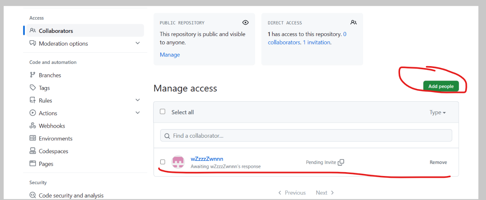
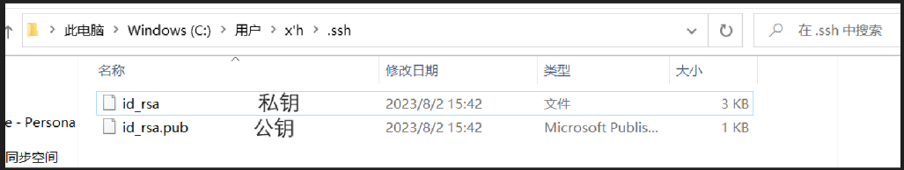
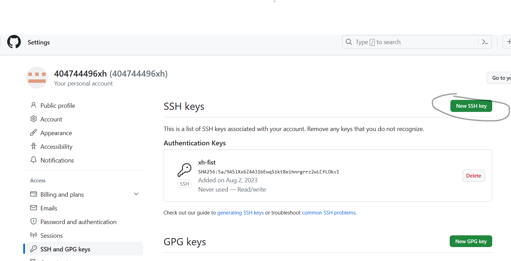
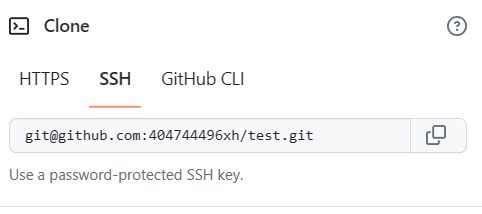

[TOC]

## 远程库操作

### 建立远程库

1.  

2.  

3.  

4.  

5.  
    ### 命令

|               命令名称               |              作用             |
| :------------------------------: | :-------------------------: |
|           git remote -v          |         查看当前所有远程地址别名        |
|      git remote add 别名 远程地址      |             起别名             |
|          git push 别名 分支          |       推送本地分支上的内容到远程仓库       |
|          git clone 远程地址          |        将远程仓库的内容克隆到本地        |
|      git pull 远程库地址别名 远程分支名      | 将远程仓库对分支最新内容拉下来后与当前本地分支直接合并 |
| git remote remove \<remote-name> |          删除远程地址的别名          |

//取消http代理
git config --global --unset http.proxy
//取消https代理
git config --global --unset https.proxy

git config --global http.sslVerify "false"

注：clone会做三件事：1.拉取代码 2. 初始化本地库 3.创建别名

### 团队协作

添加成员

### 跨团队协作

帮忙修改代码的人点这个

修改好后点这个（拉取请求）

检查好后提交合并申请

## SSH免密登录

建立一个.ssh的目录

ssh-keygen -t  rsa  -C <404744496@qq.com>

> rsa是加密算法 -C后面是

输入完命令按三次回车就创建完成

打开公钥然后点new ssh key

然后就能用SSH连接来操作远程库

没有设置new ssh key时有warning
