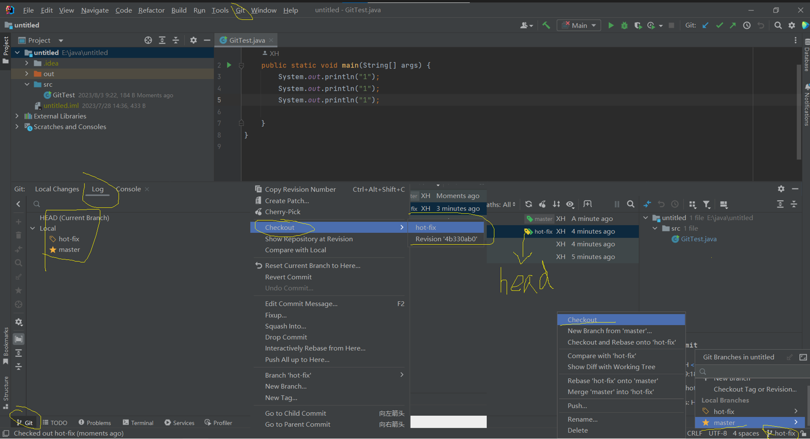
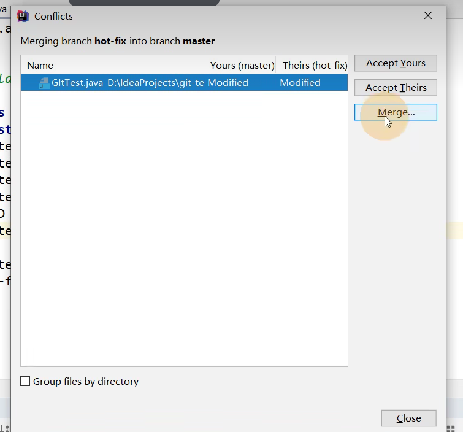
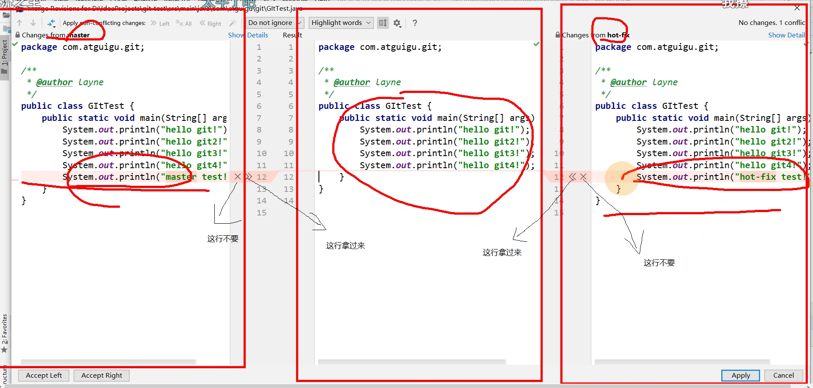
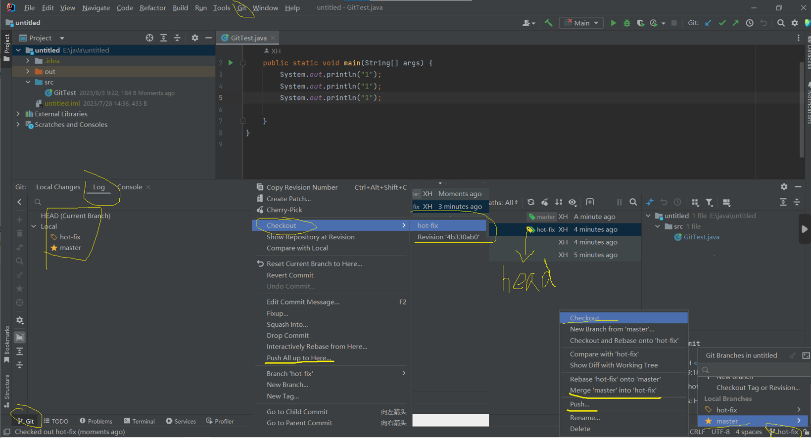
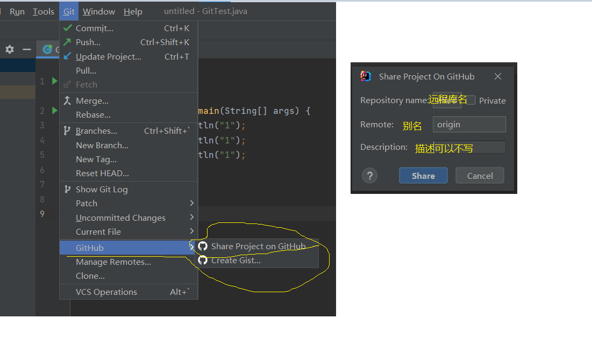

## 创建忽略规则文件

就是屏蔽一些与项目不相关的文件来消除各IDE之间的差异

git.ignore配置文件

\# Compiled class file\
\*.class\
\
\# Log file\
\*.log\
\
\# BlueJ files\
\*.ctxt\
\
\# Mobile Tools for Java (J2ME)\
.mtj.tmp/# Package Files #\
\*.jar\
\*.war\
\*.nar\
\*.ear\
\*.zip\
\*.tar.gz\
\*.rar\
\
hs\_err\_pid\*\
\
.classpath\
.project\
.settings\
target\
.idea\
\*.iml

> \*.文件类型 就是要忽略的文件

.gitconfig文件

```properties
[user]
    name = XH
    email = 404744496@qq.com
[core]
    excludesfile = E:\java\git.ignore
```



合并冲突时







添加了GitHub后


