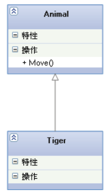
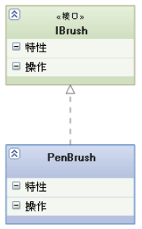
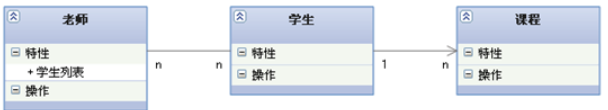
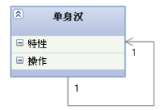
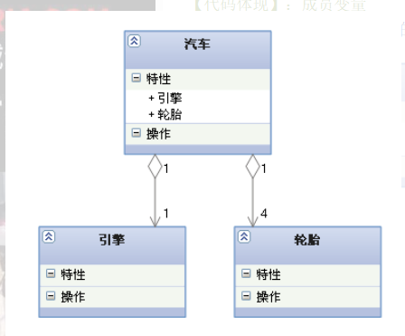
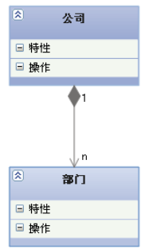
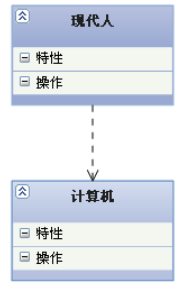
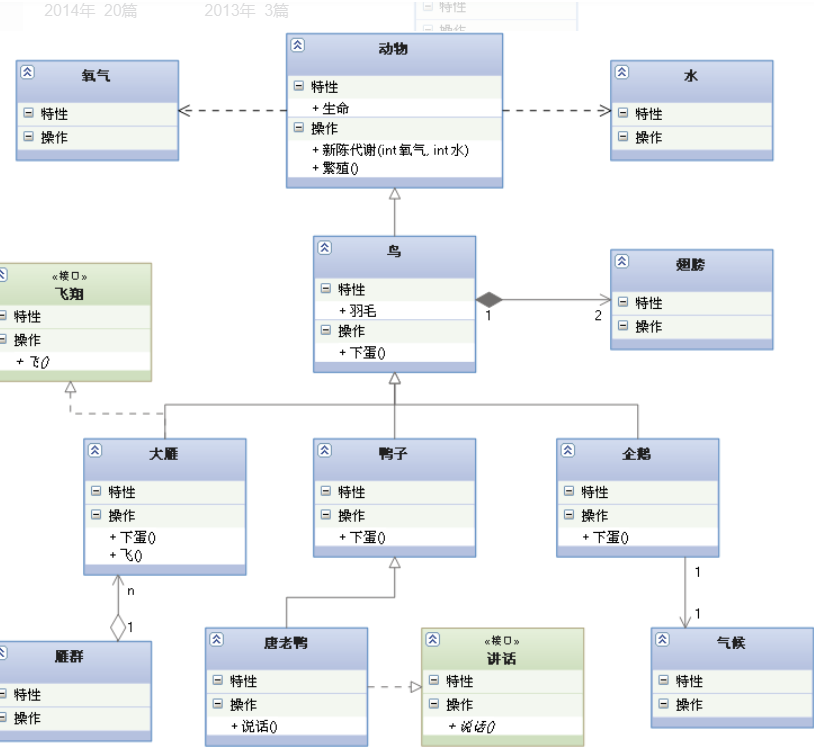

在UML类图中，常见的有以下几种关系:泛化（Generalization）,  实现（Realization）,关联（Association）,聚合（Aggregation）,组合(Composition)，依赖(Dependency)

###### 1.泛化(Generalization)

【泛化关系】：是一种

【箭头指向】：带三角箭头的实线，箭头指向父类

###### 2.实现（Realization)

【实现关系】：是一种

【箭头指向】：带三角箭头的虚线，箭头指向接口

###### 3.关联（Association）

【关联关系】：是一种

关联可以是双向的，也可以是单向的。双向的关联可以有两个箭头或者没有箭头，单向的关联有一个箭头。

【代码体现】：成员变量

【箭头及指向】：带普通箭头的实心线，指向被拥有者

上图中，老师与学生是双向关联，老师有多名学生，学生也可能有多名老师。但学生与某课程间的关系为单向关联，一名学生可能要上多门课程，课程是个抽象的东西他不拥有学生。

上图为自身关联：

###### 4.聚合（Aggregation）

【聚合关系】：是

**聚合关系是关联关系的一种，是强的关联关系**

【代码体现】：成员变量

【箭头及指向】：带空心菱形的实心线，菱形指向整体

###### 5.组合(Composition)

【组合关系】：是

【代码体现】：成员变量

【箭头及指向】：带实心菱形的实线，菱形指向整体

###### 6.依赖(Dependency)

【依赖关系】：是一种

【代码表现】：局部变量、方法的参数或者对静态方法的调用

【箭头及指向】：带箭头的虚线，指向被使用者

各种关系的强弱顺序：

泛化= 实现> 组合> 聚合> 关联> 依赖

下面这张UML图，比较形象地展示了各种类图关系：

————————————————

版权声明：本文为CSDN博主「挨踢大侠」的原创文章，遵循CC 4.0 BY-SA版权协议，转载请附上原文出处链接及本声明。

原文链接：[https://blog.csdn.net/tianhai110/article/details/6339565](https://blog.csdn.net/tianhai110/article/details/6339565)