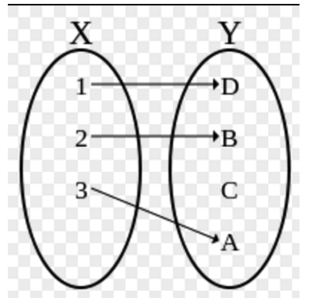
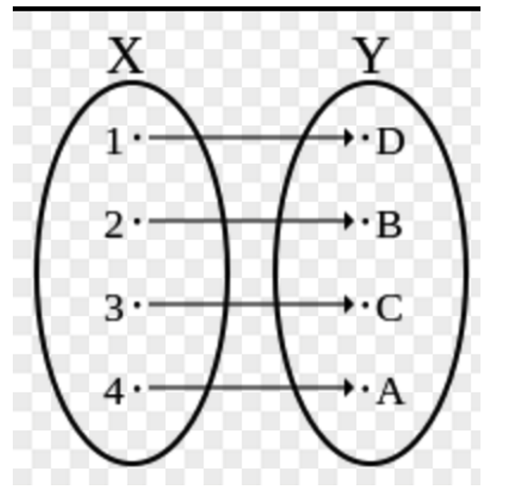

# 题型

一、单项选择题 20个，共20分

二、填空题5个，共5分

三、计算题3个，共25分

四、简答题3个，共30分

五、证明题2个，共20分

# 复习提纲

集合的运算

二元关系

等价关系

函数的性质

命题及公式类型

主析取和主合取范式

命题逻辑推理

谓词逻辑

图的矩阵表示

特殊图

代数系统

# 集合的运算

给定集合，求并、交、差、幂集和笛卡尔积运算

能区分属于关系和子集关系

# 二元关系

若A有

二元关系的表示（关系矩阵、关系图）

给定一个关系，要能判别是否具有自反性、反自反、对称性、反对称性、传递性

幂运算

**闭包运算（自反闭包、对称闭包、传递闭包）**

- 自反闭包：r(R)=R∪IA

- 对称闭包:s(R)=R∪R^-1

- 传递闭包:t(R)=R∪R^2∪R^3……R^n

# 等价关系

给定一个集合M上的等价关系R，能确定集合M的划分

等价关4系：R是自反，对称，传递的

等价类：[x]={y∈A|<x,y>∈R}

# 函数的性质

A到B的映射共有 

给定一个函数，能判别它的性质（单射、满射、双射）

满射：对任意b，存在a满足f(a) = b～

即：值域y是满的，每个y都有x对应，不存在某个y没有x对应的情况～

单射：(one-to-one function) 一对一函数，x不同则y不同～

即：没有一个x对应两个y，也没有一个y有对应两个x～

双射：既是满射，也是单射～

即：每个y都有x对应，而且都是一一对应～

# 命题及公式类型

判别一个语句是否为命题

合理利用联结词将命题符号化

给定一个公式，判断它的类型

（重言式（永真式）、矛盾式（永假式）、可满足式）

# 主析取和主合取范式

极大项、极小项及符号表示

**极小项 :**

**极大项 :**

使用 真值表法 求 主析取范式 和 主合取范式

题目 : 使用 真值表法 求 主析取范式 和 主合取范式 ;

条件 : A = ( p → ¬ q ) → r 

问题 1 : 求 主析取范式 和 主合取 范式 ;

解答 :

① 首先列出其真值表 ( 列的真值表越详细越好 , 算错好几次 )

| p q r  | ( ¬ q )  | ( p → ¬ q )  | A = ( p → ¬ q )  | 极小项 | 极大项 | 
| -- | -- | -- | -- | -- | -- |
| 0 0 0  | 1 11 | 1 11 | 0  |  m_0 | M_0 | 
| 0 0 1  | 1 11 | 1 11 | 1  |  m_1 | M_1 | 
| 0 1 0  | 0 00 | 1 11 | 0  | m_2 | M_2 | 
| 0 1 1  | 0 00 | 1 11 | 1  | m_3 | M_3 | 
| 1 0 0  | 1 11 | 1 11 | 0 |  m_4 | M_4 | 
| 1 0 1  | 1 11 | 1 11 | 1  |  m_5 | M_5 | 
| 1 1 0  | 0 00 | 0 00 | 1  | m_6 |  M_6 | 
| 1 1 1  | 0 00 | 0 00 | 1  |  m_7 | M_7 | 

极小项 - 合取式 - 成真赋值 - 对应条件真值表中的 1 - 主析取范式 ( 多个合取式的析取式 )

极大项 - 析取式 - 成假赋值 - 对应条件真值表中的 0 - 主合取范式 ( 多个析取式的合取式 )

# 命题逻辑推理

给定前提和结论，在自然推理系统P中构造推理的证明（注意规范）

# 谓词逻辑

使用合理的个体词、谓词和量词将命题符号化

量词的辖域（作用域）

求前束范式

给定一段话，用谓词逻辑进行符号化	

# 图的邻接矩阵

给一个图的邻接矩阵，要能画出对应的图

根据邻接矩阵求通路数和回路数

# 特殊图（见

给定一个图，判别是否为欧拉图

平面图及树的基本性质

图的结点度数之和不能是奇数

二部图K_n_m n=m>=2才是哈密顿图

*m*

# 代数系统

二元运算的定义

代数运算的性质（交换律、结合律、分配律、幂等律）

特异元素（单位元、零元、逆元）

群的概念（区分独异点、半群、群）