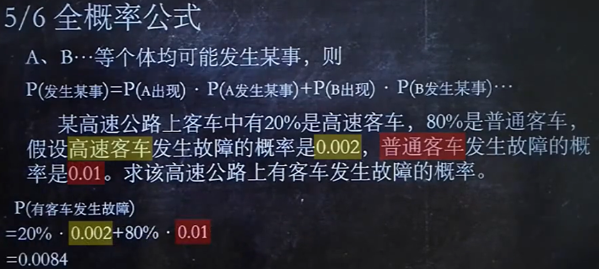
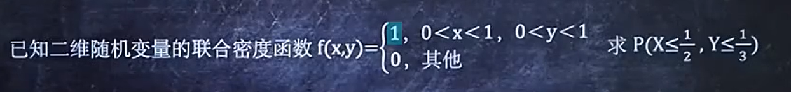
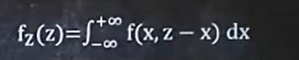
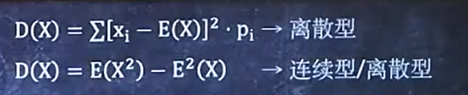
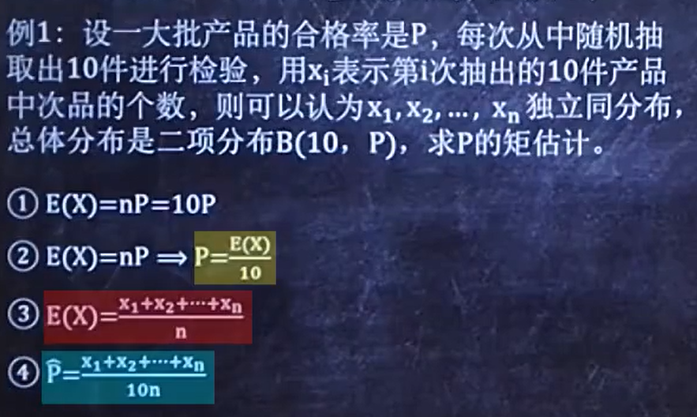

无放回，直接用C解

有放回，使用（n1+n2)!/n1!*n2!然后乘上每种的概率

A发生的前提下，B发生的概率

所有概率的总和

贝叶斯其实是条件概率反过来求。其实就是

可能和全概率公式结合考点，通过上一篇的P(有客车发生故障)= 0.0084来计算贝叶斯这一问。

**Fx是分布函数，fx是概率密度**

小fx是大Fx求导出来的，同理可以通过小fx求积分来算大Fx

**Fx求导得到fx**

**fx求积分得到 Fx**

**已知分布函数Fx，求概率**

**已知概率密度fx，求概率**

***注意：P(a<X<b)和P(a<=X<=b)是等价的，这个等号不影响***

**记住Fx(-∞) = 0 Fx(+∞) = 1，概率密度fx(X)在-∞和+∞上的积分为1**

**Fx分布函数例题：**

**fx概率密度例题：**

高中题目了属于是，只能说dddd

替换算就完事了

也是带入替换

1. 把X换成什么什么Y

1. 替换Fx(X)中的x结果为Fx(?Y)

1. 判断y中是否有负号

如果是带有负号，那么就这样：

同样的套路

1. 写出x等于什么什么y

1. 用什么y替换fx(X)中的x，结果为fx(?y)

1. 令fy = (?y)’ * fx(?y)

1. 判断?y中是否有负号，如果有就是求得的答案的相反数

首先给出各种分布的分布律、概率密度、E(x)、D(x)

**lambda是参数，x是某某次数**

**如果是这样的，千万不要用1-P(X=6)这种，要一个一个算！**

正态分布还是很重要的，后面也会经常用到标准化公式（x-u/o）

一定要记住fai(0) = 0.5

1.面积表示概率，整个正态分布图像的总面积为1

2.图像关于u对称

3.o越小，图像越陡

看陡峭

离散型的就看表就好咯

例如：

查表：

作表：

穷举：

如果满足

例1：

我们只需要验证每一个p(xy) = p(x) * p(y)，就可以验证独立性

例2：

因为独立，所以

因为所有的概率是1，所有我们求出一个a就可得到另一个b的概率

F(x,y)是联合分布函数

f(x,y)是联合概率密度

例如：

1. 找出f(x,y)不等于0时x的范围和y的范围

1. 计算结果

1. 带入计算

1. 区域

**例题1：**

 

**例题2：**

记住公式然后带入

加一点变形：

注意解题步骤，求范围再带入求更细的范围，再带入二重积分中

例题1：

难一点的例题2：

记住下面的式子

记住式子：

例如：

记住如下公式：

例如：

带入公式即可求解

F(X,Y)是边缘分布函数

fx(X),fy(Y)是边缘概率密度

有公式：

fx(X) = f(x,y)dy在y的无穷界限上的积分

fy(Y) = f(x,y)dx在x的无穷界限上的积分

例题：

F(x,y) = Fx(X) * Fy(Y)那么X、Y互相独立

f(x,y) = fx(X) * fy(Y)那么X、Y互相独立

这种题目带入验证就可以了

先求出 fx(X) 和 fy(Y)带入计算验证就OK了

如何求出 fx(X) 和 fy(Y)在上一个题型说了

例题：

记住关键公式：

例题：

**记得分类讨论就好啦**

记住公式：

例题：

解法和上题一致，就是公式使用不同

记住一个公式：Fz(Z) = Fx(Z)*Fy(Z)

就是和上面的题目的公式不一样：Fz(Z)=1-[1-Fx(Z)]*[1-Fy(Z)]

简单题，高中方法求期望就好了

**例题**

连续型的期望公式：E(x) = xf(x)dx在无穷上求积分

公式如下：

例题：

公式如下：

其实也很好理解，之前的连续性E(x)=xf(x)dx求积分，那么带入下面的Y=g(x)=x，也就是得到xf(x)dx

离散型的例题：

连续型的例题：

记住两个公式（

例题1（离散型）：

例题2（连续型）：

看表：

例题：

各种分布的公式：

例题1：

例题2：

开背：

**例题1：**

**例题2：**

**有公式：**

**例题:**

还是看公式：

**例题1:**

**例题2：**

①样本均值 

②样本k阶矩

③样本方差

④样本标准差

⑤样本k阶中心矩

**注意B2和S2的区别（一个是1/n-1，一个是1/n）**

分别是

χ2分布有

t分布的Ex=0、Dx=n/(n-2)

F分布，上下都是卡方分布

步骤如下：

例题1：

例题2：

1. 先用公式求出E(x)

1. 然后写出未知数等于多少E(x)的形式

1. 写出实际的E(x)

1. 最后将实际的E(x)带入到未知数方程中，得出答案

步骤如下：

例题1：

**书上例题**

1. 算出E(x)和E(x2)

1. 写出未知数等于?E(x)+?E(x2)

1. 根据给出的样本求出实际的E(x)和E(x2)

1. 求出未知数就是矩估计

步骤如下：

例题1:

1. 写出每个x的分布律

1. 对每个分布取ln

1. 对ln的结果求导

1. 令求导的结果为0，求出未知数

步骤如下：

和上一类型差不多，这里第一步先求每个fx就可以了

例题1：

1. 求出fx1、fx2、fx3…fxn

1. 对每个fx求ln

1. 对ln结果求导

1. 多个求导结果相加要等于0，求出未知数

看表！考点有标准化等

**单个正态总体参数的区间估计**

**两个正态总体参数**

一定要记住前面的

此外，书上

背完上面的公式我们来看例题~

**例题1：**

首先看求什么的置信区间，是求

其次置信水平为0.95那么1-α=0.95，α=0.05，所以α/2=0.025

并且没有σ，所以我们需要用s来代替σ

因为(n-1)s2/σ2满足t分布，所以有如下的置信区间

将算出的各种值带入求解:

**例题2：**

首先分析求哪个的置信区间，可以看到求σ的，那么就是套卡方分布那套

置信水平0.95，1-α=0.95，α=0.025

又因为μ没给，就用(n-1)s2/σ2~卡方(n-1)，得到σ2的置信区间：

带入求就好了

**注意！！！上图的置信区间是σ2的**

答案：

还有可能考

和上一章内容有关，假设检验这里就学了一共

第一种类型——

第二种类型——

需要注意的是，我们的原假设尽量是向良好的结果假设。

另外就是

例题就看书上的[**woodwhale**](https://blog.csdn.net/woodwhale)

