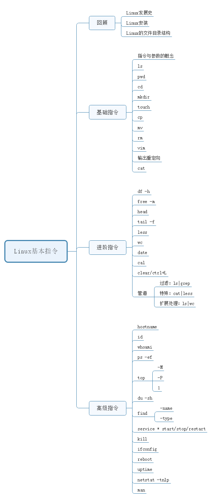
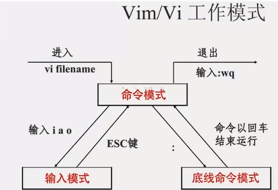

## Linux 组成

## Linux 目录
Linux只有一个根目录 "/" Linux用 "/"(windows是"") HOME目录用户在linux系统的个人账户目录路径在/home/用户名 Linux默认执行在用户的home目录下

## 命令的基本格式
一个完整的指令的标准格式：Linux通用的格式
> #指令主体（空格） [选项]（空格） [操作对象] command  [-options]  [parameter1]  …

一个指令可以包含多个选项 操作对象也可以是多个

## ls命令
语法：ls [-a -l -h] [Linux路径]
> ls:列出当前目录下的内容 ls 路径 :列出路径下的内容 -a:表示显示所有的文件/文件夹（包含了隐藏文件/文件夹） -l:表示list，表示以详细列表的形式进行展示（ls -l有一个别名ll效果相同) -h：需要和-l选项搭配使用，以更加人性化的方式显示文件的大小单位

**在Linux中隐藏文档一般都是以“.”开头。** **-”表示改行对应的文档类型为文件，“d”表示文档类型为文件夹。** 这些选项与参数可以灵活的进行组合如： ls -la ，ls -hl 路径，ls -lah ：，他们的功能也结合到一起了

## cd和pwd
用法：
> cd [Linux路径]更改到参数中的路径中（可以为相对路径 即以当前目录为起点） cd 回到home目录下 pwd打印当前工作目录

#### 特殊的路径符
> **.** :表示当前目录 ..  :表示上一级目录 ~ :表示home目录

## 创建目录命令mkdir
语法 ：mkdir  [-p]  Linux路径
> mkdir 路径：创建路径包含的**文件夹**
> 如 ：mkdir /home/1/2/3：这里创建了1，2，3三个文件夹
> **mkdir -p 路径**
> 含义：**当一次性创建多层不存在的目录的时候**，添加-p参数，否则会报错

## 文件
> 语法：touch Linux路径 创建一个文件
> 如 ：toch /home/temp.txt在/home下创建一个temp.txt文件

> cat Linux路径 查看文件（全部显示出来）

> more Linux路径 查看文件（支持翻页）

### vi/vim编辑器(🌟)
vim是vi的加强版，不仅可以编辑文本还可以shell程序编辑
#### 三种模式

> 1.命令模式（默认模式）：输入都理解为命令，不能进行文本编辑（按esc回退到）
> 2.插入模式 ：编辑文本（按i进入）
> 3.底行模式：进行一些设置如文件的保存退出等（按:进入）
#### 语法
> vi 文件路径
> vim 文件路径
> 如果文件不存在，则创建文件
> 如果文件存在，则打开文件

##### 命令模式
常用命令：
 |          命令           |             描述             |
 | :---------------------: | :--------------------------: |
 |            i            |  在当前光标位置进入输入模式  |
 | 键盘上下左右（k,j,h,l） |           移动光标           |
 |           esc           | 退出输入模式（回到命令模式） |
 |          [n]dd          | 删除光标所在行[和下面的n行]  |
 |          [n]yy          | 复制光标所在行[和下面的n行]  |
 |            p            |  粘贴复制的内容到光标所在行  |
 |            u            |        撤销上一步操作        |
 |         ctrl+r          |           反向撤销           |
 |           gg            |        跳到文件开头行        |
 |          [n]G           |  跳到文件[结尾行] \| [n行]   |
 |           dG            |   删除光标所在行到文件结尾   |
 |           dgg           |   删除光标所在行到文件开头   |
 |      page up/down       |           上下翻页           |
 |            /            | 搜索内容(查找内容并高亮显示) |
 |            n            |        继续查找下一个        |
 |            N            |        继续查找上一个        |

其他命令：
 | 命令  |              描述              |
 | :---: | :----------------------------: |
 |   a   |    在光标位置后进入输入模式    |
 |   0   |         光标移动到行首         |
 |   $   |         光标移动到行尾         |
 |   o   | 在当前行下插入新行进入输入模式 |
 |   O   |  当前行上插入新行进入输入模式  |
 |  d$   |     删除当前行到行尾的内容     |
 |  d0   |     删除当前行到行首的内容     |
 |   I   |     在当前行首进入输入模式     |
 |   A   |     在当前行尾进入输入模式     |

##### 编辑模式
编辑模式没什么特殊的就按esc和:进入命令模式和底线模式

##### 底线命令模式  
常用：
|    命令    |            描述            |
| :--------: | :------------------------: |
|    :wq     |       退出并保存文件       |
|    :q!     |       强制退出不保存       |
|     :q     |       退出不保存文件       |
|  :set nu   |   显示行号（默认不显示）   |
| :set paste | 设置粘贴模式（默认不显示） |

其他：
| 命令  | 描述  |
| :---: | :---: |
|:set nonu  |     取消行号（默认不显示）     |
|  :set hls  |   高亮搜索内容（默认不显示）   |
| :set nohls | 取消高亮搜索内容（默认不显示） |
|  :set ic   |    忽略大小写（默认不忽略）    |
| :set noic  |   不忽略大小写（默认不忽略）   |
| :set ts=4  |  设置tab键为4个空格（默认8）   |
| :set ts=0  |       取消tab键（默认8）       |
| :set sw=4  |   设置缩进为4个空格（默认8）   |
| :set sw=0  |       取消缩进（默认8）        |

## 复制，移动，删除

#### cp复制
> 语法：cp [-r] 参数1 参数2 -r,可选用于复制文件夹 参数1，表示要复制的文件或文件夹 参数2，表示复制去的地方

#### mv移动
> 语法： mv 参数1 参数2 参数1，表示被移动的文件夹或文件夹 参数2，表示要移动去的地方如果目标不存在则进行改名确保目标存在

#### rm删除
> rm [-r -f] 参数1 参数2 ........ 参数N
> - r用于删除文件夹
> - f表示force，强制删除（不会弹出提示确认信息）
> - 普通用户删除内容不会弹出提示只有root管理员用户删除内容会有提示所以普通用户一般用不到
> - 参数1 参数2 ........ 参数N ：表示要删除的文件或文件夹的路径，按空格隔开

**su - root 并输入密码 切换为root用户 rm支持通配符*用来做模糊匹配**

## which-find命令
所有的命令其实都是一个个二进制文件可以使用which来找到对应命令的存放位置

#### which
> 语法：which 要查找的命令
> 例：which cd 查找cd命令的位置

#### find
> 语法1：find 起始路径 -name "被查找文件名"   //查找文件
> 语法2：find 起始路径 -size +|-n[kMG]    		//按照文件大小查找文件
>    - +,-表示大于和小于
>    - n,表示大小数字
>    - kMG表示大小单位
> - 例：find / -size -10k	//查找小于10k的文件

find也可以用通配符

---

## grep-wc和管道符（文件）

#### gre
可以通过grep命令，从文件中通过关键字过滤文件行
> 语法：grep [-n] 关键字 文件路径
> - -n,可选表示在结果中显示匹配的行的行号
> - 参数，关键字，必填，表示过滤的关键字，带有空格或其他特殊符号，建议使用""将关键字包围起来
> - 参数，文件路径，必填，表示要过滤内容的文件路径，**可作为内容输入端口**

#### wc
可以通过wc命令统计文件行数、单词数量等
> 语法：wc [-c -m -l -w] 文件路径
> - 选项，-c,统计bytes数量
> - 选项，-m统计字符数量
> - 选项，-l,统计行数
> - 选项，-w,统计单词数量
> - 参数，文件路径，被统计的文件，**可作为内容输入端口**

### 管道符 |
含义：将管道符**左边命令**的结果作文**右边命令**的输入
> 例：cat test.txt | grep 123 
> 这里123后面应该还有一个参数，这个参数**可以作为内容输入端口**
> 这里就是在cat里显示的内容查找“123”这个的内容

---

## echo-tail和重定向

#### echo
> 语法：echo 输出的内容

#### 反引号 `
被他包围的内容会当成命令去执行 

#### 重定向符>,>>
> - >,将左侧命令的将结果，覆盖写入道符号右侧指定的文件中
> - >>,将左侧命令的结果，追加写入道符号右侧指定的文件中

  

#### tail命令
可以用与查看尾部的文件内容
> 语法：tail [-f -num] Linux路径
> - 参数，Linux路径，表示被跟踪的文件路径
> - 选项，-f,表示持续跟踪
> - 选项，-怒骂，表查看尾部多少行，不填**默认10行**

