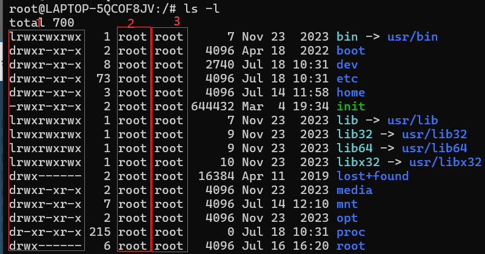
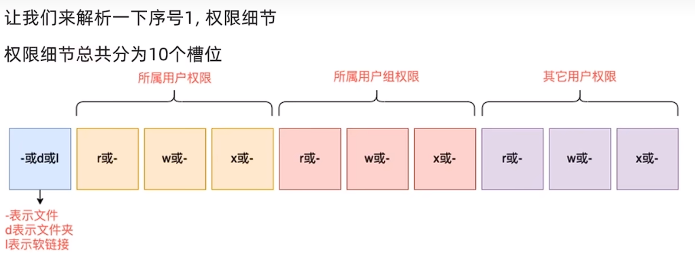

## root用户（超级管理员）
- root用户是Linux系统中的超级管理员，拥有整个系统的最高权限。
- root用户可以不受限制地管理整个系统，包括对文件和目录的创建、删除、修改等操作。
- 普通的权限一般在home目录内部没限制其他地方只有读取和执行的权限，但是root用户可以不受限制地管理整个系统。

## su和exit
语法：su [-] [用户名]
- \- 选项：表示切换到指定用户后，同时切换环境变量。
- 用户名：指定切换到哪个用户。
- 回退到上一个用户：exit

## sudo命令 
sudo命令是Linux系统管理指令，允许给普通用户权限来执行超级用户的一些命令。

语法：sudo [参数] 命令
但是表示所有用户都可以使用sudo命令，需要配置/etc/sudoers文件（root用户执行 visudo命令会自动打开）。

给itheima赋予sudo命令的权限其中，NOPASSWD表示不需要输入密码

## 用户和用户组
### 用户组管理
在root用户下执行：
- 创建用户组：groupadd [用户组名]
- 删除用户组：groupdel [用户组名]

### 用户管理
- 创建用户：useradd [-g -d] [用户名]
  - 选项：-g 指定用户所属的用户组，如果不指定则默认和用户名相同。
  - 选项：-d 指定用户家目录，如果不指定则默认在/home下创建和用户名相同的目录。
- 删除用户：userdel [-r] [用户名]
  - 选项：-r 表示删除用户的同时，将用户家目录一起删除。
- 修改用户：usermod [-aG] 用户组 用户名
- 修改密码：passwd [参数] [用户名]
- 修改用户所属组：usermod -g [用户组名] [用户名]
  - 将指定用户修改为指定组
- 查看用户信息：id [用户名]
  - 如果不提供用户名，则显示当前用户的id信息。
- 查看用户组信息：groups [用户名]
- 查看当前系统中有哪些用户： getent passwd 命令
- 查看当前系统中有哪些用户组：getent group 命令

## 查看权限控制
### 认知权限信息
通过ls -l命令查看文件权限信息


- 序号1，表示文件，文件夹的权限控制信息。
- 序号2，表示文件，文件夹的所属用户。
- 序号3，表示文件，文件夹的所属组。
  
举例：drwxr-xr-x,表示：
- 第1个d表示文件类型，d表示目录。
- 第2个（所属用户权限）rwx表示拥有读,写,执行权限。
- 第3个(所属用户组权限)，r，x表示拥有读,执行权限没有w(写)权限。
- 第4个(其他用户权限)，x表示拥有读,执行权限没有w(写)权限。

### rwx

- r：读权限，read
- w：写权限，write
- x：执行权限，execute

- r针对文件夹，可以查看文件列表，可以打开文件夹。
  - 针对文件，可以查看文件。
- w针对文件夹，可以创建,删除，修改文件。
  - 针对文件，可以修改文件内容。
- x针对文件夹，可以更改工作目录，到此文件夹
  - 针对文件，可以当作程序执行。
  
## 修改权限控制 - chmod

**chmod**

> 我们可以使用chmod命令来修改文件、文件夹的的权限。

`注意，只有文件、文件夹的所属用户或root用户才能修改权限。`

示例：
```shell
chmod u=rwx,g=rx,o=x test.txt # 将文件的权限修改为rwxr-x--x
  # - 其中:u表示user所属用户权限，g表示group组权限，o表示other其它用户权限
chmod -R u=rwx,g=rx,o=xtest # 将文件夹test以及文件夹内全部内容权限设置为:rwxr-x--x
```
