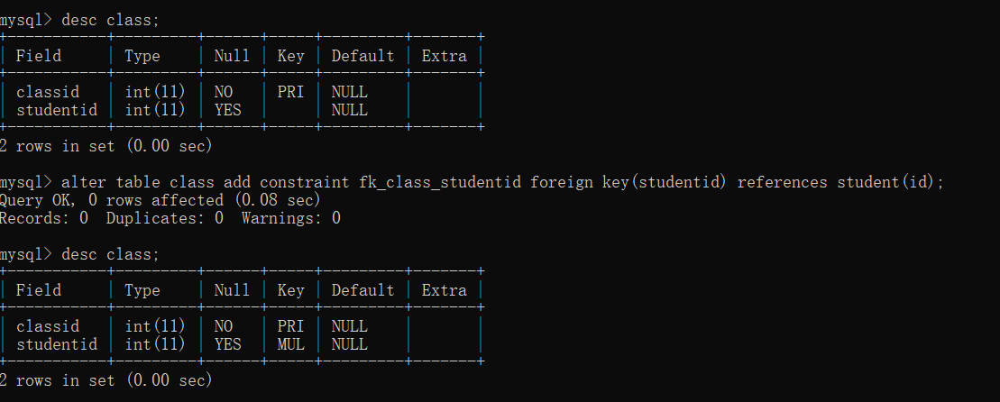

[TOC]

# MySQL服务的启动和关闭（命令）

语法：
net stop 服务名称   如：net stop MySQL
net start 服务名称  如：net start MySQL
(其他服务同理)

# 一、连接到MySQL

## 1.登录使用MySQL(命令)

使用bin目录下的MySQL.exe命令来链接MySQL数据库服务器
mysql -uroot -p密码
(隐藏密码要换行，即上面的密码要写在这里)

## 2.连接到远程主机上的MySQL：

mysql -hIP地址 -u用户名(象上面那样我的用户名是root) -p密码

## 3.退出MySQL的命令

mysql> exit/quit

# 二、MySQL修改密码

格式：mysqladmin -u用户名 -p旧密码 -password新密码

## 1.root密码为空时,设置root密码：

mysql> mysqladmin -uroot newpassword;   -- 因为开始时root没有密码，所以-p旧密码 可以省略

## 2.使用sqladmin命令修改密码

mysql> mysqladmin -uroot -p123456 password 12345678;

## 3、使用set passsword命令修改密码：

mysql> set password for 用户名@localhost = password('新密码');

## 4、忘记root密码情况下：

      ①关闭正在运行的MySQL服务。
      ②打开DOS窗口，转到mysql\bin目录。
      ③输入mysqld --skip-grant-tables 回车。--skip-grant-tables 的意思是启动MySQL服务的时候跳过权限表认证。
      ④再开一个DOS窗口（因为刚才那个DOS窗口已经不能动了），输入mysql回车，如果成功，将出现MySQL提示符 >。
      ⑤连接权限数据库： use mysql; 。
      ⑥改密码：update user set password=password("新密码") where user="root";（别忘了最后加分号） 。
      ⑦刷新权限（必须步骤）：flush privileges;　。
      ⑧退出mysql  quit；。

mysqld --skip-grant-tables\
mysql> use mysql;   --连接权限数据库
mysql> update user set password=password("新密码") where user="root";   -- 改密码
mysql> flush privileges;    -- 刷新权限
mysql> quit；    -- 退出mysql

# MySQL的常用命令

## 1、创建数据库（Create）
```shell
mysql> create database db\_name;  -- 创建数据库
mysql> show databases;           -- 显示所有的数据库
mysql> drop database db\_name;    -- 删除数据库
mysql> use db\_name;              -- 选择数据库
mysql> create table tb\_name (字段名 varchar(20), 字段名 char(1));   -- 创建数据表模板
mysql> show tables;              -- 显示数据表
mysql> desc tb\_name；            -- 显示表结构
mysql> drop table tb\_name；      -- 删除表
```


## 2、数据表

数据库创建成功后可在该数据库中创建数据表(简称为表)存储数据。请注意：在操作数据表之前应使用“USE 数据库名;”指定操作是在哪个数据库中进行先关操作，否则会抛出“No database selected”错误。

#### **创建表**

> 语法:
> create table 表名(
> 字段1 字段类型,
> 字段2 字段类型,
> …
> 字段n 字段类型
> );

#### **查看表：**

> show tables;----（所有表）
> show create table student;----查表的基本信息
> desc student;-------(查看表的字段信息)

##### **修改表**

> alter table student rename to stu;------修改数据表名
> alter table stu change name sname varchar(10);------修改字段名
> alter table stu add address varchar(50);-------增加字段
> alter table stu drop address;---------删除字段

#### **删除数据表**

> drop table 表名;

### 数据表的约束

#### 1.主键约束

主键约束即primary key用于唯一的标识表中的每一行。被标识为主键的数据在表中是唯一的且其值不能为空。这点类似于我们每个人都有一个身份证号，并且这个身份证号是唯一的。
（primary 主要的）

> 唯一，非空，不可更改

主键约束基本语法：

> 字段名 数据类型 primary key;

> 方法一:
> create table student(
> id int primary key,
> name varchar(20)
> );
> 方法二：
> create table student01(
> id int
> name varchar(20),
> primary key(id)
> );


#### 2.非空约束

非空约束即 NOT NULL指的是字段的值不能为空，基本的语法格式如下所示：

> 字段名 数据类型 NOT NULL;


#### 3.默认值约束

字段名 数据类型 DEFAULT 默认值；


#### 5.唯一性约束

字段名 数据类型 UNIQUE;    (unique 唯一的)


#### 6.外键约束&#x20;

外键约束即FOREIGN KEY常用于多张表之间的约束。基本语法如下：

> 　-- 在创建数据表时如下： ~~CONSTRAINT 外键名~~ FOREIGN KEY (从表外键字段) REFERENCES 主表 (主键字段)
>
> \-- 将创建数据表创号后语法如下：
> ALTER TABLE 从表名 ADD CONSTRAINT 外键名 FOREIGN KEY (从表外键字段) REFERENCES 主表 (主键字段);
>
> （foreign 外地的）（constraint 约束）（references 参照）

示例：

> > create table student05(
> > id int primary key,
> > name varchar(20)
> > );
>
> > create table class(
> > classid int primary key,
> > studentid int
> > );
>
> 示例：学生表作为主表，班级表作为副表设置外键， MySQL命令：
> alter table class add constraint fk\_class\_studentid foreign key(studentid) references student05(id);



**MUL是索引的意思（类似与指针）**

##### 6.1 数据一致性概念

大家知道：建立外键是为了保证数据的完整和统一性。但是，如果主表中的数据被删除或修改从表中对应的数据该怎么办呢？很明显，从表中对应的数据也应该被删除，否则数据库中会存在很多无意义的垃圾数据。

##### 6.2 删除外键

> alter table 从表名 drop foreign key 外键名；
> 示例：alter table class drop foreign key fk\_class\_studentid;

##### 6.3 关于外键约束需要注意的细节

1、从表里的外键通常为主表的主键
2、从表里外键的数据类型必须与主表中主键的数据类型一致
3、主表发生变化时应注意主表与从表的数据一致性问题

### 7.check约束

建立表时设置检查约束的语法规则如下：

> \[CONSTRAINT \[symbol]] CHECK (expr) \[\[NOT] ENFORCED]

修改表时设置检查约束的语法规则如下：

> 1.  `ALTER TABLE tb_emp7 ADD CONSTRAINT <检查约束名> CHECK(<检查约束>)`

