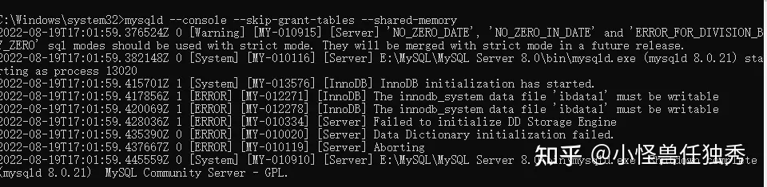

在修改MySQL数据库的root密码时很多老帖子的方式不成功

```
mysql> set password for 用户名@localhost = password('新密码');
例如（将用户root的密码更改为root）：
mysql> set password for root@localhost = password('root');
```

以及

```text
mysqladmin -u用户名 -p旧密码； password 新密码
例如：
mysqladmin -uroot -proot password 123
```

以及用UPDATE直接编辑user表方法也是不管用的。

这是由于版本在8.0以上已经不再支持。

**解决方法：**

**1、首先终止MySQL服务**

```text
1、右键此电脑-管理-服务-MySQL
或者
2、以管理员身份打开cmd,执行：
net stop mysql
```

**2、以管理员身份新开cmd，进入mysql安装的bin目录后执行：**

```text
mysqld --console --skip-grant-tables --shared-memory
```

此时，命令行框会处于持续运行状态：



**3、保持上述的窗口（切记），再以管理员身份新开cmd，执行：**

```text
mysql -uroot -p
```

这时就已经绕过密码登录进入mysql了。

**4、接下来修改root的密码为空**

```text
UPDATE mysql.user SET authentication_string='' WHERE user='root';
```

**5、此时关闭所有命令行界面，正常开启MySQL服务后进行登录，无需密码即可进入成功。**

**此时进行修改密码操作：**

```text
use mysql 

ALTER user root@'localhost' identified by '123456';
```

密码修改成功，退出mysql,即可通过密码：123456登录.

或者，修改当前用户的密码（最简单）：

```text
set password = ‘123456’;
```