[](https://www.csdn.net/)

[](https://www.csdn.net/)

SQL语言有40多年的历史，从它被应用至今几乎无处不在。我们消费的每一笔支付记录，收集的每一条用户信息，发出去的每一条消息，都会使用数据库或与其相关的产品来存储，而操纵数据库的语言正是 SQL ！

SQL 对于现在的互联网公司生产研发等岗位几乎是一个必备技能，如果不会 SQL 的话，可能什么都做不了。你可以把 SQL 当做是一种工具，利用它可以帮助你完成你的工作，创造价值。


**文章结尾有 SQL 小测验哦！看看你能得几分？**


**⭐️ **

SQL 是用于访问和处理数据库的标准的计算机语言。

- SQL 指结构化查询语言

- SQL 使我们有能力访问数据库

- SQL 是一种 ANSI 的标准计算机语言

SQL 可与数据库程序协同工作，比如 MS Access、DB2、Informix、MS SQL Server、Oracle、Sybase 以及其他数据库系统。但是由于各种各样的数据库出现，导致很多不同版本的 SQL 语言，为了与 ANSI 标准相兼容，它们必须以相似的方式共同地来支持一些主要的关键词（比如 SELECT、UPDATE、DELETE、INSERT、WHERE 等等），这些就是我们要学习的SQL基础。


可以把 SQL 分为两个部分：数据操作语言 (DML) 和 数据定义语言 (DDL)。

- 数据查询语言（DQL: Data Query Language）

- 数据操纵语言（DML：Data Manipulation Language）

SQL 是一门 ANSI 的标准计算机语言，用来访问和操作数据库系统。SQL 语句用于取回和更新数据库中的数据。

- SQL 面向数据库执行查询

- SQL 可从数据库取回数据

- SQL 可在数据库中插入新的记录

- SQL 可更新数据库中的数据

- SQL 可从数据库删除记录

- 3SQL 可创建新数据库

- SQL 可在数据库中创建新表

- SQL 可在数据库中创建存储过程

- SQL 可在数据库中创建视图

- SQL 可以设置表、存储过程和视图的权限

**顾名思义，你可以理解为数据库是用来存放数据的一个容器。**

打个比方，每个人家里都会有冰箱，冰箱是用来干什么的？冰箱是用来存放食物的地方。

同样的，数据库是存放数据的地方。正是因为有了数据库后，我们可以直接查找数据。例如你每天使用余额宝查看自己的账户收益，就是从数据库读取数据后给你的。

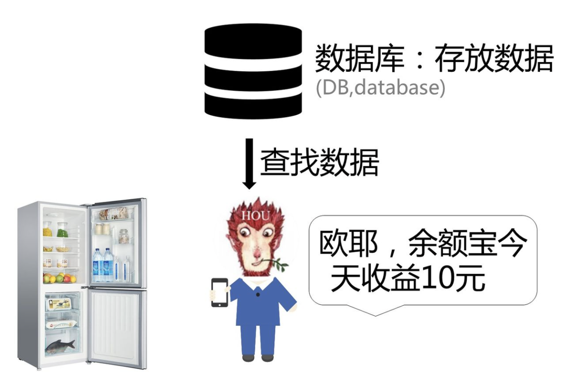

**最常见的数据库类型是关系型数据库管理系统（RDBMS）：**

RDBMS 是 SQL 的基础，同样也是所有现代数据库系统的基础，比如 MS SQL Server, IBM DB2, Oracle, MySQL 以及 Microsoft Access等等。

RDBMS

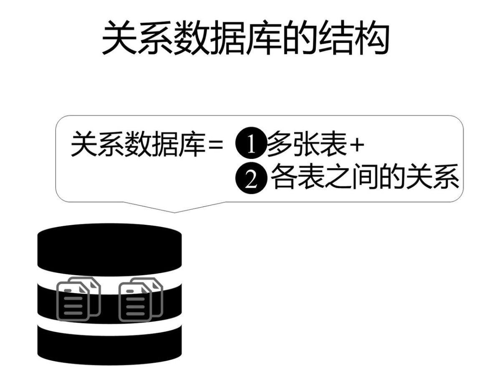

由于本文主要讲解 SQL 基础，因此对数据库不做过多解释，只需要大概了解即可。

在了解 SQL 基础语句使用之前，我们先讲一下 

一个数据库通常包含一个或多个表。每个表由一个名字标识（例如“客户”或者“订单”）。表包含带有数据的记录(行)。

**下面的例子是一个名为 “Persons” 的表：**

| Id | LastName | FirstName | Address | City | 
| -- | -- | -- | -- | -- |
| 1 | Adams | John | Oxford Street | London | 
| 2 | Bush | George | Fifth Avenue | New York | 
| 3 | Carter | Thomas | Changan Street | Beijing | 


上面的表包含三条记录（每一条对应一个人）和五个列（Id、姓、名、地址和城市）。

**有表才能查询，那么如何创建这样一个表？**

CREATE TABLE 语句用于创建数据库中的表。

**语法：**

```sql
CREATE TABLE 表名称
(
列名称1 数据类型,
列名称2 数据类型,
列名称3 数据类型,
....
);
1234567
```

数据类型（data_type）规定了列可容纳何种数据类型。下面的表格包含了SQL中最常用的数据类型：

| 数据类型 | 描述 | 
| -- | -- |
| integer(size),int(size),smallint(size),tinyint(size) | 仅容纳整数、在括号内规定数字的最大位数 | 
| decimal(size,d),numeric(size,d) | 容纳带有小数的数字、“size” 规定数字的最大位数、“d” 规定小数点右侧的最大位数 | 
| char(size) | 容纳固定长度的字符串（可容纳字母、数字以及特殊字符）、在括号中规定字符串的长度 | 
| varchar(size) | 容纳可变长度的字符串（可容纳字母、数字以及特殊的字符）、在括号中规定字符串的最大长度 | 
| date(yyyymmdd) | 容纳日期 | 


**实例：**

本例演示如何创建名为 “Persons” 的表。

该表包含 5 个列，列名分别是：“Id_P”、“LastName”、“FirstName”、“Address” 以及 “City”：

```sql
CREATE TABLE Persons
(
Id_P int,
LastName varchar(255),
FirstName varchar(255),
Address varchar(255),
City varchar(255)
);
12345678
```

Id_P 列的数据类型是 int，包含整数。其余 4 列的数据类型是 varchar，最大长度为 255 个字符。

**空的 “Persons” 表类似这样：**

可使用 INSERT INTO 语句向空表写入数据。

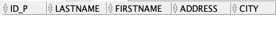

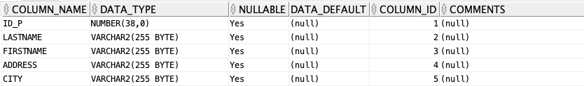

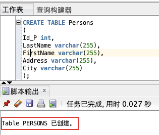

INSERT INTO 语句用于向表格中插入新的行。

**语法：**

```sql
INSERT INTO 表名称 VALUES (值1, 值2,....);
1
```

我们也可以指定所要插入数据的列：

```sql
INSERT INTO table_name (列1, 列2,...) VALUES (值1, 值2,....);
1
```

**实例：**

本例演示 “Persons” 表插入记录的两种方式：

**1、插入新的行**

```sql
INSERT INTO Persons VALUES (1, 'Gates', 'Bill', 'Xuanwumen 10', 'Beijing');
1
```

**2、在指定的列中插入数据**

```sql
INSERT INTO Persons (LastName, Address) VALUES ('Wilson', 'Champs-Elysees');
1
```

**插入成功后，数据如下：**

这个数据插入之后，是通过 

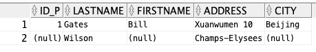

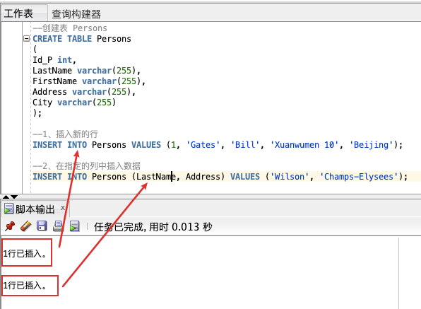

SELECT 语句用于从表中选取数据，结果被存储在一个结果表中（称为结果集）。

**语法：**

```sql
SELECT * FROM 表名称;
1
```

我们也可以指定所要查询数据的列：

```sql
SELECT 列名称 FROM 表名称;
1
```

**📢 注意：**

**实例：**

**SQL SELECT * 实例：**

```sql
SELECT * FROM Persons;
1
```

**📢 注意：**


如需获取名为 “LastName” 和 “FirstName” 的列的内容（从名为 “Persons” 的数据库表），请使用类似这样的 SELECT 语句：

```sql
SELECT LastName,FirstName FROM Persons;
1
```


如果一张表中有多行重复数据，如何去重显示呢？可以了解下 

**语法：**

```sql
SELECT DISTINCT 列名称 FROM 表名称;
1
```

**实例：**

如果要从 “LASTNAME” 列中选取所有的值，我们需要使用 

```sql
SELECT LASTNAME FROM Persons;
1
```

可以发现，在结果集中，Wilson 被列出了多次。

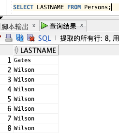

如需从 “LASTNAME” 列中仅选取唯一不同的值，我们需要使用 SELECT DISTINCT 语句：

```sql
SELECT DISTINCT LASTNAME FROM Persons;
1
```

通过上述查询，结果集中只显示了一列 Wilson，显然已经去除了重复列。

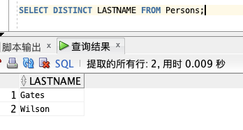

如果需要从表中选取指定的数据，可将 WHERE 子句添加到 SELECT 语句。

**语法：**

```sql
SELECT 列名称 FROM 表名称 WHERE 列 运算符 值;
1
```

下面的运算符可在 WHERE 子句中使用：

| 操作符 | 描述 | 
| -- | -- |
| = | 等于 | 
| <> | 不等于 | 
| > | 大于 | 
| < | 小于 | 
| >= | 大于等于 | 
| <= | 小于等于 | 
| BETWEEN | 在某个范围内 | 
| LIKE | 搜索某种模式 | 


**📢 注意：**

**实例：**

如果只希望选取居住在城市 “Beijing” 中的人，我们需要向 SELECT 语句添加 WHERE 子句：

```sql
SELECT * FROM Persons WHERE City='Beijing';
14
```

**📢 注意：**

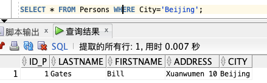

AND 和 OR 可在 WHERE 子语句中把两个或多个条件结合起来。

- 如果第一个条件和第二个条件都成立，则 AND 运算符显示一条记录。

- 如果第一个条件和第二个条件中只要有一个成立，则 OR 运算符显示一条记录。

**语法：**

**AND 运算符实例：**

```sql
SELECT * FROM 表名称 WHERE 列 运算符 值 AND 列 运算符 值;
1
```

**OR 运算符实例：**

```sql
SELECT * FROM 表名称 WHERE 列 运算符 值 OR 列 运算符 值;
1
```

**实例：**

由于 Persons 表数据太少，因此增加几条记录：

```sql
INSERT INTO Persons VALUES (2, 'Adams', 'John', 'Oxford Street', 'London');
INSERT INTO Persons VALUES (3, 'Bush', 'George', 'Fifth Avenue', 'New York');
INSERT INTO Persons VALUES (4, 'Carter', 'Thomas', 'Changan Street', 'Beijing');
INSERT INTO Persons VALUES (5, 'Carter', 'William', 'Xuanwumen 10', 'Beijing');
SELECT * FROM Persons;
12345
```

**AND 运算符实例：**

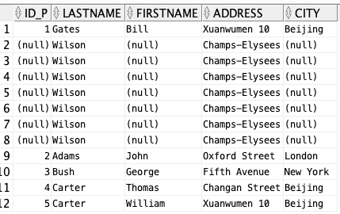

使用 AND 来显示所有姓为 “Carter” 并且名为 “Thomas” 的人：

```sql
SELECT * FROM Persons WHERE FirstName='Thomas' AND LastName='Carter';
1
```

**OR 运算符实例：**

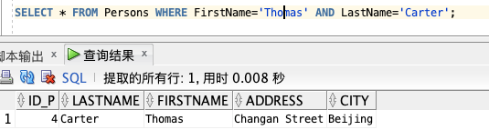

使用 OR 来显示所有姓为 “Carter” 或者名为 “Thomas” 的人：

```sql
SELECT * FROM Persons WHERE firstname='Thomas' OR lastname='Carter';
1
```

**结合 AND 和 OR 运算符：**

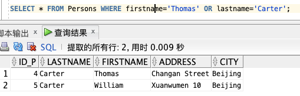

我们也可以把 AND 和 OR 结合起来（使用圆括号来组成复杂的表达式）:

```sql
SELECT * FROM Persons WHERE (FirstName='Thomas' OR FirstName='William') AND LastName='Carter';
1
```

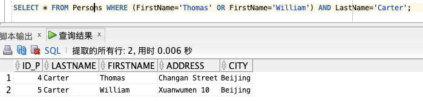

ORDER BY 语句用于根据指定的列对结果集进行排序，默认按照升序对记录进行排序，如果您希望按照降序对记录进行排序，可以使用 DESC 关键字。

**语法：**

```sql
SELECT * FROM 表名称 ORDER BY 列1,列2 DESC;
1
```

默认排序为 ASC 升序，DESC 代表降序。

**实例：**

以字母顺序显示 

```sql
SELECT * FROM Persons ORDER BY LASTNAME;
1
```

空值（NULL）默认排序在有值行之后。

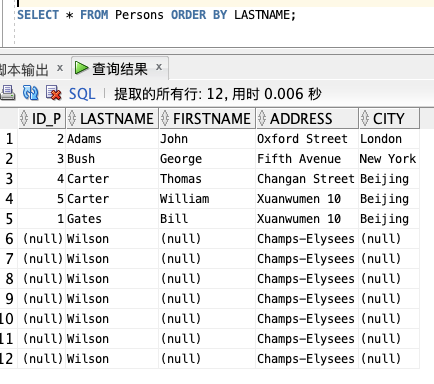

以数字顺序显示

```sql
SELECT * FROM Persons ORDER BY ID_P,LASTNAME;
1
```

以数字降序显示

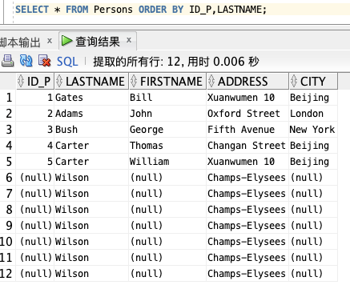

```sql
SELECT * FROM Persons ORDER BY ID_P DESC;
1
```

**📢 注意：**

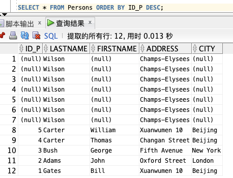

Update 语句用于修改表中的数据。

**语法：                                                                                                                                                                                                                                                                                                                                                                                                                                                                                                                                                                                                                                                                                                                                                                                                                                                                                                                                                                                                                                                                                                                                                                                                                                                                                                                                                                                                                                                                                                                                                                                                                                                                                                               **

```sql
UPDATE 表名称 SET 列名称 = 新值 WHERE 列名称 = 某值;
1
```

**实例：**

**更新某一行中的一个列：**

目前 

```sql
UPDATE Persons SET FirstName = 'Fred' WHERE LastName = 'Wilson';
1
```

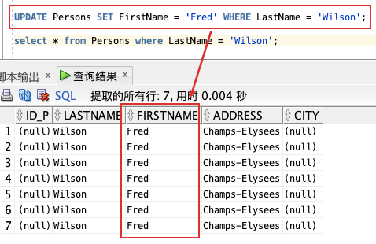

**更新某一行中的若干列：**

```sql
UPDATE Persons SET ID_P = 6,city= 'London' WHERE LastName = 'Wilson';
1
```

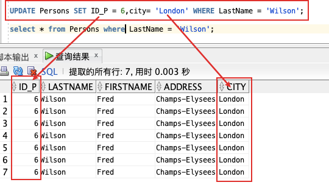

DELETE 语句用于删除表中的行。

**语法：**

```sql
DELETE FROM 表名称 WHERE 列名称 = 值;
1
```

**实例：**

**删除某行：**

删除 

```sql
DELETE FROM Persons WHERE LastName = 'Wilson';
1
```

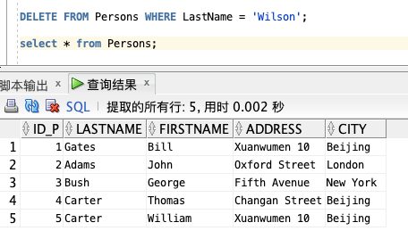

**删除所有行：**

可以在不删除表的情况下删除所有的行。这意味着表的结构、属性和索引都是完整的：

```sql
DELETE FROM table_name;
1
```


如果我们仅仅需要除去表内的数据，但并不删除表本身，那么我们该如何做呢？

可以使用 TRUNCATE TABLE 命令（仅仅删除表格中的数据）：

**语法：**

```sql
TRUNCATE TABLE 表名称;
1
```

**实例：**

本例演示如何删除名为 “Persons” 的表。

```sql
TRUNCATE TABLE persons;
1
```

DROP TABLE 语句用于删除表（表的结构、属性以及索引也会被删除）。

**语法：**

```sql
DROP TABLE 表名称;
1
```

**实例：**

本例演示如何删除名为 “Persons” 的表。

```sql
drop table persons;
1
```

从上图可以看出，第一次执行删除时，成功删除了表 

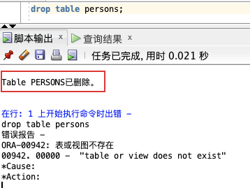

LIKE 操作符用于在 WHERE 子句中搜索列中的指定模式。

**语法：**

```sql
SELECT 列名/(*) FROM 表名称 WHERE 列名称 LIKE 值;
1
```

**实例：**

Persons

```sql
INSERT INTO Persons VALUES (1, 'Gates', 'Bill', 'Xuanwumen 10', 'Beijing');
INSERT INTO Persons VALUES (2, 'Adams', 'John', 'Oxford Street', 'London');
INSERT INTO Persons VALUES (3, 'Bush', 'George', 'Fifth Avenue', 'New York');
INSERT INTO Persons VALUES (4, 'Carter', 'Thomas', 'Changan Street', 'Beijing');
INSERT INTO Persons VALUES (5, 'Carter', 'William', 'Xuanwumen 10', 'Beijing');
select * from persons;
123456
```

1、现在，我们希望从上面的 “Persons” 表中选取居住在以 “N” 开头的城市里的人：

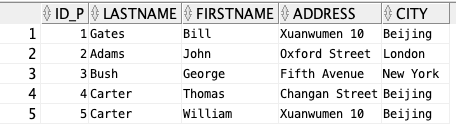

```sql
SELECT * FROM Persons WHERE City LIKE 'N%';
1
```

2、接下来，我们希望从 “Persons” 表中选取居住在以 “g” 结尾的城市里的人：

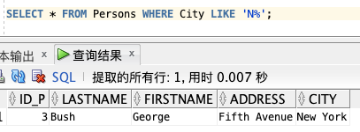

```sql
SELECT * FROM Persons WHERE City LIKE '%g';
1
```

3、接下来，我们希望从 “Persons” 表中选取居住在包含 “lon” 的城市里的人：

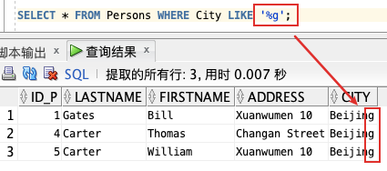

```sql
SELECT * FROM Persons WHERE City LIKE '%on%';
1
```

4、通过使用 NOT 关键字，我们可以从 “Persons” 表中选取居住在不包含 “lon” 的城市里的人：

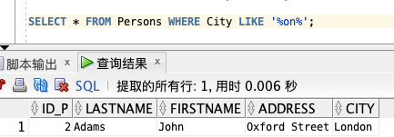

```sql
SELECT * FROM Persons WHERE City NOT LIKE '%on%';
1
```

**📢注意：**

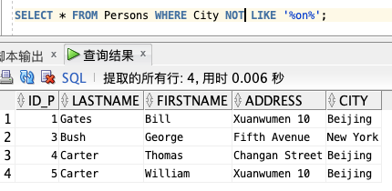

IN 操作符允许我们在 WHERE 子句中规定多个值。

**语法：**

```sql
SELECT 列名/(*) FROM 表名称 WHERE 列名称 IN (值1,值2,值3);
1
```

**实例：**

现在，我们希望从 

```sql
SELECT * FROM Persons WHERE LastName IN ('Adams','Carter');
1
```

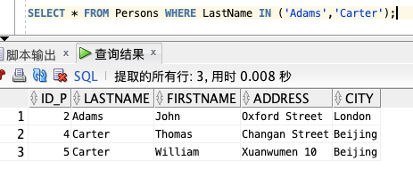

操作符 BETWEEN … AND 会选取介于两个值之间的数据范围。这些值可以是数值、文本或者日期。

**语法：**

```sql
SELECT 列名/(*) FROM 表名称 WHERE 列名称 BETWEEN 值1 AND 值2;
1
```

**实例：**

1、查询以字母顺序显示介于 “Adams”（包括）和 “Carter”（不包括）之间的人：

```sql
SELECT * FROM Persons WHERE LastName BETWEEN 'Adams' AND 'Carter';
1
```

2、查询上述结果相反的结果，可以使用 NOT：

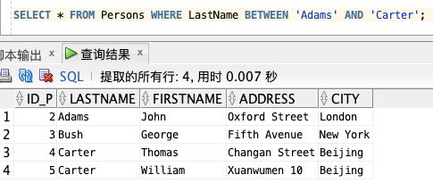

```sql
SELECT * FROM Persons WHERE LastName NOT BETWEEN 'Adams' AND 'Carter';
1
```

**📢 注意：**

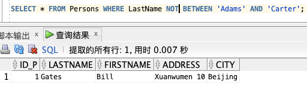

> 某些数据库会列出介于 “Adams” 和 “Carter” 之间的人，但不包括 “Adams” 和 “Carter” ；某些数据库会列出介于 “Adams” 和 “Carter” 之间并包括 “Adams” 和 “Carter” 的人；而另一些数据库会列出介于 “Adams” 和 “Carter” 之间的人，包括 “Adams” ，但不包括 “Carter” 。


**所以，请检查你的数据库是如何处理 BETWEEN…AND 操作符的！**

通过使用 SQL，可以为列名称和表名称指定别名（Alias），别名使查询程序更易阅读和书写。

**语法：**

**表别名：**

```sql
SELECT 列名称/(*) FROM 表名称 AS 别名;
1
```

**列别名：**

```sql
SELECT 列名称 as 别名 FROM 表名称;
1
```

**实例：**

**使用表名称别名：**

```sql
SELECT p.LastName, p.FirstName
FROM Persons p 
WHERE p.LastName='Adams' AND p.FirstName='John';
123
```

**使用列名别名：**

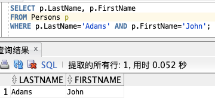

```sql
SELECT LastName "Family", FirstName "Name" FROM Persons;
1
```

**📢 注意：**

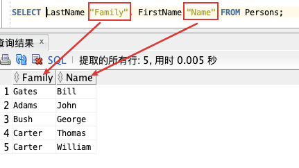

JOIN

有时为了得到完整的结果，我们需要从两个或更多的表中获取结果。我们就需要执行 

数据库中的表可通过键将彼此联系起来。主键（Primary Key）是一个列，在这个列中的每一行的值都是唯一的。在表中，每个主键的值都是唯一的。这样做的目的是在不重复每个表中的所有数据的情况下，把表间的数据交叉捆绑在一起。

如图，“Id_P” 列是 Persons 表中的的主键。这意味着没有两行能够拥有相同的 Id_P。即使两个人的姓名完全相同，Id_P 也可以区分他们。

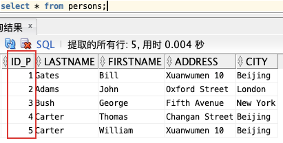

**❤️ 为了下面实验的继续，我们需要再创建一个表：Orders。**

```sql
create table orders (id_o number,orderno number,id_p number);
insert into orders values(1,11111,1);
insert into orders values(2,22222,2);
insert into orders values(3,33333,3);
insert into orders values(4,44444,4);
insert into orders values(6,66666,6);
select * from orders;
1234567
```

如图，“Id_O” 列是 Orders 表中的的主键，同时，“Orders” 表中的 “Id_P” 列用于引用 “Persons” 表中的人，而无需使用他们的确切姓名。

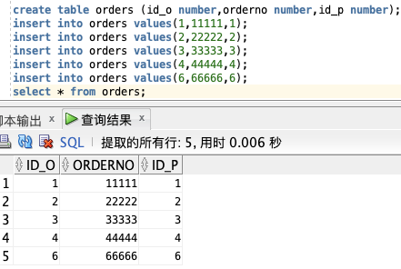

```sql
select * from persons p,orders o where p.id_p=o.id_p;
1
```

可以看到，“Id_P” 列把上面的两个表联系了起来。

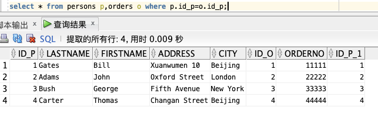

**语法：**

```sql
select 列名
from 表A
INNER|LEFT|RIGHT|FULL JOIN 表B
ON 表A主键列 = 表B外键列;
1234
```

**不同的 SQL JOIN：**

下面列出了您可以使用的 JOIN 类型，以及它们之间的差异。

- JOIN: 如果表中有至少一个匹配，则返回行

- INNER JOIN: 内部连接，返回两表中匹配的行

- LEFT JOIN: 即使右表中没有匹配，也从左表返回所有的行

- RIGHT JOIN: 即使左表中没有匹配，也从右表返回所有的行

- FULL JOIN: 只要其中一个表中存在匹配，就返回行

**实例：**

如果我们希望列出所有人的定购，可以使用下面的 SELECT 语句：

```sql
SELECT p.LastName, p.FirstName, o.OrderNo
FROM Persons p
INNER JOIN Orders o
ON p.Id_P = o.Id_P
ORDER BY p.LastName DESC;
12345
```

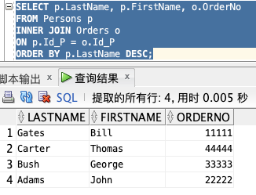

UNION

**UNION 语法：**

```sql
SELECT 列名 FROM 表A
UNION
SELECT 列名 FROM 表B;
123
```

**📢注意：**

**UNION ALL 语法：**

```sql
SELECT 列名 FROM 表A
UNION ALL
SELECT 列名 FROM 表B;
123
```

另外，UNION 结果集中的列名总是等于 UNION 中第一个 SELECT 语句中的列名。

为了实验所需，创建 Person_b 表：

```sql
CREATE TABLE Persons_b
(
Id_P int,
LastName varchar(255),
FirstName varchar(255),
Address varchar(255),
City varchar(255)
);
INSERT INTO Persons_b VALUES (1, 'Bill', 'Gates', 'Xuanwumen 10', 'Londo');
INSERT INTO Persons_b VALUES (2, 'John', 'Adams', 'Oxford Street', 'nBeijing');
INSERT INTO Persons_b VALUES (3, 'George', 'Bush', 'Fifth Avenue', 'Beijing');
INSERT INTO Persons_b VALUES (4, 'Thomas', 'Carter', 'Changan Street', 'New York');
INSERT INTO Persons_b VALUES (5, 'William', 'Carter', 'Xuanwumen 10', 'Beijing');
select * from persons_b;
1234567891011121314
```

**实例：**

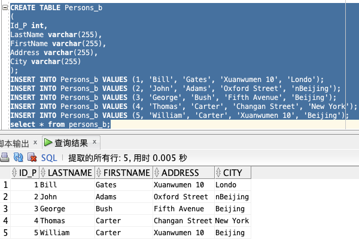

**使用 UNION 命令：**

列出 persons 和 persons_b 中不同的人：

```sql
select * from persons
UNION
select * from persons_b;
123
```

**📢注意：**

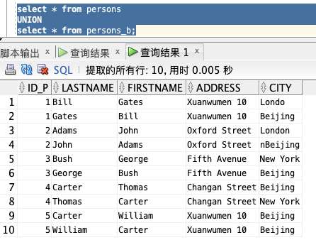

NOT NULL

NOT NULL 约束强制字段始终包含值。这意味着，如果不向字段添加值，就无法插入新记录或者更新记录。

**语法：**

```sql
CREATE TABLE 表
(
列 int NOT NULL
);
1234
```

如上，创建一个表，设置列值不能为空。

**实例：**

```sql
create table lucifer (id number not null);
insert into lucifer values (NULL);
12
```

**📢 注意：**

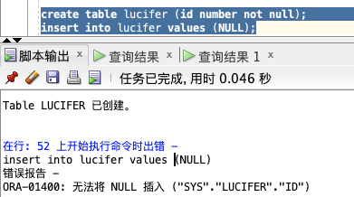

**⭐️ 拓展小知识：**

```sql
select * from persons where FirstName is not null;
1
```

同理，

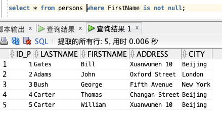

```sql
select * from persons where FirstName is null;
1
```

感兴趣的朋友，可以自己尝试一下！

在 SQL 中，视图是基于 SQL 语句的结果集的可视化的表。

视图包含行和列，就像一个真实的表。视图中的字段就是来自一个或多个数据库中的真实的表中的字段。我们可以向视图添加 SQL 函数、WHERE 以及 JOIN 语句，我们也可以提交数据，就像这些来自于某个单一的表。

**语法：**

```sql
CREATE VIEW 视图名 AS
SELECT 列名
FROM 表名
WHERE 查询条件;
1234
```

**📢 注意：**

**实例：**

下面，我们将 Persons 表中住在 Beijing 的人筛选出来创建视图：

```sql
create view persons_beijing as
select * from persons where city='Beijing';
12
```

查询上面这个视图：

如果需要更新视图中的列或者其他信息，无需删除，使用 

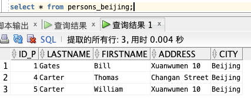

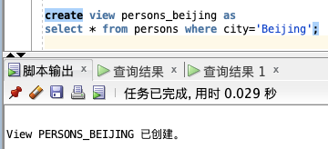

```sql
CREATE OR REPLACE VIEW 视图名 AS
SELECT 列名
FROM 表名
WHERE 查询条件;
1234
```

**实例：**

现在需要筛选出，LASTNAME 为 Gates 的记录：

```sql
create or replace view persons_beijing as
select * from persons where lastname='Gates';
12
```

删除视图就比较简单，跟表差不多，使用 

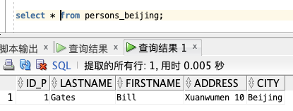

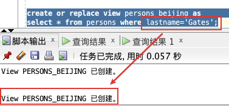

```sql
drop view persons_beijing;
1
```

**❤️ 本章要讲的高级语言就先到此为止，不宜一次性介绍太多~**

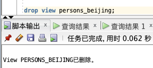

SQL 拥有很多可用于计数和计算的内建函数。

**函数的使用语法：**

```sql
SELECT function(列) FROM 表;
1
```

**❤️ 下面就来看看有哪些常用的函数！**

AVG 函数返回数值列的平均值。NULL 值不包括在计算中。

**语法：**

```sql
SELECT AVG(列名) FROM 表名;
1
```

**实例：**

计算 “orderno” 字段的平均值。

```sql
select avg(orderno) from orders;
1
```

当然，也可以用在查询条件中，例如查询低于平均值的记录：

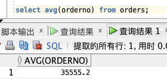

```sql
select * from orders where orderno < (select avg(orderno) from orders);
1
```

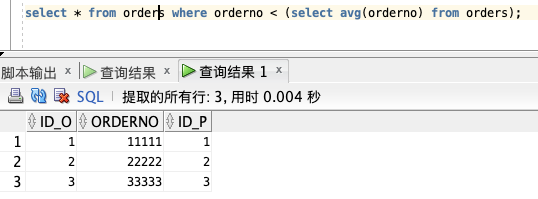

COUNT() 函数返回匹配指定条件的行数。

**语法：**

count()

- COUNT(*) ：返回表中的记录数。

- COUNT(DISTINCT 列名) ：返回指定列的不同值的数目。

- COUNT(列名) ：返回指定列的值的数目（NULL 不计入）。

```sql
SELECT COUNT(*) FROM 表名;
SELECT COUNT(DISTINCT 列名) FROM 表名;
SELECT COUNT(列名) FROM 表名;
123
```

**实例：**

**COUNT(*) ：**

```sql
select count(*) from persons;
1
```

**COUNT(DISTINCT 列名) ：**

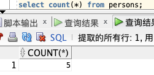

```sql
select count(distinct city) from persons;
1
```

**COUNT(列名) ：**

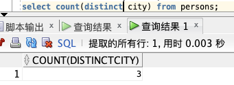

```sql
select count(city) from persons;
1
```

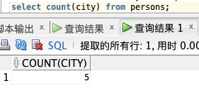

MAX

**语法：**

```sql
SELECT MAX(列名) FROM 表名;
1
```

MIN 和 MAX 也可用于文本列，以获得按字母顺序排列的最高或最低值。

**实例：**

```sql
select max(orderno) from orders;
1
```

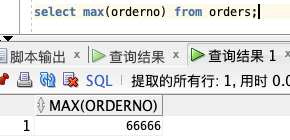

MIN

**语法：**

```sql
SELECT MIN(列名) FROM 表名;
1
```

**实例：**

```sql
select min(orderno) from orders;
1
```


SUM

**语法：**

```sql
SELECT SUM(列名) FROM 表名;
1
```

**实例：**

```sql
select sum(orderno) from orders;
1
```


GROUP BY 语句用于结合合计函数，根据一个或多个列对结果集进行分组。

**语法：**

```sql
SELECT 列名A, 统计函数(列名B)
FROM 表名
WHERE 查询条件
GROUP BY 列名A;
1234
```

**实例：**

获取 Persons 表中住在北京的总人数，根据 LASTNAME 分组：

```sql
select lastname,count(city) from persons 
where city='Beijing' 
group by lastname;
123
```

如果不加 

也就是常见的 


在 SQL 中增加 HAVING 子句原因是，WHERE 关键字无法与合计函数一起使用。

**语法：**

```sql
SELECT 列名A, 统计函数(列名B)
FROM table_name
WHERE 查询条件
GROUP BY 列名A
HAVING 统计函数(列名B) 查询条件;
12345
```

**实例：**

获取 Persons 表中住在北京的总人数大于1的 LASTNAME，根据 LASTNAME 分组：

```sql
select lastname,count(city) from persons 
where city='Beijing' 
group by lastname
having count(city) > 1;
1234
```


UCASE/UPPER

**语法：**

```sql
select upper(列名) from 表名;
1
```

**实例：**

选取 “LastName” 和 “FirstName” 列的内容，然后把 “LastName” 列转换为大写：

```sql
select upper(lastname),firstname from persons;
1
```


LCASE/LOWER

**语法：**

```sql
select lower(列名) from 表名;
1
```

**实例：**

选取 “LastName” 和 “FirstName” 列的内容，然后把 “LastName” 列转换为小写：

```sql
select lower(lastname),firstname from persons;
1
```


LEN/LENGTH

**语法：**

```sql
select length(列名) from 表名;
1
```

**实例：**

获取 LASTNAME 的值字符长度：

```sql
select length(lastname),lastname from persons;
1
```


ROUND

**语法：**

```sql
select round(列名,精度) from 表名;
1
```

**实例：**

**保留2位：**

```sql
select round(1.1314,2) from dual;
select round(1.1351,2) from dual;
12
```

📢 注意：


**取整：**

```sql
select round(1.1351,0) from dual;
select round(1.56,0) from dual;
12
```


NOW/SYSDATE

**语法：**

```sql
select sysdate from 表名;
1
```

**实例：**

获取当前时间：

```sql
select sysdate from dual;
1
```

**📢 注意：**


**上述如果都学完了的话，可以来做个小测验：**

**❤️ 测验会被记分：**

每道题的分值是 1 分。在您完成全部的20道题之后，系统会为您的测验打分，并提供您做错的题目的正确答案。其中，绿色为正确答案，而红色为错误答案。

**☞ **

文章知识点与官方知识档案匹配，可进一步学习相关知识

[MySQL入门技能树](https://edu.csdn.net/skill/mysql/mysql-753300de6ef94af7be40fb91a05421a6?utm_source=csdn_ai_skill_tree_blog)

[SQL高级技巧](https://edu.csdn.net/skill/mysql/mysql-753300de6ef94af7be40fb91a05421a6?utm_source=csdn_ai_skill_tree_blog)

[CTE和递归查询](https://edu.csdn.net/skill/mysql/mysql-753300de6ef94af7be40fb91a05421a6?utm_source=csdn_ai_skill_tree_blog)38794


**Lucifer三思而后行**


微信公众号


回复 [100天实战] 即可领取课程全套资料包！[**Lucifer三思而后行**](https://luciferliu.blog.csdn.net/)


[已关注](javascript:;)

- 1677


- 


- 10785


- 


- 188


- 

- 


[**SQL**入门新手教程.pdf](https://download.csdn.net/download/qq_42799900/26400382)

09-30

[**SQL**入门新手教程.pdf](https://download.csdn.net/download/qq_42799900/26400382)

[**SQL**语言**入门教程**（PDF版）](https://download.csdn.net/download/bdssx/2744786)

10-10

[该书简要的介绍了**SQL**语言的入门语法，较适合刚学的人查询](https://download.csdn.net/download/bdssx/2744786)评论


[A380084708](https://blog.csdn.net/A380084708)


热评

最基础的最重要，最简单的最有效！写的非常好，深入浅出，看完就可以上手了。已经重复看了几遍了。

[**SQL**最全**基础**教程(保证你看了绝对点赞收藏)_**sql**教程_搬砖养女人的博客...](https://blog.csdn.net/m0_68850571/article/details/123990306)

2-16

[视图,一种基于**SQL**语句的结果集可视化表。视图包含行和列,就像一个真实的表。视图中的字段来自一个或多个**数据库**中的真实的表中的字段,我们可以向视图添加**SQL**函数、where以及join语句,我们提交数据,然后这些来自某个单一的表。需要注意的...](https://blog.csdn.net/m0_68850571/article/details/123990306)

[史上超强最常用**SQL**语句大全_小小张自由—>张有博的博客_**sql**...](https://blog.csdn.net/promsing/article/details/112793260)

2-14

[史上超强最常用**SQL**语句大全,) 1)DDL--数据定义语言用来定义**数据库**对象:**数据库**,表,列等。关键字:create, drop,alter 等2) DML--数据操作语言用来对**数据库**中表的数据进行增删改。关键字:insert, delete, update 等3) DQL--数据...](https://blog.csdn.net/promsing/article/details/112793260)

[很适合新手的**SQL**教程，菜鸟们的福音。](https://download.csdn.net/download/rjpanpan/3274673)

05-13

[很**基础**的东西，适合菜鸟。很适合入门级选手使用。](https://download.csdn.net/download/rjpanpan/3274673)

[**SQL**学习笔记1](https://blog.csdn.net/weixin_34293141/article/details/93433665)

[weixin_34293141的博客](https://blog.csdn.net/weixin_34293141)

 3026


[* 以下内容是我在学习**SQL**（http://www.w3school.com.cn/**sql**/index.asp）的时候的学习笔记 * 学习时使用的**数据库**软件是My**SQL数据库**可视化工具**SQL**yogEnt * 如果大家有发现什么不对的地方请告诉我。谢啦!!☆⌒(*＾-゜)v * 在这里需要注意的是，和**Sql**Server相比My**SQL**不支持事务处理，没有视图，没有存储过程和触发器，没有数...](https://blog.csdn.net/weixin_34293141/article/details/93433665)

[**SQL**介绍_Gauss松鼠会的博客_**sql**介绍](https://blog.csdn.net/GaussDB/article/details/126717917)

2-19

[二、openGauss**数据库**的“**SQL**” openGauss**数据库**支持的**SQL**标准,默认支持**SQL**2、**SQL**3和**SQL**4的主要特性。当然了, 一般说到**数据库**的**SQL**语句,就离不开两个方面: 一是数据类型,二是**sql**语句基本语法。下文就此简单阐述一下: 1、数据类型(常...](https://blog.csdn.net/GaussDB/article/details/126717917)

[**SQL**语言(最**基础**,实例讲解)_观雨Java的博客_**sql**语言](https://blog.csdn.net/m0_58702068/article/details/121622285)

2-9

[**SQL**:Structure Query Language(结构化查询语言),是一种标准化的语言,用来操作**数据库**的语句,如创建项目(Create),查询内容(Read),更新内容(Update),删除条目(Delete)等操作。 Create,Read,Update,Delete通常称为CRUD. **SQL**分为普通话和方言...](https://blog.csdn.net/m0_58702068/article/details/121622285)

[**数据库基础**语言DQL语句最新发布](https://blog.csdn.net/m0_49158934/article/details/128678207)

[m0_49158934的博客](https://blog.csdn.net/m0_49158934)

 37


[1、查看公司所有员工的工资，且工资从低到高排序FROM emp2、按照时间排序时，越早的时间越小，越晚的时间越大FROM emp3、按照升序排序时，可以使用关键字ASC，但是通常不需要写，因为默认就是升序(从小到大)FROM emp4、按照工资从大到小排序(降序)，降序使用关键字DESCFROM emp5、查看每个部门的工资排名ORDER BY可以按照多字段排序，排序优先级时先将结果集按照第一个字段的值排序，保证第一个字段排序顺序的前提下。](https://blog.csdn.net/m0_49158934/article/details/128678207)

[**SQL** Server 0**基础**入门&操作手册，超详细全面~](https://blog.csdn.net/qq_37128049/article/details/118400421)

[暗余的博客](https://blog.csdn.net/qq_37128049)

 1万+


[**SQL** Server 0**基础**入门&操作手册 一. **SQL** 简介 1.1 主要特性 高性能设计，可充分利用WindowsNT的优势 系统管理先进，支持Windows图形化管理工具，支持本地和远程的系统管理和配置 强壮的事务处理功能，采用各种方法保证数据的完整性 支持对称多处理结构、存储过程、ODBC，并具有自主的**SQL**语言。**SQL** SERVER以其内置的数据复制功能、强大的管理工具、与Internet的紧密集成和开放的系统结构为广大的用户、开发人员和系统集成商提供了一个出众的**数据库**平台。 1.2](https://blog.csdn.net/qq_37128049/article/details/118400421)

[**SQL**是什么?**SQL**能做什么?_我只想争壹口氣的博客_**sql**是啥](https://blog.csdn.net/www_chf/article/details/125721852)

2-20

[对**数据库**进行查询和修改操作的语言叫做 **SQL**(Structured Query Language,结构化查询语言)。**SQL** 语言是目前广泛使用的关系**数据库**标准语言,是各种**数据库**交互方式的**基础** 著名的大型商用**数据库** **Oracle**、DB2、Sybase、**SQL** Server,开源的**数据库** Post...](https://blog.csdn.net/www_chf/article/details/125721852)

[**SQL**的使用_**sql**怎么用_chnejgeo的博客](https://blog.csdn.net/chnejgeo/article/details/123602480)

2-26

[这一**篇**先从**SQL**简单的开始 首先**SQL**除了特定对象(比如你要引用哪一张表)外都不区分大小写 1.查询数据 Select * from table_name t1 从table_name中返回所有数据 *代表所有,也可以返回其它数据,当有俩个以上中间用逗号隔开 ...](https://blog.csdn.net/chnejgeo/article/details/123602480)

[**SQL数据库**](https://blog.csdn.net/qq_40961821/article/details/121462448)

[qq_40961821的博客](https://blog.csdn.net/qq_40961821)

 1万+


[**SQL**简介](https://blog.csdn.net/qq_40961821/article/details/121462448)

[**SQL**语句的**基础**教程(一)](https://blog.csdn.net/weixin_44561769/article/details/92762229)

[weixin_44561769的博客](https://blog.csdn.net/weixin_44561769)

 2万+


[**SQL**语句的**基础**教程(一) 开发工具与关键技术：**SQL** Server 2014 Management Studio、**SQL**语句的**基础**教程（一） 作者：袁何恩 撰写时间：2019年6月16日 今天，我要和大家分享的技术是**SQL**语句的**基础**教程。 **SQL**可以面向**数据库**执行查询数据，在**数据库**中取回、插入、更新、删除数据和创建新表，并且建新**数据库**，**SQL**语句可以分为两个部分，分别是数据操作语言和数据定义语言...](https://blog.csdn.net/weixin_44561769/article/details/92762229)

[1.什么是**SQL**?_一粒微尘_1的博客_**sql**是什么](https://blog.csdn.net/zhangke0426/article/details/123380677)

2-7

[**SQL**(Structured Query Language)是一种**数据库**的结构化查询语言。 **数据库**分为关系型**数据库**、非关系型**数据库**。 关系型**数据库**:My**SQL**、**SQL** Server、Access、**Oracle**、DB2、**SQL**ite、Sybase。 My**SQL**:由瑞典My**SQL** AB公司开发,目前归甲骨文拥有的开...](https://blog.csdn.net/zhangke0426/article/details/123380677)

[常用**SQL** 大全_**sql**大全_朗晴的博客](https://blog.csdn.net/jacktree365/article/details/127247695)

1-29

[史上超强最常用**SQL**语句大全,) 1)DDL--数据定义语言用来定义**数据库**对象:**数据库**,表,列等。关键字:create, drop,alter 等 2) DML--数据操作语言用来对**数据库**中表的数据进行增删改。关键字:insert, delete, update 等 3) DQL--数据...](https://blog.csdn.net/jacktree365/article/details/127247695)

[**SQL**零**基础**入门必知必会！](https://huaweicloud.csdn.net/63355094d3efff3090b54085.html)

[华章IT官方博客](https://blog.csdn.net/hzbooks)

 8088


[???? 前言**SQL**语言有40多年的历史，从它被应用至今几乎无处不在。我们消费的每一笔支付记录，收集的每一条用户信息，发出去的每一条消息，都会使用**数据库**或与其相关的产品来存储，而操纵**数据库**的语言...](https://huaweicloud.csdn.net/63355094d3efff3090b54085.html)

[**SQL**知识（浓缩版）快速入门（**基础**语法、概念）](https://blog.csdn.net/Strengthen123/article/details/126050520)

[Strengthen123的博客](https://blog.csdn.net/Strengthen123)

 2588


[快速入门必备知识（浓缩版）](https://blog.csdn.net/Strengthen123/article/details/126050520)

[【**SQL**教程|01】**SQL**简介——什么是**SQL**_AwesomeTang的博客](https://blog.csdn.net/qq_27484665/article/details/128160681)

2-20

[**SQL**是一门语言 **SQL**是Structured Query Language的简写,中文译为“结构化查询语言”; **SQL**是一种用来查询和处理关系性**数据库**的语言,使用**SQL**我们可以: 增(INSERT):可以向**数据库**中插入记录; 删(DELETE):可以删除数据可中的记录; ...](https://blog.csdn.net/qq_27484665/article/details/128160681)

[**SQL** **数据库**基本操作](https://huaweicloud.csdn.net/63356100d3efff3090b54beb.html)

[程序员小白的博客](https://blog.csdn.net/weixin_43960383)

 1万+


[**SQL** **数据库**基本操作](https://huaweicloud.csdn.net/63356100d3efff3090b54beb.html)

[**SQL数据库**（**SQL** Server）**基础**知识思维导图（最终版）](https://download.csdn.net/download/yunfengwangking/10111368)

11-09

[**SQL数据库**（**SQL** Server）**基础**知识思维导图（最终版），较之前的版本，进行了一些修改整理。](https://download.csdn.net/download/yunfengwangking/10111368)

[全新**SQL** Server教程](https://blog.csdn.net/chinaherolts2008/article/details/110661062)

[chinaherolts2008的博客](https://blog.csdn.net/chinaherolts2008)

 1044


[**SQL基础**教程 一、**SQL**简介 1：什么是**SQL**？ A:**SQL**指结构化查询语句 B:**SQL**使我们有能力访问**数据库** C:**SQL**是一种ANSI(美国国家标准化组织)的标准计算机语言 2：**SQL**能做什么？ *面向**数据库**执行查询 *从**数据库**中取出数据 *向**数据库**插入新的记录 *更新**数据库**中数据 *从**数据库**删除记录 *创建**数据库** *创建表 *创建存储过程 *创建视图 *设置表、存储过程和视图的权限 3：RDBMS RDBMS是指关系型**数据库**管理系统 RDBMS是**SQL**的**基础**，](https://blog.csdn.net/chinaherolts2008/article/details/110661062)

[**SQL**语句教程（完本高清PDF）](https://download.csdn.net/download/u010037928/10908136)

01-10

[**SQL** 语法 无论您是一位 **SQL** 的新手，或是一位只是需要对 **SQL** 复习一下的资料仓储业界老将，您 就来对地方了。这个 **SQL** 教材网站列出常用的 **SQL** 指令,包含以下几个部分: ♦ **SQL** 指令: **SQL** 如何被用来储存、读取、以及处理**数据库**之中的资料。 ♦ 表格处理: **SQL** 如何被用来处理**数据库**中的表格。 ♦ 进阶 **SQL**: 介绍 **SQL** 进阶概念，以及如何用 **SQL** 来执行一些较复杂的运算。 ♦ **SQL** 语法: 这一页列出所有在这个教材中被提到的 **SQL** 语法。 对于每一个指令，我们将会先列出及解释这个指令的语法，然后用一个例子来让读者了解这 个指令是如何被运用的。当您读完了这个网站的所有教材后，您将对 **SQL** 的语法会有一个 大致上的了解。另外，您将能够正确地运用 **SQL** 来由**数据库**中获取信息。笔者本身的经验 是，虽然要对 **SQL** 有很透彻的了解并不是一朝一夕可以完成的，可是要对 **SQL** 有个基本 的了解并不难。希望在看完这个网站后，您也会有同样的想法。](https://download.csdn.net/download/u010037928/10908136)

[**SQL** Server **数据库**学习](https://blog.csdn.net/kenjianqi1647/article/details/82183441)

[灰太狼的小秘密](https://blog.csdn.net/kenjianqi1647)

 14万+


[一、认识**数据库** 1、**数据库**的基本概念 2、**数据库**常用对象 3、**数据库**的组成 **数据库**主要由文件和文件组组成。**数据库**中所有的数据和对象都被存储在文件中。 二、创建**数据库** 1、创建**数据库** 对象资源管理器—**数据库**——右击——新建**数据库** 三、操作数据表与视图 1、创建数据表 空值：表示数据未知。非空值：数据列不允许空值。 （1）选择一个**数据库**——展开 表——...](https://blog.csdn.net/kenjianqi1647/article/details/82183441)

[**数据库**---**SQL**](https://blog.csdn.net/m0_58342797/article/details/123445725)

[m0_58342797的博客](https://blog.csdn.net/m0_58342797)

 1826


[基本概念 **数据库**（Database） 简称DB，是长期存储在计算机内，有组织的，可共享的大量数据的集合。 基本特征 我们安装**数据库**软件时，安装的是客户端和服务端，在客户端上输入指令，服务器会进行操作。 ...](https://blog.csdn.net/m0_58342797/article/details/123445725)

[经典**SQL**语句大全热门推荐](https://huaweicloud.csdn.net/63a567a6b878a54545946773.html)

[学习笔记](https://blog.csdn.net/znyyjk)

 44万+


[**SQL**语句参考，包含Access、My**SQL** 以及 **SQL** Server**基础**创建**数据库**CREATE DATABASE database-name 删除**数据库**drop database dbname 备份**sql** server 创建 备份数据的 device USE master EXEC sp_addumpdevice 'disk', 'testBack', 'c:\ms**sql**7backup\MyN](https://huaweicloud.csdn.net/63a567a6b878a54545946773.html)

[**SQL**基本语句（整理）](https://huaweicloud.csdn.net/633564a6d3efff3090b5550c.html)

[weixin_43294936的博客](https://blog.csdn.net/weixin_43294936)

 7万+


[一、DDL(Data Definition Language) 数据定义语言，用来定义**数据库**对象（**数据库**，表，字段） ①查询 查询所有**数据库** show databases; 查询当前**数据库** select database(); ②创建 create database [if not exists] **数据库**名 [default charset 字符集][collate 排序规则]; #中括号里的可加可不加，具体情况而定 #第一个是如果不存在相同名称的**数据库**则创建 #..](https://huaweicloud.csdn.net/633564a6d3efff3090b5550c.html)

[MY**SQL数据库**进阶操作](https://blog.csdn.net/weixin_33816300/article/details/93872102)

[weixin_33816300的博客](https://blog.csdn.net/weixin_33816300)

 1379


[一，**基础**强化 where语句的作用:使用where子句对表中的数据筛选，结果为true的行会出现在结果集中. 1，as关键字 在使用**SQL**语句显示结果的时候，往往在屏幕显示的字段名并不具备良好的可读性，此时可以使用as给字段起一个别名。 1)使用 as 给字段起别名 select id as 序号, name as 名字, gender as 性别 from students; ...](https://blog.csdn.net/weixin_33816300/article/details/93872102)

### “相关推荐”对你有帮助么？

- 


非常没帮助

- 


没帮助

- 


一般

- 


有帮助

- 


非常有帮助

[返回首页](https://blog.csdn.net/)

- 关于我们

- 招贤纳士

- 商务合作

- 寻求报道

- 400-660-0108

- kefu@csdn.net

- 在线客服

- 工作时间 8:30-22:00

- 公安备案号11010502030143

- 京ICP备19004658号

- 京网文〔2020〕1039-165号

- 经营性网站备案信息

- 北京互联网违法和不良信息举报中心

- 家长监护

- 网络110报警服务

- 中国互联网举报中心

- Chrome商店下载

- 账号管理规范

- 版权与免责声明

- 版权申诉

- 出版物许可证

- 营业执照

- ©1999-2023北京创新乐知网络技术有限公司


[**Lucifer三思而后行**](https://luciferliu.blog.csdn.net/)[](https://luciferliu.blog.csdn.net/)


码龄2年[ 数据库领域优质创作者](https://i.csdn.net/#/uc/profile?utm_source=14998968)


[**180**原创](https://luciferliu.blog.csdn.net/)

[**355**周排名](https://blog.csdn.net/rank/list/weekly)

[**1197**总排名](https://blog.csdn.net/rank/list/total)

**351万+**

访问

[](https://blog.csdn.net/blogdevteam/article/details/103478461)

等级

**8万+**

积分

**14万+**

粉丝

**1万+**

获赞

**3925**

评论

**5万+**

收藏


[私信](https://im.csdn.net/chat/m0_50546016)


### 热门文章

- 基础篇：数据库 SQL 入门教程


- 疫情趋势下，远程控制软件成为刚需，ToDesk or 向日葵，哪一款最好用？


- 数据中台怎么选型？终于有人讲明白了


- 时光不负，对我来说不寻常的一年 | 2021 年终总结


- 100天精通Oracle-实战系列（第8天）保姆级 PL/SQL Developer 安装与配置


### 分类专栏

- DBA 实战系列


27篇

- 100天精通Oracle-实战系列


27篇

- PyGame小游戏系列


1篇

- DBA日常小知识


47篇

- 三天入门Linux系统


3篇

- Vagrant安装Oracle系列


15篇

- Oracle MOS 文档


12篇

- 精选文章翻译


14篇

### 最新评论

- 基础篇：数据库 SQL 入门教程

[A380084708: ](https://blog.csdn.net/A380084708)最基础的最重要，最简单的最有效！写的非常好，深入浅出，看完就可以上手了。已经重复看了几遍了。

- 100天精通Oracle-实战系列（第25天）Oracle 数据泵并行和压缩

[Dfnygs: ](https://blog.csdn.net/qq_44828051)后面一直更不了，能退费不

- Oracle 从入门到精通系列讲解 - 总目录

[weixin_41395393: ](https://blog.csdn.net/weixin_41395393)这么久不更新，能退款吗

- 100天精通Oracle-实战系列 - 总目录

[weixin_41395393: ](https://blog.csdn.net/weixin_41395393)这么久不更新，能退款吗

- Java零基础如何入门学习？给初学者的建议，非常全面

[2301_76478404: ](https://blog.csdn.net/2301_76478404)视频里是java17版本那我下一样的先学？还是8版本好点

### 您愿意向朋友推荐“博客详情页”吗？

- 


强烈不推荐

- 


不推荐

- 


一般般

- 


推荐

- 


强烈推荐

### 最新文章

- 100天精通Oracle-实战系列（第25天）Oracle 数据泵并行和压缩

- 100天精通Oracle-实战系列（第24天）Oracle 数据泵表导出导入

- 100天精通Oracle-实战系列（第23天）Oracle 数据泵用户导出导入

[2022年69篇](https://luciferliu.blog.csdn.net/?type=blog&year=2022&month=10)

[2021年141篇](https://luciferliu.blog.csdn.net/?type=blog&year=2021&month=12)

### 目录

1. 目录

1. 📚 前言

1. 🌴 SQL 介绍

1. 

1. 🌼 什么是 SQL

1. 🌀 SQL 的类型

1. 🌵 学习 SQL 的作用

1. 🍄 数据库是什么

1. 🐥 SQL 基础语言学习

1. 

1. 🐤 CREATE TABLE – 创建表

1. 🐑 INSERT – 插入数据

1. 🐼 SELECT – 查询数据

1. 🐫 DISTINCT – 去除重复值

1. 🐸 WHERE – 条件过滤

1. 🐹 AND & OR – 运算符

1. 🐰 ORDER BY – 排序

1. 🐱 UPDATE – 更新数据

1. 🐨 DELETE – 删除数据

1. 🐵 TRUNCATE TABLE – 清除表数据

1. 🐯 DROP TABLE – 删除表

1. 🚀 SQL 高级言语学习

1. 

1. 🚢 LIKE – 查找类似值

1. 🚤 IN – 锁定多个值

1. ⛵️ BETWEEN – 选取区间数据

1. 🚂 AS – 别名

1. 🚁 JOIN – 多表关联

1. 🚜 UNION – 合并结果集

1. 🚌 NOT NULL – 非空

1. 🚐 VIEW – 视图

1. 🎯 SQL 常用函数学习

1. 

1. 🍔 AVG – 平均值

1. 🍕 COUNT – 汇总行数

1. 🍘 MAX – 最大值

1. 🍢 MIN – 最小值

1. 🍰 SUM – 求和

1. 🍪 GROUP BY – 分组

1. 🍭 HAVING – 句尾连接

1. 🍷 UCASE/UPPER – 大写

1. 🍶 LCASE/LOWER – 小写

1. 👛 LEN/LENGTH – 获取长度

1. 🍗 ROUND – 数值取舍

1. 🍞 NOW/SYSDATE – 当前时间

1. 🍺 写在最后


- 博客

- 下载

- 学习

- 社区

- GitCode


- 云服务

- 猿如意

**搜索**[](https://blog.csdn.net/qq_67273183)


[会员中心](https://mall.csdn.net/vip)

[消息](https://i.csdn.net/#/msg/index)

[历史](https://i.csdn.net/#/user-center/history)

[创作中心](https://mp.csdn.net/)

[发布](https://mp.csdn.net/edit)

# 基础篇：数据库 SQL 入门教程


置顶[Lucifer三思而后行](https://luciferliu.blog.csdn.net/)


已于 2022-06-17 21:38:35 修改


158896


文章标签：[sql](https://so.csdn.net/so/search/s.do?q=sql&t=all&o=vip&s=&l=&f=&viparticle=) [数据库](https://so.csdn.net/so/search/s.do?q=%E6%95%B0%E6%8D%AE%E5%BA%93&t=all&o=vip&s=&l=&f=&viparticle=) [oracle](https://so.csdn.net/so/search/s.do?q=oracle&t=all&o=vip&s=&l=&f=&viparticle=)

> ❤️ 前些天发现了一个通俗易懂，风趣幽默的 **人工智能学习网站**！👈🏻 免费学习


- 📚 前言

- 🌴 SQL 介绍

- 

- 🌼 什么是 SQL

- 🌀 SQL 的类型

- 🌵 学习 SQL 的作用

- 🍄 数据库是什么

- 🐥 SQL 基础语言学习

- 

- 🐤 CREATE TABLE – 创建表

- 🐑 INSERT – 插入数据

- 🐼 SELECT – 查询数据

- 🐫 DISTINCT – 去除重复值

- 🐸 WHERE – 条件过滤

- 🐹 AND & OR – 运算符

- 🐰 ORDER BY – 排序

- 🐱 UPDATE – 更新数据

- 🐨 DELETE – 删除数据

- 🐵 TRUNCATE TABLE – 清除表数据

- 🐯 DROP TABLE – 删除表

- 🚀 SQL 高级言语学习

- 

- 🚢 LIKE – 查找类似值

- 🚤 IN – 锁定多个值

- ⛵️ BETWEEN – 选取区间数据

- 🚂 AS – 别名

- 🚁 JOIN – 多表关联

- 🚜 UNION – 合并结果集

- 🚌 NOT NULL – 非空

- 🚐 VIEW – 视图

- 🎯 SQL 常用函数学习

- 

- 🍔 AVG – 平均值

- 🍕 COUNT – 汇总行数

- 🍘 MAX – 最大值

- 🍢 MIN – 最小值

- 🍰 SUM – 求和

- 🍪 GROUP BY – 分组

- 🍭 HAVING – 句尾连接

- 🍷 UCASE/UPPER – 大写

- 🍶 LCASE/LOWER – 小写

- 👛 LEN/LENGTH – 获取长度

- 🍗 ROUND – 数值取舍

- 🍞 NOW/SYSDATE – 当前时间

- 🍺 写在最后

SQL语言有40多年的历史，从它被应用至今几乎无处不在。我们消费的每一笔支付记录，收集的每一条用户信息，发出去的每一条消息，都会使用数据库或与其相关的产品来存储，而操纵数据库的语言正是 SQL ！

SQL 对于现在的互联网公司生产研发等岗位几乎是一个必备技能，如果不会 SQL 的话，可能什么都做不了。你可以把 SQL 当做是一种工具，利用它可以帮助你完成你的工作，创造价值。


**文章结尾有 SQL 小测验哦！看看你能得几分？**


**⭐️ **

SQL 是用于访问和处理数据库的标准的计算机语言。

- SQL 指结构化查询语言

- SQL 使我们有能力访问数据库

- SQL 是一种 ANSI 的标准计算机语言

SQL 可与数据库程序协同工作，比如 MS Access、DB2、Informix、MS SQL Server、Oracle、Sybase 以及其他数据库系统。但是由于各种各样的数据库出现，导致很多不同版本的 SQL 语言，为了与 ANSI 标准相兼容，它们必须以相似的方式共同地来支持一些主要的关键词（比如 SELECT、UPDATE、DELETE、INSERT、WHERE 等等），这些就是我们要学习的SQL基础。


可以把 SQL 分为两个部分：数据操作语言 (DML) 和 数据定义语言 (DDL)。

- 数据查询语言（DQL: Data Query Language）

- 数据操纵语言（DML：Data Manipulation Language）

SQL 是一门 ANSI 的标准计算机语言，用来访问和操作数据库系统。SQL 语句用于取回和更新数据库中的数据。

- SQL 面向数据库执行查询

- SQL 可从数据库取回数据

- SQL 可在数据库中插入新的记录

- SQL 可更新数据库中的数据

- SQL 可从数据库删除记录

- SQL 可创建新数据库

- SQL 可在数据库中创建新表

- SQL 可在数据库中创建存储过程

- SQL 可在数据库中创建视图

- SQL 可以设置表、存储过程和视图的权限

**顾名思义，你可以理解为数据库是用来存放数据的一个容器。**

打个比方，每个人家里都会有冰箱，冰箱是用来干什么的？冰箱是用来存放食物的地方。

同样的，数据库是存放数据的地方。正是因为有了数据库后，我们可以直接查找数据。例如你每天使用余额宝查看自己的账户收益，就是从数据库读取数据后给你的。


**最常见的数据库类型是关系型数据库管理系统（RDBMS）：**

RDBMS 是 SQL 的基础，同样也是所有现代数据库系统的基础，比如 MS SQL Server, IBM DB2, Oracle, MySQL 以及 Microsoft Access等等。

RDBMS


由于本文主要讲解 SQL 基础，因此对数据库不做过多解释，只需要大概了解即可。

在了解 SQL 基础语句使用之前，我们先讲一下 

一个数据库通常包含一个或多个表。每个表由一个名字标识（例如“客户”或者“订单”）。表包含带有数据的记录(行)。

**下面的例子是一个名为 “Persons” 的表：**

| Id | LastName | FirstName | Address | City | 
| -- | -- | -- | -- | -- |
| 1 | Adams | John | Oxford Street | London | 
| 2 | Bush | George | Fifth Avenue | New York | 
| 3 | Carter | Thomas | Changan Street | Beijing | 


上面的表包含三条记录（每一条对应一个人）和五个列（Id、姓、名、地址和城市）。

**有表才能查询，那么如何创建这样一个表？**

CREATE TABLE 语句用于创建数据库中的表。

**语法：**

```sql
CREATE TABLE 表名称
(
列名称1 数据类型,
列名称2 数据类型,
列名称3 数据类型,
....
);
1234567
```

数据类型（data_type）规定了列可容纳何种数据类型。下面的表格包含了SQL中最常用的数据类型：

| 数据类型 | 描述 | 
| -- | -- |
| integer(size),int(size),smallint(size),tinyint(size) | 仅容纳整数、在括号内规定数字的最大位数 | 
| decimal(size,d),numeric(size,d) | 容纳带有小数的数字、“size” 规定数字的最大位数、“d” 规定小数点右侧的最大位数 | 
| char(size) | 容纳固定长度的字符串（可容纳字母、数字以及特殊字符）、在括号中规定字符串的长度 | 
| varchar(size) | 容纳可变长度的字符串（可容纳字母、数字以及特殊的字符）、在括号中规定字符串的最大长度 | 
| date(yyyymmdd) | 容纳日期 | 


**实例：**

本例演示如何创建名为 “Persons” 的表。

该表包含 5 个列，列名分别是：“Id_P”、“LastName”、“FirstName”、“Address” 以及 “City”：

```sql
CREATE TABLE Persons
(
Id_P int,
LastName varchar(255),
FirstName varchar(255),
Address varchar(255),
City varchar(255)
);
12345678
```

Id_P 列的数据类型是 int，包含整数。其余 4 列的数据类型是 varchar，最大长度为 255 个字符。

**空的 “Persons” 表类似这样：**

可使用 INSERT INTO 语句向空表写入数据。


INSERT INTO 语句用于向表格中插入新的行。

**语法：**

```sql
INSERT INTO 表名称 VALUES (值1, 值2,....);
1
```

我们也可以指定所要插入数据的列：

```sql
INSERT INTO table_name (列1, 列2,...) VALUES (值1, 值2,....);
1
```

**实例：**

本例演示 “Persons” 表插入记录的两种方式：

**1、插入新的行**

```sql
INSERT INTO Persons VALUES (1, 'Gates', 'Bill', 'Xuanwumen 10', 'Beijing');
1
```

**2、在指定的列中插入数据**

```sql
INSERT INTO Persons (LastName, Address) VALUES ('Wilson', 'Champs-Elysees');
1
```

**插入成功后，数据如下：**

这个数据插入之后，是通过 


SELECT 语句用于从表中选取数据，结果被存储在一个结果表中（称为结果集）。

**语法：**

```sql
SELECT * FROM 表名称;
1
```

我们也可以指定所要查询数据的列：

```sql
SELECT 列名称 FROM 表名称;
1
```

**📢 注意：**

**实例：**

**SQL SELECT * 实例：**

```sql
SELECT * FROM Persons;
1
```

**📢 注意：**


如需获取名为 “LastName” 和 “FirstName” 的列的内容（从名为 “Persons” 的数据库表），请使用类似这样的 SELECT 语句：

```sql
SELECT LastName,FirstName FROM Persons;
1
```


如果一张表中有多行重复数据，如何去重显示呢？可以了解下 

**语法：**

```sql
SELECT DISTINCT 列名称 FROM 表名称;
1
```

**实例：**

如果要从 “LASTNAME” 列中选取所有的值，我们需要使用 

```sql
SELECT LASTNAME FROM Persons;
1
```

可以发现，在结果集中，Wilson 被列出了多次。


如需从 “LASTNAME” 列中仅选取唯一不同的值，我们需要使用 SELECT DISTINCT 语句：

```sql
SELECT DISTINCT LASTNAME FROM Persons;
1
```

通过上述查询，结果集中只显示了一列 Wilson，显然已经去除了重复列。


如果需要从表中选取指定的数据，可将 WHERE 子句添加到 SELECT 语句。

**语法：**

```sql
SELECT 列名称 FROM 表名称 WHERE 列 运算符 值;
1
```

下面的运算符可在 WHERE 子句中使用：

| 操作符 | 描述 | 
| -- | -- |
| = | 等于 | 
| <> | 不等于 | 
| > | 大于 | 
| < | 小于 | 
| >= | 大于等于 | 
| <= | 小于等于 | 
| BETWEEN | 在某个范围内 | 
| LIKE | 搜索某种模式 | 


**📢 注意：**

**实例：**

如果只希望选取居住在城市 “Beijing” 中的人，我们需要向 SELECT 语句添加 WHERE 子句：

```sql
SELECT * FROM Persons WHERE City='Beijing';
1
```

**📢 注意：**


AND 和 OR 可在 WHERE 子语句中把两个或多个条件结合起来。

- 如果第一个条件和第二个条件都成立，则 AND 运算符显示一条记录。

- 如果第一个条件和第二个条件中只要有一个成立，则 OR 运算符显示一条记录。

**语法：**

**AND 运算符实例：**

```sql
SELECT * FROM 表名称 WHERE 列 运算符 值 AND 列 运算符 值;
1
```

**OR 运算符实例：**

```sql
SELECT * FROM 表名称 WHERE 列 运算符 值 OR 列 运算符 值;
1
```

**实例：**

由于 Persons 表数据太少，因此增加几条记录：

```sql
INSERT INTO Persons VALUES (2, 'Adams', 'John', 'Oxford Street', 'London');
INSERT INTO Persons VALUES (3, 'Bush', 'George', 'Fifth Avenue', 'New York');
INSERT INTO Persons VALUES (4, 'Carter', 'Thomas', 'Changan Street', 'Beijing');
INSERT INTO Persons VALUES (5, 'Carter', 'William', 'Xuanwumen 10', 'Beijing');
SELECT * FROM Persons;
12345
```

**AND 运算符实例：**


使用 AND 来显示所有姓为 “Carter” 并且名为 “Thomas” 的人：

```sql
SELECT * FROM Persons WHERE FirstName='Thomas' AND LastName='Carter';
1
```

**OR 运算符实例：**


使用 OR 来显示所有姓为 “Carter” 或者名为 “Thomas” 的人：

```sql
SELECT * FROM Persons WHERE firstname='Thomas' OR lastname='Carter';
1
```

**结合 AND 和 OR 运算符：**


我们也可以把 AND 和 OR 结合起来（使用圆括号来组成复杂的表达式）:

```sql
SELECT * FROM Persons WHERE (FirstName='Thomas' OR FirstName='William') AND LastName='Carter';
1
```


ORDER BY 语句用于根据指定的列对结果集进行排序，默认按照升序对记录进行排序，如果您希望按照降序对记录进行排序，可以使用 DESC 关键字。

**语法：**

```sql
SELECT * FROM 表名称 ORDER BY 列1,列2 DESC;
1
```

默认排序为 ASC 升序，DESC 代表降序。

**实例：**

以字母顺序显示 

```sql
SELECT * FROM Persons ORDER BY LASTNAME;
1
```

空值（NULL）默认排序在有值行之后。


以数字顺序显示

```sql
SELECT * FROM Persons ORDER BY ID_P,LASTNAME;
1
```

以数字降序显示


```sql
SELECT * FROM Persons ORDER BY ID_P DESC;
1
```

**📢 注意：**


Update 语句用于修改表中的数据。

**语法：**

```sql
UPDATE 表名称 SET 列名称 = 新值 WHERE 列名称 = 某值;
1
```

**实例：**

**更新某一行中的一个列：**

目前 

```sql
UPDATE Persons SET FirstName = 'Fred' WHERE LastName = 'Wilson';
1
```

**更新某一行中的若干列：**


```sql
UPDATE Persons SET ID_P = 6,city= 'London' WHERE LastName = 'Wilson';
1
```


DELETE 语句用于删除表中的行。

**语法：**

```sql
DELETE FROM 表名称 WHERE 列名称 = 值;
1
```

**实例：**

**删除某行：**

删除 

```sql
DELETE FROM Persons WHERE LastName = 'Wilson';
1
```

**删除所有行：**


可以在不删除表的情况下删除所有的行。这意味着表的结构、属性和索引都是完整的：

```sql
DELETE FROM table_name;
1
```


如果我们仅仅需要除去表内的数据，但并不删除表本身，那么我们该如何做呢？

可以使用 TRUNCATE TABLE 命令（仅仅删除表格中的数据）：

**语法：**

```sql
TRUNCATE TABLE 表名称;
1
```

**实例：**

本例演示如何删除名为 “Persons” 的表。

```sql
TRUNCATE TABLE persons;
1
```

DROP TABLE 语句用于删除表（表的结构、属性以及索引也会被删除）。

**语法：**

```sql
DROP TABLE 表名称;
1
```

**实例：**

本例演示如何删除名为 “Persons” 的表。

```sql
drop table persons;
1
```

从上图可以看出，第一次执行删除时，成功删除了表 


LIKE 操作符用于在 WHERE 子句中搜索列中的指定模式。

**语法：**

```sql
SELECT 列名/(*) FROM 表名称 WHERE 列名称 LIKE 值;
1
```

**实例：**

Persons

```sql
INSERT INTO Persons VALUES (1, 'Gates', 'Bill', 'Xuanwumen 10', 'Beijing');
INSERT INTO Persons VALUES (2, 'Adams', 'John', 'Oxford Street', 'London');
INSERT INTO Persons VALUES (3, 'Bush', 'George', 'Fifth Avenue', 'New York');
INSERT INTO Persons VALUES (4, 'Carter', 'Thomas', 'Changan Street', 'Beijing');
INSERT INTO Persons VALUES (5, 'Carter', 'William', 'Xuanwumen 10', 'Beijing');
select * from persons;
123456
```

1、现在，我们希望从上面的 “Persons” 表中选取居住在以 “N” 开头的城市里的人：


```sql
SELECT * FROM Persons WHERE City LIKE 'N%';
1
```

2、接下来，我们希望从 “Persons” 表中选取居住在以 “g” 结尾的城市里的人：


```sql
SELECT * FROM Persons WHERE City LIKE '%g';
1
```

3、接下来，我们希望从 “Persons” 表中选取居住在包含 “lon” 的城市里的人：


```sql
SELECT * FROM Persons WHERE City LIKE '%on%';
1
```

4、通过使用 NOT 关键字，我们可以从 “Persons” 表中选取居住在不包含 “lon” 的城市里的人：


```sql
SELECT * FROM Persons WHERE City NOT LIKE '%on%';
1
```

**📢注意：**


IN 操作符允许我们在 WHERE 子句中规定多个值。

**语法：**

```sql
SELECT 列名/(*) FROM 表名称 WHERE 列名称 IN (值1,值2,值3);
1
```

**实例：**

现在，我们希望从 

```sql
SELECT * FROM Persons WHERE LastName IN ('Adams','Carter');
1
```


操作符 BETWEEN … AND 会选取介于两个值之间的数据范围。这些值可以是数值、文本或者日期。

**语法：**

```sql
SELECT 列名/(*) FROM 表名称 WHERE 列名称 BETWEEN 值1 AND 值2;
1
```

**实例：**

1、查询以字母顺序显示介于 “Adams”（包括）和 “Carter”（不包括）之间的人：

```sql
SELECT * FROM Persons WHERE LastName BETWEEN 'Adams' AND 'Carter';
1
```

2、查询上述结果相反的结果，可以使用 NOT：


```sql
SELECT * FROM Persons WHERE LastName NOT BETWEEN 'Adams' AND 'Carter';
1
```

**📢 注意：**


> 某些数据库会列出介于 “Adams” 和 “Carter” 之间的人，但不包括 “Adams” 和 “Carter” ；某些数据库会列出介于 “Adams” 和 “Carter” 之间并包括 “Adams” 和 “Carter” 的人；而另一些数据库会列出介于 “Adams” 和 “Carter” 之间的人，包括 “Adams” ，但不包括 “Carter” 。


**所以，请检查你的数据库是如何处理 BETWEEN…AND 操作符的！**

通过使用 SQL，可以为列名称和表名称指定别名（Alias），别名使查询程序更易阅读和书写。

**语法：**

**表别名：**

```sql
SELECT 列名称/(*) FROM 表名称 AS 别名;
1
```

**列别名：**

```sql
SELECT 列名称 as 别名 FROM 表名称;
1
```

**实例：**

**使用表名称别名：**

```sql
SELECT p.LastName, p.FirstName
FROM Persons p 
WHERE p.LastName='Adams' AND p.FirstName='John';
123
```

**使用列名别名：**


```sql
SELECT LastName "Family", FirstName "Name" FROM Persons;
1
```

**📢 注意：**


JOIN

有时为了得到完整的结果，我们需要从两个或更多的表中获取结果。我们就需要执行 

数据库中的表可通过键将彼此联系起来。主键（Primary Key）是一个列，在这个列中的每一行的值都是唯一的。在表中，每个主键的值都是唯一的。这样做的目的是在不重复每个表中的所有数据的情况下，把表间的数据交叉捆绑在一起。

如图，“Id_P” 列是 Persons 表中的的主键。这意味着没有两行能够拥有相同的 Id_P。即使两个人的姓名完全相同，Id_P 也可以区分他们。


**❤️ 为了下面实验的继续，我们需要再创建一个表：Orders。**

```sql
create table orders (id_o number,orderno number,id_p number);
insert into orders values(1,11111,1);
insert into orders values(2,22222,2);
insert into orders values(3,33333,3);
insert into orders values(4,44444,4);
insert into orders values(6,66666,6);
select * from orders;
1234567
```

如图，“Id_O” 列是 Orders 表中的的主键，同时，“Orders” 表中的 “Id_P” 列用于引用 “Persons” 表中的人，而无需使用他们的确切姓名。


```sql
select * from persons p,orders o where p.id_p=o.id_p;
1
```

可以看到，“Id_P” 列把上面的两个表联系了起来。


**语法：**

```sql
select 列名
from 表A
INNER|LEFT|RIGHT|FULL JOIN 表B
ON 表A主键列 = 表B外键列;
1234
```

**不同的 SQL JOIN：**

下面列出了您可以使用的 JOIN 类型，以及它们之间的差异。

- JOIN: 如果表中有至少一个匹配，则返回行

- INNER JOIN: 内部连接，返回两表中匹配的行

- LEFT JOIN: 即使右表中没有匹配，也从左表返回所有的行

- RIGHT JOIN: 即使左表中没有匹配，也从右表返回所有的行

- FULL JOIN: 只要其中一个表中存在匹配，就返回行

**实例：**

如果我们希望列出所有人的定购，可以使用下面的 SELECT 语句：

```sql
SELECT p.LastName, p.FirstName, o.OrderNo
FROM Persons p
INNER JOIN Orders o
ON p.Id_P = o.Id_P
ORDER BY p.LastName DESC;
12345
```


UNION

**UNION 语法：**

```sql
SELECT 列名 FROM 表A
UNION
SELECT 列名 FROM 表B;
123
```

**📢注意：**

**UNION ALL 语法：**

```sql
SELECT 列名 FROM 表A
UNION ALL
SELECT 列名 FROM 表B;
123
```

另外，UNION 结果集中的列名总是等于 UNION 中第一个 SELECT 语句中的列名。

为了实验所需，创建 Person_b 表：

```sql
CREATE TABLE Persons_b
(
Id_P int,
LastName varchar(255),
FirstName varchar(255),
Address varchar(255),
City varchar(255)
);
INSERT INTO Persons_b VALUES (1, 'Bill', 'Gates', 'Xuanwumen 10', 'Londo');
INSERT INTO Persons_b VALUES (2, 'John', 'Adams', 'Oxford Street', 'nBeijing');
INSERT INTO Persons_b VALUES (3, 'George', 'Bush', 'Fifth Avenue', 'Beijing');
INSERT INTO Persons_b VALUES (4, 'Thomas', 'Carter', 'Changan Street', 'New York');
INSERT INTO Persons_b VALUES (5, 'William', 'Carter', 'Xuanwumen 10', 'Beijing');
select * from persons_b;
1234567891011121314
```

**实例：**


**使用 UNION 命令：**

列出 persons 和 persons_b 中不同的人：

```sql
select * from persons
UNION
select * from persons_b;
123
```

**📢注意：**


NOT NULL

NOT NULL 约束强制字段始终包含值。这意味着，如果不向字段添加值，就无法插入新记录或者更新记录。

**语法：**

```sql
CREATE TABLE 表
(
列 int NOT NULL
);
1234
```

如上，创建一个表，设置列值不能为空。

**实例：**

```sql
create table lucifer (id number not null);
insert into lucifer values (NULL);
12
```

**📢 注意：**


**⭐️ 拓展小知识：**

```sql
select * from persons where FirstName is not null;
1
```

同理，


```sql
select * from persons where FirstName is null;
1
```

感兴趣的朋友，可以自己尝试一下！

在 SQL 中，视图是基于 SQL 语句的结果集的可视化的表。

视图包含行和列，就像一个真实的表。视图中的字段就是来自一个或多个数据库中的真实的表中的字段。我们可以向视图添加 SQL 函数、WHERE 以及 JOIN 语句，我们也可以提交数据，就像这些来自于某个单一的表。

**语法：**

```sql
CREATE VIEW 视图名 AS
SELECT 列名
FROM 表名
WHERE 查询条件;
1234
```

**📢 注意：**

**实例：**

下面，我们将 Persons 表中住在 Beijing 的人筛选出来创建视图：

```sql
create view persons_beijing as
select * from persons where city='Beijing';
12
```

查询上面这个视图：

如果需要更新视图中的列或者其他信息，无需删除，使用 


```sql
CREATE OR REPLACE VIEW 视图名 AS
SELECT 列名
FROM 表名
WHERE 查询条件;
1234
```

**实例：**

现在需要筛选出，LASTNAME 为 Gates 的记录：

```sql
create or replace view persons_beijing as
select * from persons where lastname='Gates';
12
```

删除视图就比较简单，跟表差不多，使用 


```sql
drop view persons_beijing;
1
```

**❤️ 本章要讲的高级语言就先到此为止，不宜一次性介绍太多~**


SQL 拥有很多可用于计数和计算的内建函数。

**函数的使用语法：**

```sql
SELECT function(列) FROM 表;
1
```

**❤️ 下面就来看看有哪些常用的函数！**

AVG 函数返回数值列的平均值。NULL 值不包括在计算中。

**语法：**

```sql
SELECT AVG(列名) FROM 表名;
1
```

**实例：**

计算 “orderno” 字段的平均值。

```sql
select avg(orderno) from orders;
1
```

当然，也可以用在查询条件中，例如查询低于平均值的记录：


```sql
select * from orders where orderno < (select avg(orderno) from orders);
1
```


COUNT() 函数返回匹配指定条件的行数。

**语法：**

count()

- COUNT(*) ：返回表中的记录数。

- COUNT(DISTINCT 列名) ：返回指定列的不同值的数目。

- COUNT(列名) ：返回指定列的值的数目（NULL 不计入）。

```sql
SELECT COUNT(*) FROM 表名;
SELECT COUNT(DISTINCT 列名) FROM 表名;
SELECT COUNT(列名) FROM 表名;
123
```

**实例：**

**COUNT(*) ：**

```sql
select count(*) from persons;
1
```

**COUNT(DISTINCT 列名) ：**


```sql
select count(distinct city) from persons;
1
```

**COUNT(列名) ：**


```sql
select count(city) from persons;
1
```


MAX

**语法：**

```sql
SELECT MAX(列名) FROM 表名;
1
```

MIN 和 MAX 也可用于文本列，以获得按字母顺序排列的最高或最低值。

**实例：**

```sql
select max(orderno) from orders;
1
```


MIN

**语法：**

```sql
SELECT MIN(列名) FROM 表名;
1
```

**实例：**

```sql
select min(orderno) from orders;
1
```


SUM

**语法：**

```sql
SELECT SUM(列名) FROM 表名;
1
```

**实例：**

```sql
select sum(orderno) from orders;
1
```


GROUP BY 语句用于结合合计函数，根据一个或多个列对结果集进行分组。

**语法：**

```sql
SELECT 列名A, 统计函数(列名B)
FROM 表名
WHERE 查询条件
GROUP BY 列名A;
1234
```

**实例：**

获取 Persons 表中住在北京的总人数，根据 LASTNAME 分组：

```sql
select lastname,count(city) from persons 
where city='Beijing' 
group by lastname;
123
```

如果不加 

也就是常见的 


在 SQL 中增加 HAVING 子句原因是，WHERE 关键字无法与合计函数一起使用。

**语法：**

```sql
SELECT 列名A, 统计函数(列名B)
FROM table_name
WHERE 查询条件
GROUP BY 列名A
HAVING 统计函数(列名B) 查询条件;
12345
```

**实例：**

获取 Persons 表中住在北京的总人数大于1的 LASTNAME，根据 LASTNAME 分组：

```sql
select lastname,count(city) from persons 
where city='Beijing' 
group by lastname
having count(city) > 1;
1234
```


UCASE/UPPER

**语法：**

```sql
select upper(列名) from 表名;
1
```

**实例：**

选取 “LastName” 和 “FirstName” 列的内容，然后把 “LastName” 列转换为大写：

```sql
select upper(lastname),firstname from persons;
1
```


LCASE/LOWER

**语法：**

```sql
select lower(列名) from 表名;
1
```

**实例：**

选取 “LastName” 和 “FirstName” 列的内容，然后把 “LastName” 列转换为小写：

```sql
select lower(lastname),firstname from persons;
1
```


LEN/LENGTH

**语法：**

```sql
select length(列名) from 表名;
1
```

**实例：**

获取 LASTNAME 的值字符长度：

```sql
select length(lastname),lastname from persons;
1
```


ROUND

**语法：**

```sql
select round(列名,精度) from 表名;
1
```

**实例：**

**保留2位：**

```sql
select round(1.1314,2) from dual;
select round(1.1351,2) from dual;
12
```

📢 注意：


**取整：**

```sql
select round(1.1351,0) from dual;
select round(1.56,0) from dual;
12
```


NOW/SYSDATE

**语法：**

```sql
select sysdate from 表名;
1
```

**实例：**

获取当前时间：

```sql
select sysdate from dual;
1
```

**📢 注意：**


**上述如果都学完了的话，可以来做个小测验：**

**❤️ 测验会被记分：**

每道题的分值是 1 分。在您完成全部的20道题之后，系统会为您的测验打分，并提供您做错的题目的正确答案。其中，绿色为正确答案，而红色为错误答案。

**☞ **

文章知识点与官方知识档案匹配，可进一步学习相关知识

[MySQL入门技能树](https://edu.csdn.net/skill/mysql/mysql-753300de6ef94af7be40fb91a05421a6?utm_source=csdn_ai_skill_tree_blog)

[SQL高级技巧](https://edu.csdn.net/skill/mysql/mysql-753300de6ef94af7be40fb91a05421a6?utm_source=csdn_ai_skill_tree_blog)

[CTE和递归查询](https://edu.csdn.net/skill/mysql/mysql-753300de6ef94af7be40fb91a05421a6?utm_source=csdn_ai_skill_tree_blog)