[](https://blog.csdn.net/hebtu666/article/details/115613082?ops_request_misc=%257B%2522request%255Fid%2522%253A%2522169516758816800197031682%2522%252C%2522scm%2522%253A%252220140713.130102334..%2522%257D&request_id=169516758816800197031682&biz_id=0&utm_medium=distribute.pc_search_result.none-task-blog-2~all~top_positive~default-2-115613082-null-null.142^v94^insert_down28v1&utm_term=%E6%95%B0%E6%8D%AE%E5%BA%93&spm=1018.2226.3001.4187#t99)

**数据**

**数据库**

**数据库管理系统**

主要功能：

**数据定义功能：**

（1）提供数据定义语言(DDL)：创建表（CREATE），修改表（ALTER），删除表（DROP）；

（2）定义数据库中的数据对象

**操纵功能：**

提供数据操纵语言(DML，即增删改查的操作)，实现对数据库的基本操作 (查询、插入、删除和修改)

**事务管理和运行管理：**

数据库由DBMS统一管理和控制保证数据的安全，完整性、多用户对数据的并发使用、发生故障后的系统恢复

**建立和维护功能：**

**数据库系统**

两类数据模型

1. 概念模型：第一次抽象，用于数据库设计

1. 逻辑模型和物理模型：第二次抽象

1）

2）

数据模型的组成要素

1. 数据结构

1）描述数据库的组成对象，以及对象之间的联系

2）描述与数据之间联系有关的对象

3）

4）分类：（1）非关系型：网状，层次；（2）关系型；（3）面向对象型

1. 数据操作

1）对数据库中各种对象(型)的实例(值)允许

2）增删改查

3）是对系统动态特性的描述

1. 数据的完整性约束条件

1）一组完整性规则的[集合](https://so.csdn.net/so/search?q=%E9%9B%86%E5%90%88&spm=1001.2101.3001.7020)

2）完整性规则：给定的数据模型中数据及其联系所具有的

3）用以限定符合数据模型的数据库状态以及状态的变化，以保证数据的正确、有效、相容

1. 实体完整性：具体的数据的属性信息是否完整

参照完整性：该属性对应的值存在

用户定义完整性：看心情

关系模型

1. 基本概念：

1）关系（Relation）：一个关系对应通常说的一张表

2）元组（Tuple）：表中的一行即为一个元组

3）属性（Attribute）：表中的一列即为一个属性，给每一个属性起一个名称即属性名

4）码（Key） ：唯一确定一个元组的属性或属性组

5）域（Domain） ：是一组具有相同数据类型的值的集合

6）分量：元组中的一个属性值

7）关系模式：对关系的描述，一般表示为

​ 关系名（属性1，属性2，……，属性n）

学生（学号，姓名，年龄，性别，系，年级）

8）注意规范：不能出现大表套小表。

1. 数据操作：增删改查，对若干元组操作的集合

1. 数据的完整性约束条件：

1）实体完整性

2）参照完整性

3）用户定义完整性

1. 型：对某一类数据的结构和属性的说明，（学号，姓名，性别，系别，年龄，籍贯）

1. 值：是型的一个具体赋值，（201315130，李明，男，计算机，19，江苏）

1. 模式：数据库逻辑结构和特征的描述，是型的描述，反映的是数据的结构及其联系，**模式是相对稳定的**

1. 实例：模式的一个**具体值某一时刻的状态数据的更新而变动**

1. 如果是一个成绩单：那么科目那一行表示的是模式（不仅仅只是这些，还包括其他的信息），每一个人的成绩一行表示的是一个实例

1. 模式：数据库中全体数据的逻辑结构和特征的描述，所有用户的公共数据视图，综合了所有用户的需求，

**一个数据库只有一个模式**

**地位**

**定义**

1. 外模式：模式的

**子集**

1. 内模式：1）是

**数据物理结构和存储方式的描述**

一个数据库只有一个内模式。

1. 外模式/模式映像：保证了数据的逻辑独立性。不唯一

1）当模式改变时，数据库管理员修改有关的外模式／模式映象，使外模式保持不变

2）应用程序是依据数据的外模式编写的，从而应用程序不必修改，保证了数据与程序的逻辑独立性，简称数据的逻辑独立性。

1. 模式/内模式映像：保证了数据的物理独立性。唯一

1）当数据库的存储结构改变了（例如选用了另一种存储结构），数据库管理员修改模式／内模式映象，使模式保持不变，进而外模式也不发生改变

2）应用程序不受影响。保证了数据与程序的物理独立性，简称数据的物理独立性

1. 数据的存取由DBMS管理的好处：

1）用户不必考虑存取路径等细节

2）简化了应用程序的编制

3）大大减少了应用程序的维护和修改

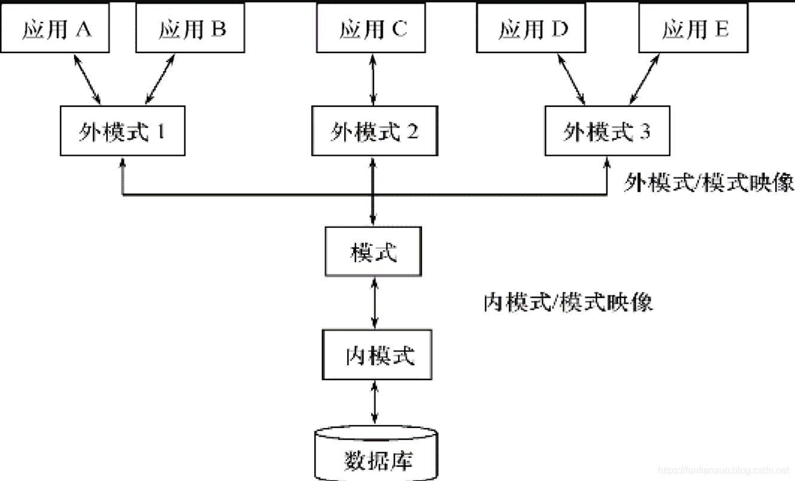

 

硬件，操作系统，数据库设计人员，数据库管理人员，数据库管理系统，用户等等。

 

1. 域：一组具有相同数据类型的值的集合（即取值范围）

1. 笛卡尔积：域上的一种集合运算。结果为一个集合，集合的每一个元素是一个元组，元组的每一个分量来自不同的域。

1. 基数：一个域允许的不同取值个数。

1. 笛卡尔积的基数：每个域不同取值的个数的乘积，或者说元组的个数

1. 关系：域的

**笛卡尔积的子集**

1. 关系：表

列：属性

行：元组

1. 候选码：某一属性组的值能唯一地标示一个元组，而其子集不能，则称该属性组为候选码

1. 主属性：候选码中的属性都称为主属性，注意：主属性非空。

1. 非主属性：候选码之外的属性称为非主属性

1. 全码：关系模式的所有属性是这个关系模式的候选码

1. 主码：从候选码中选取一组能唯一确定一个元组的属性组作为主码。

1. 三类关系：

1）基本关系：实际存在的表，是实际存储数据的逻辑表示

2）查询表：查询结果对应的表

3）视图表：由基本表或其他视图表导出的表，是虚表，不对应实际存储的数据。

注意：关系数据模型中的关系必须是有限集合。

关系的每一个列必须附加一个属性名，属性名不能重名，这种方法取消了关系属性的有序性。

1. ① 列是同质的（Homogeneous）：每一列中的分量来自同一个域，是同一类型的数据

② 不同的列可出自同一个域

- 其中的每一列称为一个属性

- 不同的属性要给予不同的属性名

③ 列的顺序无所谓, 列的次序可以任意交换

④ 任意两个元组的候选码不能相同：相同就不是候选码了

⑤ 行的顺序无所谓，行的次序可以任意交换

**⑥ 分量必须取原子值（不允许表中套表）**


 

1. 关系模式：对关系的描述，

**是静态的、稳定的**

1. 关系：是关系模式在某一时刻的状态或内容，

**是动态的、随时间不断变化的**

1. 关系模式的形式化表示：

```
//关系模式R(U, D, DOM, F)R       关系名U       组成该关系的属性名集合D       属性组U中属性所来自的域DOM  	属性向域的映象集合F       属性间的数据依赖关系集合 //可以简记为R (U)    或    R (A1，A2，…，An)R: 关系名A1，A2，…，An  : 属性名注：域名及属性向域的映象常常直接说明为属性的类型、长度
```

1. 在一个给定的应用领域中，

**所有关系的集合**

1. 关系数据库的型与值

，不是关系的型与值

1）关系数据库的型也称

2）

1. 常用的基本操作：

**查询：**选择、投影、连接、除、并、交、差

**数据更新：**插入、删除、修改

1. **5种基本操作：**选择、投影、并、差、笛卡尔积 

**注意：不算交**

1. 关系操作的特点：

集合操作方式：操作的对象和结果都是集合，

 

1. 若属性A是基本关系R的主属性，则属性A不能取空值

1. 关系间的引用：关系与关系之间存在着联系

1. 外码：设F是基本关系R的一个或一组属性，但

**不是关系R的主码**

注：

1）R、S不一定是不同的关系。

2）目标关系S的主码Ks 和参照关系的外码F必须定义在

3）外码并不一定要与相应的主码同名，当外码与相应的主码属于不同关系时，往往取相同的名字，以便于识别

4）

1. 两个不变性：指实体完整性和参照完整性

1. 针对某一具体关系数据库的约束条件，反映某一具体应用所涉及的数据必须满足的语义要求

1. 关系模型应提供定义和检验这类完整性的机制，以便用统一的系统的方法处理它们，而不要由应用程序承担这一功能

1. 传统的关系运算：

并、交、差、笛卡尔积

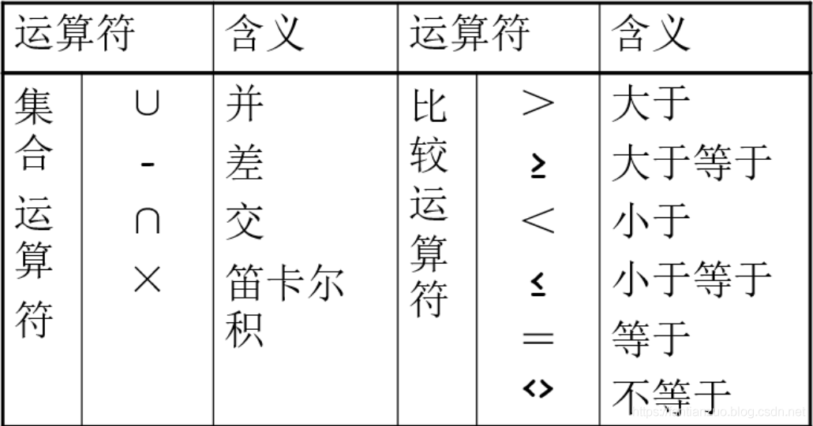

1. 操作对象关系：

操作方式：同数学中的并、交、差、笛卡尔积。只不过操作对象的元素是元组。另外需要注意能进行运算所需要满足的条件。

对于并、交、差需要满足的关系：1）属性的数目相同；2）相应的属性取自同一个域

常见的关系运算有选择、投影、连接、除

在关系R中选择满足给定条件的诸元组。

表达式：$\sigma_F(R) = {t | t \in R \and F(t) = ''true''}$

F：为选择条件，是一个逻辑表达式，基本形式为：$X_1 \theta Y_1$，其中$\theta$为大于、小于、等于、不等于等。

举例：

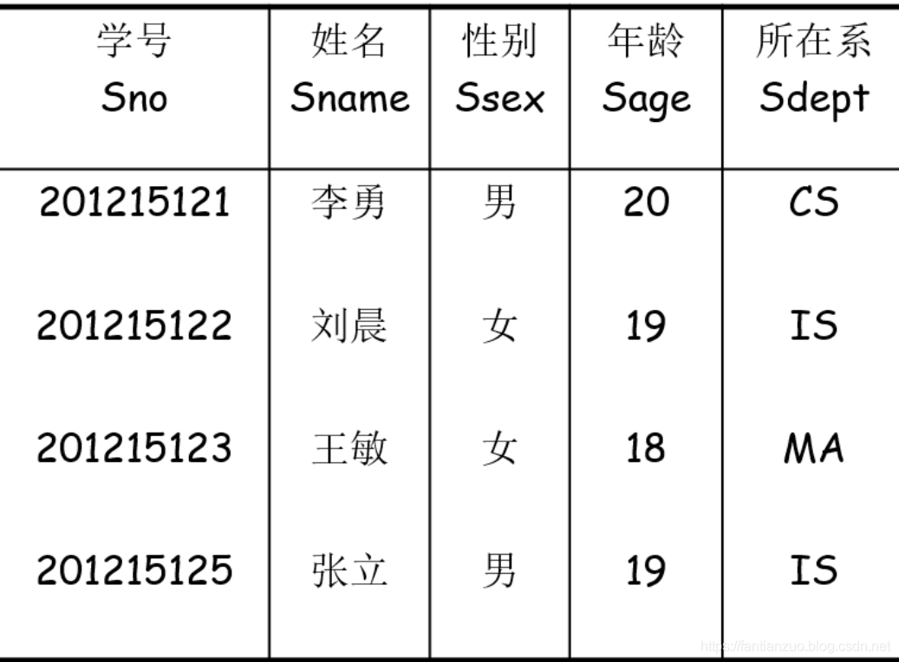

**选择：$\sigma_{Sdept = "IS"}(Student)$**

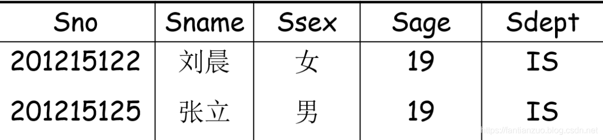

从R中选择出若干属性列组成新的关系

表达式：$\prod_{A} (R)= {t[A] | t\in R}$

A为属性列，

举例：还是上方的关系，经过投影$\prod_{Sname, Sdept}(Student)$，结果如下：

 [](https://github.com/zcxhaha/DataBaseNote/blob/master/img/1.png)

 

1）**一般连接：**从两个关系的笛卡尔积中选取属性间满足一定条件的元组

（1）表达式：$R\bowtie_ {A \theta B} S = {t_r^ \frown t_s | t_r \in R \and t_s \in S \and t_r[A] \theta t_s[B] }$

（2）A和B：分别为R和S上度数相等且可比的属性组

（3）$\theta$表示比较运算符，

（4）连接运算从R和S的广义笛卡尔积R×S中选取（R关系）在A属性组上的值与（S关系）在B属性组上值满足比较关系θ的元组

2）**等值连接：**当上述的运算符为等于号的时候

（1）含义：从关系R与S的广义笛卡尔积中选取A、B属性值相等的那些元组，即等值连接为：

（2）表达式：$R\bowtie_ {A = B} S = {t_r^ \frown t_s | t_r \in R \and t_s \in S \and t_r[A] = t_s[B] }$

（3）仍然是从行的角度进行运算，而不涉及列

（4）属性组可以不同

3）**自然连接：**一种特殊的等值连接

（1）与等值连接的不同：两个关系R和S必须具有相同的属性组

（2）将结果中相同的属性列去掉

（3）表达式：$R\bowtie S = {t_r^ \frown t_s | t_r \in R \and t_s \in S \and t_r[A] = t_s[B] }$

4）由自然连接所引发的一系列问题：

（1）悬浮元组：在做自然连接的时候被舍弃的元组

（2）外连接：如果把舍弃的元组也保存在结果关系中，而在其他属性上填空值(Null)，这种连接就叫做

（3）左外连接：如果只把左边关系R中要舍弃的元组保留就叫做左外连接

（4）右外连接：如果只把右边关系S中要舍弃的元组保留就叫做右外连接

1）除运算的意义：

（1）假设关系R，S，RS，R关系拥有的属性是姓名，S关系拥有的属性是课程，RS关系拥有的属性是姓名和课程的联系，则RS/S表示

（2）如下图：

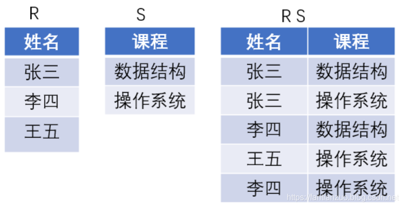

注：RS/S得到的关系：张三和李四构成的表，表示选修了全部课程的同学的集合。

**举例：**

**R：**

| A | B | C | 
| -- | -- | -- |
| a1 | b1 | c2 | 
| a2 | b3 | c7 | 
| a3 | b4 | c6 | 
| a1 | b2 | c3 | 
| a4 | b6 | c6 | 
| a2 | b2 | c3 | 
| a1 | b2 | c1 | 


**S:**

| B | C | D | 
| -- | -- | -- |
| b1 | c2 | d1 | 
| b2 | c1 | d1 | 
| b2 | c3 | d2 | 


R÷S

| A | 
| -- |
| a1 | 


> (1) 找S与R的共同属性，即公式中的Y属性(2)计算R中每个X属性的象集，如果某个象集包含S在Y属性上的投影，则该属为R/S结果中的一个值。


解答如下：

在关系R中，A可以取四个值{a1,a2,a3,a4}，其中：

a1的象集为：{（

a2的象集为：{（

a3的象集为：{（

a4的象集为：{（

S在（B,C）上的投影为{(

显然只有R的象集a1包含S在（B,C）属性组上的投影，所以R÷S={a1}。

 

 

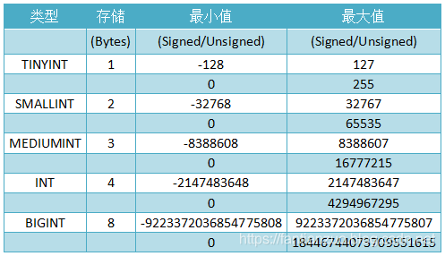

定点数：DECIMAL和NUMERIC类型在MySQL中视为相同的类型。它们用于

DECIMAL(M,D)，其中M表示十进制数字总的个数，D表示小数点后面数字的位数。

1. 如果存储时，整数部分超出了范围（如上面的例子中，添加数值为1000.01），MySql就会报错，不允许存这样的值。

1. 如果存储时，小数点部分若超出范围，就分以下情况：

1. 若四舍五入后，整数部分没有超出范围，则只警告，但能成功操作并四舍五入删除多余的小数位后保存。如999.994实际被保存为999.99。

1. 若四舍五入后，整数部分超出范围，则MySql报错，并拒绝处理。如999.995和-999.995都会报错。

M的默认取值为10，D默认取值为0。如果创建表时，某字段定义为decimal类型不带任何参数，等同于decimal(10,0)。带一个参数时，D取默认值。

M的取值范围为1~65，取0时会被设为默认值，超出范围会报错。

D的取值范围为0~30，而且必须<=M，超出范围会报错。

所以，很显然，当M=65，D=0时，可以取得最大和最小值。

 

：float，double和real。他们定义方式为：FLOAT(M,D) 、 REAL(M,D) 、 DOUBLE PRECISION(M,D)。  “(M,D)”表示该值一共显示M位整数，其中D位位于小数点后面

FLOAT和DOUBLE中的M和D的取值默认都为0，即除了最大最小值，不限制位数。

M取值范围为0~255。FLOAT只保证6位有效数字的准确性，所以FLOAT(M,D)中，M<=6时，数字通常是准确的。如果M和D都有明确定义，其超出范围后的处理同decimal。

D取值范围为0~30，同时必须<=M。double只保证16位有效数字的准确性，所以DOUBLE(M,D)中，M<=16时，数字通常是准确的。如果M和D都有明确定义，其超出范围后的处理同decimal。

内存中，FLOAT占4-byte（1位符号位 8位表示指数 23位表示尾数），DOUBLE占8-byte（1位符号位 11位表示指数 52位表示尾数）。

 

**浮点数比定点数类型存储空间少，计算速度快，但是不够精确。**

 

因为需要计算额外的空间和计算开销，所以应该尽量只在对小数进行精确计算时 才使用DECIMAL。但在数据量比较大的情况下，可以考虑使用BIGINT代替DECIMAL，将需要存储的货币单位根据小数的位数乘以相应的倍数即可。

 

可用来保存位字段值。BIT(M)类型允许存储M位值。M范围为1~64，默认为1。

BIT其实就是存入二进制的值，类似010110。

如果存入一个BIT类型的值，位数少于M值，则左补0.

如果存入一个BIT类型的值，位数多于M值，MySQL的操作取决于此时有效的SQL模式：

如果模式未设置，MySQL将值裁剪到范围的相应端点，并保存裁减好的值。

如果模式设置为traditional(“严格模式”)，超出范围的值将被拒绝并提示错误，并且根据SQL标准插入会失败。

MySQL把BIT当做字符串类型，而非数字类型。

                                                               

字符串类型指CHAR、VARCHAR、BINARY、VARBINARY、BLOB、TEXT、ENUM和SET。

 

 

CHAR和VARCHAR类型声明的长度表示你想要保存的最大字符数。例如，CHAR(30)可以占用30个字符。默认长度都为255。

**CHAR列的长度固定为创建表时声明的长度。长度可以为从0到255的任何值。当保存CHAR值时，在它们的右边填充空格以达到指定的长度。当检索到CHAR值时，尾部的空格被删除掉，所以，我们在存储时字符串右边不能有空格，即使有，查询出来后也会被删除。在存储或检索过程中不进行大小写转换。**

所以当char类型的字段为唯一值时，添加的值是否已经存在以不包含末尾空格（可能有多个空格）的值确定，

VARCHAR列中的值为可变长字符串。长度可以指定为0到65,535之间的值（实际可指定的最大长度与编码和其他字段有关，比如，MySql使用utf-8编码格式，大小为标准格式大小的2倍，仅有一个varchar字段时实测最大值仅21844，如果添加一个char(3)，则最大取值减少3。整体最大长度是65,532字节）。

 

**同CHAR对比，VARCHAR值保存时只保存需要的字符数，另加一个字节来记录长度(如果列声明的长度超过255，则使用两个字节)。**

 

VARCHAR值保存时不进行填充。当值保存和检索时尾部的空格仍保留，符合标准SQL。

 

如果分配给CHAR或VARCHAR列的值超过列的最大长度，则对值进行裁剪以使其适合。如果被裁掉的字符不是空格，则会产生一条警告。如果裁剪非空格字符，则会造成错误(而不是警告)并通过使用严格SQL模式禁用值的插入。

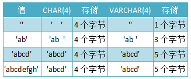

 

 

**BINARY和VARBINARY类型类似于CHAR和VARCHAR类型，但是不同的是，它们存储的不是字符串，而是二进制串。所以它们没有编码格式，并且排序和比较基于列值字节的数值值。**

当保存BINARY值时，在它们右边填充

对于VARBINARY，插入时不填充字符，选择时不裁剪字节。比较时所有字节很重要。

 

**BLOB是一个二进制大对象，可以容纳可变数量的数据**

有4种TEXT类型：TINYTEXT、TEXT、MEDIUMTEXT和LONGTEXT。这些对应4种BLOB类型，有相同的最大长度和存储需求。

**BLOB列被视为二进制字符串。TEXT列被视为字符字符串，类似BINARY和CHAR。**

在TEXT或BLOB列的存储或检索过程中，不存在大小写转换。

未运行在严格模式时，如果你为BLOB或TEXT列分配一个超过该列类型的最大长度的值，值被截取以保证适合。如果截掉的字符不是空格，将会产生一条警告。使用严格SQL模式，会产生错误，并且值将被拒绝而不是截取并给出警告。

 

**在大多数方面，可以将BLOB列视为能够足够大的VARBINARY列。同样，可以将TEXT列视为VARCHAR列。**

 

BLOB和TEXT在以下几个方面不同于VARBINARY和VARCHAR：

当保存或检索BLOB和TEXT列的值时不删除尾部空格。(这与VARBINARY和VARCHAR列相同）。

比较时将用空格对TEXT进行扩充以适合比较的对象，正如CHAR和VARCHAR。

对于BLOB和TEXT列的索引，必须指定索引前缀的长度。对于CHAR和VARCHAR，前缀长度是可选的。

BLOB和TEXT列不能有默认值。

BLOB或TEXT对象的最大大小由其类型确定，但在客户端和服务器之间实际可以传递的最大值由可用内存数量和通信缓存区大小确定。你可以通过更改max_allowed_packet变量的值更改消息缓存区的大小，但必须同时修改服务器和客户端程序。

 

每个BLOB或TEXT值分别由内部分配的对象表示。

它们（TEXT和BLOB同）的长度：

Tiny：最大长度255个字符(2^8-1)

BLOB或TEXT：最大长度65535个字符(2^16-1)

Medium：最大长度16777215个字符(2^24-1)

LongText 最大长度4294967295个字符(2^32-1)

实际长度与编码有关，比如utf-8的会减半。

 

**当BLOB和TEXT值太大时，InnoDB会使用专门的外部存储区域来进行存储，此时单个值在行内需要1~4个字节存储一个指针，然后在外部存储区域存储实际的值。**

MySQL会BLOB和TEXT进行排序与其他类型是不同的：它只对每个类的最前max_sort_length字节而不是整个字符串进行排序。

**MySQL不能将BLOB和TEXT列全部长度的字符串进行索引，也不能使用这些索引消除排序。**

 

MySQL在存储枚举时非常紧凑，会根据列表值的数量压缩到一个或两个字节中。MySQL在内部将每个值在列表中的位置保存为整数，并且在表的.frm文件中保存“数组——字符串”映射关系的查找表。

枚举字段是按照内部存储的整数而不是定义的字符串进行排序的；

由于MySQL把每个枚举值都保存为整数，并且必须通过查找才能转换为字符串，所以枚举列有一定开销。在特定情况下，把CHAR/VARCHAR列与枚举列进行JOIN可能会比直接关联CHAR/VARCHAR更慢。

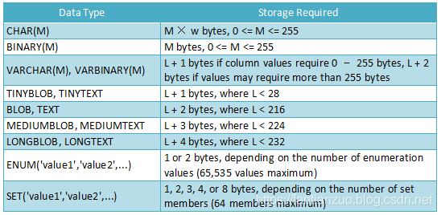

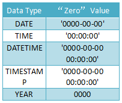

DATE, DATETIME, 和TIMESTAMP类型 这三者其实是关联的，都用来表示日期或时间。

**当你需要同时包含日期和时间信息的值时则使用DATETIME类型。MySQL以'YYYY-MM-DD HH:MM:SS'格式检索和显示DATETIME值。支持的范围为'1000-01-01 00:00:00'到'9999-12-31 23:59:59'。**

当你只需要日期值而不需要时间部分时应使用DATE类型。MySQL用'YYYY-MM-DD'格式检索和显示DATE值。支持的范围是'1000-01-01'到 '9999-12-31'。

 

**TIMESTAMP类型同样包含日期和时间，范围从'1970-01-01 00:00:01' UTC 到'2038-01-19 03:14:07' UTC。**

TIME值的范围可以从'-838:59:59'到'838:59:59'。小时部分会因此大的原因是TIME类型不仅可以用于表示一天的时间(必须小于24小时)，还可能为某个事件过去的时间或两个事件之间的时间间隔(可以大于24小时，或者甚至为负)

 

两者的存储方式不一样

对于TIMESTAMP，它把客户端插入的时间从当前时区转化为UTC（世界标准时间）进行存储。查询时，将其又转化为客户端当前时区进行返回。

而对于DATETIME，不做任何改变，基本上是原样输入和输出。

 

YEAR类型是一个单字节类型用于表示年。

MySQL以YYYY格式检索和显示YEAR值。范围是1901到2155。

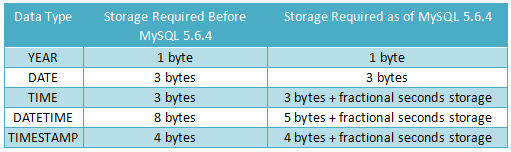

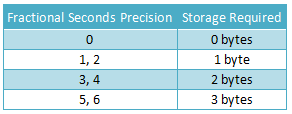

1. SQL语言是一个功能极强的关系数据库语言。同时也是一种介于关系代数与关系演算之间的结构化查询语言（Structured Query Language），其功能包括

**数据定义、数据查询、数据操纵和数据控制**

1. SQL的特点：

1）综合统一：集数据定义、数据查询、数据操纵和数据控制等多种功能于一体。

2）高度非过程化 ：面对象的设计

3）面向集合的操作方式 ：操作对象是集合，并且操作结果也是集合

4）两种使用方式，统一的语法结构 ：既是一种独立的语言，又是一种嵌入式的语言，（嵌入式是指嵌入别的高级语言）。

5）简洁易学

**一、创建数据库：**

代码：

```sql
create database Student;        --创建数据库use Student;                    --使用数据库drop database Student;          --删除数据库
```

注意：

1）两种注释方式：（1）两个减号--，注释单行 （2）/* */注释多行

2）不能再当前数据库删除当前数据库

**数据类型：**

[](https://github.com/zcxhaha/DataBaseNote/blob/master/img/201902279.png)

注意：

1）一个属性采用何种数据类型由两部分决定：（1）该属性的取值范围；（2）该属性做何种运算。

模式，一个独立于数据库用户的

代码：

```
/** 创建模式zhang，下键表student*/create schema zhang	create table student	(		Sno char(9) primary key,		Sname varchar(20) unique,		Ssex char(4) not  null,		Sage smallint,		Sdept varchar(5)			); /** 删除模式中的表*/drop table zhang.student; /** 删除模式*/drop schema zhang;    --注意前提该模式下无对象
```

**注意：**

1）删除模式的时候首先应当将模式下的所有对象删除，才能删除该模式

2）在删除某个非dbo模式下的表时，需要加模式名

3）该模式不是三级模式两级映像中的模式，而是相当于一个

4）CASCADE(级联)：删除模式的同时把该模式中所有的数据库对象全部删除（SQL Server不支持）

5）RESTRICT(限制)：只有当该模式中没有任何下属的对象时才能执行

**一、创建表（三张）**

1）学生表（Student）

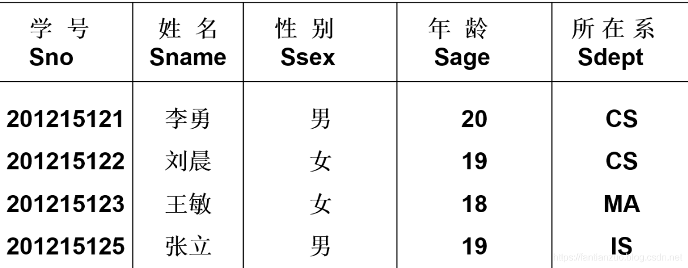

 代码：

```sql
/** 未添加数据*/create table student(	Sno char(9) primary key,          --primary key   指示主码	Sname varchar(20) unique,         --unique        指示值唯一，	Ssex char(4) not  null,           --not null      该值非空	Sage smallint,	Sdept varchar(5)	);
```

2）课程表（Course）

[](https://github.com/zcxhaha/DataBaseNote/blob/master/img/201903132.png)

代码：

```sql
/** 创建课程表*/create table Course(	Cno char(2) primary key,	Cname varchar(10) unique,	Cpno char(2),                --Cpno是外码，参照的是自身的Cno	Ccredit smallint,	foreign key (Cpno) references Course(Cno)     --外码);
```

3）学生-课程表

 

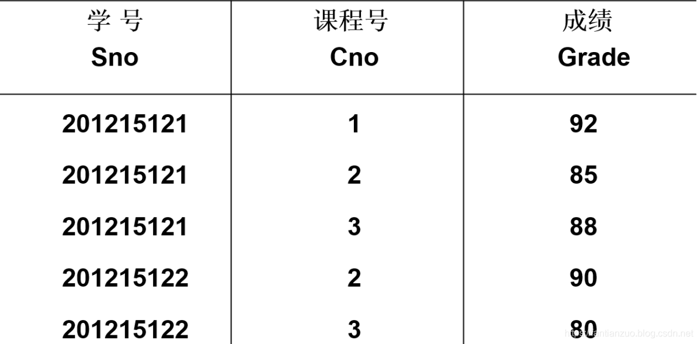

代码：

```scss
/** 创建学生-课程表*/create table SC(	Sno char(9),	Cno char(2),	Grade int,	primary key(Sno, Cno),            --多个属性列构成主码，写在最后	foreign key(Sno) references student(Sno),    --外码， 每个外码写一行	foreign key(Cno) references Course(Cno));
```

**注意：**

1）创建表的时候需要考虑三个完整性约束条件：实体完整性，参照完整性，用户自定义完整性

2）两种完整性约束条件的定义方式：

- 列级完整性约束条件

：涉及相应属性列的完整性约束条件，在属性列的后边定义。

- 表级完整性约束条件

：涉及一个或多个属性列的完整性约束条件 ，在将属性列完之后定义。

3）外码要和所参照的主码类型相同。表级完整性约束的时候属性列需要加括号。

**二、修改表**

**增加列**

```
alter table student add graduation date;/*1. 指定要修改的表2. add关键字3. 新增列的属性名4. 新增列的数据类型*/
```

**删除列**

```sql
alter table student drop column graduation;
```

**修改列的数据类型**

```sql
alter table student alter column graduation varchar(20); 
```

**增加约束**

```sql
/*这种增加约束的方法不容易从左边的框框（键）中看出来*/alter table student add unique(graduation); /*给增加的约束自定义了一个别名，容易区分*/alter table student add constraint S_un unique(graduation); /*注意*/--1. 不可以使用增加not null约束，想要添加只可以在设计中将勾去掉--虽然以下的方式看似添加了not null约束，但是不起任何作用alter table student add constraint cc check(sname is not null); --2. 给某一属性列添加主键，需要保证该属性列不允许为空，刚建的新表在未加约束的情况下，默认属性列允许为空值alter  table  student  add primary key(sno,cno); --3. 添加外键，需要保证外码和被参照表的主属性的数据类型保持一致alter  table  student  add foreign key (sno) references student(sno);
```

**删除约束**

```
/*通过指定的约束名字删除指定的约束*/alter table student drop constraint S_un; /*在左边单机右键删除*/
```

**三、删除表**

```
/*删除表的时候必须先将参照表干掉，再删除被参照表*/drop table student；
```

> 建立索引的目的是加快数据查询的速度。DBA或者表的属主可以根据需要建立表的索引；但是有些DBMS可以自动建立以下索引，1）PRIMARY KEY索引（聚簇索引）2）UNIQUE索引（唯一性索引）


**一、创建索引**

```
/*创建唯一性索引*//* * stu为索引名字，创建索引必须要有一个索引名 * 列名后面紧跟排序类型，ASC为升序，DESC为降序，默认为ASC，可以有多个列，用逗号隔开。 * 对于已经包含重复值的属性列不可以增加唯一性索引*/create unique index S_nn on student(graduation asc); /*创建聚簇索引（聚集）*/Create  clustered index stu on student(sage desc);/* * 聚簇索引的关键字为clustered,不是书上有误，而是sqlserver是这样 * 同样，列名后面紧跟排序类型，可以有多个列，用逗号隔开。 * 聚簇索引严格按照物理存储位置来排序。 * 不可以在有主键的表中创建索引 * 一个表只能创建一个聚簇索引*/
```

**二、删除索引**

```
/*注意：删除索引必须为表名+索引名*/drop  index  student.stu
```

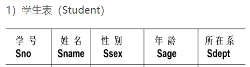

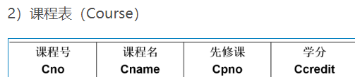

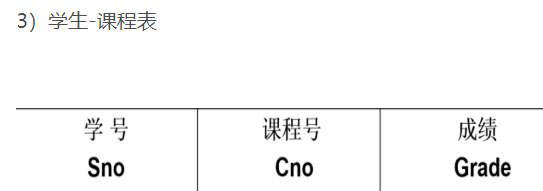

简单的查询操作：

```sql
--投影，select后边指明所选的列，from指明所访问的表select sno, sname, sdeptfrom student; --选择指定的列，可以加算术表达式，并且为其添加新的属性名select sno, 2019-sage as birthdayfrom student; --投影后，修改属性名select sno num, 2019-sage birthdayfrom student; --*代表选中所有列select *from student; --除了int，smallint，其余的数据类型需要单引号''select sname,'2017' yearfrom student; --字符串的拼接--5)查询全体学生的姓名、联系电话，并在前面加上字符串‘联系方式’select sname, '联系方式'+telfrom student; --select后加函数--count函数空值不计，重复值重复计--当count函数作用在全部列上时以元组计数select COUNT(sno)from student; --COUNT的含义是计数，*表示所有列，COUNT（*）表示元组数，某个或部分属性列为空值不影响count统计结果select COUNT(*)		from student; --去重，distinct作用域是整个元组，是所有指定列组成的元组的去重select distinct sno, cnofrom sc; --查询性别为女的学生的学号，姓名select sno, snamefrom studentwhere ssex = '女'; --查询学分为4学分的课程的名字select cnamefrom coursewhere ccredit = 4; --查询成绩在85分以上的学生的学号（学号不重）select distinct snofrom scwhere grade > 85; --查询年龄在20~23岁（包括20岁和23岁）之间的学生的姓名、系别和年龄。SELECT Sname,Sdept,Sage	FROM StudentWHERE Sage BETWEEN 20 AND 23; --不能写成sdept='CS','IS','MA'select sname,ssexfrom studentwhere sdept='CS' or sdept='IS' or sdept = 'MA'; --IS NULL， IS NOT NULL空值：只能用“is”，不能用“=”--WHERE NOT Sage >= 20；not必须在 sage前边，而不是>=前边 select sname,ssexfrom studentwhere sdept in ('CS','IS','MA'); --模糊查询--%任意长度，_单个字符，__表示两个或两个以内--转义字符\，需要加escape '\'标注select *from studentwhere sname like '刘__'; select *	--如果字符中本身带有下划线，用任意字符当转义字符from Coursewhere Cname like 'DB\_%i_ _' escape '\';
```

order by子句：

```sql
--order by子句--选择sno列，从sc表中，cno为'3'，按成绩降序给出--desc表示降序排列，asc表示升序排列，当缺省的时候表示asc--在SqlServer中当排序的属性列中存在空值的时候，升序排列默认空值在元组最先显示，desc（降序）空值元组在最后显示select snofrom scwhere cno = '3'order by grade desc; --多属性列排序，首先按ccredit进行升序排列，当ccredit相等的时候，按cpno进行降序排列select *from courseorder by ccredit, cpno desc;
```

> 注意：首先将符合where子句的元组筛选出来，然后根据order by子句进行排序。


聚集函数：

```sql
--count统计sc表中sno的数目，空值不计，重复值重复计--distinct关键字，在计算式取消重复列中的重复值select count (distinct sno)from sc; --统计元组的数目select count(*)from sc; --求该列值的总和select sum (grade)from sc; --求平均值，结果向下取整select AVG (grade)from sc; --求最小select min (grade)from sc; --求最大select max (grade)from sc;
```

**注意：**

1. 聚集函数全部都忽略空值

1. where子句中不能使用聚集函数作为条件表达式，聚集函数只能用在select子句或者group by中的having子句。

1. 聚集函数作用的元组是满足where子句中的条件的元组

group by子句：

```sql
--GROUP BY--在有GROUP BY的语句中，select子句后边只可以出现分组属性列或者聚集函数，其他列名不可以，--平均值计算略过空值--首先按cno进行分组，分别统计每组中sno的数量和每组中的平均值，最后给每一新列起别名select cno, count(sno) cnt,AVG (grade) avfrom scgroup by cno; --可以使用HAVING短语筛选最终输出结果,作用于组，从中选择满足条件的组--同上首先通过cno分组，在通过having语句选出满足指定条件的组select cno, count(sno) cnt, AVG (grade) avfrom scgroup by cnohaving COUNT(sno)>=2; --查询选修了3门以上课程的学生学号--首先使用group by进行分组，然后使用having选择满足条件的组select sno,COUNT(cno)from scgroup by snohaving COUNT(cno)>=3
```

注意：

1. where子句作用于基表或视图，从中选择满足条件的元组。

1. having短语作用于组，从中选择满足条件的元组

1. 使用group by子句后，select子句的列名列表中只能出现分组属性和聚集函数

基本概念

1. 连接谓词中的列名称为连接字段

1. 连接条件中的各连接字段类型必须是可比的，但不必是相同的

1. SQL没有自动去掉重复列的功能

基本操作

```sql
--from涉及两个表，不加连接条件，得到的是广义的笛卡尔积，select后跟的是最终显示的列select student.*,sc.* from student,sc; --加上连接条件，得到的是从广义笛卡尔积中选择满足指定条件的元组--select后跟的是最终所显示的列，对于两个表公共的属性列需要使用表名进行区分，不属于公共列的不需要--SqlServer没有自动去掉重复列的功能select student.*,cno,grade  --去掉重复列from student,scwhere student.sno=sc.sno;  --连接条件：不然是广义笛卡尔积 --或者--select sc.sno,sname,sage,ssex,sdept,cno,grade   --去掉重复列from student,scwhere student.sno=sc.sno;
```

> 一种可能的执行过程：1）首先在表1中找到第一个元组，然后从头开始扫描表2，逐一查找满足连接条件的元组，找到后就将表1中的第一个元组与该元组拼接起来，形成结果表中一个元组 。2）表2全部查找完后，再找表1中第二个元组，然后再从头开始扫描表2，逐一查找满足连接条件的元组，找到后就将表1中的第二个元组与该元组拼接起来，形成结果表中一个元组。3）重复上述操作，直到表1中的全部元组都处理完毕。


**自身连接**

```sql
select first.cno, second.cpnofrom course first, course secondwhere first.cpno = second.cno;
```

**注意：**

1. 由于两张表的所有属性列的名字相同，所以需要起别名进行加以区分。

1. 上述代码表示将第一张自己表和第二张自己表做广义笛卡尔积，然后选择第一张自己表的cpno等于第二张自己的cno的元组对应的属性列。

**外连接**

```sql
--外连接select sc.sno,sname,sage,ssex,sdept,cno,gradefrom student full outer join scon student.sno = sc.sno; --左外连接select sc.sno,sname,sage,ssex,sdept,cno,gradefrom student left outer join scon student.sno = sc.sno; --右外连接select sc.sno,sname,sage,ssex,sdept,cno,gradefrom student right outer join scon student.sno = sc.sno;
```

> 注意：原先的条件where变为on表名后的外连接操作符指明了主体表。


基本概念

查询块：一个select-from-where语句

嵌套查询：将一个查询块嵌套在另一个查询块的where子句或having短语的条件中的查询

子查询不能使用order by子句，因为嵌套查询返回的是一个集合或者布尔值，排序没有任何意义，所以规定不能使用order by语句（胡扯）

一些嵌套查询可以使用连接查询代替，但是一些不可以。

不相关子查询：子查询的查询条件不依赖于父查询

相关子查询：子查询的查询条件依赖于父查询

**不相关子查询的可能执行过程**

**相关子查询可能的执行过程**

带有IN谓词的子查询

一个典型的例子：

[](https://github.com/zcxhaha/DataBaseNote/blob/master/img/20190402.png)

该查询为不相关子查询，即查询过称为，1）在course表中查找出信息系统的课程号；2）根据查找出的课程号，在sc表中查询出该学生的学号；3）根据查询到的学号，在student表中查询出相应学生的姓名。

带有比较运算符的子查询

适用条件：当能确切知道内层查询返回单值时，可用比较运算符（>，<，=，>=，<=，!=或< >）

例如：

找出每个学生超过他选修课程平均成绩的课程号。

```sql
    SELECT Sno,  Cno    FROM  SC  x    WHERE Grade >=               (SELECT AVG(Grade)                 FROM  SC y                WHERE y.Sno = x.Sno);
```

查询过程：

[](https://github.com/zcxhaha/DataBaseNote/blob/master/img/201904022.PNG)

[](https://github.com/zcxhaha/DataBaseNote/blob/master/img/20190403.PNG)

该例为一个相关子查询。

带有any或者all谓词的子查询

**声明：**

any：表示任意一个就行，> any表示大于任意一个就可以

all：表示所有，> all表示需要大于所有的值

**常见的谓词解释：**

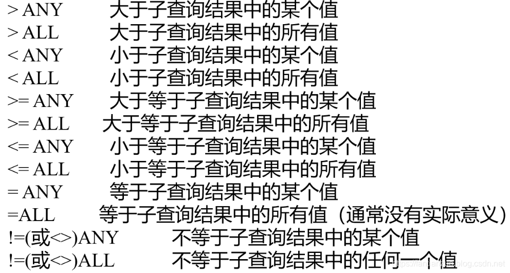

 

 

带有EXISTS谓词的子查询：

**介绍：**

存在量词

exists

1）不返回任何数据，只返回true或者false。当内层的查询非空时返回true，当内层的查询为空时返回false。

2）由EXISTS引出的子查询，其目标列表达式通常都用*，因为带EXISTS的子查询只返回真值或假值，给出列名无实际意义（还是胡扯）

not exists

1）若内层查询结果非空，则外层的WHERE子句返回假值

2）若内层查询结果为空，则外层的WHERE子句返回真值

**例子：**

exists的例子：

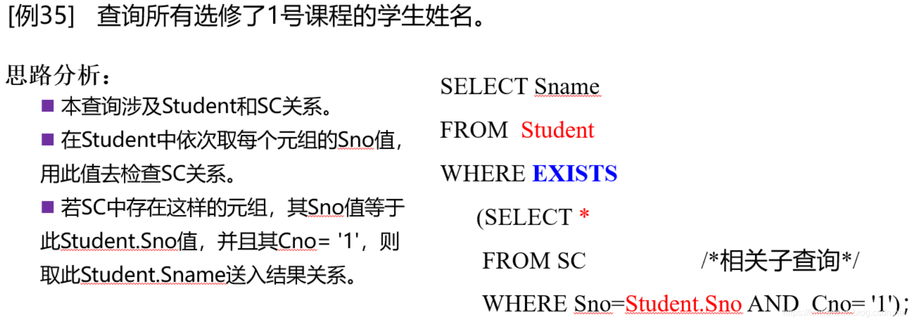

 

not exists的例子：

[](https://github.com/zcxhaha/DataBaseNote/blob/master/img/201904027.PNG)

**难点1：使用exists/not exists实现全称量词**

1）查询选修了全部课程的学生姓名

```sql
--说法转换：即对于某个学生来说，没有哪一门课程，使自己没有选的select snamefrom studentwhere not exists(	select *	from course	where not exists(    	select s*    	from sc    	where student.sno = sno and cno = course.cno));
```

**解释：**

（1）对于第一个not exists里边查询的是当前student是否有未选修的课程，如果当前学生有未选修的课程，经过not exists返回false，即该学生的信息不会被记录。

（2）对于第二个not exists里边查询的是当前学生对象，对于当前的课程，如果选了该门课程，not exists里边为真，经过not exists返回false，该门课程不会被记录，反之，如果该学生未选该门课程，该门课程将会被记录。

（3）有一点像双重for循环，依次遍历所有的student中的元组，在每一个student的情况下，在遍历course，最后在一个not exists中的where子句中进行判断。

**难点2：使用exists/not exists实现逻辑蕴涵**

2）查询至少选修了学生201215122选修的全部课程的学生号码。

```sql
SELECT  DISTINCT SnoFROM  SC SCXWHERE NOT EXISTS	(SELECT *	 FROM SC SCY	 WHERE SCY.Sno = '201215122'  AND	 NOT EXISTS		(SELECT *		 FROM SC SCZ		 WHERE SCZ.Sno=SCX.Sno AND SCZ.Cno=SCY.Cno));
```

**解释：**

（1）基本同上

**并操作：**

查询计算机科学系的学生及年龄不大于19岁的学生。

```sql
/*使用UNION取并集*/SELECT *FROM StudentWHERE Sdept= 'CS'UNIONSELECT *FROM StudentWHERE Sage<=19；
```

**交操作：**

查询计算机科学系的学生与年龄不大于19岁的学生的交集(INTERSECT)。

```sql
/*使用INTERSECT实现交操作*/SELECT *FROM StudentWHERE Sdept='CS' INTERSECTSELECT *FROM StudentWHERE Sage<=19；
```

**差操作：**

查询计算机科学系的学生与年龄不大于19岁的学生的差集。

```sql
/*使用EXCEPT实现差操作*/SELECT *FROM StudentWHERE Sdept='CS'EXCEPTSELECT  *FROM StudentWHERE Sage <=19; 
```

**插入元祖**

```sql
--1. 表名后没有指定属性列：表示要插入的是一条完整的元组，且属性列属性与表定义中的顺序一致insert into studentvalues ('201215128', '陈东', '18', '男', 'IS'); --2. 在表明后指定要插入数据的表名及属性列，属性列的顺序可与表定义中的顺序不一致insert into student(sno, sname, sage, ssex, sdept)values ('201215138', '陈东栋', '18', '男', 'CS'); --3. 插入部分列，未显示给出的列按空值计算，当然前提条件是那些列可以为空值insert into student(sno, sname)values ('201215148', '陈栋');
```

**2. 插入一个子查询的结果**

```sql
--子查询的结果必须包含和insert的字段列表一样多的字段，并且数据类型兼容insert into depavg	select sdept,AVG(sage) avgage	from student	group by sdept;
```

```
--1. 修改某些符合where子句中的条件的元组的值update studentset sage = 92where sno = '200215121'; --2. where子句缺省，默认修改所有元组的该属性的值--注意：在修改数据的时候应当先写where子句中的条件update studentset sage = 92; --3. 带子查询的修改update scset grade = 100where 'CS' in (	select sdept	from student	where sc.sno = student.sno); --set子句中遇到null只能用等号，where子句中只能用is nullupdate student set sage = null          where sno = '201811012';
```

> 注意：DBMS在执行修改语句时会检查修改操作是否破坏表上已定义的完整性规则。实体完整性：保证主码不能被修改用户自定义完整性：not null约束，unique约束，值域约束等。


```sql
--1. 删除符合where子句中条件的某些行deletefrom studentwhere sno = '201215148'; --2. 带子查询的删除deletefrom scwhere 'CS' in (	select sdept	from student	where sc.sno = student.sno); --3. 删除所有行deletefrom student;
```

> 注意：同数据更新，结果很危险，操作需谨慎。


Left(x,len) – 返回串左边的字符（长度为len）

Right(x,len)

Length(x) – 返回串的长度

Locate(x,sub_x) – 找出串的一个子串

SubString(x, from, to) – 返回字串的字符

Lower(x)

Upper(x)

LTrim(x)

RTrim(x)

Soundex(x) – 读音（用于发音匹配）

SELECT cust_name, cust_contact FROM customers WHERE Soundex(cust_contact) = Soundex(‘Y Lie’);

日期和时间采用相应的数据类型和特殊的格式存储，以便可以快速和有效的排序或过滤，节省物理存储空间.

一般，应用程序不使用用来存储日期和时间的格式，因此日期和时间函数总是被用来读取、统计和处理这些函数.

常用日期和时间处理函数：

AddDate() – 增加一个日期（天，周等）

AddTime() – 增加一个时间（时，分等）

CurDate() – 返回当前日期

CurTime() – 返回当前时间

Date() – 返回日期时间的日期部分

DateDiff() – 计算两个日期之差

Date_Add() – 日期运算函数

Date_Format() – 返回一个格式化的日期或时间串

Day() – 返回一个日期的天数部分

DayOfWeek() – 返回日期对应的星期几

Hour() – 返回一个时间的小时部分

Minute() – 返回一个时间的分钟部分

Second() – 返回一个时间的秒部分

Month() – 返回一个日期的月部分

Now() – 返回当前日期和时间

Time() – 返回一个日期时间的时间部分

Year() – 返回一个日期的年份部分

日期首选格式： yyyy-mm-dd; 如2005-09-01

检索某日期下的数据：

SELECT cust_id, order_num FROM orders WHERE Date(order_date) = ‘2005-09-01’;

检索某月或日期范围内的数据：

SELECT cust_id, order_num FROM orders WHERE Year(order_date) = 2005 AND Month(order_date) = 9;

– or

SELECT cust_id, order_num FROM orders WHERE date(order_date) BETWEEN ‘2005-09-01’ AND ‘2005-09-30’;

代数、三角函数、几何运算等

常用数值处理函数：

abs(); cos(); exp(); mod()（取余）; Pi(); Rand(); Sin(); Sqrt(); Tan();

 

视图是虚拟的表，与包含数据的表不同，视图只包含使用时动态检索数据的查询,主要是用于查询。

1. 重用sql语句

1. 简化复杂的sql操作，在编写查询后，可以方便地重用它而不必知道他的基本查询细节。

1. 使用表的组成部分而不是整个表。

1. 保护数据。可以给用户授予表的特定部分的访问权限而不是整个表的访问权限。

1. 更改数据格式和表示。视图可返回与底层表的表示和格式不同的数据。

注意：

- 在视图创建之后，可以用与表基本相同的方式利用它们。可以对视图执行select操作，过滤和排序数据，将视图联结到其他视图或表，甚至能添加和更新数据。

- 重要的是知道视图仅仅是用来查看存储在别处的数据的一种设施。视图本身不包含数据，因此它们返回的数据时从其他表中检索出来的。在添加和更改这些表中的数据时，视图将返回改变过的数据。

- 因为视图不包含数据，所以每次使用视图时，都必须处理查询执行时所需的任一检索。如果你使用多个联结和过滤创建了复杂的视图或者嵌套了视图，可能会发现性能下降得很厉害。因此，在部署使用了大量视图的应用前，应该进行测试。

1. 与表一样，视图必须唯一命名；

1. 可以创建任意多的视图；

1. 为了创建视图，必须具有足够的访问权限。这些限制通常由数据库管理人员授予。

1. 视图可以嵌套，可以利用从其他视图中检索数据的查询来构造一个视图。

1. Order by 可以在视图中使用，但如果从该视图检索数据select中也是含有order by，那么该视图的order by 将被覆盖。

1. 视图不能索引，也不能有关联的触发器或默认值

1. 视图可以和表一起使用

1. 利用create view 语句来进行创建视图

1. 使用show create view viewname；来查看创建视图的语句

1. 用drop view viewname 来删除视图

1. 更新视图可以先drop在create，也可以使用create or replace view。

视图是否可以更新，要视情况而定。

通常情况下视图是可以更新的，可以对他们进行insert，update和delete。更新视图就是更新其基表(视图本身没有数据)。如果你对视图进行增加或者删除行，实际上就是对基表进行增加或者删除行。

但是，如果MySQL不能正确的确定更新的基表数据，则不允许更新(包括插入和删除)，这就意味着视图中如果存在以下操作则不能对视图进行更新：(1)分组(使用group by 和 having )；(2)联结；(3)子查询；(4)并；(5)聚集函数;(6)dictinct;(7)导出(计算)列。

 

存储过程就是为了以后的使用而保存的一条或者多条MySQL语句的集合。可将视为批文件，虽然他们的作用不仅限于批处理。

1.通过把处理封装在容易使用的单元中，简化复杂的操作；

 

2.由于不要求反复建立一系列处理步骤，保证了数据的完整性。如果所有开发人员和应用程序都使用同一(实验和测试)存储过程，则所使用的代码都是相同的。这一点的延伸就是防止错误。需要执行的步骤越多，出错的可能性就越大，防止错误保证了数据的一致性。

 

3.简化对变动的管理，如果表名。列名或者业务逻辑等有变化，只需要更改存储过程的代码。使用它的人员甚至不需要知道这些变化。这一点延伸就是安全性，通过存储过程限制对基数据的访问减少了数据讹误的机会。

 

4.提高性能。因为使用存储过程比使用单独的sql语句更快。

 

5.存在一些只能用在单个请求的MySQL元素和特性，存储过程可以使用他们来编写功能更强更灵活的代码

 

综上：

三个主要的好处：简单、安全、高性能。

两个缺陷：

1、存储过程的编写更为复杂，需要更高的技能更丰富的经验。

2、可能没有创建存储过程的安全访问权限。许多数据库管理员限制存储过程的 创建权限，允许使用，不允许创建。

Call关键字：Call接受存储过程的名字以及需要传递给他的任意参数。存储过程可以显示结果，也可以不显示结果。

CREATE PROCEDURE productpricing()

    BEGIN

        SELECT  AVG( prod_price)  as priceaverage FROM products;

    END;

创建名为productpricing的储存过程。如果存储过程中需要传递参数，则将他们在括号中列举出来即可。括号必须有。BEGIN和END关键字用来限制存储过程体。上述存储过程体本身是一个简单的select语句。注意这里只是创建存储过程并没有进行调用。

 

储存过程的使用：

 

Call productpring()；

 

一般存储过程并不显示结果，而是把结果返回给你指定的变量上。

变量：内存中一个特定的位置，用来临时存储数据。

```sql
MySQL> CREATE PROCEDURE prod(      out pl decimal(8,2),      out ph decimal(8,2),      out pa decimal(8,2)      )begin      select Min(prod_price) into pl from products;      select MAx(prod_price) into ph from products;      select avg(prod_price) into pa from products;  end;   call PROCEDURE(@pricelow,@pricehigh,@priceaverage); select @pricelow; select @pricehigh; select @pricelow,@pricehigh,@priceaverage;
```

 

解释：

此存储过程接受3个参数，pl存储产品最低价，ph存储产品最高价，pa存储产品平均价。每个参数必须指定类型，使用的为十进制，关键字OUT 指出相应的参数用来从存储过程传出一个值(返回给调用者)。

 

**MySQL支持in(传递给存储过程)、out(从存储过程传出，这里所用)和inout(对存储过程传入和传出)类型的参数。**

存储过程的参数允许的数据类型与表中使用的类型相同。注意记录集是不被允许的类型，因此，不能通过一个参数返回多个行和列，这也是上面为什么要使用3个参数和3条select语句的原因。

 

调用：为调用此存储过程，必须指定3个变量名。如上所示。3个参数是存储过程保存结果的3个变量的名字。调用时，语句并不显示任何数据，它返回以后可以显示的变量(或在其他处理中使用)。

 

注意：所有的MySQL变量都是以@开头。

```sql
CREATE PROCEDURE ordertotal(      IN innumber int,      OUT outtotal decimal(8,2)      )      BEGIN      SELECT Sum(item_price * quantity) FROM orderitems WHERE order_num = innumber INTO outtotal;      end    //   CALL ordertotal(20005,@total); select @total;  // 得到20005订单的合计   CALL ordertotal(20009,@total); select @total; //得到20009订单的合计
```

 

```sql
 ​CREATE PROCEDURE ordertotal(  IN onumber INT,  IN taxable BOOLEAN,  OUT ototal DECIMAL(8,2)  )COMMENT 'Obtain order total, optionally adding tax' BEGIN   -- declear variable for total   DECLARE total DECIMAL(8,2);   -- declear tax percentage   DECLARE taxrate INT DEFAULT 6;   -- get the order total     SELECT Sum(item_price * quantity) FROM orderitems WHERE order_num = onumber INTO total; -- IS this taxable? IF taxable THEN    -- yes ,so add taxrate to the total    SELECT total+(total/100*taxrate)INTO total;    END IF;  -- finally ,save to out variable  SELECT total INTO ototal; END;
```

在存储过程中我们使用了DECLARE语句，他们表示定义两个局部变量，DECLARE要求指定变量名和数据类型。它也支持可选的默认值(taxrate默认6%)，因为后期我们还要判断要不要增加税，所以，我们把SELECT查询的结果存储到局部变量total中，然后在IF 和THEN的配合下，检查taxable是否为真，然后在真的情况下，我们利用另一条SELECT语句增加营业税到局部变量total中，然后我们再利用SELECT语句将total(增加税或者不增加税的结果)保存到总的ototal中。

COMMENT关键字 上面的COMMENT是可以给出或者不给出，如果给出，将在SHOW PROCEDURE STATUS的结果中显示。

 

在某个表发生更改时自动处理某些语句，这就是触发器。

 

触发器是MySQL响应delete 、update 、insert 、位于begin 和end语句之间的一组语句而自动执行的一条MySQL语句。其他的语句不支持触发器。

在创建触发器时，需要给出4条语句（规则）：

1.  唯一的触发器名；

2.  触发器关联的表；

3.  触发器应该响应的活动；

4.  触发器何时执行(处理之前或者之后)

 

Create trigger 语句创建 触发器

CREATE TRIGGER newproduct AFTER INSERT ON products FOR EACH ROW SELECT 'Product added' INTO @info;

CREATE TRIGGER用来创建名为newproduct的新触发器。触发器可以在一个操作发生前或者发生后执行，这里AFTER INSERT 是指此触发器在INSERT语句成功执行后执行。这个触发器还指定FOR EACH ROW ， 因此代码对每个插入行都会执行。文本Product added 将对每个插入的行显示一次。

 

注意：

1、触发器只有表才支持，视图，临时表都不支持触发器。

2、触发器是按照每个表每个事件每次地定义，每个表每个事件每次只允许一个触发器，因此，每个表最多支持六个触发器(insert，update，delete的before 和after)。

3、单一触发器不能与多个事件或多个表关联，所以，你需要一个对insert和update 操作执行的触发器，则应该定义两个触发器。

4、触发器失败：如果before 触发器失败，则MySQL将不执行请求的操作，此外，如果before触发器或者语句本身失败，MySQL则将不执行after触发器。

INSERT触发器

是在insert语句执行之前或者执行之后被执行的触发器。

1、在insert触发器代码中，可引入一个名为new的虚拟表，访问被插入的行；

2、在before insert触发器中，new中的值也可以被更新(允许更改被插入的值)；

3、对于auto_increment列，new在insert执行之前包含0，在insert执行之后包含新的自动生成值

CREATE TRIGGER neworder AFTER INSERT ON orders FOR EACH ROW SELECT NEW.order_num;

创建一个名为neworder的触发器，按照AFTER INSERT ON orders 执行。在插入一个新订单到orders表时，MySQL生成一个新的订单号并保存到order_num中。触发器从NEW.order_num取得这个值并返回它。此触发器必须按照AFTER INSERT执行，因为在BEFORE INSERT语句执行之前，新order_num还没有生成。对于orders的每次插入使用这个触发器总是返回新的订单号。

**DELETE触发器**

Delete触发器在delete语句执行之前或者之后执行。

1、在delete触发器的代码内,可以引用一个名为OLD的虚拟表，用来访问被删除的行。

2、OLD中的值全为只读，不能更新。

```sql
CREATE TRIGGER deleteorder BEFORE DELETE ON orders FOR EACH ROW BEGIN INSERT INTO archive_orders(order_num,order_date,cust_id) values (OLD.order_num,OLD.order_date,OLD.cust_id); END;   ----------------------------------------------------------------   CREATE TABLE archive_orders(   order_num int(11) NOT NULL AUTO_INCREMENT,   order_date datetime NOT NULL,   cust_id int(11) NOT NULL,   PRIMARY KEY (order_num),   KEY fk_orders1_customers1 (cust_id),   CONSTRAINT fk_orders1_customers1 FOREIGN KEY (cust_id) REFERENCES customers  (cust_id) ) ENGINE=InnoDB AUTO_INCREMENT=20011 DEFAULT CHARSET=utf8
```

在任意订单被删除前将执行此触发器，它使用一条INSERT 语句将OLD中的值(要被删除的订单) 保存到一个名为archive_orders的存档表中(为实际使用这个例子，我们需要用与orders相同的列创建一个名为archive_orders的表)

 

使用BEFORE DELETE触发器的优点(相对于AFTER DELETE触发器来说)为，如果由于某种原因，订单不能存档，delete本身将被放弃。

 

我们在这个触发器使用了BEGIN和END语句标记触发器体。这在此例子中并不是必须的，只是为了说明使用BEGIN END 块的好处是触发器能够容纳多条SQL 语句(在BEGIN END块中一条挨着一条)。

**UPDATE触发器**

在update语句执行之前或者之后执行

1、在update触发器的代码内,可以引用一个名为OLD的虚拟表，用来访问以前(UPDATE语句之前)的值，引用一个名为NEW的虚拟表访问新更新的值。

2、在BEFORE UPDATE触发器中，NEW中的值可能也被用于更新(允许更改将要用于UPDATE语句中的值)

3、OLD中的值全为只读，不能更新。

CREATE TRIGGER updatevendor BEFORE UPDATE ON vendors FOR EACH ROW SET NEW.vend_state = Upper(NEW.vemd_state);

保证州名缩写总是大写(不管UPFATE语句中是否给出了大写)，每次更新一行时，NEW.vend_state中的值(将用来更新表行的值)都用Upper(NEW.vend_state)替换。

1、通常before用于数据的验证和净化(为了保证插入表中的数据确实是需要的数据) 也适用于update触发器。

2、与其他DBMS相比，MySQL 5中支持的触发器相当初级，未来的MySQL版本中估计会存在一些改进和增强触发器的支持。

3、创建触发器可能需要特殊的安全访问权限，但是触发器的执行时自动的，如果insert，update，或者delete语句能够执行，则相关的触发器也能执行。

4、用触发器来保证数据的一致性(大小写，格式等)。在触发器中执行这种类型的处理的优点就是它总是进行这种处理，而且透明的进行，与客户机应用无关。

5、触发器的一种非常有意义的使用就是创建审计跟踪。使用触发器，把更改(如果需要，甚至还有之前和之后的状态)记录到另外一个表是非常容易的。

6、MySQL触发器不支持call语句，无法从触发器内调用存储过程。

 

 

- 恢复操作的基本原理：冗余 

- 恢复机制涉及的两个关键问题

1. 如何建立冗余数据

- 数据转储（**backup）**

- 登录日志文件（**logging）**

1.  **如何利用这些冗余数据实施数据库恢复**

 

 

- 数据转储定义：

**转储是指DBA将整个数据库复制到其他存储介质上保存起来的过程，备用的数据称为后备副本或后援副本**

- 如何使用

1. 数据库遭到破坏后可以将后备副本重新装入

1. 重装后备副本只能将数据库恢复到转储时的状态

- 转储方法

1. 静态转储与动态转储

1. 海量转储与增量转储

**静态转储：**

**1）定义：在系统中无事务运行时进行的转储操作。转储开始的时刻数据库处于一  致性状态，而转储不允许对数据库的任何存取、修改活动。静态转储得到的一定是一个数据一致性的副本。**

**2）优点：实现简单**

**3）缺点：降低了数据库的可用性**

**转储必须等待正运行的用户事务结束才能进行；新的事务必须等待转储结束才能执行**

**动态转储：**

**            1）定义：转储期间允许对数据库进行存取或修改。转储和用户事务可以并发执行。**

**            2）优点：不用等待正在运行的用户事务结束；不会影响新事务的运行。**

**            3）实现：必须把转储期间各事务对数据库的修改活动登记下来，建立日志文件后备副本加上日志文件就能把数据库恢复到某一时刻的正确状态。**

**海量转储：**

**            1）定义：每次转储全部数据库**

**            2）特点：从恢复角度，使用海量转储得到的后备副本进行恢复更方便一些。**

**增量转储：**

**            1）定义：每次只转储上一次转储后更新过的数据**

**            2）特点：如果数据库很大，事务处理又十分频繁，则增量转储方式更实用更有效。**

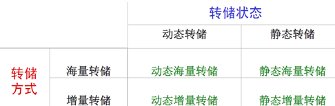

 

 

**日志文件(log)是用来记录事务对数据库的更新操作的文件**

**1）以记录为单位：**

**日志文件中需要登记的内容包括：**

- 

- 各个事务的开始标记**(BEGIN TRANSACTION)**

- 各个事务的结束标记**(COMMIT或ROLLBACK)**

- 各个事务的所有更新操作

**     以上均作为日志文件中的一个日志记录                   **

**每个日志记录的内容：**

- 事务标识（标明是哪个事务）

- 操作类型（插入、删除或修改）

- 操作对象（记录内部标识）

- 更新前数据的旧值（对插入操作而言，此项为空值）

- 更新后数据的新值（对删除操作而言**, 此项为空值）**

 

**2）以数据块为单位**

**日志记录内容包括：**

**事务标识（标明是哪个事务）**

** 被更新的数据块**

- 进行事务故障恢复

- 进行系统故障恢复

- 协助后备副本进行介质故障恢复

**1）事务故障恢复和系统故障恢复必须用日志文件**

**2）在动态转储方式中必须建立日志文件，后备副本和日志文件结合起来才能有效地恢复数据库**

**3）静态转储方式中也可以建立日志文件（重新装入后备副本，然后利用日志文件把已完成的事务进行重做，对未完成事务进行撤销）**

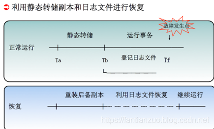

- 基本原则

1. 登记的次序严格按并行事务执行的时间次序

1. 必须先写日志文件，后写数据库

**为什么要先写日志文件？**

**1）写数据库和写日志文件是两个不同的操作，在这两个操作之间可能发生故障**

**2）如果先写了数据库修改，而在日志文件中没有登记下这个修改，则以后就无法恢复这个修改了**

**3）如果先写日志，但没有修改数据库，按日志文件恢复时只不过是多执行一次不必要的UNDO操作，并不会影响数据库的正确性**

 

 

- 事务故障：事务在运行至正常终止点前被终止

- 恢复方法

1. 由恢复子系统应利用日志文件撤消（**UNDO）此事务已对数据库进行的修改**

- 事务故障的恢复由系统自动完成，对用户是透明的，不需要用户干预

- 事务故障的恢复步骤

**1. 反向扫描文件日志，查找该事务的更新操作。**

**2. 对该事务的更新操作执行逆操作。即将日志记录中“更新前的值” 写入数据库。**

 

-  **插入操作， “更新前的值”为空，则相当于做删除操作**

-  **删除操作，“更新后的值”为空，则相当于做插入操作**

-  **若是修改操作，则相当于用修改前值代替修改后值**

**3. 继续反向扫描日志文件，查找该事务的其他更新操作，并做同样处理。**

**4. 如此处理下去，直至读到此事务的开始标记，事务故障恢复就完成了。**

- 系统故障造成数据库不一致状态的原因

1. 未完成事务对数据库的更新已写入数据库

1. 已提交事务对数据库的更新还留在缓冲区没来得及写入数据库

- 恢复方法

1. Undo** 故障发生时未完成的事务**

1. Redo** 已完成的事务**

- 系统故障的恢复由系统在***重新启动时*****自动完成，不需要用户干预**

- 系统故障的恢复步骤

**1. 正向扫描日志文件**

- 

- 

- 重做**(REDO) 队列: 在故障发生前已经提交的事务**

- 这些事务既有**BEGIN TRANSACTION记录，也有COMMIT记录**

- 撤销** (Undo)队列: 故障发生时尚未完成的事务**

-  **这些事务只有BEGIN TRANSACTION记录，无相应的COMMIT记录**

**2. 对撤销(Undo)队列事务进行撤销(UNDO)处理**

- 

- 

- 反向扫描日志文件，对每个**UNDO事务的更新操作执行逆操作**

**3. 对重做(Redo)队列事务进行重做(REDO)处理**

- 

- 

- 正向扫描日志文件，对每个**REDO事务重新执行登记的操作**

**恢复步骤**

**重装数据库**

- 装入最新的后备副本，使数据库恢复到最近一次转储时的一致性状态。

- 对于静态转储的数据库副本，装入后数据库即处于一致性状态

- 对于动态转储的数据库副本，还须同时装入转储时刻的日志文件副本，利用恢复系统故障的方法（即**REDO+UNDO），才能将数据库恢复到一致性状态。**

** 装入有关的日志文件副本，重做已完成的事务。**

- 首先扫描日志文件，找出故障发生时已提交的事务的标识，将其记入重做队列。

- 然后正向扫描日志文件，对重做队列中的所有事务进行重做处理。

- 介质故障的恢复需要**DBA介入**

- DBA**的工作**

1. 重装最近转储的数据库副本和有关的各日志文件副本

1. 执行系统提供的恢复命令**，具体的恢复操作仍由DBMS完成**

- 利用日志技术进行数据库恢复存在两个问题

1. 搜索整个日志将耗费大量的时间

1. REDO**处理：事务实际上已经执行，又重新执行，浪费了大量时间**

- 具有检查点（**checkpoint）的恢复技术**

1. 在日志文件中增加检查点记录（**checkpoint）**

1. 增加重新开始文件**，并让恢复子系统在登录日志文件期间动态地维护日志**

- 检查点记录的内容

1. 建立检查点时刻所有正在执行的事务清单

1. 这些事务最近一个日志记录的地址

- 重新开始文件的内容

1. 记录各个检查点记录在日志文件中的地址

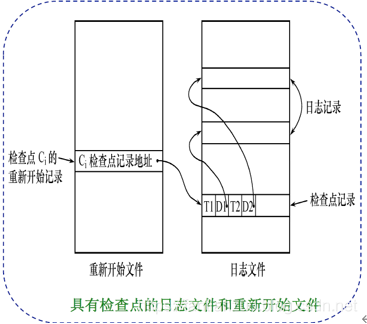

- 动态维护日志文件的方法

**周期性地执行如下操作：建立检查点，保存数据库状态。**

**具体步骤是：**

**1.将当前日志缓冲区中的所有日志记录写入磁盘的日志文件上**

**2.在日志文件中写入一个检查点记录**

**3.将当前数据缓冲区的所有数据记录写入磁盘的数据库中**

**4.把检查点记录在日志文件中的地址写入一个重新开始文件**

 

**使用检查点方法可以改善恢复效率**

**当事务T在一个检查点之前提交：**

1. T**对数据库所做的修改一定都已写入数据库**

1. 写入时间是在这个检查点建立之前或在这个检查点建立之时

1. 在进行恢复处理时，没有必要对事务**T执行REDO操作**

**使用检查点的恢复步骤**

** 1.从重新开始文件中找到最后一个检查点记录在日志文件中的地址，由该地址在日志文件中找到最后一个检查点记录**

** 2.由该检查点记录得到检查点建立时刻所有正在执行的事务清单ACTIVE-LIST**

- 建立两个事务队列

- UNDO-LIST

- REDO-LIST

- 把**ACTIVE-LIST暂时放入UNDO-LIST队列，REDO队列暂为空**

** 3.从检查点开始正向扫描日志文件，直到日志文件结束**

- 如有新开始的事务**Ti，把Ti暂时放入UNDO-LIST队列**

- 如有提交的事务**Tj，把Tj从UNDO-LIST队列移到REDO-LIST队列**

**4.对UNDO-LIST中的每个事务执行UNDO操作**

**                  对REDO-LIST中的每个事务执行REDO操作**

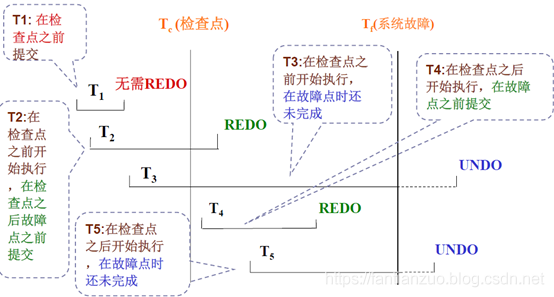

 

 

**为避免硬盘介质出现故障影响数据库的可用性，许多DBMS提供了数据库映像（mirror）功能用于数据库恢复。**

**将整个数据库或其中的关键数据复制到另一个磁盘上，每当主数据库更新时，DBMS自动把更新后的数据复制过去，由DBMS自动保证镜像数据与主数据库的一致性。一旦出现介质故障，可由镜像磁盘继续提供使用，同时DBMS自动利用磁盘数据进行数据库的恢复，不需要关闭系统和重装数据库副本。**

**在没有出现故障时，数据库镜像还可以用于并发操作，即当一个用户对数据库加排它锁修改数据时，其他用户可以读镜像数据库上的数据，而不必等待该用户释放锁。**

**由于数据库镜像是通过复制数据实现的，频繁地赋值数据自然会降低系统运行效率。因此在实际应用中用户往往只选择对关键数据和日志文件进行镜像。**

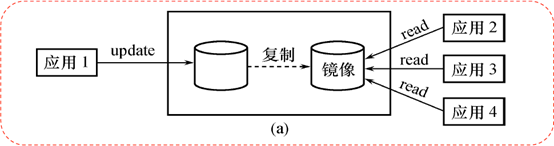

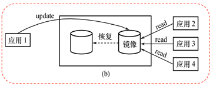

 

 

 

 

- 如果数据库只包含成功事务提交的结果，就说数据库处于一致性状态。保证数据一致性是对数据库的最基本的要求。

- 事务是数据库的逻辑工作单位

1. DBMS**保证系统中一切事务的原子性、一致性、隔离性和持续性**

- DBMS**必须对事务故障、系统故障和介质故障进行恢复**

- 恢复中最经常使用的技术：数据库转储和登记日志文件

- 恢复的基本原理：利用存储在后备副本、日志文件和数据库镜像中的冗余数据来重建数据库

 

**事务故障的恢复**

- UNDO

**系统故障的恢复**

- UNDO + REDO

**介质故障的恢复**

- 重装备份并恢复到一致性状态** + REDO**

 

**检查点技术**

- 可以提高系统故障的恢复效率  

- 可以在一定程度上提高利用动态转储备份进行介质故障恢复的效率

**镜像技术**

- 镜像技术可以改善介质故障的恢复效率

**多用户数据库：允许多个用户同时使用的数据库（订票系统）**

**不同的多事务执行方式：**

**         1.串行执行：每个时刻只有一个事务运行，其他事务必须等到这个事务结束后方能运行。**

**         2.交叉并发方式：**

**单处理机系统中，事务的并发执行实际上是这些并行事务的并行操作轮流交叉运行（不是真正的并发，但是提高了系统效率）**

**3.同时并发方式：**

**多处理机系统中，每个处理机可以运行一个事务，多个处理机可以同时运行多个事务，实现多个事务真正的并行运行**

**并发执行带来的问题：**

**         多个事务同时存取同一数据（共享资源）**

**         存取不正确的数据，破坏事务一致性和数据库一致性**

**并发操作带来的数据不一致性包括**

**         1）丢失修改（lost update）**

**         2）不可重复读（non-repeatable read）**

**         3）读脏数据（dirty read）**

**记号:W（x）写数据x           R（x）读数据x**

 

**并发控制机制的任务：**

**         1）对并发操作进行正确的调度**

**         2）保证事务的隔离性**

**         3）保证数据库的一致性**

**并发控制的主要技术**

**         1）封锁（locking）（主要使用的）**

**         2）时间戳（timestamp）**

**         3）乐观控制法（optimistic scheduler）**

**         4）多版本并发控制（multi-version concurrency control ，MVCC）**

**封锁：封锁就是事务T在对某个数据对象（例如表、记录等）操作之前，先向系统发出请求，对其加锁。加锁后事务T就对该数据对象有了一定的控制，在事务T释放它的锁之前，其它的事务不能更新此数据对象**

 

**确切的控制由封锁的类型决定**

**基本的封锁类型有两种：排它锁（X锁，exclusive locks）、共享锁（S 锁，share locks）**

**排它锁又称写锁，对A加了排它锁之后，其他事务不能对A加 任何类型的锁（排斥读和写）**

**共享锁又称读锁，对A加了共享锁之后，其他事务只能对A加S锁，不能加X锁（只排斥写）**

（很重要）

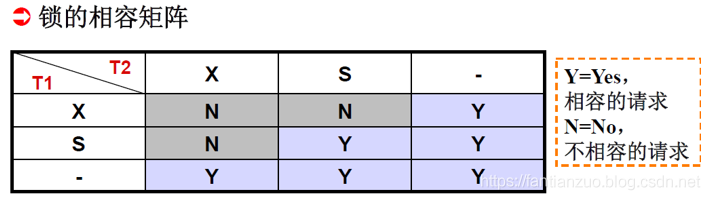

**在运用X锁和S锁对数据对象加锁时，需要约定一些规则：封锁协议（Locking Protocol）**

**何时申请X锁或S锁、持锁时间、何时释放**

**对封锁方式制定不同的规则，就形成了各种不同的封锁协议。**

**常用的封锁协议：三级封锁协议**

**三级封锁协议在不同程度上解决了并发问题，为并发操作的正确调度提供一定的保证。**

 

**1、一级封锁协议**

**事务T在修改数据R之前，必须先对其加X锁，直到事务结束（commit/rollback）才释放。**

**一级封锁协议可以防止丢失修改**

**如果是读数据，不需要加锁的，所以它不能保证可重复读和不读“脏”数据。**

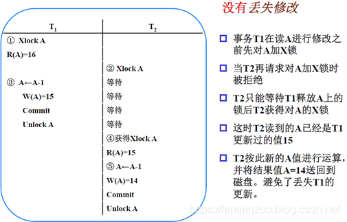

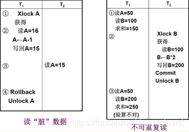

**2、 二级封锁协议**

**         在一级封锁协议的基础（写要加X锁，事务结束释放）上，增加事务T在读入数据R之前必须先对其加S锁，读完后即可释放S锁。（读要加S锁，读完即释放）**

**二级封锁协议除了可以防止丢失修改，还可以防止读脏数据**

**由于读完数据即释放S锁，不能保证不可重复读**

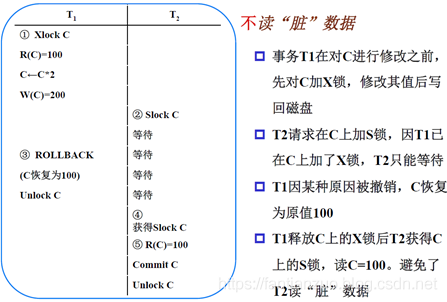

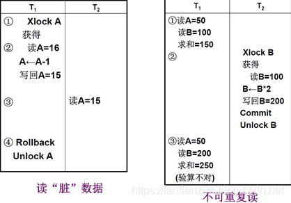

**3、三级封锁协议：**

**         在一级封锁协议基础上增加事务T在读取数据R之前必须先对其加S锁，直到事务结束后释放。**

**三级封锁协议除了可以防止丢失修改和读脏数据外，还防止了不可重复读**

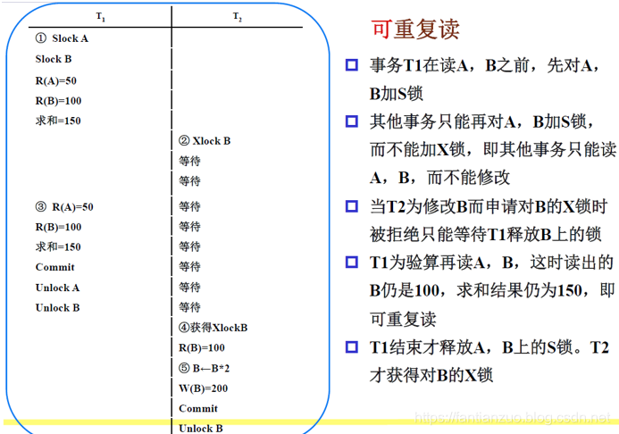

**三级封锁协议的主要区别是什么操作需要申请锁，何时释放锁。封锁协议越高，一致性程度越高。**

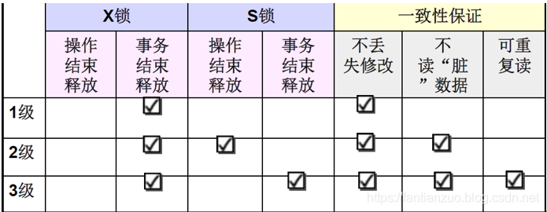

 

 

**饥饿：事务T1封锁了数据R，事务T2又请求封锁R，于是T2等待。T3也请求封锁R，当T1释放了R上的封锁之后，系统首先批准了T3的请求，T2仍然等待。 T4又请求封锁R，当T3释放了R上的封锁之后系统又批准了T4的请求……T2有可能永远等待，这就是饥饿的情形**

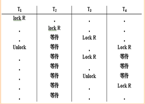

**避免饥饿的方法：先来先服务**

**当多个事务请求封锁同一数据对象时，按请求封锁的先后次序对这些事务排队**

**该数据对象上的锁一旦释放，首先批准申请队列中第一个事务获得锁。**

 

 

**死锁：事务T1封锁了数据R1， T2封锁了数据R2。 T1又请求封锁R2，因T2已封锁了R2，于是T1等待T2释放R2上的锁。 接着T2又申请封锁R1，因T1已封锁了R1，T2也只能**

**等待T1释放R1上的锁。 这样T1在等待T2，而T2又在等待T1，T1和T2两个事务永远不能结束，形成死锁。**

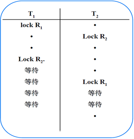

**1、死锁的预防**

**产生死锁的原因是两个或多个事务都已经封锁了一些数据对象，然后又都请求对已被其他事务封锁的数据对象加锁，从而出现死等待。**

**预防死锁发生就是破坏产生死锁的条件**

**方法**

**1）一次封锁法：**

**         要求每个事务必须一次将所有要使用的数据全部加锁，否则就不能继续执行。**

**         存在的问题：降低系统的并发度；难以实现精确确定封锁对象**

**2）顺序封锁法：**

**         预先对数据对象规定一个封锁顺序，所有事务都按这个顺序实施封锁。**

**         存在的问题：**

**维护成本：数据库系统中的封锁对象极多，并且在不断地变化**

**难以实现：很难实现确定每一个事务要封锁哪些对象**

**DBMS普通采用的诊断并解除死锁的方法**

**2、死锁的诊断和解除**

**         方法：超时法和事务等待图法**

**         1）超时法：如果一个事务的等待时间超过了规定的时限，就认为发生了死锁**

**                  优点：实现简单**

**                  缺点：误判死锁；时限若设置太长，死锁发生后不能及时发现。**

**         2）事务等待图法：用事务等待图动态反映所有事务的等待情况事务**

**等待图是一个有向图G=(T，U)，T为结点的集合，每个结点表示正运行的事务， U为边的集合，每条边表示事务等待的情况。若T1等待T2，则T1、T2之间划一条有向边，从T1指向T2。**

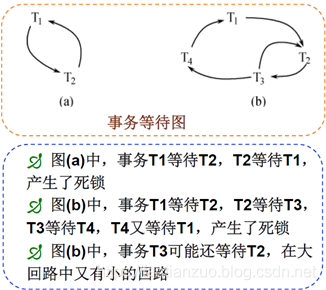

**并发控制子系统周期性地（比如每隔数秒）生成事务等待图，检测事务。如果发现图中存在回路，则表示系统中出现了死锁。    **

**解除死锁：并发控制子系统选择一个处理死锁代价最小的事务，将其撤销。**

**释放该事务持有的所有的锁，使其他事务能够继续运行下去。**

 

 

**什么样的调度是正确的？串行调度是正确的。**

**（执行结果等价于串行调度的调度也是正确的，这样的调度称为可串行化调度。）**

**定义：多个事务的并发执行是正确的，当且仅当其结果与按某一次序串行地执行这些事务时的结果相同，称这种调度策略为可串行化调度（serializable）。**

**可串行性是并发事务正确调度的准则。按这个准则规定，一个给定的并发调度，当且仅当它是可串行化的，才认为是正确调度。**

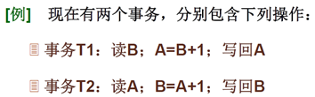

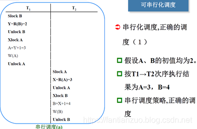

**判断可串行化调度的充分条件**

**冲突操作：不同的事务对同一个数据的读写和写写操作。**

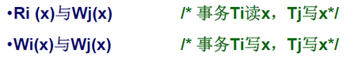

**不同事务的冲突操作和同一事务的两个操作是不能交换的。**

**Ri（x）和Wj（x）不可交换，Wi（x）和Wj（x）不可交换**

**冲突可串行化调度：**

**一个调度Sc在保证冲突操作的次序不变的情况下，通过交换两个事务不冲突操作的次序得到另一个调度Sc’，如果Sc’是串行的，称调度Sc为冲突可串行化的调度。**

 

**DBMS的并发控制机制必须提供一定的手段来保证调度是可串行化的。目前DBMS普遍采用两段锁协议（TwoPhase Locking，简称2PL）的方法来显示并发调度的可串行性。**

 

**两段锁协议是指所有事务必须分两个阶段对数据对象进行加锁和解锁。**

**         1）在对任何数据进行读写操作以前，首先要申请并获得对该数据的锁。**

**         2）在释放一个锁之后，事务不再申请和获得其他任何的锁。**

**“两段”锁的含义：事务分为两个阶段**

**第一阶段是获得封锁，也称为扩展阶段**

**事务可以申请获得任何数据对象上的任何类型的锁，但是不能释放任何锁**

**第二阶段是释放封锁，也称为收缩阶段**

**事务可以释放任何数据对象上的任何类型的锁，但是不能再申请任何锁**

 

**事务遵守两段锁协议是可串行化调度的充分条件，而不是必要条件。**

**若并发事务都遵守两段锁协议，则对这些事务的任何并发调度策略都是可串行化的**

**若并发事务的一个调度是可串行化的，不一定所有事务都符合两段锁协议**

 

**两段锁协议与防止死锁的一次封锁法**

**一次封锁法要求每个事务必须一次将所有要使用的数据全部加锁，否则就不能继续执行，因此一次封锁法遵守两段锁协议**

**但是两段锁协议并不要求事务必须一次将所有要使用的数据全部加锁，因此遵守两段锁协议的事务可能发生死锁**

 

**封锁对象的大小称为封锁粒度（granularity）。**

**封锁的对象可以是逻辑单元（属性值、属性值集合、元组、关系、索引项、数据库），也可以是物理单元（页、物理记录）。**

**选择封锁粒度原则：**

**         封锁粒度和系统的并发度和并发控制的开销密切相关**

**         封锁的粒度越大，数据库所能够封锁的数据单元就越少，并发度就越低，系统开销也**

**越小；**

**封锁的粒度越小，并发度较高，但系统开销也就越大**

 

**意向锁：如果对一个节点加意向锁，则可说明该节点的下层节点正在被加锁；对任一节点加锁时，必须先对它的上层节点加意向锁。**

**例如，对任一元组加锁时，必须先对它所在的数据库和关系加意向锁。**

**三种常用的意向锁：意向共享锁（Intent Share Lock，IS锁）；意向排它锁（Intent Exclusive Lock，IX锁）；共享意向排它锁（Share Intent Exclusive Lock，SIX锁）。**

 

**1、IS锁**

**如果对一个数据对象加IS锁，表示它的子节点拟加S锁。**

**例如：事务T1要对R1中某个元组加S锁，则要首先对关系R1和数据库加IS锁**

 

**2、IX锁**

**如果对一个数据对象加IX锁，表示它的子节点拟加X锁。**

**例如：事务T1要对R1中某个元组加X锁，则要首先对关系R1和数据库加IX锁**

 

**3、SIX锁**

**如果对一个数据对象加SIX锁，表示对它加S锁，再加IX锁，即SIX = S + IX。**

 

**例如：对某个表加SIX锁，则表示该事务要读整个表（所以要对该表加S锁），同**

**时会更新个别元组（所以要对该表加IX锁）**

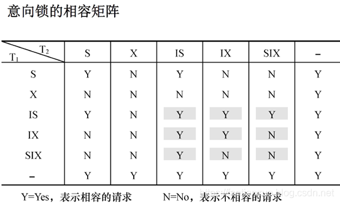

**意向锁的强度： 锁的强度是指它对其他锁的排斥程度。一个事务在申请封锁时以强锁代替弱锁是安全的，反之则不然。**

**具有意向锁的多粒度封锁方法**

**申请封锁时应该按自上而下的次序进行**

**释放封锁时则应该按自下而上的次序进行**

**优点：**

**         1）提高了系统并发度**

**         2）减少了加锁和解锁的开销**

**在实际的DBMS产品中得到广泛应用。**

 

**并发控制的方法除了封锁技术外，还有时间戳方法、乐观控制法和多版本并发控制。**

**时间戳方法：给每一个事务盖上一个时标，即事务开始的时间。每个事务具有唯一的时间戳，并按照这个时间戳来解决事务的冲突操作。如果发生冲突操作，就回滚到具有较早时间戳的事务，以保证其他事务的正常执行，被回滚的事务被赋予新的时间戳被从头开始执行。**

**乐观控制法认为事务执行时很少发生冲突，所以不对事务进行特殊的管制，而是让它自由执行，事务提交前再进行正确性检查。如果检查后发现该事务执行中出现过冲突并影响了可串行性，则拒绝提交并回滚该事务。又称为验证方法**

**多版本控制是指在数据库中通过维护数据对象的多个版本信息来实现高效并发的一种策略。**