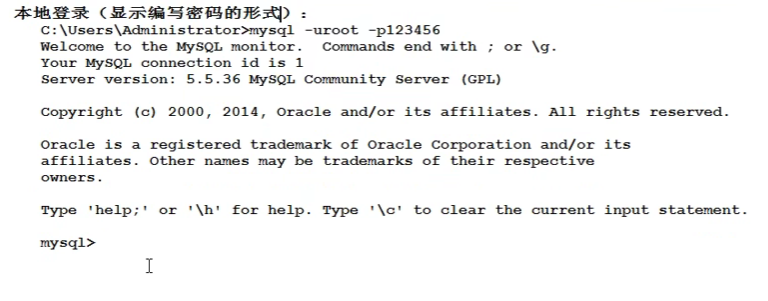

### 1.什么是数据库？什么是SQL？他们之间的关系是什么？

#### &#x9;	数据库：

&#x9;		英文单词Datebase，简称DB。按照一定格式存储的一些文件的组合。

&#x9;		顾名思义：存储数据仓库，实际上就是一堆文件。这些文件中存储了具有特定格式的数据。

#### &#x9;	数据库管理系统：

&#x9;		DataBaseManagement,简称DBMS。

&#x9;		数据库管理系统是专门用来管理数据库中的数据的，数据库管理系统可以对数据库当中的数据进行增删改查。

&#x9;		常见的数据库管理系统：

&#x9;			MySQL，Oracle，MS等。

#### &#x9;	SQL:结构化查询语言

&#x9;				程序员通过学习SQL语言，通过编写SQL语言然后DBMS负责执行SQL语句然后对数据库进行增删查改	           的操作。

&#x9;	   三者之间的关系：DBMS--执行-->SQL-->操作-->DB

### 安装MySQL注意事

一路下一步就好
注意：
端口号：
1.端口号是port是任何一个软件/应用都会有的，端口号是应用的唯一代表。
2.端口号通常和Ip地址在一块，IP地址用来定位计算机的，端口号port是用来定位计算机的某个服务的/某个应用的！
3.在同一台计算机上，端口号不能重复。具有唯一性。
MySQL数据库启动时候服务器占有的默认端口号是3306

设置MySQL数据库的编码方式utf-8
一定要注意：先选中第三个再选择utf-8
服务名称：MySQL 不用改

选择配置环境变量path=MySQL的bin路径

MySQL超级管理员的用户名不能改，一定是root 需要设置密码
设置密码的同时可以激活root账户远程访问。
激活表是root账户可以在外地登录，反之不行。

### 删除MySQL

第一步 双击MySQL图标删除
第二步 删除目录
把c:\programData下面的MySQL目录干掉
把c:\program File(x86下面的MySQL目录干掉)
卸载结束

### MySQL的服务

计算机右键-->管理-->服务和应用程序-->找MySQL服务
MySQL的服务默认启动的状态，只有启动了MySQL才能用。
默认启动下是“自动”启动，自动启动表示下一次重启操作系统的时候自动启动该服务。

可以在服务上右键：
启动
重启服务
停止服务
...
还可以改变服务的默认配置：
服务上点击右键，属性 然后可以选择启动方式：
自动（延迟启动）
自动
手动
禁用

### 使用MySQL

使用bin目录下的MySQL.exe命令来链接MySQL数据库服务器

本地登录

