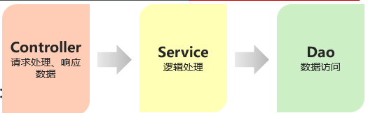

## Bean的声明

要把某个对象交给IOC容器管理，需要在对应的类上加上如下注解之一：

| 注解          | 说明              | 位置                          |
| :---------- | :-------------- | :-------------------------- |
| @Component  | 声明bean的基础注解     | 不属于以下三类时，用此注解               |
| @Controller | @Component的衍生注解 | 标注在控制器类上                    |
| @Service    | @Component的衍生注解 | 标注在业务类上                     |
| @Repository | @Component的衍生注解 | 标注在数据访问类上（由于与mybatis整合，用的少） |

> 声明bean的时候，可以通过value属性指定bean的名字，如果没有指定，默认为类名首字母小写。
> 使用以上四个注解都可以声明bean，但是在springboot集成web开发中，声明控制器bean只能用@Controller。

> @SpringBootApplication具有包扫描作用，默认扫描当前包及其子包

## 请求

|  参数类型  |                              方法                             |
| :----: | :---------------------------------------------------------: |
|  简单参数  |     定义方法形参，请求参数名与形参变量名一致。  如果不一致，通过@RequestParam手动映射     |
|  实体参数  |                  请求参数名，与实体对象的属性名一致，会自动接收封装                  |
| 数组集合参数 | 数组: 请求参数名与数组名一致，直接封装   集合: 请求参数名与集合名一致，@RequestParam绑定关系 |
|  日期参数  |                       @DateTimeFormat                       |
| JSON参数 |                         @RequestBody                        |
|  路径参数  |                        @PathVariable                        |

## @ResponseBody

类型：方法注解、类注解
位置：Controller方法上/类上
作用：将方法返回值直接响应，如果返回值类型是 实体对象/集合 ，将会转换为JSON格式响应
说明：@RestController = @Controller + @ResponseBody ;

## DI

1.  依赖注入的注解

*   @Autowired: 默认按照类型自动装配。
*   如果同类型的bean存在多个:
*   @Primary
*   @Autowired + @Qualifier("bean的名称”)
*   @Resource(name="bean的名称")

1.  @Resource 与@Autowired区别

*   @Autowired 是spring框架提供的注解，而@Resource是JDK提供的注解
*   @Autowired 默认是按照类型注入，而@Resource默认是按照名称注入。

| 注解         | 描述                                    | 示例                                                                    |
| ---------- | ------------------------------------- | --------------------------------------------------------------------- |
| @Autowired | 实现自动装配，将匹配类型的Bean注入到字段、构造方法或Setter方法中 | @Autowired private UserService userService;                           |
| @Qualifier | 结合@Autowired使用，指定具体的Bean名称进行注入        | @Autowired @Qualifier("userService") private UserService userService; |
| @Resource  | 实现自动装配，指定Bean的名称或类型                   | @Resource(name = "userService") private UserService userService;      |
| @Value     | 注入配置文件中的属性值，可以直接注入简单类型的值或表达式          | @Value("\${app.name}") private String appName;                        |

## 响应状态码

|      状态码分类      |                      说明                      |
| :-------------: | :------------------------------------------: |
|       1xx       | 响应中 ---临时状态码。表示请求已经接受，告诉客户端应该继续请求或者如果已经完成则忽略 |
|       2xx       |           成功 --- 表示请求已经被成功接收，处理已完成           |
|       3xx       |      重定向 --- 重定向到其它地方，让客户端再发起一个请求以完成整个处理     |
|       4xx       |    客户端错误 --- 处理发生错误，责任在客户端，如：客户端的请求一个不存在的资   |
| 源，客户端未被授权，禁止访问等 |                                              |
|       5xx       |   服务器端错误 --- 处理发生错误，责任在服务端，如：服务端抛出异常，路由出错，   |
|    HTTP版本不支持等   |                                              |

> 关于响应状态码，我们先主要认识三个状态码，其余的等后期用到了再去掌握：
> 200 ok 客户端请求成功
> 404 Not Found 请求资源不存在
> 500 Internal Server Error 服务端发生不可预期的错误

