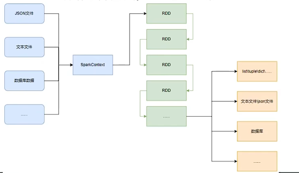
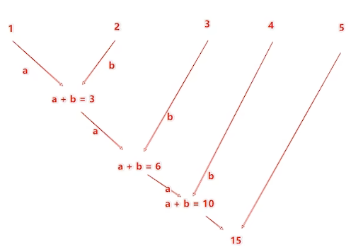
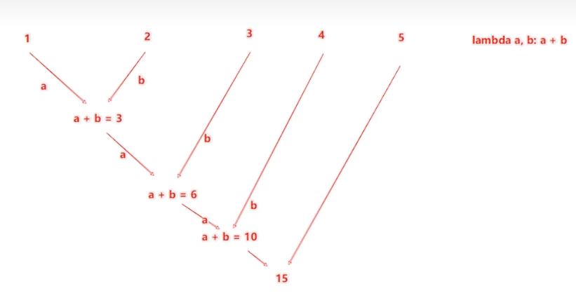
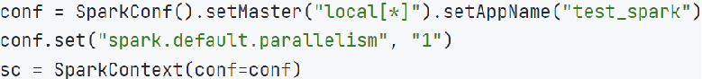
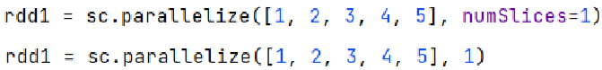

## 安装pyspark包
```shell
pip install pyspark
```
```python
# 导包
from pyspark import SparkContext,SparkConf
# 创建Sparkconf对象
conf = SparkConf().setMaster("local[*]").setAppName("test_Spark_app")

# conf = SpaarkConf
# conf.setMaster("local[*]")
# conf.setAppName("test_Spark_app") 

# 基于spaprkConf创建SparkContext对象
sc = SparkContext(conf=conf)

# 获取PySpark的版本
print("PySpark version: ", sc.version)

# 停止SparkContext对象的运行（停止spark程序）
sc.stop()
```
## PySpark的编程模型
- 数据输入:通过SparkContext完成数据读取
- 数据计算:读取到的数据转换为RDD对象，调用RDD的成员方法完成计算
- 数据输出:调用RDD的数据输出相关成员方法，将结果输出到list、元组、字典、文本文件、数据库等
> PySpark的功能都是从SparkContext对象作为开始

## RDD 对象
如图可见,PySpark支持多种数据的输入,在输入完成后,都会得到一个:RDD类的对象
RDD全称为:弹性分布式数据集(ResilientDistributed Datasets)
PySpark针对数据的处理,都是以RDD对象作为载体，即:
- 数据存储在RDD内
- 各类数据的计算方法，也都是RDD的成员方法
- RDD的数据计算方法，返回值依旧是RDD对象


```python
"""
演示通过PySpark代码加载数据，即数据输入
"""
from pyspark import SparkContext, SparkConf

conf = SparkConf().setMaster("local[*]").setAppName("test_spark_dataInput")
sc = SparkContext(conf=conf)

# 通过parallelize方法将python数据加载到Spark中，成为RDD对象
rdd1 = sc.parallelize([1, 2, 3 ,4, 5])
rdd2 = sc.parallelize((1, 2, 3 ,4, 5))
rdd3 = sc.parallelize("abcdefgh")
rdd4 = sc.parallelize({1, 2, 3, 4, 5})
rdd5 = sc.parallelize({"key1": "value1", "key2": "value2", "key3":"value3"})

# 如果要查看RDD中的数据，需要调用collect方法
print(rdd1.collect())
print(rdd2.collect())
print(rdd3.collect())
print(rdd4.collect())
print(rdd5.collect())

# 用textFile方法读取文件加载到spark，成为RDD对象
rdd = sc.textFile("data/hello.txt")
print(rdd.collect())

sc.stop()
```
## 数据计算
注意：这里的代码中要配置PYSPARK_PYTHON环境代码如下
> os.environ["PYSPARK_PYTHON"] = "D:\\Anaconda\\python.exe"


### map方法
PySpark的数据计算,都是基于RDD对象来进行的,那么如何进行呢?
自然是依赖，RDD对象内置丰富的:成员方法(算子)
**map算子**
> 功能: map算子,是将RDD的数据 一条条处理( 处理的逻辑 基于map算子中接收的处理函数),返回新的RDD
语法:
```python
rdd.map(func)

# func :f:(T)> U
#f: 表示这是一个函数(方法)
#(T)→U 表示的是方法的定义:
#()表示传入参数，(T)表示 传入1个参数，() 表示没有传入参数
#T 是泛型的代称，在这里表示 任意类型
#U也是泛型代称，在这里表示 任意类型

#→>U表示返回值

#(T)→U 总结起来的意思是:这是一个方法，这个方法接受一个参数传入，传入参数类型不限. 返回一个返回值，返回值类型不限.返回一个返回值，返回值和传入参数类型一致

#(A)→ A 总结起来的意思是:这是一个方法，这个方法接受一个参数传入，传入参数类型不限
```

```python
"""
RDD的map成员方法的使用
"""
from pyspark.context import SparkContext, SparkConf
# 设置python环境变量
import os
os.environ["PYSPARK_PYTHON"] = "D:\\Anaconda\\python.exe"

conf = SparkConf().setMaster("local[*]").setAppName("test_spark_map")
sc = SparkContext(conf=conf)

# 准备一个RDD
rdd = sc.parallelize([1, 2, 3])
print(rdd.collect())

# 通过map方法将全部数据都乘以10
def map_func(x):
    return x * 10
rdd2 = rdd.map(map_func)
# rdd.map(lambda x: x * 10)
print(rdd2.collect())
# (T) -> U
# (T) -> T

# 链式调用
rdd3 = rdd.map(lambda x: x * 10).map(lambda x: x + 10)
print(rdd3.collect())
sc.stop()
```
### flatMap方法
> 功能: flatMap算子,是将RDD的数据 一条条处理( 处理的逻辑 基于flatMap算子中接收的处理函数),返回新的RDD
> 相对与map多了一个解除嵌套的功能

```python
# coding:utf8
# 演示rdd的flatMap算子

from pyspark import SparkConf,SparkContext
import os
os.environ["PYSPARK_PYTHON"] = "D:\\Anaconda\\python.exe"
# 0.构建Spark执行环境
conf = SparkConf().setAppName("create rdd").setMaster("local[*]")
sc =SparkContext(conf=conf)
# 准备一个RDD
rdd = sc.parallelize(["itheima itcast 666", "itheima itheima itcast", "python itheima"])

#按照空格切分数据后，解除嵌套（提取单词）
print(rdd.map(lambda x:x.split(" ")).collect())
print(rdd.flatMap(lambda x:x.split(" ")).collect())
sc.stop()

```
### reduceByKey方法
reduceByKey算子
> 功能:**针对KV型** RDD,自动按照key分组,然后根据你提供的聚合逻辑,完成 **组内数据**(value)的聚合操作.

用法：
```
rdd.reduceByKey(func)

# func: f(k,v) -> k
# f(k,v) -> k 表示函数，接收两个参数，返回一个值
```
reduceBeKey中的聚合逻辑是:
比如,有[1,2,3,4,5],然后聚合函数是: lambda a，b:a + b



> 注意:reduceByKey中接收的函数,只负责聚合,不理会分组
> 分组是自动 **by key** 来分组的,
```python
"""
演示RDD的reduceByKey成员方法的使用
"""
from pyspark import SparkConf, SparkContext
import os
os.environ["PYSPARK_PYTHON"] = "D:\\Anaconda\\python.exe"
conf = SparkConf().setMaster("local[*]").setAppName("test_spark")
sc =SparkContext(conf=conf)

#准备一个RDD
rdd = sc.parallelize([('男',99),('男',88),('女',99),('女',66)])
#求男生和女生两个组的成绩之和
rdd2 = rdd.reduceByKey(lambda x,y:x+y)
print(rdd2.collect())
sc.stop()
```

### filter方法
> 功能: 过滤RDD中的数据,选择想要的进行保留

语法：
```python
rdd.filter(func)
# func: f(T) -> bool  传入1个参数，返回一个bool值
```
> 函数返回值为True的数据保留，False的数据过滤
```python
"""
演示RDD的filter成员方法的使用
"""
from pyspark import SparkConf, SparkContext
import os
os.environ["PYSPARK_PYTHON"] = "D:\\Anaconda\\python.exe"
conf = SparkConf().setMaster("local[*]").setAppName("test_spark")
sc =SparkContext(conf=conf)
#准备一个RDD
rdd=sc.parallelize([1,2,3,4,5])
# 对RDD的数据进行过滤
rdd_filter=rdd.filter(lambda x:x>3)
# 打印结果
print("rdd_filter:",rdd_filter.collect())
sc.stop()
```

### distinct方法
> distinct算子
> 功能: 去除RDD中的重复数据

语法：
```python
rdd.distinct() # 无需传参
```
```python
"""
演示RDD的distinct成员方法的使用
"""
from pyspark import SparkConf,SparkContext
import os
os.environ["PYSPARK_PYTHON"] = "D:\\Anaconda\\python.exe"
conf = SparkConf().setMaster("local[*]").setAppName("test_spark")
sc = SparkContext(conf=conf)
#准备一个RDD
rdd=sc.parallelize([1,1,3,3,5,5,7,8,8,9,10])
#对RDD的数据进行去重
rdd2 = rdd.distinct()
print(rdd2.collect())
sc.stop()
```

### sortBy()方法
> 功能: 对RDD中的数据进行排序

语法:
> rdd.sortBy(func,ascending=False,numPartitions=1)
> 
> \# func:(T)→U:告知按照rdd中的哪个数据进行排序，比如 lambda x:x[1] 表示按照rdd中的第二列元素进行排序
> 
> \# ascending True升序 False 降序
> 
> \# numPartitions:用多少分区排序

```python
from pyspark import SparkConf, SparkContext
import os
os.environ["PYSPARK_PYTHON"] = "D:\\Anaconda\\python.exe"
conf = SparkConf().setMaster("local[*]").setAppName("test_spark")
sc =SparkContext(conf=conf)
#1.读取数据文件
rdd = sc.textFile("data/hello.txt")
#2、取出全部单词
word_rdd = rdd.flatMap(lambda x:x.split(" "))
#3、将所有单词都转换成二元元组，单词为Key，value设置为1
word_with_one_rdd = word_rdd.map(lambda word:(word,1))
#4.分组并求和
result_rdd = word_with_one_rdd.reduceByKey(lambda a, b: a + b)
#5.对结果进行排序
final_rdd = result_rdd.sortBy(lambda x:x[1],ascending=True,numPartitions=1)
print(final_rdd.collect())
sc.stop()

```

## 数据输出
### 将rdd输出为python对像
#### 1.cllect算子
> 功能：将RDD中各个分区内的数据，统一收集到Driver端，形成一个List对象

用法：
`rdd.collect()`返回值是一个List

#### 2.reduce算子
> 功能：对RDD数据集安装你传入的逻辑进行聚合

语法：
`rdd.reduce(func)``
> \# func: f(T, T) -> T  传入两个参数，返回一个值
> \# 2参数传入1个返回值，返回值和参数类型要一致

执行流程如下图：



#### 3.take算子
> 功能：取出RDD的前N个数据，组和成List返回

用法：
>`sc.parallelize([3,2,1,4,5,6]).take(5) `
> 
> `[3,2，1，4，5]`

#### 4.count算子
> 功能：统计RDD中有多少条数据

用法：
> `sc.parallelize([3,2,1,4,5,6]).count()`
> 6

代码：
```python
"""
演示将RDD输出为Python对象
"""
from pyspark import SparkConf, SparkContext
import os
import json
os.environ["PYSPARK_PYTHON"] = "D:\\Anaconda\\python.exe"
conf = SparkConf().setMaster("local[*]").setAppName("test_spark")
sc =SparkContext(conf=conf)
#准备RDD
rdd =sc.parallelize([1,2,3,4,5])

#collect算子，输出RDD为list对象
rdd_list = rdd.collect()
print(rdd_list)

#reduce算子，对RDD进行两两聚合
rdd_reduce = rdd.reduce(lambda x,y:x+y)
print(rdd_reduce)

# take算子，取出RDD前N个元素，组成list返回
rdd_take = rdd.take(3)
print(rdd_take)

# count，统计rdd内有多少条数据，返回值为数字
rdd_count = rdd.count()
print(f'RDD里有{rdd_count}个元素')

sc.stop()
```

### 输出为文件
#### 配置环境
1.下载Hadoop安装包
http://archive.apache.org/dist/hadoop/common/hadoop-3.0.0/hadoop-3.0.0.tar.gz
2.解压到电脑任意位置
在Python代码中使用os模块配置：os.environ[‘HADOOP_HOME’] = ‘HADOOP解压文件夹路径’
3.下载winutils.exe，并放入Hadoop解压文件夹的bin目录内
https://raw.githubusercontent.com/steveloughran/winutils/master/hadoop-3.0.0/bin/winutils.exe
4.下载hadoop.dll，并放入:C:/Windows/System32 文件夹内
https://raw.githubusercontent.com/steveloughran/winutils/master/hadoop-3.0.0/bin/hadoop.dll

#### 1.saveAsTextFile算子
> 功能：将RDD中的数据，按照指定的路径保存为文本文件
> 支持 本地写出，hdfs等文件系统

代码：
```python
rdd = sc.parallelize([1,2,3,4])
rdd.saveAsTextFile("data/output")
```
输出时文件夹里有很多个文件，每个文件里只有一行数据，文件名是随机的，文件数量取决于分区数量

可以修改rdd分区为1个
方式1，SparkConf对象设置属性全局并行度为1：


方式2，创建RDD的时候设置（parallelize方法传入numSlices参数为1）


## 了解PySpark代码在大数据集群上运行

提交命令：
`将案例提交到YARN集群中运行`
bin/spark-submit --master yarn --num-executors 3 --queue root.teach --executor-cores 4 --executor-memory 4g /home/hadoop/demo.py


