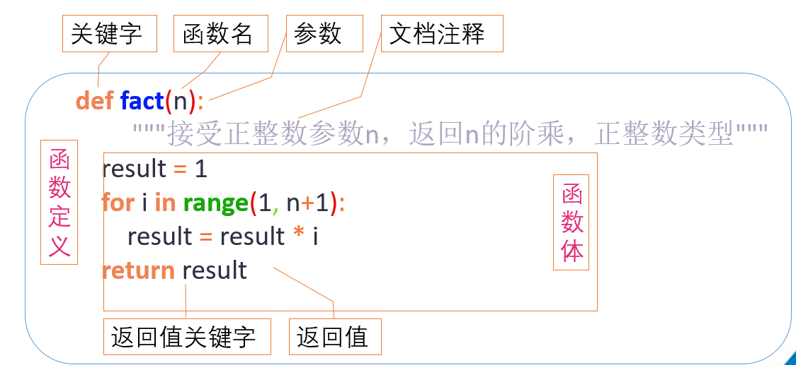

## 一.函数定义和调用

*   **定义函数的格式如下：**

    

***

## 二.函数参数

*   **(1)缺省参数**

*   `调用函数时，缺省参数的值如果没有传入，则取默认值`。

*   下例会打印默认的age，如果age没有被传入：
```python
def printinfo(name, age=35):

    # 打印任何传入的字符串

    print("name: %s" % name)
    print("age %d" % age)

    # 调用printinfo函数

    printinfo(name="miki")  # 在函数执行过程中 age去默认值35
    printinfo(age=9 ,name="miki")
```
    

    name: miki
    age: 35
    name: miki
    age: 9

*   **在形参中默认有值的参数，称之为缺省参数**

*   **注意**：带有默认值的参数一定要位于参数列表的最后面

```
>>> def printinfo(name, age=35, sex):
...     print name
...
File "<stdin>", line 1
SyntaxError: non-default argument follows default argument

```

*   **（2）不定长参数**

*   有时可能需要一个函数能处理比当初声明时更多的参数, 这些参数叫做不定长参数，声明时不会命名。

*   `基本语法如下：`

```
def functionname([formal_args,] *args, **kwargs):
   """函数_文档字符串"""
   function_suite
   return [expression]

```

注意：

- 加了星号（\*）的变量args会存放所有未命名的变量参数，args为元组
- 而加\*\*的变量kwargs会存放命名参数，即形如key=value的参数， kwargs为字典.

```
def fun(a, b, *args, **kwargs):

    print("a =%d" % a)
    print("b =%d" % b)
    print("args:")
    print(args)
    print("kwargs: ")
    for key, value in kwargs.items():
        print("key=%s" % value)

fun(1, 2, 3, 4, 5, m=6, n=7, p=8)  # 注意传递的参数对应

```

```
a =1
b =2
args:
(3, 4, 5)
kwargs: 
key=6
key=7
key=8

```


### 将字典和元组作为参数传递给Python函数

#### 元组作为参数
当使用元组传递参数时，可以使用解包操作符 `*` 来将元组中的元素作为独立的参数传递给函数。

```python
def func(a, b, c):
    print(a, b, c)

# 元组
my_tuple = (1, 2, 3)
func(*my_tuple)  # 1 2 3 作为独立参数传递
```

#### 字典作为参数
当使用字典传递参数时，可以使用解包操作符 `**` 来将字典中的键值对作为关键字参数传递给函数。重要的是，字典的键必须与函数的参数名相匹配。

```python
def func(a, b, c):
    print(a, b, c)

# 字典的键与函数参数名一致
my_dict = {'a': 1, 'b': 2, 'c': 3}
func(**my_dict)  # 输出: 1 2 3
```

#### 字典键与函数参数名不匹配的情况
如果字典的键与函数的参数名不一致，Python 会尝试找到匹配的参数名，如果找不到，会抛出一个 `TypeError`。

```python
# 字典的键与函数参数名不一致
my_dict_mismatch = {'x': 1, 'y': 2, 'z': 3}
# 这将抛出一个错误
func(**my_dict_mismatch)  # TypeError: func() got multiple values for argument 'a'
```

#### 总结
- 使用 `*` 操作符解包元组，可以将其元素作为位置参数传递给函数。
- 使用 `**` 操作符解包字典，可以将其键值对作为关键字参数传递给函数，但字典的键必须与函数的参数名一致。
- 如果字典的键与函数参数名不匹配，将会导致错误。


*   **（3）缺省参数在\*args后面**

```
def sum_nums_3(a, *args, b=22, c=33, **kwargs):
    print(a)
    print(b)
    print(c)
    print(args)
    print(kwargs)

sum_nums_3(100, 200, 300, 400, 500, 600, 700, b=1, c=2, mm=800, nn=900)

```

```
100
1
2
(200, 300, 400, 500, 600, 700)
{'mm': 800, 'nn': 900}

```

*   **说明：**

*   如果很多个值都是不定长参数，那么这种情况下，可以将缺省参数放到 \*args的后面，\
    但如果有\*\*kwargs的话，\*\*kwargs必须是最后的

***

## 三.函数返回值

*   `所谓“返回值”，就是程序中函数完成一件事情后，最后给调用者的结果`

***

> 在[python](https://so.csdn.net/so/search?q=python\&spm=1001.2101.3001.7020)中我们怎样返回多个值？
>
> 一个函数返回多个数据的方式

```
def divid(a, b):
    shang = a//b
    yushu = a%b 
    return shang, yushu  #默认是元组

result = divid(5, 2)
print(result)  # 输出(2, 1)

```

    (2, 1)

*   return后面可以是元组，列表、字典等，只要是能够存储多个数据的类型，就可以一次性返回多个数据。

***

## 五.引用

*   **在python中，值是靠引用来传递来的。**

*   我们可以用id()来判断两个变量是否为同一个值的引用。 我们可以将id值理解为那块内存的地址标示。

```
a = 1
b = a
print(b)
print(id(a))
print(id(b))

print("---")
# 注意a的id值已经变了
a = 2
print(id(a))
print(id(b))

```

```
1
2047670192
2047670192
---
2047670208
2047670192

```

*   **总结：** 之前为了更好的理解变量，咱们可以把a=100理解为变量a中存放了100，事实上变量a存储是100的引用（可理解为在内存中的一个编号）

***

*   **引用当做实参**

*   可变类型与不可变类型的变量分别作为函数参数时，会有什么不同吗？

*   Python有没有类似C语言中的指针传参呢？

```
def test1(b):  # 变量b一定是一个局部变量，就看它指向的是谁？可变还是不可变
    b += b  # += 是直接对b指向的空间进行修改,而不是让b指向一个新的
    # b = b+b  # xx = xx+yyy 先把=号右边的结果计算出来,然后让b指向这个新的地方,不管原来b指向谁
    print(b)            # 现在b一定指向这个新的地方
    print(id(b))
# a = [11, 22]
a = 100
test1(a)
#测试一下
print(a)
print(id(a))

```

*   `地址不一样`

```
200
2047673376 #两个的地址不一样
100
2047671776

```

*   `总结：`

*   Python中函数参数是引用传递（注意不是值传递）

*   对于不可变类型，因变量不能修改，所以运算不会影响到变量自身

*   而对于可变类型来说，函数体中的运算有可能会更改传入的参数变量

***

## 六.lambda

`lambda` 表达式在 Python 中是一种简洁的匿名函数定义方式，其基本语法是 `lambda 参数: 表达式`。它常用于需要函数对象的场合，如 `map`、`filter`、`sorted` 等函数的参数。例如：

    add = lambda x, y: x + y
    print(add(5, 3))  # 输出 8

`lambda` 表达式通常用于创建小的、临时的函数，但不能包含复杂的逻辑或多条语句。
