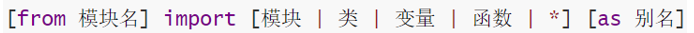

## 异常

#### 1. 为什么要捕获异常？

在可能发生异常的地方，进行捕获。当异常出现的时候，提供解决方式，而不是任由其导致程序无法运行。

#### 2. 捕获异常的语法？


#### 3. 如何捕获所有异常？

异常的种类多种多样，如果想要不管什么类型的异常都能捕获到，那么使用:

*   except:
*   except Exception
*   两种方式捕获全部的异常

## 模块

#### 1. 什么是模块？

模块就是一个Python代码文件，内含类、函数、变量等，我们可以导入进行使用。

#### 2. 如何导入模块



#### 3. 注意事项：

*   from可以省略，直接import即可
*   as别名可以省略
*   通过”.”来确定层级关系
*   模块的导入一般写在代码文件的开头位置

## 自定义模块

#### 1. 如何自定义模块并导入？

在Python代码文件中正常写代码即可，通过import、from关键字和导入Python内置模块一样导入即可使用。

#### 2. \_\_main\_\_变量的功能是？

if **main** == “**main**”表示，只有当程序是直接执行的才会进入if内部，如果是被导入的，则if无法进入

#### 3. 注意事项

不同模块，同名的功能，如果都被导入，那么后导入的会覆盖先导入的
**\_\_all\_\_变量可以控制import 的时候哪些功能可以被导入**

## 包

#### 1. 什么是第三方包？有什么作用？

第三方包就是非Python官方内置的包，可以安装它们扩展功能，提高开发效率。

#### 2. 如何安装？

> •在命令提示符内：
>
> •pip install 包名称
>
> •pip install -i <https://pypi.tuna.tsinghua.edu.cn/simple> 包名称
>
> •在PyCharm中安装

#### 关于\*\*\_\_init\*\*\*\*\*\_\_文件\*\*\*

在Python中，`__init__.py` 文件是一个特殊的文件，它定义了一个Python包的初始化。当你有一个包含多个模块的目录时，Python需要一个方式来识别这个目录作为一个包。`__init__.py` 文件就扮演了这个角色。

以下是 `__init__.py` 文件的一些关键点：

1.  **包标识**：空的 `__init__.py` 文件足以告诉Python解释器该目录应该被视为一个包。

2.  **初始化代码**：你可以在 `__init__.py` 文件中执行包级别的初始化代码，比如包的配置或初始化数据。

3.  **模块引用**：`__init__.py` 可以用来从包内的其他模块导入特定的类、函数或变量，使得它们可以直接从包级别访问，而不需要显式地指定模块名。

4.  **包的组织**：在大型项目中，`__init__.py` 文件有助于组织代码，通过定义清晰的接口和API，隐藏内部实现细节。

5.  **命名空间**：`__init__.py` 文件可以控制包的命名空间，通过导入和导出特定的名称来管理包的公共接口。

6.  **向后兼容性**：在Python 3.3之前，`__init__.py` 文件是创建包的必要条件。从Python 3.3开始，引入了隐式的命名空间包，这种类型的包不需要 `__init__.py` 文件。

7.  **废弃警告**：如果你使用的是Python 2，并且想要确保代码在Python 3中也能正常工作，可以在 `__init__.py` 中添加以下代码：
    ```python
    __future__ import absolute_import
    ```

例如，如果你有一个名为 `my_package` 的目录，里面包含了一个 `__init__.py` 文件和其他一些模块，你可以这样导入和使用它们：

```python
# 在 my_package/__init__.py 中
from .module1 import my_function

# 在其他文件中
import my_package

# 直接使用从 module1 导入的 my_function
my_package.my_function()
```

`__init__.py` 文件是Python包结构中的一个关键组成部分，它提供了包初始化和组织代码的方式。
