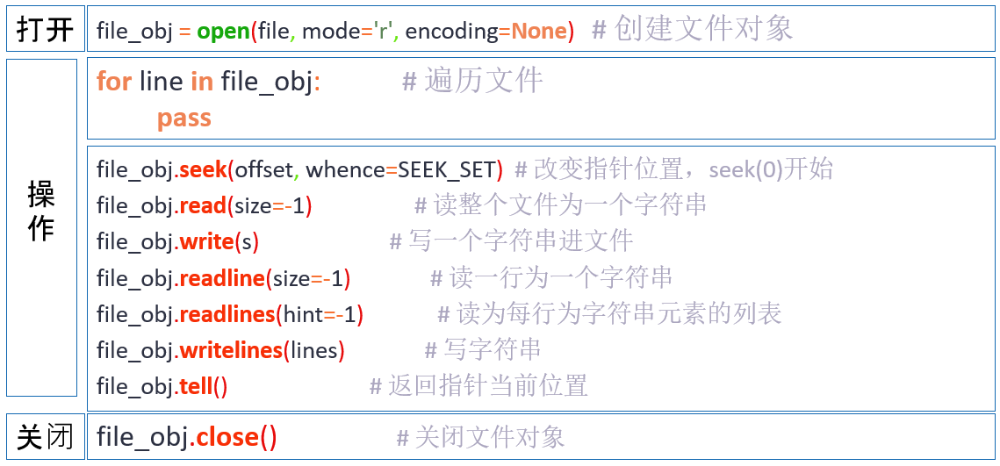

# 文件




## **一、读文件**

#### **2.3 with上下文管理：解决经常会忘记关闭文件句柄，造成资源浪费，所以处理文件是往往使用 with 语句进行上下文管理**。

    with + open(文件地址）as 函数名：不需要你手动调用fs.close()自动帮你关闭文件 with open(file=r"a.txt",mode="r",encoding="utf-8") as fb:   
    	ct = fb.read()    
    	print(ct)

#### **2.4多种读文件的方式：**


**a)read()**

    #在读模式下，使用文件对象的 read 方法可以读取文件的内容。它接收一个整数参数表示读取内容的大小，文本模式下表示字符数量，二进制模式下表示字节大小。
     
    with open('a.txt', 'r', encoding='utf-8') as f:
        content = f.read(3)
        print(content)
     
     
    响应：共计三个字符
    我是新

**b)readline()**

    with open(file=r"a.txt",mode="r",encoding="utf-8") as fb:
        vt = fb.readline()
        print(vt)
     
     
    #响应：
    这里是第一行句子

**c)readlines()**

```python
with open(file=r"a.txt",mode="r",encoding="utf-8") as fb:    
	bt = fb.readlines()    
	print(bt)	  
响应："\n"换行符的字符体现，读出来就是这样表现 ['这里是第一行句子\n', '这是是第二行句子\n', '这里是第三行句子\n']
```

**d)二进制读取：# mode=rb，不需要encoding参数**

    with open(file=r"a.txt",mode="r",encoding="utf-8") as fb:
        bt = fb.readlines()
        print(bt)
     
     
    响应："\n"换行符的字符体现，读出来就是这样表现
     
    ['这里是第一行句子\n', '这是是第二行句子\n', '这里是第三行句子\n']

## **二、写文件**

**a)mode="w"：**

    # mode=rb，不需要encoding参数
    with open(file=r"a.txt",mode="rb") as fb:
        content  =fb.read()
        print(content)
     
     
    #响应：
    b'\xe8\xbf\x99\xe9\x87\x8c\xe6\x98\xaf\xe7\xac\xac\xe4\xb8\x80\xe8\xa1\x8c\xe5\x8f\xa5\xe5\xad\x90\r\n\xe8\xbf\x99\xe6\x98\xaf\xe6\x98\xaf\xe7\xac\xac\xe4\xba\x8c\xe8\xa1\x8c\xe5\x8f\xa5\xe5\xad\x90\r\n\xe8\xbf\x99\xe9\x87\x8c\xe6\x98\xaf\xe7\xac\xac\xe4\xb8\x89\xe8\xa1\x8c\xe5\x8f\xa5\xe5\xad\x90\r\n'

**运行后会发现之前 a.txt 内容修改为“我是新写入的内容”，因为 `w` 模式会清除原文件内容，所以小心使用。**

**b)mode="a"：**

    #\n代表换行符，使用就换行
    with open(file=r"a.txt",mode="a",encoding="utf-8") as fb:
        fb.write("我是第二次写入的内容\n")
     
     
     
    文本内容：
     
    我是新写入的内容
    我是第二次写入的内容

c).写二进制文件:将图片二进制信息写入文件中，并存到本地。

```
 
import requests
 
url = 'https://ss1.bdstatic.com/70cFvXSh_Q1YnxGkpoWK1HF6hhy/it/u=1247698508,1430079989&fm=26&gp=0.jpg'
 
response = requests.get(url)
 
with open('校花.jpg', 'wb') as f:
    f.write(response.content)
```

c)结果图例：


####

## **三、tell 方法：文件对象的 tell 方法返回整数，表示文件指针距离文件开头的字节数**

    with open('a.txt', 'r', encoding='utf-8') as f:
        print(f.tell()) #文件指针距离文件开头的字节数
        content = f.read(3)
        print(content)
        print(f.tell())#文件指针距离文件开头的字节数
     
     
    响应：
     
    0
    我是新
    9

## **四、seek 方法：通过文件对象的 seek 方法可以移动文件句柄**

    seek 方法接收两个参数：
     
    offset 表示偏移指针的字节数
    whence 表示偏移参考，默认为 0
    0 表示偏移参考文件的开头，offset 必须是 >=0 的整数
    1 表示偏移参考当前位置，offset 可以是负数
    2 表示偏移参考文件的结尾，offset 一般是负数

注意文本模式下只允许从文件的开头进行偏移，也即只支持 whence=0

    with open('a.txt', 'r', encoding='utf-8') as f:
        print(f.read(3))
        # 跳转到文件开头
        f.seek(0)
        # 再读取第一个字
        print(f.read(1))
     
    #响应:
    我是新
    我

# 目录

## os

Python提供了多种方式来操作文件系统目录，以下是一些常见的操作和相应的Python标准库函数：

#### 1.  **创建目录**：

    使用`os`模块的`mkdir()`或`makedirs()`函数可以创建单个或多个目录。

    ```python
    import os
    os.mkdir('new_directory')  # 创建一个新目录
    os.makedirs('new_directory/sub_directory', exist_ok=True)  # 创建嵌套目录，exist_ok参数避免在目录已存在时抛出异常
    ```

#### 2.  **删除目录**：

    使用`rmdir()`或`removedirs()`函数可以删除目录。

    ```python
    os.rmdir('empty_directory')  # 删除空目录
    os.removedirs('empty_directory/sub_directory')  # 删除嵌套目录
    ```

#### 3.  **列出目录内容**：

    使用`listdir()`函数可以列出目录中的所有文件和子目录。

    ```python
    files_and_dirs = os.listdir('some_directory')
    ```

#### 4.  **检查路径是否存在**：

    使用`path.exists()`或`os.path.exists()`可以检查文件或目录是否存在。

    ```python
    exists = os.path.exists('some_path')
    ```

#### 5.  **获取当前工作目录**：

    使用`getcwd()`可以获取当前工作目录。

    ```python
    current_directory = os.getcwd()
    ```

#### 6.  **改变当前工作目录**：

    使用`chdir()`可以改变当前工作目录。

    ```python
    os.chdir('new_directory')
    ```

#### 7.  **获取文件状态**：

    使用`stat()`可以获取文件或目录的详细信息。

    ```python
    file_info = os.stat('some_file')
    ```

#### 8.  **重命名或移动目录**：

    使用`rename()`可以重命名或移动文件和目录。

    ```python
    os.rename('old_name', 'new_name')
    ```

#### 9.  **遍历目录树**：

    使用`os.walk()`可以遍历目录树。

    ```python
    for dirpath, dirnames, filenames in os.walk('some_directory'):
        for filename in filenames:
            print(os.path.join(dirpath, filename))
    ```

#### 10. **路径操作**：

    `os.path`模块提供了一系列函数来操作路径，如`join()`, `split()`, `abspath()`等。

    ```python
    full_path = os.path.join('directory', 'subdirectory', 'file')
    head, tail = os.path.split(full_path)
    ```

