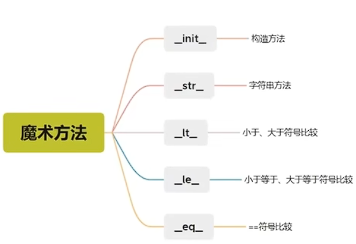

：

## 1.  **定义类**：
使用 `class` 关键字来定义一个类。

    ```python
    class MyClass:
        pass
    ```

## 2.  **属性**：
类可以拥有属性，这些属性可以是数据或方法。

    ```python
    class Person:
        species = "Homo sapiens"  # 类属性

        def __init__(self, name, age):
            self.name = name  # 实例属性
            self.age = age
    ```

## 3.  **方法**：
类可以定义方法，这些方法可以访问和修改类的属性。(self 参数用于访问类的属性)必须要写·

    ```python
    class Person:
        a=1
        def __init__(self, name, age):
            self.name = name
            self.age = age

        def greet(self):
            print(f"Hello, my name is {self.name} and I am {self.age} years old.")
    ```

## 4.  **构造器和析构器**：
`__init__` 是构造器，用于初始化新创建的对象。`__del__` 是析构器，用于在对象被销毁时执行清理工作。

```python
class Person:
    def __init__(self, name, age):
        # 构造方法也可以用 self.name = name这种方式来定义成员变量
        self.name = name
        self.age = age
        print(f"A new person created: {name}, {age}")# 构造器
    def __del__(self):
        print("A person is being destroyed.")
```

## 5.  **继承**：
一个类可以继承另一个类的属性和方法。
```python
# 父类是 Person(多继承就是多个父类)
# 多继承用逗号隔开如：class Employee(Person, Person2)
class Employee(Person):
    def __init__(self, name, age, employee_id):
        super().__init__(name, age)
        self.employee_id = employee_id
    def show_employee_id(self):
        print(f"Employee ID: {self.employee_id}")
    def greet(self):
        pass
```
pass 关键字表示空的意思(占位符)，不写任何代码。
### 复写
子类可以复写父类的属性或方法，复写后，子类会覆盖父类的同名属性或方法。
```python
class Employee(Person):
    a=2 # 复写父类属性
    def __init__(self, name, age, employee_id):
        super().__init__(name, age)
        self.employee_id = employee_id
        print(f"A new employee created: {name}, {age}, {employee_id}")
        # 复写父类方法
    def greet(self):
        print(f"Name: {self.name}")
        print(f"Employee ID: {self.employee_id}")
        print("Employee Name: " + self.name)
        print("Employee ID: " + self.employee_id)
```    

### 调用父类方法和属性
方式1：
    - 使用父类方法：父类名.方法名(self)
    - 使用父类属性：父类名.成员变量
方式2：
    - 使用父类方法：super().方法名()
    - 调用父类属性：super().成员变量
  
```python
class Employee(Person):
    def __init__(self, name, age, employee_id):
        super().__init__(name, age)
        self.employee_id = employee_id
        print(f"A new employee created: {name}, {age}, {employee_id}")
    def greet(self):
        super().greet()
        print(f"Employee ID: {self.employee_id}")
        print("Employee Name: " + self.name)
        print("Employee ID: " + self.employee_id)
        print("Employee Name: " + Person.name)
        print("Employee ID: " + Person.age)
        print("Employee Name: " + Person.age)
```

## 6.  **多态**：
允许不同类的对象对同一消息做出响应，但具体的方式取决于对象的实际类型。

```python
class Animal:
    def speak(self):
        pass
class Dog(Animal):
    def speak(self):
        return "Woof!"
class Cat(Animal):
    def speak(self):
        return "Meow!"
# 创建对象
dog = Dog()
cat = Cat()
ani = Animal()
# 多态
ani=dog
print(ani.speak())  # 输出:Woof!
```

## 7.  **类方法和静态方法**：
类方法使用 `@classmethod` 装饰器，它们的第一个参数是类本身（通常命名为 `cls`）。静态方法使用 `@staticmethod` 装饰器，它们不接收类或实例的引用作为第一个参数。

    ```python
    class MyClass:
        @classmethod
        def class_method(cls):
            print(f"This is a class method of {cls}")

        @staticmethod
        def static_method():
            print("This is a static method.")
    ```

## 8.  **私有属性和方法**：
使用双下划线 `__` 开头的属性或方法被视为私有的，它们不应该被类的外部直接访问。

    ```python
    class Person:
        def __init__(self):
            self.__age = 0  # 私有属性

        def get_age(self):  # 公开的访问器方法
            return self.__age
    ```

类是 Python 中实现封装、继承和多态等面向对象特性的基础。通过使用类，你可以创建灵活且可重用的代码。

## 9.魔术方法
像 `__init__` 这样的方法被称为魔术方法，它们是 Python 中预定义的特殊方法。

### _str_字符串方法
`__str__` 方法返回一个字符串，当对象被转换为字符串时，该方法会被调用。

```python
class student:
    def _init_(self, name, age):
        self.name = name
        self.age = age
    def _str_(self):
        return f"student类对象,name={self.name},age={self.age}
student = student("周杰轮”，11)
print(student)
# 结果:student类对象，name=周杰轮，age=11
print(str(student))#结果:student类对象，name=周杰轮，age=11
```
上面代码中如果没有 `__str__` 方法，那么输出会是 `student object`（内存地址），如果有了 `__str__` 方法，那么输出就是 `student类对象，name=周杰轮，age=11`。

### __lt__ 小于(大于其实就是反过来所以大于也是这个)
```python
class student:
    def _init_(self, name, age):
        self.name = name
        self.age = age
    def __lt__(self, other):
        return self.age < other.age

stul= student("周杰轮"，11)
stu2= student("林军杰"，13)
print(stul < stu2)
#结果:True
print(stul>stu2)
# 结果:Falue
```
上例中，`__lt__` 方法用于比较两个学生对象的年龄大小。如果没有 `__lt__` 方法，那么比较会报错

### __le__ 小于等于(大于等于同理)
```python
class student:
    def _init_(self, name, age):
        self.name = name
        self.age = age
    def __le__(self, other):
        return self.age <= other.age
        stul= student("周杰轮"，11)
        stu2= student("林军杰"，13)
        print(stul <= stu2)
        #结果:True
        print(stul>=stu2)
        # 结果:Falue
```

### __eq__ 等于
```python
class student:
    def _init_(self, name, age):
        self.name = name
        self.age = age
    def __eq__(self, other):
        return self.age == other.age
stul= student("周杰轮"，11)
stu2= student("林军杰"，13)
print(stul == stu2)
#结果:False
print(stul == stul)
# 结果:True
print(stul != stu2)
# 结果:True
print(stul != stul)
# 结果:False
print(stul is stul)
