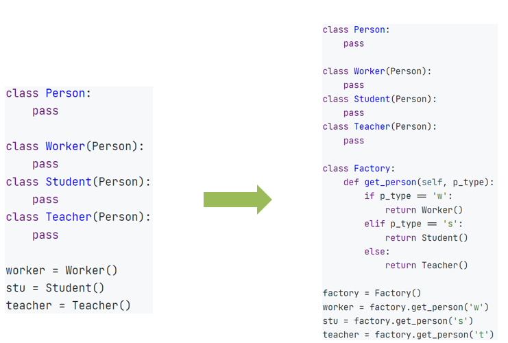

## 闭包
在函数嵌套的前提下，内部函数使用了外部函数的变量，并且外部函数返回了内部函数，我们把这个使用外部函数变量的内部函数称为闭包。


---

### 简单闭包


### 修改外部函数变量值


### 闭包注意事项
优点，使用闭包可以让我们得到：
- 无需定义全局变量即可实现通过函数，持续的访问、修改某个值
- 闭包使用的变量的所用于在函数内，难以被错误的调用修改

缺点：
- 由于内部函数持续引用外部函数的值，所以会导致这一部分内存空间不被释放，一直占用内存
### 总结
1. 什么是闭包
   定义双层嵌套函数， 内层函数可以访问外层函数的变量
   将内存函数作为外层函数的返回，此内层函数就是闭包函数
2. 闭包的好处和缺点
   优点：不定义全局变量，也可以让函数持续访问和修改一个外部变量
   优点：闭包函数引用的外部变量，是外层函数的内部变量。作用域封闭难以被误操作修改
   缺点：额外的内存占用
3. nonlocal关键字的作用
   在闭包函数（内部函数中）想要修改外部函数的变量值
   需要用nonlocal声明这个外部变量


## 装饰器
装饰器其实也是一种闭包， 其功能就是在**不破坏目标函数原有的代码和功能的前提下，为目标函数增加新功能**。

### 装饰器一般写法（闭包写法）


### 装饰器的语法糖写法


### 总结
1. 什么是装饰器
   装饰器就是使用创建一个闭包函数，在闭包函数内调用目标函数。
   可以达到不改动目标函数的同时，增加额外的功能。
2. 装饰器的写法:


## 设计模式
### 单例模式

设计模式是一种编程套路，可以极大的方便程序的开发。
最常见、最经典的设计模式，就是我们所学习的面向对象了。

除了面向对象外，在编程中也有很多既定的套路可以方便开发，我们称之为设计模式：
- 单例、工厂模式
- 建造者、责任链、状态、备忘录、解释器、访问者、观察者、中介、模板、代理模式
- 等等模式

设计模式非常多，我们主要挑选了2个经常用到的进行讲解。


单例模式（Singleton Pattern）是一种常用的软件设计模式，该模式的主要目的是确保某一个类只有一个实例存在。
在整个系统中，某个类只能出现一个实例时，单例对象就能派上用场。
定义: 保证一个类只有一个实例,并提供一个访问它的全局访问点
适用场景:当一个类只能有一个实例，而客户可以从一个众所周知的访问点访问它时。

单例的实现模式：


---

### 工厂模式
当需要大量创建一个类的实例的时候， 可以使用工厂模式。
即，从原生的使用类的构造去创建对象的形式
迁移到，基于工厂提供的方法去创建对象的形式。



<div style="float: left; width: 50%; padding: 10px;">


</div>

<div style="float: right; width: 50%; padding: 10px;">
  使用工厂类的get_person()方法去创建具体的类对象

优点：
- 大批量创建对象的时候有统一的入口，易于代码维护
- 当发生修改，仅修改工厂类的创建方法即可
- 符合现实世界的模式，即由工厂来制作产品（对象）
</div>

<div style="clear: both;"></div>

### 总结
1. 什么是工厂模式
   将对象的创建由使用原生类本身创建
   转换到由特定的工厂方法来创建
2. 工厂模式的优点
   - 大量创建对象的时候有统一的入口，易于代码维护
   - 当发生修改，仅修改工厂类的创建方法即可
   - 符合现实世界的模式，即由工厂来制作产品（对象）

## 进程和线程
现代操作系统比如Mac OS X，UNIX，Linux，Windows等，都是支持“多任务”的操作系统。
进程： 就是一个程序，运行在系统之上，那么便称之这个程序为一个运行进程，并分配进程ID方便系统管理。
线程：线程是归属于进程的，一个进程可以开启多个线程，执行不同的工作，是进程的实际工作最小单位。

进程就好比一家公司，是操作系统对程序进行运行管理的单位
线程就好比公司的员工，进程可以有多个线程（员工），是进程实际的工作者

操作系统中可以运行多个进程，即多任务运行
一个进程内可以运行多个线程，即多线程运行

### 并行
并行执行的意思指的是同一时间做不同的工作。
进程之间就是并行执行的，操作系统可以同时运行好多程序，这些程序都是在并行执行。

除了进程外，线程其实也是可以并行执行的。
也就是比如一个Python程序，其实是完全可以做到：
- 一个线程在输出：你好
- 一个线程在输出：Hello
像这样一个程序在同一时间做两件乃至多件不同的事情， 我们就称之为：多线程并行执行

## 多线程
### threading模块
绝大多数编程语言，都允许多线程编程，Pyhton也不例外。
Python的多线程可以通过threading模块来实现。


```python
"""
演示多线程编程的使用
"""
import time
import threading

def sing(msg):
    while True:
        print(msg)
        time.sleep(1)


def dance(msg):
    while True:
        print(msg)
        time.sleep(1)


if __name__ == '__main__':
    # 创建一个唱歌的线程
    sing_thread = threading.Thread(target=sing, args=("我要唱歌 哈哈哈", ))
    # 创建一个跳舞的线程
    dance_thread = threading.Thread(target=dance, kwargs={"msg": "我在跳舞哦 啦啦啦"})

    # 让线程去干活吧
    sing_thread.start()
    dance_thread.start()

```

## 网络编程
### socket
socket (简称 套接字) 是进程之间通信一个工具，好比现实生活中的插座，所有的家用电器要想工作都是基于插座进行，进程之间想要进行网络通信需要socket。

Socket负责进程之间的网络数据传输，好比数据的搬运工。

### 服务端和客户端
2个进程之间通过Socket进行相互通讯，就必须有服务端和客户端

Socket服务端：等待其它进程的连接、可接受发来的消息、可以回复消息
Socket客户端：主动连接服务端、可以发送消息、可以接收回复


### soket服务端编程
主要分为如下几个步骤：
1. 创建socket对象


2. 绑定socket_server到指定IP和地址（这一步决定它是服务端）


3.  服务端开始监听端口


4.  接收客户端连接，获得连接对象


```python
"""
演示Socket服务端开发
"""
import socket
# 创建Socket对象
socket_server = socket.socket()
# 绑定ip地址和端口
socket_server.bind(("localhost", 8888))
# 监听端口
socket_server.listen(1)
# listen方法接受一个整数传参，表示接受的连接数量

# 等待客户端链接
# result = socket_server.accept()
# conn = result[0]        # conn表示客户端的链接对象
# address = result[1]     # address表示客户端的ip地址和端口号

conn , address = socket_server.accept()
# accept方法返回的是二元元组（链接对象，客户端地址信息）
# 可以通过 变量1，变量2 = socket.accept() 来接受返回值
# accept方法会阻塞程序，直到有客户端链接
print(f"接受到了客户端的连接，客户端地址信息为：{address}")
while True:
    # 接受客户端信息，要使用客户端和服务器的连接对象而非socket_server对象
    data: str = conn.recv(1024).decode("UTF-8")  # 接受客户端发送的数据
    # recv方法接受一个整数传参，表示接受的字节数（缓冲区大小）
    # 返回值是字节数组，不是字符串，可以通过decode方法转换为字符串
    print(f"客户端发送的数据为：{data}")
    if data == "exit":
        break
    # 发送回复消息
    msg = input("请输入回复消息：").encode("UTF-8")
    conn.send(msg)

# 关闭链接
conn.close()
socket_server.close()

```

### socket客户端编程
主要分为如下几个步骤：
1. 创建socket对象

2. 

2. 连接到服务端


3. 发送消息


4. 接收返回消息


5. 关闭链接

