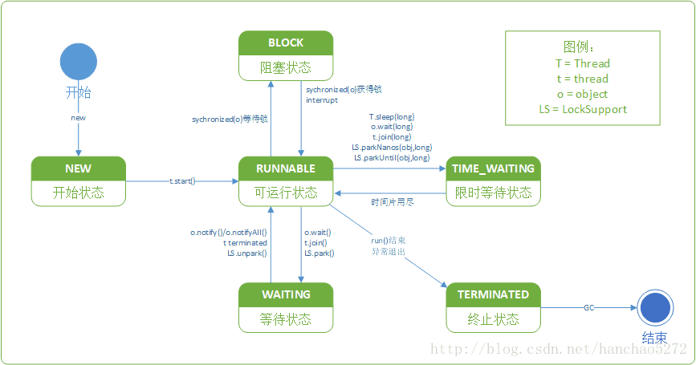

关于Java线程的状态，都规定在了

```java
public enum State {
   /**
     * Thread state for a thread which has not yet started.
     */
    NEW,

    /**
     * Thread state for a runnable thread.  A thread in the runnable
     * state is executing in the Java virtual machine but it may
     * be waiting for other resources from the operating system
     * such as processor.
     */
    RUNNABLE,

    /**
     * Thread state for a thread blocked waiting for a monitor lock.
     * A thread in the blocked state is waiting for a monitor lock
     * to enter a synchronized block/method or
     * reenter a synchronized block/method after calling
     * {@link Object#wait() Object.wait}.
     */
    BLOCKED,

    /**
     * Thread state for a waiting thread.
     * A thread is in the waiting state due to calling one of the
     * following methods:
     * <ul>
     *   <li>{@link Object#wait() Object.wait} with no timeout</li>
     *   <li>{@link #join() Thread.join} with no timeout</li>
     *   <li>{@link LockSupport#park() LockSupport.park}</li>
     * </ul>
     *
     * <p>A thread in the waiting state is waiting for another thread to
     * perform a particular action.
     *
     * For example, a thread that has called <tt>Object.wait()</tt>
     * on an object is waiting for another thread to call
     * <tt>Object.notify()</tt> or <tt>Object.notifyAll()</tt> on
     * that object. A thread that has called <tt>Thread.join()</tt>
     * is waiting for a specified thread to terminate.
     */
    WAITING,

    /**
     * Thread state for a waiting thread with a specified waiting time.
     * A thread is in the timed waiting state due to calling one of
     * the following methods with a specified positive waiting time:
     * <ul>
     *   <li>{@link #sleep Thread.sleep}</li>
     *   <li>{@link Object#wait(long) Object.wait} with timeout</li>
     *   <li>{@link #join(long) Thread.join} with timeout</li>
     *   <li>{@link LockSupport#parkNanos LockSupport.parkNanos}</li>
     *   <li>{@link LockSupport#parkUntil LockSupport.parkUntil}</li>
     * </ul>
     */
    TIMED_WAITING,

    /**
     * Thread state for a terminated thread.
     * The thread has completed execution.
     */
    TERMINATED;
}12345678910111213141516171819202122232425262728293031323334353637383940414243444546474849505152535455565758596061626364
```

## 从源代码，总结出Java线程的状态有以下几种：

- **NEW**

：一个尚未启动的线程的状态。也称之为

**初始状态、开始状态**

- **RUNNABLE**

：一个可以运行的线程的状态，可以运行是指这个线程

已经在JVM中运行了，但是有可能正在等待其他的系统资源。也称之为

**就绪状态、可运行状态**

- **BLOCKED**

：一个线程因为等待监视锁而被阻塞的状态。也称之为

**阻塞状态**

- **WAITING**

：一个正在等待的线程的状态。也称之为

**等待状态**

- **TIMED_WAITING**

：一个在限定时间内等待的线程的状态。也称之为

**限时等待状态**

- **TERMINATED**

：一个完全运行完成的线程的状态。也称之为

**终止状态、结束状态**

根据



有些文章中的流程图与我这个流程图有很大区别，他们的流程可能包括：New、Runnable、Running、Blocked。本人也不能肯定谁对谁错，我只是按照源代码即注释进行学习。如果有不对的地方，请多多指教。

为了验证上面论述的状态即状态转换的正确性，也为了加深对线程状态转换的理解，下面通过四个实例进行练习。

这个简单，直接上代码：

```java
//线程的六种状态
LOGGER.info("======线程的六种状态======");
LOGGER.info("线程-初始状态：" + Thread.State.NEW);
LOGGER.info("线程-就绪状态：" + Thread.State.RUNNABLE);
LOGGER.info("线程-阻塞状态：" + Thread.State.BLOCKED);
LOGGER.info("线程-等待状态：" + Thread.State.WAITING);
LOGGER.info("线程-限时等待状态：" + Thread.State.TIMED_WAITING);
LOGGER.info("线程-终止状态：" + Thread.State.TERMINATED + "\n");12345678
```

**运行结果：**

```
2018-03-12 21:00:28 INFO  ThreadStateDemo:22 - ======线程的六种状态======
2018-03-12 21:00:28 INFO  ThreadStateDemo:23 - 线程-初始状态：NEW
2018-03-12 21:00:28 INFO  ThreadStateDemo:24 - 线程-就绪状态：RUNNABLE
2018-03-12 21:00:28 INFO  ThreadStateDemo:25 - 线程-阻塞状态：BLOCKED
2018-03-12 21:00:28 INFO  ThreadStateDemo:26 - 线程-等待状态：WAITING
2018-03-12 21:00:28 INFO  ThreadStateDemo:27 - 线程-限时等待状态：TIMED_WAITING
2018-03-12 21:00:28 INFO  ThreadStateDemo:28 - 线程-终止状态：TERMINATED1234567
```

上面的运行结果，证明线程的状态确实是前面论述的六种。

**需求：**

编写一段代码，依次显示一个线程的这些状态：NEW->RUNNABLE->TIME_WAITING->RUNNABLE->TERMINATED。

**分析：**

根据之前章节的学习，很容分析得到：

- NEW：一个线程新new出来，但是还未start()的状态。

- RUNNABLE：一个线程调用了start()之后的状态。

- TIME_WAITING：一个线程通过Thread.sleep(long)进入限时休眠的状态。

- RUNNABLE：Thread.sleep(long)的时间片用完，线程解除限时休眠的状态。

- TERMINATED：一个线程运行完run()方法的状态。

**代码：**

```java
//线程状态间的状态转换：NEW->RUNNABLE->TIME_WAITING->RUNNABLE->TERMINATED
LOGGER.info("======线程状态间的状态转换NEW->RUNNABLE->TIME_WAITING->RUNNABLE->TERMINATED======");
//定义一个内部线程
Thread thread = new Thread(() -> {
    LOGGER.info("2.执行thread.start()之后，线程的状态：" + Thread.currentThread().getState());
    try {
        //休眠100毫秒
        Thread.sleep(100);
    } catch (InterruptedException e) {
        e.printStackTrace();
    }
    LOGGER.info("4.执行Thread.sleep(long)完成之后，线程的状态：" + Thread.currentThread().getState());
});
//获取start()之前的状态
LOGGER.info("1.通过new初始化一个线程，但是还没有start()之前，线程的状态：" + thread.getState());
//启动线程
thread.start();
//休眠50毫秒
Thread.sleep(50);
//因为thread1需要休眠100毫秒，所以在第50毫秒，thread1处于sleep状态
LOGGER.info("3.执行Thread.sleep(long)时，线程的状态：" + thread.getState());
//thread1和main线程主动休眠150毫秒，所以在第150毫秒,thread1早已执行完毕
Thread.sleep(100);
LOGGER.info("5.线程执行完毕之后，线程的状态：" + thread.getState() + "\n");123456789101112131415161718192021222324
```

**运行结果：**

```
2018-03-12 21:00:28 INFO  ThreadStateDemo:32 - ======线程状态间的状态转换NEW->RUNNABLE->TIME_WAITING->RUNNABLE->TERMINATED======
2018-03-12 21:00:29 INFO  ThreadStateDemo:45 - 1.通过new初始化一个线程，但是还没有start()之前，线程的状态：NEW
2018-03-12 21:00:29 INFO  ThreadStateDemo:35 - 2.执行thread.start()之后，线程的状态：RUNNABLE
2018-03-12 21:00:29 INFO  ThreadStateDemo:51 - 3.执行Thread.sleep(long)时，线程的状态：TIMED_WAITING
2018-03-12 21:00:29 INFO  ThreadStateDemo:42 - 4.执行Thread.sleep(long)完成之后，线程的状态：RUNNABLE
2018-03-12 21:00:29 INFO  ThreadStateDemo:54 - 5.线程执行完毕之后，线程的状态：TERMINATED123456
```

**需求：**

编写一段代码，依次显示一个线程的这些状态：NEW->RUNNABLE->WAITING->RUNNABLE->TERMINATED。

**分析：**

根据之前章节的学习，很容分析得到：

- NEW：一个线程新new出来，但是还未start()的状态。

- RUNNABLE：一个线程调用了start()之后的状态。

- WAITING：一个线程通过object.wait()进入等待的状态。

- RUNNABLE：另一个线程通过object.notify()唤醒了开始的线程，第一个线程解除等待的状态。

- TERMINATED：一个线程运行完run()方法的状态。

**代码：**

```java
//线程状态间的状态转换：NEW->RUNNABLE->WAITING->RUNNABLE->TERMINATED
LOGGER.info("======线程状态间的状态转换NEW->RUNNABLE->WAITING->RUNNABLE->TERMINATED======");
//定义一个对象，用来加锁和解锁
AtomicBoolean obj = new AtomicBoolean(false);
//定义一个内部线程
Thread thread1 = new Thread(() -> {
    LOGGER.info("2.执行thread.start()之后，线程的状态：" + Thread.currentThread().getState());
    synchronized (obj) {
        try {
            //thread1需要休眠100毫秒
            Thread.sleep(100);
            //thread1100毫秒之后，通过wait()方法释放obj对象是锁
            obj.wait();
        } catch (InterruptedException e) {
            e.printStackTrace();
        }
    }
    LOGGER.info("4.被object.notify()方法唤醒之后，线程的状态：" + Thread.currentThread().getState());
});
//获取start()之前的状态
LOGGER.info("1.通过new初始化一个线程，但是还没有start()之前，线程的状态：" + thread1.getState());
//启动线程
thread1.start();
//main线程休眠150毫秒
Thread.sleep(150);
//因为thread1在第100毫秒进入wait等待状态，所以第150秒肯定可以获取其状态
LOGGER.info("3.执行object.wait()时，线程的状态：" + thread1.getState());
//声明另一个线程进行解锁
new Thread(() -> {
    synchronized (obj) {
        //唤醒等待的线程
        obj.notify();
    }
}).start();
//main线程休眠10毫秒等待thread1线程能够苏醒
Thread.sleep(10);
//获取thread1运行结束之后的状态
LOGGER.info("5.线程执行完毕之后，线程的状态：" + thread1.getState() + "\n");1234567891011121314151617181920212223242526272829303132333435363738
```

**运行结果：**

```
2018-03-12 21:00:29 INFO  ThreadStateDemo:59 - ======线程状态间的状态转换NEW->RUNNABLE->WAITING->RUNNABLE->TERMINATED======
2018-03-12 21:00:29 INFO  ThreadStateDemo:78 - 1.通过new初始化一个线程，但是还没有start()之前，线程的状态：NEW
2018-03-12 21:00:29 INFO  ThreadStateDemo:64 - 2.执行thread.start()之后，线程的状态：RUNNABLE
2018-03-12 21:00:29 INFO  ThreadStateDemo:84 - 3.执行object.wait()时，线程的状态：WAITING
2018-03-12 21:00:29 INFO  ThreadStateDemo:75 - 4.被object.notify()方法唤醒之后，线程的状态：RUNNABLE
2018-03-12 21:00:29 INFO  ThreadStateDemo:95 - 5.线程执行完毕之后，线程的状态：TERMINATED123456
```

**需求：**

编写一段代码，依次显示一个线程的这些状态：NEW->RUNNABLE->BLOCKED->RUNNABLE->TERMINATED。

**分析：**

根据之前章节的学习，很容分析得到：

- NEW：一个线程新new出来，但是还未start()的状态。

- RUNNABLE：一个线程调用了start()之后的状态。

- BLOCKED：一个线程因为等待object上的对象锁，而进入阻塞的状态。

- RUNNABLE：另一个对象释放了object上的对象所，第一个线程解除阻塞的状态。

- TERMINATED：一个线程运行完run()方法的状态。

**代码：**

```java
//线程状态间的状态转换：NEW->RUNNABLE->BLOCKED->RUNNABLE->TERMINATED
LOGGER.info("======线程状态间的状态转换NEW->RUNNABLE->BLOCKED->RUNNABLE->TERMINATED======");
//定义一个对象，用来加锁和解锁
AtomicBoolean obj2 = new AtomicBoolean(false);
//定义一个线程，先抢占了obj2对象的锁
new Thread(() -> {
    synchronized (obj2) {
        try {
            //第一个线程要持有锁100毫秒
            Thread.sleep(100);
            //然后通过wait()方法进行等待状态，并释放obj2的对象锁
            obj2.wait();
        } catch (InterruptedException e) {
            e.printStackTrace();
        }
    }
}).start();
//定义目标线程，获取等待获取obj2的锁
Thread thread3 = new Thread(() -> {
    LOGGER.info("2.执行thread.start()之后，线程的状态：" + Thread.currentThread().getState());
    synchronized (obj2) {
        try {
            //thread3要持有对象锁100毫秒
            Thread.sleep(100);
            //然后通过notify()方法唤醒所有在ojb2上等待的线程继续执行后续操作
            obj2.notify();
        } catch (InterruptedException e) {
            e.printStackTrace();
        }
    }
    LOGGER.info("4.阻塞结束后，线程的状态：" + Thread.currentThread().getState());
});
//获取start()之前的状态
LOGGER.info("1.通过new初始化一个线程，但是还没有thread.start()之前，线程的状态：" + thread3.getState());
//启动线程
thread3.start();
//先等100毫秒
Thread.sleep(50);
//第一个线程释放锁至少需要100毫秒，所以在第50毫秒时，thread3正在因等待obj的对象锁而阻塞
LOGGER.info("3.因为等待锁而阻塞时，线程的状态：" + thread3.getState());
//再等300毫秒
Thread.sleep(300);
//两个线程的执行时间加上之前等待的50毫秒以供250毫秒，所以第300毫秒，所有的线程都已经执行完毕
LOGGER.info("5.线程执行完毕之后，线程的状态：" + thread3.getState());1234567891011121314151617181920212223242526272829303132333435363738394041424344
```

**运行结果：**

```
2018-03-12 21:00:29 INFO  ThreadStateDemo:100 - ======线程状态间的状态转换NEW->RUNNABLE->BLOCKED->RUNNABLE->TERMINATED======
2018-03-12 21:00:29 INFO  ThreadStateDemo:132 - 1.通过new初始化一个线程，但是还没有thread.start()之前，线程的状态：NEW
2018-03-12 21:00:29 INFO  ThreadStateDemo:118 - 2.执行thread.start()之后，线程的状态：RUNNABLE
2018-03-12 21:00:29 INFO  ThreadStateDemo:138 - 3.因为等待锁而阻塞时，线程的状态：BLOCKED
2018-03-12 21:00:29 INFO  ThreadStateDemo:129 - 4.阻塞结束后，线程的状态：RUNNABLE
2018-03-12 21:00:29 INFO  ThreadStateDemo:142 - 5.线程执行完毕之后，线程的状态：TERMINATED123456
```

通过分析四个代码实例，证明，开始章节说所述的线程状态以及线程状态转换都是正确的。