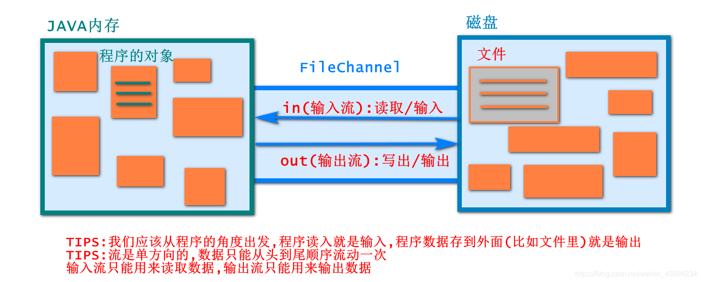
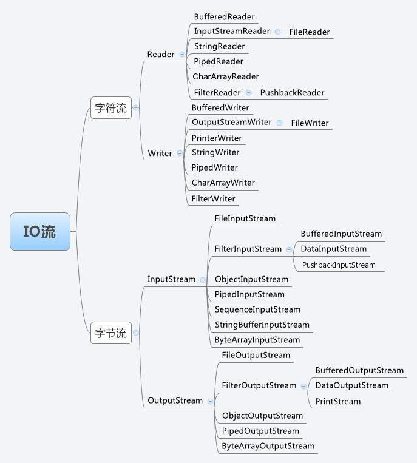
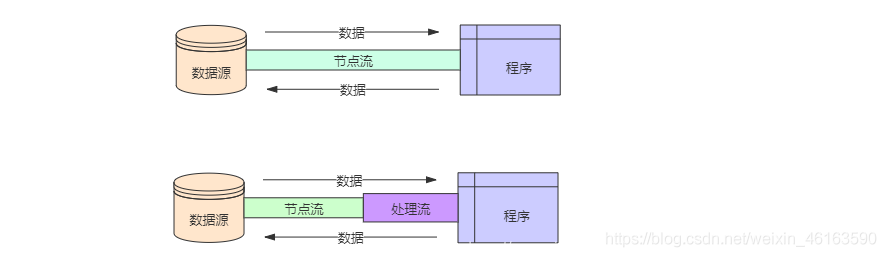
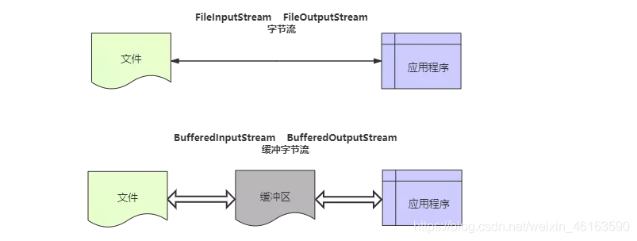

[TOC]

# 流Stream

在学习IO流之前,我们首先需要学习的概念就是Stream流
为了方便理解,我们可以把数据的读写操作抽象成数据在"管道"中流动,但需注意:
1.流只能单方向流动
2.输入流用来读取 → in
3.输出流用来写出 → out
4.数据只能从头到尾顺序的读写一次
所以以程序的角度来思考,In/out 相对于程序而言的输入(读取)/输出(写出)的过程.

| 分类    | 字节输入流               | 字节输出流                | 字符输入流            | 字符输出流             |
| :---- | :------------------ | :------------------- | :--------------- | :---------------- |
| 抽象基类  | InputSteam          | OutputSteam          | Reader           | Writer            |
| 访问文件  | FileInputSteam      | FileOutputSteam      | FileReader       | FileWriter        |
| 访问数组  | ByteArrayInputSteam | ByteArrayOutputSteam | CharArrayReader  | CharArrayWrite    |
| 访问管道  | PipedInputSteam     | pipedOutputSteam     | PipedReader      | PipedWriter       |
| 访问字符串 |                     |                      | StringReader     | StringWriter      |
| 缓冲流   | BufferedInputSteam  | BufferedOutputSteam  | BufferedReader   | BufferedWrite     |
| 转换流   |                     |                      | InputSteamReader | OutputSteamWriter |
| 对象流   | ObjectInputSteam    | ObjectOutputSteam    |                  |                   |
|       | FilterInputSteam    | FilterOutputSteam    | FilterReader     | FilterWriter      |
| 打印流   |                     | PrintSteam           |                  | PrintWrite        |
| 推回输入流 | PushbackInputSteam  |                      | PushbackReader   |                   |
| 特殊流   | DataInputSteam      | DataOutputSteam      |                  |                   |

# io的继承结构

## 1.主流分类

*   按照方向进行分类:输入流输出流(相对于程序而言,从程序写数据到文件中是输出)
*   按照传输类型进行分类:字节流 字符流
*   组合: 字节输入流 字节输出流 字符输入流 字符输出流

## 2.学习方法:在抽象父类中学习通用的方法,在子类中学习如何创建对象

## 3.字节输入流:

> \--FileInputStream 子类,操作文件的字节输入流,普通类
> \--BufferedInputStream 子类,缓冲字节输入流,普通类

### 常用方法

#### InputSteam抽象类

> abstract int read() 从输入流中读取数据的下一个字节（返回-1读取失败）
> int read(byte\[] b) 从输入流中读取一定数量的字节，并将其存储在缓冲区数组 b 中
> int read(byte\[] b, int off, int len) 将输入流中最多 len 个数据字节读入 byte 数组,off表示存时的偏移量
> void close() 关闭此输入流并释放与该流关联的所有系统资源
> InputStream 抽象类,不能new,可以作为超类,学习其所提供的共性方法

#### FileInputStream子类

> 创建对象
> FileInputStream(File file)—直接传文件对象
> 通过打开一个到实际文件的连接来创建一个 FileInputStream，该文件通过文件系统中的 File 对象 file 指定FileInputStream(String pathname)—传路径
> 通过打开一个到实际文件的连接来创建一个 FileInputStream，该文件通过文件系统中的路径名 name 指定

#### BufferedInputStream子类

> 创建对象
> BufferedInputStream(InputStream in)
> 创建一个 BufferedInputStream 并保存其参数，即输入流 in，以便将来使用。

## 4.字符输入流

> Reader 抽象类,不能new,可以作为超类,学习其所提供的共性方法
> \--FileReader,子类,操作文件的字符输入流,普通类
> \--BufferedReader,子类,缓冲字符输入流,普通类

### 常用方法

#### Reader抽象类

> 常用方法：
> int read() 读取单个字符
> int read(char\[] cbuf) 将字符读入数组
> abstract int read(char\[] cbuf, int off, int len) 将字符读入数组的某一部分
> int read(CharBuffer target) 试图将字符读入指定的字符缓冲区
> abstract void close() 关闭该流并释放与之关联的所有资源

#### FileReader子类

> 创建对象
> FileReader(String fileName) 在给定从中读取数据的文件名的情况下创建一个新 FileReader
> FileReader(File file) 在给定从中读取数据的 File 的情况下创建一个新 FileReader

#### BufferedReader子类

> 创建对象
> BufferedReader(Reader in) 创建一个使用默认大小输入缓冲区的缓冲字符输入流

## 5.字节输出流:

> OutputStream 抽象类,不能new,可以作为超类,学习其所提供的共性方法
> \--FileOutputStream 子类,操作文件的字节输出流,普通类
> \--BufferedOutputStream 子类,缓冲字节输出流,普通类

### 常用方法

#### OutputStream抽象类

> Void close() 关闭此输出流并释放与此流相关的所有系统资源
> Void flush() 刷新此输出流并强制写出所有缓冲的输出字节
> Void write(byte\[ ] b) 将b.length个字节从指定的byte数组写入此输出流
> Void write(byte\[ ] b,int off ,int len) 将指定byte数组中从偏移量off开始的len个字节写入输出流
> Abstract void write(int b) 将指定的字节写入此输出流

#### FileOutputStream 子类

> 构造方法(创建对象):
> FileOutputStream(String name)
> 创建一个向具有指定名称的文件中写入数据的文件输出流
> FileOutStream(File file)
> 创建一个向指定File对象表示的文件中写入数据的文件输出流
> FileOutStream(File file,boolean append)—如果第二个参数为true,表示追加,不覆盖
> 创建一个向指定File对象表示的文件中写入数据的文件输出流,后面的参数是指是否覆盖原文件内容

#### BufferedOutputstream 子类

> 构造方法(创建对象):
> BufferedOutputStream(OutputStream out)
> 创建一个新的缓冲输出流,用以将数据写入指定的底层输出流

## 6.字符输出流

> Writer 抽象类,不能new,可以作为超类,学习其所提供的共性方法
> \--FileWriter,子类,操作文件的字符输出流,普通类
> \--BufferedWriter,子类,缓冲字符输出流,普通类

### 常用方法

#### Writer 抽象类

常用方法:

> Abstract void close() 关闭此流,但要先刷新它
> Void write(char\[ ] cbuf) 写入字符数组
> Void write(int c) 写入单个字符
> Void write(String str) 写入字符串
> Void write(String str,int off,int len) 写入字符串的某一部分
> Abstract void write(char\[] cbuf,int off,int len)写入字符数组的某一部分

#### FileWriter 子类

> 构造方法(创建对象):
> FileWriter(String filename)
> 根据给定的文件名构造一个FileWriter对象
> FileWriter(String filename,boolean append)
> 根据给定的文件名以及指示是否附加写入数据的boolean值来构造FileWriter

#### BufferedWriter子类

> 构造方法(创建对象):
> BufferedWriter(Writer out)
> 创建一个使用默认大小输出缓冲区的缓冲字符输出流

## 7.转化流

**转换流概述与 InputStreamReader 的使用。 转换流提供了在字节流和字符流之间的转换 Java API 提供了两个转换流：**

> InputStreamReader：将 InputStream 转换为 Reader 实现将字节的输入流按指定字符集转换为字符的输入流。 需要和 InputStream“套接”。 构造器：
>
> > public InputStreamReader(InputStreamin) public InputSreamReader(InputStreamin,StringcharsetName) 如：Reader isr= new InputStreamReader(System.in,”gbk”);

> OutputStreamWriter：将 Writer 转换为 OutputStream
>
> > 实现将字符的输出流按指定字符集转换为字节的输出流。 需要和 OutputStream“套接”。 构造器：
> >
> > > public OutputStreamWriter(OutputStreamout) public OutputSreamWriter(OutputStreamout,StringcharsetName)

## 8.标准输入、输出流、打印流、数据流

### 1.标准输入、输出流

System.in 和 System.out 分别代表了系统标准的输入和 输出设备；
默认输入设备是：键盘，输出设备是：显示器；

> System.in 的类型是 InputStream；
> System.out 的类型是 PrintStream，其是 OutputStream 的子类 FilterOutputStream 的子类；

**重定向：**
通过 System 类的 setIn，setOut 方法对默认设备进行改变。

> public static void setIn(InputStreamin)&#x20;
> public static void setOut(PrintStreamout)&#x20;

### 2.打印流、数据流

打印流：
实现将基本数据类型的数据格式转化为字符串输出；

**打印流：PrintStream 和 PrintWriter；**

> 提供了一系列重载的 print() 和 println() 方法， 用于多种数据类型的输出。
>
> &#x20;·PrintStream 和 PrintWriter 的 输 出 不 会 抛 出 IOException 异常。&#x20;
> ·PrintStream 和 PrintWriter 有自动 flush 功能
> ·PrintStream 打印的所有字符都使用平台的默认字符编码转换为字节。在需要写入字符而不是写入字节 的情况下，应该使用 PrintWriter 类。
> ·System.out 返回的是 PrintStream 的实例。

\*\* 数据流：\*\*

为了方便地操作 Java 语言的基本数据类型和 String 的 数据，可以使用数据流。

数据流有两个类：( 用于读取和写出基本数据类型、 String 类的数据）

·DataInputStream 和 DataOutputStream · 分 别“ 套 接” 在 InputStream 和 OutputStream 子类的流上。

DataInputStream 中的方法：

> boolean readBoolean() 					byte readByte()&#x20;
> char readChar() 								float readFloat()&#x20;
> double readDouble() 						short readShort()&#x20;
> long readLong() 								int readInt()&#x20;
> String readUTF() 								void readFully(byte\[s] b)

DataOutputStream将上述的方法的 read 改为相应的 write 即可

## 9.对象流

### 7.1 对象序列化机制的理解

·ObjectInputStream 和 OjbectOutputSteam。

·用于存储和读取基本数据类型数据或对象的处理流。它的强大之处 就是可以把 Java 中的对象写入到数据源中，也能把对象从数据源中还原回来。

·序列化：用 ObjectOutputStream 类保存基本类型数据或对象的机制。

·反序列化：用 ObjectInputStream 类读取基本类型数据或对象的机制。

·ObjectOutputStream 和 ObjectInputStream 不能序列化 static 和 transient 修饰的成员变量。

·如果需要让某个对象支持序列化机制，则必须让对象所属的类及其 属性是可序列化的，为了让某个类是可序列化的，该类必须实现如下两个接 口之一。否则，会抛出 NotSerializableException 异常。

·Serializable

·Externalizable

### serialVersionUID

serialVersionUID 用来表明类的不同版本间的兼 容性。简言之，其目的是以序列化对象进行版本控制， 有关各版本反序列化时是否兼容。

(InvalidCastException) Person 需要满足如下的要求，方可序列化：

1\. 需要实现接口：Serializable；

2\. 当前类提供一个全局常量：serialVersionUID；

3\. 除了当前 Person 类需要实现 Serializable 接口之外，还必须保证其内 部所有属性。 也必须是可序列化的。（默认情况下，基本数据类型可序列化）

## 10.随机存取文件流

RandomAccessFile 对象包含一个记录指针，用以标示当前 读写处的位置。RandomAccessFile 类对象可以自由移动记 录指针：

> ·long getFilePointer()：获取文件记录指针的当前位置。
>
> &#x20;·void seek(long pos)：将文件记录指针定位到pos位置。

构造器：

> ·public RandomAccessFile(File file, String mode)&#x20;
>
> ·public RandomAccessFile(String name, String mode)

创建 RandomAccessFile 类实例需要指定一个 mode 参数， 该参数指定 RandomAccessFile 的访问模式：

> ·r: 以只读方式打开&#x20;
>
> ·rw：打开以便读取和写入&#x20;
>
> ·rwd: 打开以便读取和写入；同步文件内容的更新
>
> &#x20;·rws: 打开以便读取和写入；同步文件内容和元数据 的更新。

如果模式为只读 r。则不会创建文件，而是会去读取一个 已经存在的文件，如果读取的文件不存在则会出现异常。 如果模式为 rw 读写。如果文件不存在则会去创建文件， 如果存在则不会创建。

## 10.NIO.2 中 Path、Paths、Files 类的使

**Paths 类提供的静态 get() 方法用来获取 Path 对象：**

> ·static Pathget(String first, String … more)：用于将多个字符串串 连成路径。
>
> &#x20;·static Path get(URI uri)：返回指定 uri 对应的 Path 路径

#### **1、Path 接口**

**Path 常用方法**

> ·String toString()：返回调用 Path 对象的字符串表示形式；
>
> &#x20;·boolean startsWith(String path)： 判断是否以 path 路径开始；&#x20;
>
> ·boolean endsWith(String path)：判断是否以 path 路径结束；
>
> &#x20;·boolean isAbsolute()：判断是否是绝对路径；
>
> &#x20;·Path getParent()：返回 Path 对象包含整个路径，不包含 Path 对象指定的文 件路径；
>
> &#x20;·Path getRoot()：返回调用 Path 对象的根路径；&#x20;
>
> ·Path getFileName()：返回与调用 Path 对象关联的文件名；
>
> &#x20;·intgetNameCount()：返回 Path 根目录后面元素的数量；&#x20;
>
> ·Path getName(int idx)：返回指定索引位置 idx 的路径名称；
>
> &#x20;·Path toAbsolutePath()：作为绝对路径返回调用 Path 对象；
>
> &#x20;·Path resolve(Path p)：合并两个路径， 返回台并后的路径对应的 Path 对象；&#x20;
>
> ·File toFile()：将 Path 转化为 File 类的对象。

#### **2、Files 类**

**Files 常用方法：用于判断**

> ·boolean exist(Path path, LinkOption .. opts)：判断文件是否存在&#x20;
>
> ·boolean isDirectory(Path path, LinkOption .. opts)：判断是否是目录&#x20;
>
> ·boolean isRegularFile(Path path, LinkOption .. opts)：判断是否是文件&#x20;
>
> ·boolean isHidden(Path path)：判断是否是隐藏文件&#x20;
>
> ·boolean isReadable(Path path)：判断文件是否可读
>
> &#x20;·boolean isWritable(Path path)：判断文件是否可写&#x20;
>
> ·boolean notExists(Path path, LinkOption .. opts)：判断文件是否不存在

**Files 常用方法 : 用于操作内容**

> ·SeekableByteChannel newByteChannel(Path path, OpenOption..how)： 获取与指定文件的连接，how 指定打开方式。
>
> &#x20;·DirectoryStream newDirectoryStream(Path path)：打开 path 指定 的目录。
>
> &#x20;·InputStream newlnputStream(Path path, OpenOption..how)：获取 InputStream 对象。
>
> &#x20;·OutputStream newOutputStream(Path path, OpenOptin...how)：获取 OutputStream 对象。

**javano.file.Files 用于操作文件或目录的工具类。**

Files 常用方法：

> ·Path copy(Path src, Path dest, CopyOption ... how)：文件的复制； ;
>
> ·Path createDirectory(Path path, FileAttribute .... attr)：创建一个目录；&#x20;
>
> ·Path createFile(Path path, FileAttribute ... arr)：创建一一个文件；&#x20;
>
> ·void delete(Path path)：删除一个文件 / 目录，如果不存在，执行报错；
>
> &#x20;·void deletelfExists(Path path)：Path 对应的文件 / 月录如果存在，执行删除；
>
> &#x20;·Path move(Path sre, Path dest, CopyOption.. .how)：将 src 移动到 dest 位置；
>
> &#x20;·long size(Path path)：返回 path 指定文件的大小。

# ByteArrayOutputStream和ByteArrayInputStream

ByteArrayOutputStream类是在创建它的实例时，程序内部创建一个byte型别数组的缓冲区，然后利用ByteArrayOutputStream和ByteArrayInputStream的实例向数组中写入或读出byte型数据。在网络传输中我们往往要传输很多变量，我们可以利用ByteArrayOutputStream把所有的变量收集到一起，然后一次性把数据发送出去。
具体用法如下:
ByteArrayOutputStream:    可以捕获内存缓冲区的数据，转换成字节数组
可使用toByteArray()和toString()获取数据。
ByteArrayInputStream: 可以将字节数组转化为输入流
\*\* \*\*

