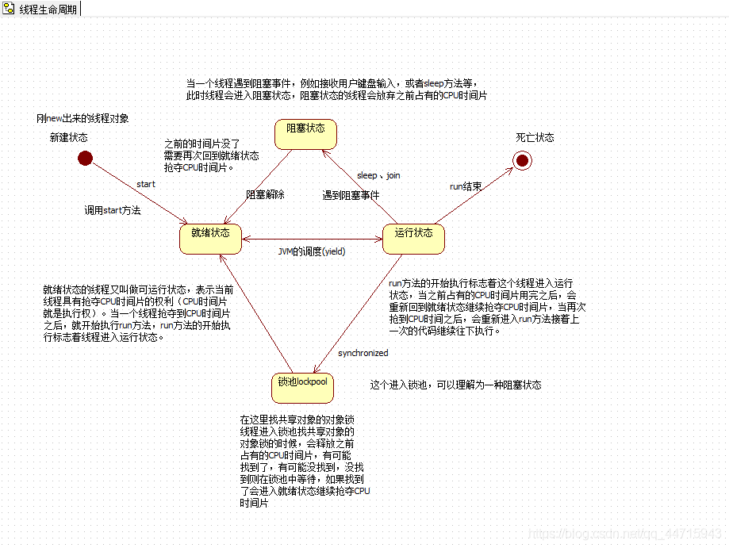
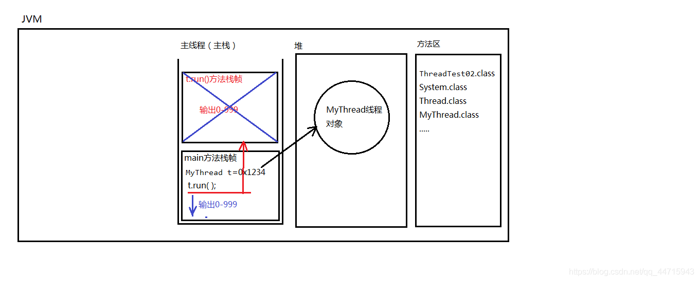
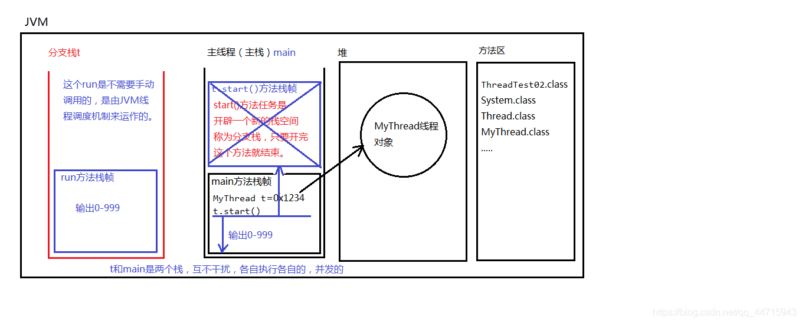
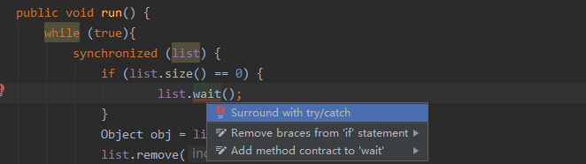
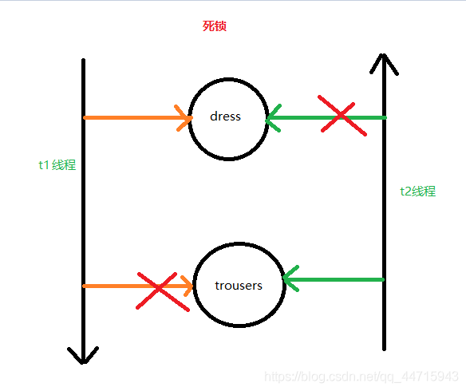
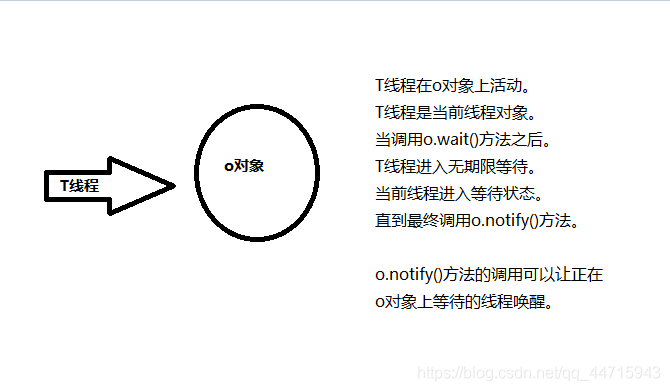
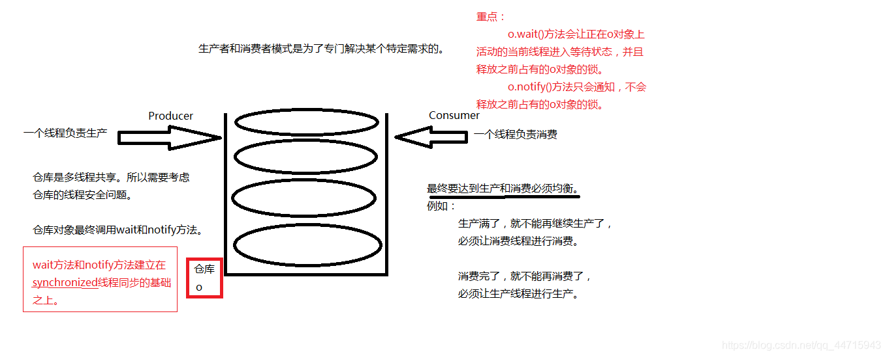

进程是:一个应用程序（1个进程是一个软件）。

线程是：一个进程中的执行场景/执行单元。

注意：

**eg.**

对于java程序来说，当在DOS命令窗口中输入：

java HelloWorld 回车之后。会先启动JVM，而

JVM再启动一个

同时再启动一个

最起码，现在的java程序中至少有两个线程并发，一个是 

**进程**

**线程**

**注意：**

进程A和进程B的 

**eg.**

魔兽游戏是一个进程

酷狗音乐是一个进程

这两个进程是独立的，不共享资源。

在java语言中：

线程A和线程B，

**eg.**

**假设启动10个线程，会有10个栈空间，每个栈和每个栈之间，互不干扰，各自执行各自的，这就是多线程并发。**

**eg.**

火车站，可以看做是一个

火车站中的每一个售票窗口可以看做是一个

我在窗口1购票，你可以在窗口2购票，你不需要等我，我也不需要等你。所以[多线程](https://so.csdn.net/so/search?q=%E5%A4%9A%E7%BA%BF%E7%A8%8B&spm=1001.2101.3001.7020)并发可以提高效率。

java中之所以有多线程机制，目的就是为了 

main方法结束只是主线程结束了，主栈空了，其它的栈(线程)可能还在压栈弹栈。

对于

**单核**

不能够做到真正的多线程并发，但是可以做到给人一种“多线程并发”的感觉。

对于单核的CPU来说，在某一个时间点上实际上只能处理一件事情，但是由于CPU的处理速度极快，多个线程之间频繁切换执行，给别人的感觉是：多个事情同时在做！！！

**eg.**

线程A：播放音乐

线程B：运行魔兽游戏

线程A和线程B频繁切换执行，人类会感觉音乐一直在播放，游戏一直在运行，

给我们的感觉是同时并发的。（因为计算机的速度很快，我们人的眼睛很慢，所以才会感觉是多线程！）

t1线程执行t1的。

t2线程执行t2的。

**t1不会影响t2，t2也不会影响t1**

1. 新建状态

1. 就绪状态

1. 运行状态

1. 阻塞状态

1. 死亡状态



| 构造方法名 | 备注 | 
| -- | -- |
|   |   | 
| Thread() |   | 
| Thread(String name) | name为线程名字 | 
| 创建线程第二种方式 |   | 
| Thread(Runnable target) |   | 
| Thread(Runnable target, String name) | name为线程名字 | 


编写一个类，直接 

1. 怎么创建线程对象？ **new**继承线程的类。

1. 怎么启动线程呢？ 调用线程对象的 **start()** 方法。

**伪代码：**

```java
// 定义线程类
public class MyThread extends Thread{
	public void run(){
	
	}
}
// 创建线程对象
MyThread t = new MyThread();
// 启动线程。
t.start();
12345678910
```

**eg.**

```java
public class ThreadTest02 {
    public static void main(String[] args) {
        MyThread t = new MyThread();
        // 启动线程
        //t.run(); // 不会启动线程，不会分配新的分支栈。（这种方式就是单线程。）
        t.start();
        // 这里的代码还是运行在主线程中。
        for(int i = 0; i < 1000; i++){
            System.out.println("主线程--->" + i);
        }
    }
}

class MyThread extends Thread {
    @Override
    public void run() {
        // 编写程序，这段程序运行在分支线程中（分支栈）。
        for(int i = 0; i < 1000; i++){
            System.out.println("分支线程--->" + i);
        }
    }
}
12345678910111213141516171819202122
```

**注意：**

- t.run()

 不会启动线程，只是普通的调用方法而已。

- t.start()

 方法的作用是：启动一个分支线程，

这段代码的任务只是为了开启一个新的栈空间，只要新的栈空间开出来，start()方法就结束了。线程就启动成功了。

启动成功的线程会自动调用run方法，并且run方法在分支栈的栈底部（压栈）。

run方法在分支栈的栈底部，main方法在主栈的栈底部。run和main是

**调用run()方法内存图：**



**调用start()方法内存图：**



编写一个类，

1. 怎么创建线程对象？ **new**线程类传入可运行的类/接口。

1. 怎么启动线程呢？ 调用线程对象的 **start()** 方法。

**伪代码：**

```java
// 定义一个可运行的类
public class MyRunnable implements Runnable {
	public void run(){
	
	}
}
// 创建线程对象
Thread t = new Thread(new MyRunnable());
// 启动线程
t.start();
12345678910
```

**eg.**

```java
public class ThreadTest03 {
    public static void main(String[] args) {
        Thread t = new Thread(new MyRunnable()); 
        // 启动线程
        t.start();
        
        for(int i = 0; i < 100; i++){
            System.out.println("主线程--->" + i);
        }
    }
}

// 这并不是一个线程类，是一个可运行的类。它还不是一个线程。
class MyRunnable implements Runnable {
    @Override
    public void run() {
        for(int i = 0; i < 100; i++){
            System.out.println("分支线程--->" + i);
        }
    }
}
123456789101112131415161718192021
```

```java
public class ThreadTest04 {
    public static void main(String[] args) {
        // 创建线程对象，采用匿名内部类方式。
        Thread t = new Thread(new Runnable(){
            @Override
            public void run() {
                for(int i = 0; i < 100; i++){
                    System.out.println("t线程---> " + i);
                }
            }
        });

        // 启动线程
        t.start();

        for(int i = 0; i < 100; i++){
            System.out.println("main线程---> " + i);
        }
    }
}
1234567891011121314151617181920
```

**注意：**

**第二种方式**

| 方法名 | 作用 | 
| -- | -- |
| static Thread currentThread() | 获取当前线程对象 | 
| String getName() | 获取线程对象名字 | 
| void setName(String name) | 修改线程对象名字 | 


- Thread-0

- Thread-1

- Thread-2

- Thread-3

- …

**eg.**

```java
class MyThread2 extends Thread {
    public void run(){
        for(int i = 0; i < 100; i++){
            // currentThread就是当前线程对象。当前线程是谁呢？
            // 当t1线程执行run方法，那么这个当前线程就是t1
            // 当t2线程执行run方法，那么这个当前线程就是t2
            Thread currentThread = Thread.currentThread();
            System.out.println(currentThread.getName() + "-->" + i);

            //System.out.println(super.getName() + "-->" + i);
            //System.out.println(this.getName() + "-->" + i);
        }
    }
}
1234567891011121314
```

| 方法名 | 作用 | 
| -- | -- |
| static void sleep(long millis) | 让当前线程休眠millis秒 | 


1. 静态方法：Thread.sleep(1000);

1. 参数是

**毫秒**

1. 作用： 让当前线程进入休眠，进入“**阻塞状态**”，

**放弃占有CPU时间片**

这行代码出现在A线程中，A线程就会进入休眠。

这行代码出现在B线程中，B线程就会进入休眠。

1. Thread.sleep()方法，可以做到这种效果：

间隔特定的时间，去执行一段特定的代码，每隔多久执行一次。

**eg.**

```java
public class ThreadTest06 {
    public static void main(String[] args) {
    	//每打印一个数字睡1s
        for(int i = 0; i < 10; i++){
            System.out.println(Thread.currentThread().getName() + "--->" + i);

            // 睡眠1秒
            try {
                Thread.sleep(1000);
            } catch (InterruptedException e) {
                e.printStackTrace();
            }
        }
    }
}
123456789101112131415
```

| 方法名 | 作用 | 
| -- | -- |
| void interrupt() | 终止线程的睡眠 | 


**eg.**

```java
public class ThreadTest08 {
    public static void main(String[] args) {
        Thread t = new Thread(new MyRunnable2());
        t.setName("t");
        t.start();

        // 希望5秒之后，t线程醒来（5秒之后主线程手里的活儿干完了。）
        try {
            Thread.sleep(1000 * 5);
        } catch (InterruptedException e) {
            e.printStackTrace();
        }
        // 终断t线程的睡眠（这种终断睡眠的方式依靠了java的异常处理机制。）
        t.interrupt();
    }
}

class MyRunnable2 implements Runnable {
    @Override
    public void run() {
        System.out.println(Thread.currentThread().getName() + "---> begin");
        try {
            // 睡眠1年
            Thread.sleep(1000 * 60 * 60 * 24 * 365);
        } catch (InterruptedException e) {
            e.printStackTrace();
        }
        //1年之后才会执行这里
        System.out.println(Thread.currentThread().getName() + "---> end");
}
123456789101112131415161718192021222324252627282930
```



因为run()方法在

**eg.**

```java
public class ThreadTest09 {
    public static void main(String[] args) {
        Thread t = new Thread(new MyRunnable3());
        t.setName("t");
        t.start();

        // 模拟5秒
        try {
            Thread.sleep(1000 * 5);
        } catch (InterruptedException e) {
            e.printStackTrace();
        }
        // 5秒之后强行终止t线程
        t.stop(); // 已过时（不建议使用。）
    }
}

class MyRunnable3 implements Runnable {

    @Override
    public void run() {
        for(int i = 0; i < 10; i++){
            System.out.println(Thread.currentThread().getName() + "--->" + i);
            try {
                Thread.sleep(1000);
            } catch (InterruptedException e) {
                e.printStackTrace();
            }
        }
    }
}
12345678910111213141516171819202122232425262728293031
```

**注意：**

这种方式存在很大的缺点：

因为这种方式是直接将线程

**eg.**

```java
public class ThreadTest10 {
    public static void main(String[] args) {
        MyRunable4 r = new MyRunable4();
        Thread t = new Thread(r);
        t.setName("t");
        t.start();

        // 模拟5秒
        try {
            Thread.sleep(5000);
        } catch (InterruptedException e) {
            e.printStackTrace();
        }
        // 终止线程
        // 你想要什么时候终止t的执行，那么你把标记修改为false，就结束了。
        r.run = false;
    }
}

class MyRunable4 implements Runnable {

    // 打一个布尔标记
    boolean run = true;

    @Override
    public void run() {
        for (int i = 0; i < 10; i++){
            if(run){
                System.out.println(Thread.currentThread().getName() + "--->" + i);
                try {
                    Thread.sleep(1000);
                } catch (InterruptedException e) {
                    e.printStackTrace();
                }
            }else{
                // return就结束了，你在结束之前还有什么没保存的。
                // 在这里可以保存呀。
                //save....

                //终止当前线程
                return;
            }
        }
    }
}
123456789101112131415161718192021222324252627282930313233343536373839404142434445
```

由于一个线程一直运行此程序，要是if判断在外面只会在启动线程时判断并不会结束，因此需要每次循环判断一下标记。

- 抢占式

调度模型：

那个线程的优先级比较高，抢到的CPU时间片的概率就高一些/多一些。

**java采用的就是抢占式调度模型**

- 均分式

调度模型：

平均分配CPU时间片。每个线程占有的CPU时间片时间长度一样。

平均分配，一切平等。

有一些编程语言，线程调度模型采用的是这种方式。

| 方法名 | 作用 | 
| -- | -- |
| int getPriority() | 获得线程优先级 | 
| void setPriority(int newPriority) | 设置线程优先级 | 


- 最低优先级1

- 默认优先级是5

- 最高优先级10

**优先级比较高的获取CPU时间片可能会多一些**

| 方法名 | 作用 | 
| -- | -- |
| static void yield() | 让位方法，当前线程暂停，回到就绪状态，让给其它线程。 | 


yield()方法不是阻塞方法。让当前线程让位，让给其它线程使用。

yield()方法的执行会让当前线程从“

注意：在回到就绪之后，

| 方法名 | 作用 | 
| -- | -- |
| void join() | 将一个线程合并到当前线程中，当前线程受阻塞，加入的线程执行直到结束 | 


**eg.**

```java
class MyThread1 extends Thread {
	public void doSome(){
		MyThread2 t = new MyThread2();
		t.join(); // 当前线程进入阻塞，t线程执行，直到t线程结束。当前线程才可以继续。
	}
}

class MyThread2 extends Thread{

}
12345678910
```

**常量：**

| 常量名 | 备注 | 
| -- | -- |
| static int MAX_PRIORITY | 最高优先级（10） | 
| static int MIN_PRIORITY | 最低优先级（1） | 
| static int NORM_PRIORITY | 默认优先级（5） | 


**方法：**

| 方法名 | 作用 | 
| -- | -- |
| int getPriority() | 获得线程优先级 | 
| void setPriority(int newPriority) | 设置线程优先级 | 


```java
public class ThreadTest11 {
    public static void main(String[] args) {
        System.out.println("最高优先级：" + Thread.MAX_PRIORITY);//最高优先级：10
        System.out.println("最低优先级:" + Thread.MIN_PRIORITY);//最低优先级:1
        System.out.println("默认优先级:" + Thread.NORM_PRIORITY);//默认优先级:5
        
        // main线程的默认优先级是：5
        System.out.println(hread.currentThread().getName() + "线程的默认优先级是：" + currentThread.getPriority());

        Thread t = new Thread(new MyRunnable5());
        t.setPriority(10);
        t.setName("t");
        t.start();

        // 优先级较高的，只是抢到的CPU时间片相对多一些。
        // 大概率方向更偏向于优先级比较高的。
        for(int i = 0; i < 10000; i++){
            System.out.println(Thread.currentThread().getName() + "-->" + i);
        }
    }
}

class MyRunnable5 implements Runnable {
    @Override
    public void run() {
        for(int i = 0; i < 10000; i++){
            System.out.println(Thread.currentThread().getName() + "-->" + i);
        }
    }
}

12345678910111213141516171819202122232425262728293031
```

**注意：**

- main线程的默认优先级是：**5**

- 优先级较高的，只是抢到的**CPU时间片**相对多一些。大概率方向更偏向于优先级比较高的。

| 方法名 | 作用 | 
| -- | -- |
| static void yield() | 让位，当前线程暂停，回到就绪状态，让给其它线程。 | 


**eg.**

```java
public class ThreadTest12 {
    public static void main(String[] args) {
        Thread t = new Thread(new MyRunnable6());
        t.setName("t");
        t.start();

        for(int i = 1; i <= 10000; i++) {
            System.out.println(Thread.currentThread().getName() + "--->" + i);
        }
    }
}

class MyRunnable6 implements Runnable {

    @Override
    public void run() {
        for(int i = 1; i <= 10000; i++) {
            //每100个让位一次。
            if(i % 100 == 0){
                Thread.yield(); // 当前线程暂停一下，让给主线程。
            }
            System.out.println(Thread.currentThread().getName() + "--->" + i);
        }
    }
}
12345678910111213141516171819202122232425
```

**注意：**

| 方法名 | 作用 | 
| -- | -- |
| void join() | 将一个线程合并到当前线程中，当前线程受阻塞，加入的线程执行直到结束 | 
| void join(long millis) | 接上条，等待该线程终止的时间最长为 millis 毫秒 | 
| void join(long millis, int nanos) | 接第一条，等待该线程终止的时间最长为 millis 毫秒 + nanos 纳秒 | 


**eg.**

```java
public class ThreadTest13 {
    public static void main(String[] args) {
        System.out.println("main begin");

        Thread t = new Thread(new MyRunnable7());
        t.setName("t");
        t.start();

        //合并线程
        try {
            t.join(); // t合并到当前线程中，当前线程受阻塞，t线程执行直到结束。
        } catch (InterruptedException e) {
            e.printStackTrace();
        }

        System.out.println("main over");
    }
}

class MyRunnable7 implements Runnable {

    @Override
    public void run() {
        for(int i = 0; i < 10000; i++){
            System.out.println(Thread.currentThread().getName() + "--->" + i);
        }
    }
}
12345678910111213141516171819202122232425262728
```

**注意：**

以后在开发中，我们的项目都是运行在服务器当中，而服务器已经将线程的定义，线程对象的创建，线程的启动等，都已经实现完了。这些代码我们都不需要编写。

**最重要的是：**

**满足三个条件：**

1. 条件1：

**多线程并发**

1. 条件2：

**有共享数据**

1. 条件3：

**共享数据有修改的行为**

满足以上3个条件之后，就会存在线程安全问题。

当

**线程排队执行**

这种机制被称为：

**专业术语叫做**

线程同步就是线程排队了，线程排队了就会 

**异步编程模型：**

线程t1和线程t2，各自执行各自的，t1不管t2，t2不管t1，谁也不需要等谁，这种编程模型叫做：异步编程模型。

其实就是：多线程并发（效率较高。）

**异步就是并发。**

**同步编程模型：**

线程t1和线程t2，在线程t1执行的时候，必须等待t2线程执行结束，或者说在t2线程执行的时候，必须等待t1线程执行结束，两个线程之间发生了等待关系，这就是同步编程模型。

效率较低。线程排队执行。

**同步就是排队。**

线程同步机制的

```java
synchronized(){
	// 线程同步代码块。
}
123
```

**重点：**

synchronized后面

那要看你想让哪些线程同步。

假设t1、t2、t3、t4、t5，有5个线程，你只希望t1 t2 t3排队，t4 t5不需要排队。怎么办？

**你一定要在()中写一个t1 t2 t3共享的对象。而这个对象对于t4 t5来说不是共享的。**

这里的共享对象是：账户对象。

账户对象是共享的，那么this就是账户对象！！！

()不一定是this，这里只要是多线程共享的那个对象就行。

**注意：**

在java语言中，任何一个对象都有“一把锁”，其实这把锁就是标记。（只是把它叫做锁。）

**100个对象，100把锁。1个对象1把锁。**

1、假设t1和t2线程并发，开始执行以下代码的时候，肯定有一个先一个后。

2、假设t1先执行了，遇到了

找到之后，并

**占有这把锁**

3、假设t1已经占有这把锁，此时t2也遇到synchronized关键字，也会去占有后面

共享对象的这把锁，结果这把锁被t1占有，t2只能在同步代码块外面

直到t1把同步代码块执行结束了，t1会归还这把锁，此时t2终于等到这把锁，然后

t2占有这把锁之后，进入同步代码块执行程序。

4、这样就达到了

**重中之重：**

这个共享对象一定要选好了。这个共享对象一定是你需要排队

执行的这些线程对象所共享的。

```java
class Account {
    private String actno;
    private double balance; //实例变量。

    //对象
    Object o= new Object(); // 实例变量。（Account对象是多线程共享的，Account对象中的实例变量obj也是共享的。）

    public Account() {
    }

    public Account(String actno, double balance) {
        this.actno = actno;
        this.balance = balance;
    }

    public String getActno() {
        return actno;
    }

    public void setActno(String actno) {
        this.actno = actno;
    }

    public double getBalance() {
        return balance;
    }

    public void setBalance(double balance) {
        this.balance = balance;
    }

    //取款的方法
    public void withdraw(double money){
        /**
         * 以下可以共享,金额不会出错
         * 以下这几行代码必须是线程排队的，不能并发。
         * 一个线程把这里的代码全部执行结束之后，另一个线程才能进来。
         */
        synchronized(this) {
        //synchronized(actno) {
        //synchronized(o) {
        
        /**
         * 以下不共享，金额会出错
         */
		  /*Object obj = new Object();
	        synchronized(obj) { // 这样编写就不安全了。因为obj2不是共享对象。
	        synchronized(null) {//编译不通过
	        String s = null;
	        synchronized(s) {//java.lang.NullPointerException*/
            double before = this.getBalance();
            double after = before - money;
            try {
                Thread.sleep(1000);
            } catch (InterruptedException e) {
                e.printStackTrace();
            }
            this.setBalance(after);
        //}
    }
}

class AccountThread extends Thread {
    // 两个线程必须共享同一个账户对象。
    private Account act;

    // 通过构造方法传递过来账户对象
    public AccountThread(Account act) {
        this.act = act;
    }

    public void run(){
        double money = 5000;
        act.withdraw(money);
        System.out.println(Thread.currentThread().getName() + "对"+act.getActno()+"取款"+money+"成功，余额" + act.getBalance());
    }
}

public class Test {
    public static void main(String[] args) {
        // 创建账户对象（只创建1个）
        Account act = new Account("act-001", 10000);
        // 创建两个线程，共享同一个对象
        Thread t1 = new AccountThread(act);
        Thread t2 = new AccountThread(act);

        t1.setName("t1");
        t2.setName("t2");
        t1.start();
        t2.start();
    }
}
1234567891011121314151617181920212223242526272829303132333435363738394041424344454647484950515253545556575859606162636465666768697071727374757677787980818283848586878889909192
```

以上代码锁

synchronized出现在实例方法上，一定锁的是 

没得挑。只能是this。不能是其他的对象了。所以这种方式

synchronized出现在实例方法上，表示

代码写的少了。节俭了。

如果共享的对象就是

**eg.**

```java
    public synchronized void withdraw(double money){
        double before = this.getBalance();
        double after = before - money;
        try {
            Thread.sleep(1000);
        } catch (InterruptedException e) {
            e.printStackTrace();
        }
        this.setBalance(after);
    }
12345678910
```

**eg.**

```java
    public void run(){
        double money = 5000;
        // 取款
        // 多线程并发执行这个方法。
        //synchronized (this) { //这里的this是AccountThread对象，这个对象不共享！
        synchronized (act) { // 这种方式也可以，只不过扩大了同步的范围，效率更低了。
            act.withdraw(money);
        }

        System.out.println(Thread.currentThread().getName() + "对"+act.getActno()+"取款"+money+"成功，余额" + act.getBalance());
    }
1234567891011
```

这种方式也可以，只不过

- 实例变量：在**堆**中。

- 静态变量：在**方法区**。

- 局部变量：在**栈**中。

以上三大变量中：

**局部变量永远都不会存在线程安全问题。**

- 因为局部变量不共享。（一个线程一个栈。）

- 局部变量在**栈**中。所以局部变量永远都不会共享。

1. 实例变量在堆中，堆只有1个。

1. 静态变量在方法区中，方法区只有1个。

**堆和方法区都是多线程共享的，所以可能存在线程安全问题。**

**总结：**

- 局部变量+常量：不会有线程安全问题。

- 成员变量（实例+静态）：可能会有线程安全问题。

**如果使用局部变量的话：**

建议使用：

因为局部变量不存在线程安全问题。选择StringBuilder。

StringBuffer效率比较低。

**反之：**

使用StringBuffer。

- ArrayList是非线程安全的。

- Vector是线程安全的。

- HashMap HashSet是非线程安全的。

- Hashtable是线程安全的。

**synchronized有三种写法：**

**灵活**

```java
synchronized(线程共享对象){
	同步代码块;
}
123
```

表示

表示找 

**就算创建了100个对象，那类锁也只有1把。**

**注意区分：**

- 对象锁：1个对象1把锁，100个对象100把锁。

- 类锁：100个对象，也可能只是1把类锁。

是一上来就选择线程同步吗？synchronized

不是，synchronized会让程序的执行效率降低，用户体验不好。

系统的用户吞吐量降低。用户体验差。在不得已的情况下再选择线程同步机制。

- 第一种方案：尽量使用

**局部变量**

- 第二种方案：

**如果必须是实例变量**

- 第三种方案：如果不能使用局部变量，对象也不能创建多个，这个时候就只能选择

**synchronized**

死锁代码要会写。一般面试官要求你会写。

只有会写的，才会在以后的开发中注意这个事儿。

因为死锁很难调试。



```java
/**
 * 比如：t1想先穿衣服在穿裤子
 *       t2想先穿裤子在传衣服
 * 此时：t1拿到衣服，t2拿到裤子；
 * 由于t1拿了衣服，t2找不到衣服；t2拿了裤子，t1找不到裤子
 * 就会导致死锁的发生！
 */
public class Thread_DeadLock {
    public static void main(String[] args) {
        Dress dress = new Dress();
        Trousers trousers = new Trousers();
        //t1、t2共享dress和trousers。
        Thread t1 = new Thread(new MyRunnable1(dress, trousers), "t1");
        Thread t2 = new Thread(new MyRunnable2(dress, trousers), "t2");
        t1.start();
        t2.start();
    }
}

class MyRunnable1 implements Runnable{
    Dress dress;
    Trousers trousers;

    public MyRunnable1() {
    }

    public MyRunnable1(Dress dress, Trousers trousers) {
        this.dress = dress;
        this.trousers = trousers;
    }

    @Override
    public void run() {
        synchronized(dress){
            try {
                Thread.sleep(1000);
            } catch (InterruptedException e) {
                e.printStackTrace();
            }
            synchronized (trousers){
                System.out.println("--------------");
            }
        }
    }
}

class MyRunnable2 implements Runnable{
    Dress dress;
    Trousers trousers;

    public MyRunnable2() {
    }

    public MyRunnable2(Dress dress, Trousers trousers) {
        this.dress = dress;
        this.trousers = trousers;
    }

    @Override
    public void run() {
        synchronized(trousers){
            try {
                Thread.sleep(1000);
            } catch (InterruptedException e) {
                e.printStackTrace();
            }
            synchronized (dress){
                System.out.println("。。。。。。。。。。。。。。");
            }
        }
    }
}

class Dress{

}

class Trousers{

}
1234567891011121314151617181920212223242526272829303132333435363738394041424344454647484950515253545556575859606162636465666768697071727374757677787980
```

- 一类是：**用户线程**

- 一类是：**守护线程**（**后台线程**）

其中具有代表性的就是：

一般守护线程是一个

注意：主线程main方法是一个用户线程。

每天00:00的时候系统数据自动备份。

这个需要使用到定时器，并且我们可以将定时器设置为守护线程。

一直在那里看着，没到00:00的时候就备份一次。所有的用户线程如果结束了，守护线程自动退出，没有必要进行数据备份了。

| 方法名 | 作用 | 
| -- | -- |
| void setDaemon(boolean on) | on为true表示把线程设置为守护线程 | 


**eg.**

```java
public class ThreadTest14 {
    public static void main(String[] args) {
        Thread t = new BakDataThread();
        t.setName("备份数据的线程");

        // 启动线程之前，将线程设置为守护线程
        t.setDaemon(true);

        t.start();

        // 主线程：主线程是用户线程
        for(int i = 0; i < 10; i++){
            System.out.println(Thread.currentThread().getName() + "--->" + i);
            try {
                Thread.sleep(1000);
            } catch (InterruptedException e) {
                e.printStackTrace();
            }
        }
    }
}

class BakDataThread extends Thread {
    public void run(){
        int i = 0;
        // 即使是死循环，但由于该线程是守护者，当用户线程结束，守护线程自动终止。
        while(true){
            System.out.println(Thread.currentThread().getName() + "--->" + (++i));
            try {
                Thread.sleep(1000);
            } catch (InterruptedException e) {
                e.printStackTrace();
            }
        }
    }
}
123456789101112131415161718192021222324252627282930313233343536
```

**间隔特定的时间，执行特定的程序。**

**eg.**

每周要进行银行账户的总账操作。

每天要进行数据的备份操作。

在实际的开发中，每隔多久执行一段特定的程序，这种需求是很常见的，那么在java中其实可以采用多种方式实现：

1. 可以使用

**sleep**

1. 在java的类库中已经写好了一个定时器：java.util.Timer，可以直接拿来用。

不过，这种方式在目前的开发中也很少用，因为现在有很多高级框架都是支持定时任务的。

在实际的开发中，目前使用较多的是Spring框架中提供的SpringTask框架，这个框架只要进行简单的配置，就可以完成定时器的任务。

| 构造方法名 | 备注 | 
| -- | -- |
| Timer() | 创建一个定时器 | 
| Timer(boolean isDaemon) | isDaemon为true为守护线程定时器 | 
| Timer(String name) | 创建一个定时器，其线程名字为name | 
| Timer(String name, boolean isDaemon) | 结合2、3 | 


| 方法名 | 作用 | 
| -- | -- |
| void schedule(TimerTask task, Date firstTime, long period) | 安排指定的任务在指定的时间开始进行重复的固定延迟执行 | 
| void cancel() | 终止定时器 | 


**正常方式：**

```java
class TimerTest01{
    public static void main(String[] args) {
        Timer timer = new Timer();
//        Timer timer = new Timer(true);//守护线程
        String firstTimeStr = "2021-05-09 17:27:00";
        SimpleDateFormat sdf = new SimpleDateFormat("yyyy-MM-dd HH:mm:ss");
        try {
            Date firstTime = sdf.parse(firstTimeStr);
            timer.schedule(new MyTimerTask(), firstTime, 1000 * 5);//每5s执行一次
        } catch (ParseException e) {
            e.printStackTrace();
        }
    }
}

class MyTimerTask extends TimerTask{
    @Override
    public void run() {
        Date d = new Date();
        SimpleDateFormat sdf = new SimpleDateFormat("yyyy-MM-dd HH:mm:ss");
        String time = sdf.format(d);
        System.out.println(time + ":备份日志一次！");
    }
}
123456789101112131415161718192021222324
```

**匿名内部类方式：**

```java
class TimerTest02{
    public static void main(String[] args) {
        Timer timer = new Timer();
        String firstTimeStr = "2021-05-09 17:56:00";
        SimpleDateFormat sdf = new SimpleDateFormat("yyyy-MM-dd HH:mm:ss");
        try {
            Date firstTime = sdf.parse(firstTimeStr);
            timer.schedule(new TimerTask() {
                @Override
                public void run() {
                    Date d = new Date();
                    SimpleDateFormat sdf = new SimpleDateFormat("yyyy-MM-dd HH:mm:ss");
                    String time = sdf.format(d);
                    System.out.println(time + ":备份日志一次！");
                }
            }, firstTime, 1000 * 5);
        } catch (ParseException e) {
            e.printStackTrace();
        }
    }
}
123456789101112131415161718192021
```

这种方式实现的线程

之前讲解的那两种方式是

**任务需求：**

系统委派一个线程去执行一个任务，该线程执行完任务之后，可能会有一个执行结果，我们怎么能拿到这个执行结果呢？

使用第三种方式：实现Callable接口方式。

可以获取到线程的执行结果。

**效率比较低**

**eg.**

```java
public class ThreadTest15 {
    public static void main(String[] args) throws Exception {

        // 第一步：创建一个“未来任务类”对象。
        // 参数非常重要，需要给一个Callable接口实现类对象。
        FutureTask task = new FutureTask(new Callable() {
            @Override
            public Object call() throws Exception { // call()方法就相当于run方法。只不过这个有返回值
                // 线程执行一个任务，执行之后可能会有一个执行结果
                // 模拟执行
                System.out.println("call method begin");
                Thread.sleep(1000 * 10);
                System.out.println("call method end!");
                int a = 100;
                int b = 200;
                return a + b; //自动装箱(300结果变成Integer)
            }
        });

        // 创建线程对象
        Thread t = new Thread(task);

        // 启动线程
        t.start();

        // 这里是main方法，这是在主线程中。
        // 在主线程中，怎么获取t线程的返回结果？
        // get()方法的执行会导致“当前线程阻塞”
        Object obj = task.get();
        System.out.println("线程执行结果:" + obj);

        // main方法这里的程序要想执行必须等待get()方法的结束
        // 而get()方法可能需要很久。因为get()方法是为了拿另一个线程的执行结果
        // 另一个线程执行是需要时间的。
        System.out.println("hello world!");
    }
}
12345678910111213141516171819202122232425262728293031323334353637
```

| 方法名 | 作用 | 
| -- | -- |
| void wait() | 让活动在当前对象的线程无限等待（释放之前占有的锁） | 
| void notify() | 唤醒当前对象正在等待的线程（只提示唤醒，不会释放锁） | 
| void notifyAll() | 唤醒当前对象全部正在等待的线程（只提示唤醒，不会释放锁） | 


1. 第一：wait和notify方法**不是线程对象的方法**，是java中任何一个java对象都有的方法，因为这两个方法是 **Object类中自带** 的。

**wait方法和notify方法不是通过线程对象调用**

不是这样的：t.wait()，也不是这样的：t.notify()…不对。

1. 第二：**wait()方法作用**？

```java
Object o = new Object();

o.wait();
123
```

**表示：**

**让正在o对象上活动的线程进入等待状态，无期限等待，直到被唤醒为止。**

o.wait();方法的调用，会让“当前线程（正在o对象上活动的线程）”进入等待状态。

1. 第三：**notify()方法作用**？

```java
Object o = new Object();

o.notify();
123
```

**表示：**

**唤醒正在o对象上等待的线程。**

1. 第四：**notifyAll()** 方法 **作用**？

```java
Object o = new Object();

o.notifyAll();
123
```

**表示：**

这个方法是唤醒o对象上处于等待的



1、wait和notify方法

2、wait方法和notify方法建立在 

3、wait方法作用：o.wait() 让正在o对象上活动的线程t进入等待状态，并且

4、notify方法作用：o.notify() 让正在o对象上等待的线程唤醒，

- 生产线程负责生产，消费线程负责消费。

- 生产线程和消费线程要达到均衡。

- 这是一种特殊的业务需求，在这种特殊的情况下需要使用**wait方法和notify方法**。

模拟这样一个需求：

- 仓库我们采用

**List**

- List

集合中假设只能存储

- 1

个元素就表示仓库

- 如果

**List**

- 保证

**List**

- 必须做到这种效果：

**生产1个消费1个**



**eg.**

**使用wait方法和notify方法实现“生产者和消费者模式”**

```java
public class ThreadTest16 {
    public static void main(String[] args) {
        // 创建1个仓库对象，共享的。
        List list = new ArrayList();
        // 创建两个线程对象
        // 生产者线程
        Thread t1 = new Thread(new Producer(list));
        // 消费者线程
        Thread t2 = new Thread(new Consumer(list));

        t1.setName("生产者线程");
        t2.setName("消费者线程");

        t1.start();
        t2.start();
    }
}

// 生产线程
class Producer implements Runnable {
    // 仓库
    private List list;

    public Producer(List list) {
        this.list = list;
    }
    @Override
    public void run() {
        // 一直生产（使用死循环来模拟一直生产）
        while(true){
            // 给仓库对象list加锁。
            synchronized (list){
                if(list.size() > 0){ // 大于0，说明仓库中已经有1个元素了。
                    try {
                        // 当前线程进入等待状态，并且释放Producer之前占有的list集合的锁。
                        list.wait();
                    } catch (InterruptedException e) {
                        e.printStackTrace();
                    }
                }
                // 程序能够执行到这里说明仓库是空的，可以生产
                Object obj = new Object();
                list.add(obj);
                System.out.println(Thread.currentThread().getName() + "--->" + obj);
                // 唤醒消费者进行消费
                list.notifyAll();
            }
        }
    }
}

// 消费线程
class Consumer implements Runnable {
    // 仓库
    private List list;

    public Consumer(List list) {
        this.list = list;
    }

    @Override
    public void run() {
        // 一直消费
        while(true){
            synchronized (list) {
                if(list.size() == 0){
                    try {
                        // 仓库已经空了。
                        // 消费者线程等待，释放掉list集合的锁
                        list.wait();
                    } catch (InterruptedException e) {
                        e.printStackTrace();
                    }
                }
                // 程序能够执行到此处说明仓库中有数据，进行消费。
                Object obj = list.remove(0);
                System.out.println(Thread.currentThread().getName() + "--->" + obj);
                // 唤醒生产者生产。
                list.notifyAll();
            }
        }
    }
}
1234567891011121314151617181920212223242526272829303132333435363738394041424344454647484950515253545556575859606162636465666768697071727374757677787980818283
```

**注意：**

生产者消费者模式貌似只能使用wait()和notify()实现！

```java
package javase;


import java.text.ParseException;
import java.text.SimpleDateFormat;
import java.util.Date;
import java.util.*;
import java.util.concurrent.Callable;
import java.util.concurrent.ExecutionException;
import java.util.concurrent.FutureTask;

public class ThreadTest {
    public static void main(String[] args) {

    }
}

//创建线程的第一种方法：继承Thread类
class ThreadTest01{
    public static void main(String[] args) {
        MyThread01 t = new MyThread01();
        t.setName("t");
        t.start();//启动线程
        for (int i = 0; i < 1000; i++){
            System.out.println(Thread.currentThread().getName() + "--->" + i);
        }
    }
}

class MyThread01 extends Thread{
    @Override
    public void run() {
        for (int i = 0; i < 1000; i++){
            System.out.println(Thread.currentThread().getName() + "--->" + i);
        }
    }
}

//创建线程的第二种方法：实现Runnable接口
class ThreadTest02{
    public static void main(String[] args) {
        Thread t = new Thread(new MyRunnable01(), "t");//创建线程并设置名字
        t.start();
        for (int i = 0; i < 1000; i++){
            System.out.println(Thread.currentThread().getName() + "--->" + i);
        }
    }
}

// 这并不是一个线程类，是一个可运行的类。它还不是一个线程。
class MyRunnable01 implements Runnable{
    @Override
    public void run() {
        for (int i = 0; i < 1000; i++){
            System.out.println(Thread.currentThread().getName() + "--->" + i);
        }
    }
}

//创建线程的第二种方法：实现Runnable接口（采用匿名内部类）
class ThreadTest03{
    public static void main(String[] args) {
        //匿名内部类
        Thread t = new Thread(new Runnable() {
            @Override
            public void run() {
                for (int i = 0; i < 1000; i++){
                    System.out.println(Thread.currentThread().getName() + "--->" + i);
                }
            }
        });

        t.setName("t");
        t.start();
        for (int i = 0; i < 1000; i++){
            System.out.println(Thread.currentThread().getName() + "--->" + i);
        }
    }
}

/**
 * Thread.currentThread()获取当前线程对象（静态方法）
 * 线程.getName()获取当前线程名字
 * 线程.setName()设置当前线程名字
 */
class ThreadTest04{
    public static void main(String[] args) {
        System.out.println(Thread.currentThread().getName());//当前线程名字 main
        MyThread01 t1 = new MyThread01();
        MyThread01 t2 = new MyThread01();
        t1.setName("t1");
        t2.setName("t2");
        t1.start();
        t2.start();
        for (int i = 0; i < 1000; i++){
            System.out.println(Thread.currentThread().getName() + "--->" + i);
        }
    }
}

//sleep(long millis)（静态方法）
class ThreadTest05{
    public static void main(String[] args) {
        for (int i = 0; i < 10; i++){
            try {
                Thread.sleep(1000);//睡眠1s
            } catch (InterruptedException e) {
                e.printStackTrace();
            }
            System.out.println(Thread.currentThread().getName() + "--->" + i);
        }
    }
}

//interrupt()中断正在睡眠的线程（不推荐使用，了解即可）
class ThreadTest06 {
    public static void main(String[] args) {
        MyThread02 t = new MyThread02();
        t.setName("t");
        t.start();

        try {
            Thread.sleep(1000 * 5);
        } catch (InterruptedException e) {
            e.printStackTrace();
        }
        System.out.println("hello world");
        t.interrupt();
    }
}

class MyThread02 extends Thread{
    @Override
    public void run() {
        System.out.println(Thread.currentThread().getName() + "--->begin" );
        try {
            Thread.sleep(1000 * 60 * 60 * 24 * 365);//睡一年
        } catch (InterruptedException e) {
            e.printStackTrace();
        }
        System.out.println(Thread.currentThread().getName() + "--->end" );
    }
}

//stop()终止一个线程执行（不推荐使用，可能导致数据丢失）
class ThreadTest07{
    public static void main(String[] args) {
        MyThread03 t = new MyThread03();
        t.setName("t");
        t.start();
        try {
            Thread.sleep(1000 * 5);
        } catch (InterruptedException e) {
            e.printStackTrace();
        }
        t.stop();
    }
}

class MyThread03 extends Thread{
    @Override
    public void run() {
        for (int i = 0; i < 100; i++){
            System.out.println(Thread.currentThread().getName() + "--->" + i);
            try {
                Thread.sleep(1000);
            } catch (InterruptedException e) {
                e.printStackTrace();
            }
        }
    }
}

//合理终止一个线程：设置一个标记
class ThreadTest08{
    public static void main(String[] args) {
        MyThread04 t = new MyThread04();
        t.setName("t");
        t.start();
        try {
            Thread.sleep(1000 * 5);
        } catch (InterruptedException e) {
            e.printStackTrace();
        }
        System.out.println("hello world");
        // 终止线程
        // 你想要什么时候终止t的执行，那么你把标记修改为false，就结束了。
        t.flag = true;
    }
}

class MyThread04 extends Thread{
    boolean flag = false;
    @Override
    public void run() {
        if (this.flag){
            return ;
        }
        for (int i = 0; i < 1000; i++){
            if (this.flag){//由于一个线程一直运行此程序，要是判断在外面只会在启动线程时判断并不会结束，因此需要每次循环判断一下标记。
                /**
                 * 这里可以保存东西
                 */
                return ;
            }
            System.out.println(Thread.currentThread().getName() + "--->" + i);
            try {
                Thread.sleep(1000);
            } catch (InterruptedException e) {
                e.printStackTrace();
            }
        }
    }
}

/*//MyThread04另一种写法
class MyThread04 extends Thread{
    boolean flag = false;
    @Override
    public void run() {
        for (int i = 0; i < 1000; i++){
            if (!this.flag){
                System.out.println(Thread.currentThread().getName() + "--->" + i);
                try {
                    Thread.sleep(1000);
                } catch (InterruptedException e) {
                    e.printStackTrace();
                }
            }else{
                return;
            }

        }
    }
}*/

/**关于线程的优先级
 *getPriority()获得线程优先级
 *setPriority()设置线程优先级
 */
class ThreadTest09{
    public static void main(String[] args) {
        System.out.println("最高优先级：" + Thread.MAX_PRIORITY);//最高优先级：10
        System.out.println("最低优先级:" + Thread.MIN_PRIORITY);//最低优先级:1
        System.out.println("默认优先级:" + Thread.NORM_PRIORITY);//默认优先级:5

        MyThread01 t1 = new MyThread01();
        MyThread01 t2 = new MyThread01();
        MyThread01 t3 = new MyThread01();
        t1.setName("t1");
        t2.setName("t2");
        t3.setName("t3");
        t1.setPriority(Thread.MAX_PRIORITY);
        t2.setPriority(Thread.MIN_PRIORITY);
        t3.setPriority(Thread.NORM_PRIORITY);
        t1.start();
        t2.start();
        t3.start();

        try {
            Thread.sleep(1000 * 5);
        } catch (InterruptedException e) {
            e.printStackTrace();
        }
        System.out.println("t1的优先级：" + t1.getPriority());//t1的优先级：10
        System.out.println("t2的优先级：" + t2.getPriority());//t2的优先级：1
        System.out.println("t3的优先级：" + t3.getPriority());//t3的优先级：5
    }
}

//yield()让位，当前线程暂停，回到就绪状态，让给其它线程（静态方法）
class ThreadTest10{
    public static void main(String[] args) {
        Thread t1 = new Thread(new MyRunnable02(), "t1");
        Thread t2 = new Thread(new MyRunnable02(), "t2");
        t1.start();
        t2.start();
    }
}

class MyRunnable02 implements Runnable{

    @Override
    public void run() {
        for (int i = 0; i < 1000; i++){
            //每100个让位一次。
            if (i % 100 == 0){
                Thread.yield();// 当前线程暂停一下，让给主线程。
            }
            System.out.println(Thread.currentThread().getName() + "--->" + i);
        }
    }
}

//join()线程合并。将一个线程合并到当前线程中，当前线程受阻塞，加入的线程执行直到结束。
class ThreadTest11{
    public static void main(String[] args) {
        System.out.println("main begin");
        MyThread01 t1 = new MyThread01();
        t1.setName("t1");
        t1.start();
        try {
            t1.join();//t合并到当前线程中，当前线程受阻塞，t线程执行直到结束。
        } catch (InterruptedException e) {
            e.printStackTrace();
        }
        System.out.println("main end");
    }
}

//守护线程
class ThreadTest12{
    public static void main(String[] args) {
        MyThread05 t = new MyThread05();
        t.setName("t");
        t.setDaemon(true);//设置守护线程
        t.start();
        for (int i = 0; i < 10; i++) {
            System.out.println(Thread.currentThread().getName() + "--->" + i);
            try {
                Thread.sleep(1000);
            } catch (InterruptedException e) {
                e.printStackTrace();
            }
        }
    }
}

class MyThread05 extends Thread{
    @Override
    public void run() {
        int i = 0;
        while (true){
            System.out.println(Thread.currentThread().getName() + "--->" + i++);
            try {
                Thread.sleep(1000);
            } catch (InterruptedException e) {
                e.printStackTrace();
            }
        }
    }
}

//使用定时器实现日志备份
class TimerTest01{
    public static void main(String[] args) {
        Timer timer = new Timer();
//        Timer timer = new Timer(true);//守护线程
        String firstTimeStr = "2021-05-09 17:27:00";
        SimpleDateFormat sdf = new SimpleDateFormat("yyyy-MM-dd HH:mm:ss");
        try {
            Date firstTime = sdf.parse(firstTimeStr);
            timer.schedule(new MyTimerTask(), firstTime, 1000 * 5);//每5s执行一次
        } catch (ParseException e) {
            e.printStackTrace();
        }
    }
}

class MyTimerTask extends TimerTask{
    @Override
    public void run() {
        Date d = new Date();
        SimpleDateFormat sdf = new SimpleDateFormat("yyyy-MM-dd HH:mm:ss");
        String time = sdf.format(d);
        System.out.println(time + ":备份日志一次！");
    }
}

class TimerTest02{
    public static void main(String[] args) {
        Timer timer = new Timer();
        String firstTimeStr = "2021-05-09 17:56:00";
        SimpleDateFormat sdf = new SimpleDateFormat("yyyy-MM-dd HH:mm:ss");
        try {
            Date firstTime = sdf.parse(firstTimeStr);
            timer.schedule(new TimerTask() {
                @Override
                public void run() {
                    Date d = new Date();
                    SimpleDateFormat sdf = new SimpleDateFormat("yyyy-MM-dd HH:mm:ss");
                    String time = sdf.format(d);
                    System.out.println(time + ":备份日志一次！");
                }
            }, firstTime, 1000 * 5);
        } catch (ParseException e) {
            e.printStackTrace();
        }
    }
}

//实现线程的第三种方式：实现Callable接口
class ThreadTest13{
    public static void main(String[] args) {
        System.out.println("main begin");
        FutureTask task = new FutureTask(new MyCallable());
        Thread t = new Thread(task, "t");
        t.start();
        try {
            Object o = task.get();//会导致main线程阻塞
            System.out.println("task线程运行结果：" + o);
        } catch (InterruptedException e) {
            e.printStackTrace();
        } catch (ExecutionException e) {
            e.printStackTrace();
        }
        System.out.println("main end");
    }
}

class MyCallable implements Callable{
    @Override
    public Object call() throws Exception {//相当于run()方法,不过这个有返回值
        System.out.println("MyCallable begin");
        Thread.sleep(1000 * 5);
        System.out.println("MyCallable end");
        return 1;
    }
}

/**
 * 生产者消费者模式
 */
class Thread14{
    public static void main(String[] args) {
        List<Object> list = new ArrayList<>();
        Thread producer = new Producer(list);
        Thread consumer = new Consumer(list);
        producer.setName("生产者线程");
        consumer.setName("消费者线程");
        producer.start();
        try {
            Thread.sleep(1000);//睡眠1s保证producer线程先执行
        } catch (InterruptedException e) {
            e.printStackTrace();
        }
        consumer.start();
    }
}

/**
 * Producer类和Consumer类run()方法没有synchronized
 * 如果生产者线程和消费者线程同时进入run()方法就会引起
 * java.lang.IllegalMonitorStateException异常
 * （两个线程无限等待）
 */
class Producer extends Thread{
    List<Object> list;

    public Producer() {
    }

    public Producer(List<Object> list) {
        this.list = list;
    }

    @Override
    public void run() {
        while(true){
            synchronized (list) {//this是当前对象，锁的是list，不是当前对象
                if (list.size() > 0) {
                    try {
                        list.wait();
                    } catch (InterruptedException e) {
                        e.printStackTrace();
                    }
                }
                Object obj = new Object();
                list.add(obj);
                System.out.println(Thread.currentThread().getName() + "生产：" + obj);
                list.notifyAll();
            }
        }
    }
}

class Consumer extends Thread{
    List<Object> list;

    public Consumer() {
    }

    public Consumer(List<Object> list) {
        this.list = list;
    }

    @Override
    public void run() {
        while (true){
            synchronized (list) {
                if (list.size() == 0) {
                    try {
                        list.wait();
                    } catch (InterruptedException e) {
                        e.printStackTrace();
                    }
                }
                Object obj = list.get(0);
                list.remove(0);
                System.out.println(Thread.currentThread().getName() + "消费：" + obj);
                list.notifyAll();
            }
        }
    }
}

/**
 * 循环模拟生产者消费者模式
 */
class PC{
    public static void main(String[] args) {
        List<Object> list = new ArrayList<>();

        while (true){
            if (list.size() > 1){
                continue;
            }else{
                Object o = new Object();
                list.add(o);
                System.out.println("生产：" + o);
            }

            if (list.size() == 0){
                continue;
            }else{
                Object o = list.get(0);
                list.remove(0);
                System.out.println("消费：" + o);
            }
        }
    }
}


123456789101112131415161718192021222324252627282930313233343536373839404142434445464748495051525354555657585960616263646566676869707172737475767778798081828384858687888990919293949596979899100101102103104105106107108109110111112113114115116117118119120121122123124125126127128129130131132133134135136137138139140141142143144145146147148149150151152153154155156157158159160161162163164165166167168169170171172173174175176177178179180181182183184185186187188189190191192193194195196197198199200201202203204205206207208209210211212213214215216217218219220221222223224225226227228229230231232233234235236237238239240241242243244245246247248249250251252253254255256257258259260261262263264265266267268269270271272273274275276277278279280281282283284285286287288289290291292293294295296297298299300301302303304305306307308309310311312313314315316317318319320321322323324325326327328329330331332333334335336337338339340341342343344345346347348349350351352353354355356357358359360361362363364365366367368369370371372373374375376377378379380381382383384385386387388389390391392393394395396397398399400401402403404405406407408409410411412413414415416417418419420421422423424425426427428429430431432433434435436437438439440441442443444445446447448449450451452453454455456457458459460461462463464465466467468469470471472473474475476477478479480481482483484485486487488489490491492493494495496497498499500501502503504505506507508509510511512513514515516517518519520521522523524525526527528529530531532533534535536537538539540541542543544545546547548549550551552553554555556557558559560561562563564565566567568569
```

```java
package javase;

/**
 *     不使用线程同步机制，多线程对同一个账户进行取款，出现线程安全问题。
 */
public class ThreadSafe01 {
    public static void main(String[] args) {
        Account01 act = new Account01("act-001", 10000);
        Thread t1 = new Thread(new AccountRunnable01(act), "t1");
        Thread t2 = new Thread(new AccountRunnable01(act), "t2");
        t1.start();
        t2.start();
    }
}

class Account01{
    private String actno;
    private double balance;

    public Account01() {
    }

    public Account01(String actno, double balance) {
        this.actno = actno;
        this.balance = balance;
    }

    public String getActno() {
        return actno;
    }

    public void setActno(String actno) {
        this.actno = actno;
    }

    public double getBalance() {
        return balance;
    }

    public void setBalance(double balance) {
        this.balance = balance;
    }

    /**
     * // t1和t2并发这个方法。。。。（t1和t2是两个栈。两个栈操作堆中同一个对象。）
     * @param money
     */
    public void withdraw(double money){
        /*this.setBalance(this.getBalance() - money);//这样写不会出问题*/

        //以下代码，只要t1没有执行完this.setBalance(after);，t2进来执行都会导致数据错误！
        double before = this.getBalance();
        double after = before - money;
        //模拟网络延迟
        try {
            Thread.sleep(1000);
        } catch (InterruptedException e) {
            e.printStackTrace();
        }
        this.setBalance(after);
    }
}

class AccountRunnable01 implements Runnable{
    private Account01 act;

    public AccountRunnable01() {
    }

    public AccountRunnable01(Account01 act) {
        this.act = act;
    }

    public Account01 getAct() {
        return act;
    }

    public void setAct(Account01 act) {
        this.act = act;
    }

    @Override
    public void run() {
        act.withdraw(5000);
        System.out.println(Thread.currentThread().getName() + "取款5000，还剩余额：" + act.getBalance());
    }
}
123456789101112131415161718192021222324252627282930313233343536373839404142434445464748495051525354555657585960616263646566676869707172737475767778798081828384858687
```

```java
package javase;

/**
 * 使用线程同步机制，解决线程安全问题。
 */
public class ThreadSafe02 {
    public static void main(String[] args) {
        Account02 act = new Account02("act-001", 10000);
        Thread t1 = new Thread(new AccountRunnable02(act), "t1");
        Thread t2 = new Thread(new AccountRunnable02(act), "t2");
        t1.start();
        t2.start();
    }
}

class Account02{
    private String actno;
    private double balance;

    Object o = new Object();

    public Account02() {
    }

    public Account02(String actno, double balance) {
        this.actno = actno;
        this.balance = balance;
    }

    public String getActno() {
        return actno;
    }

    public void setActno(String actno) {
        this.actno = actno;
    }

    public double getBalance() {
        return balance;
    }

    public void setBalance(double balance) {
        this.balance = balance;
    }

    public void withdraw(double money){
        /**
         * 以下可以共享,金额不会出错
         */
        synchronized(this) {
        //synchronized(actno) {
        //synchronized(o) {
        /**
         * 以下不共享，金额会出错
         */
/*        Object obj = new Object();
        synchronized(obj) {
        synchronized(null) {//编译不通过
        String s = null;
        synchronized(s) {//java.lang.NullPointerException*/
        double before = this.getBalance();
            double after = before - money;
            try {
                Thread.sleep(1000);
            } catch (InterruptedException e) {
                e.printStackTrace();
            }
            this.setBalance(after);
        }
    }
}

class AccountRunnable02 implements Runnable{
    private Account02 act;

    public AccountRunnable02() {
    }

    public AccountRunnable02(Account02 act) {
        this.act = act;
    }

    public Account02 getAct() {
        return act;
    }

    public void setAct(Account02 act) {
        this.act = act;
    }

    @Override
    public void run() {
        //synchronized (act) { 这种方式也可以，只不过扩大了同步的范围，效率更低了
            act.withdraw(5000);
        //}
        System.out.println(Thread.currentThread().getName() + "取款5000，还剩余额：" + act.getBalance());
    }
}
1234567891011121314151617181920212223242526272829303132333435363738394041424344454647484950515253545556575859606162636465666768697071727374757677787980818283848586878889909192939495969798
```

```java
package javase;

public class ThreadSafe03 {
    public static void main(String[] args) {
        Account03 act = new Account03("act-001", 10000);
        Thread t1 = new Thread(new AccountRunnable03(act), "t1");
        Thread t2 = new Thread(new AccountRunnable03(act), "t2");
        t1.start();
        t2.start();
    }
}

class Account03{
    private String actno;
    private double balance;

    public Account03() {
    }

    public Account03(String actno, double balance) {
        this.actno = actno;
        this.balance = balance;
    }

    public String getActno() {
        return actno;
    }

    public void setActno(String actno) {
        this.actno = actno;
    }

    public double getBalance() {
        return balance;
    }

    public void setBalance(double balance) {
        this.balance = balance;
    }

    /**
     * synchronized出现在实例方法上，一定锁的是this。
     * @param money
     */
    public synchronized void withdraw(double money){
        double before = this.getBalance();
        double after = before - money;
        try {
            Thread.sleep(1000);
        } catch (InterruptedException e) {
            e.printStackTrace();
        }
        this.setBalance(after);
    }
}

class AccountRunnable03 implements Runnable{
    private Account03 act;

    public AccountRunnable03() {
    }

    public AccountRunnable03(Account03 act) {
        this.act = act;
    }

    public Account03 getAct() {
        return act;
    }

    public void setAct(Account03 act) {
        this.act = act;
    }

    @Override
    public void run() {
        act.withdraw(5000);
        System.out.println(Thread.currentThread().getName() + "取款5000，还剩余额：" + act.getBalance());
    }
}
1234567891011121314151617181920212223242526272829303132333435363738394041424344454647484950515253545556575859606162636465666768697071727374757677787980
```

```java
package javase;

/**
 * 比如：t1想先穿衣服在穿裤子
 *       t2想先穿裤子在传衣服
 * 此时：t1拿到衣服，t2拿到裤子；
 * 由于t1拿了衣服，t2找不到衣服；t2拿了裤子，t1找不到裤子
 * 就会导致死锁的发生！
 */
public class Thread_DeadLock {
    public static void main(String[] args) {
        Dress dress = new Dress();
        Trousers trousers = new Trousers();
        //t1、t2共享dress和trousers。
        Thread t1 = new Thread(new MyRunnable1(dress, trousers), "t1");
        Thread t2 = new Thread(new MyRunnable2(dress, trousers), "t2");
        t1.start();
        t2.start();
    }
}

class MyRunnable1 implements Runnable{
    Dress dress;
    Trousers trousers;

    public MyRunnable1() {
    }

    public MyRunnable1(Dress dress, Trousers trousers) {
        this.dress = dress;
        this.trousers = trousers;
    }

    @Override
    public void run() {
        synchronized(dress){
            try {
                Thread.sleep(1000);
            } catch (InterruptedException e) {
                e.printStackTrace();
            }
            synchronized (trousers){
                System.out.println("--------------");
            }
        }
    }
}

class MyRunnable2 implements Runnable{
    Dress dress;
    Trousers trousers;

    public MyRunnable2() {
    }

    public MyRunnable2(Dress dress, Trousers trousers) {
        this.dress = dress;
        this.trousers = trousers;
    }

    @Override
    public void run() {
        synchronized(trousers){
            try {
                Thread.sleep(1000);
            } catch (InterruptedException e) {
                e.printStackTrace();
            }
            synchronized (dress){
                System.out.println("。。。。。。。。。。。。。。");
            }
        }
    }
}

class Dress{

}

class Trousers{

}
12345678910111213141516171819202122232425262728293031323334353637383940414243444546474849505152535455565758596061626364656667686970717273747576777879808182
```