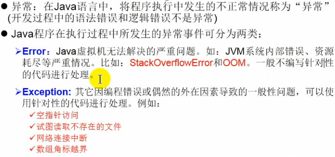
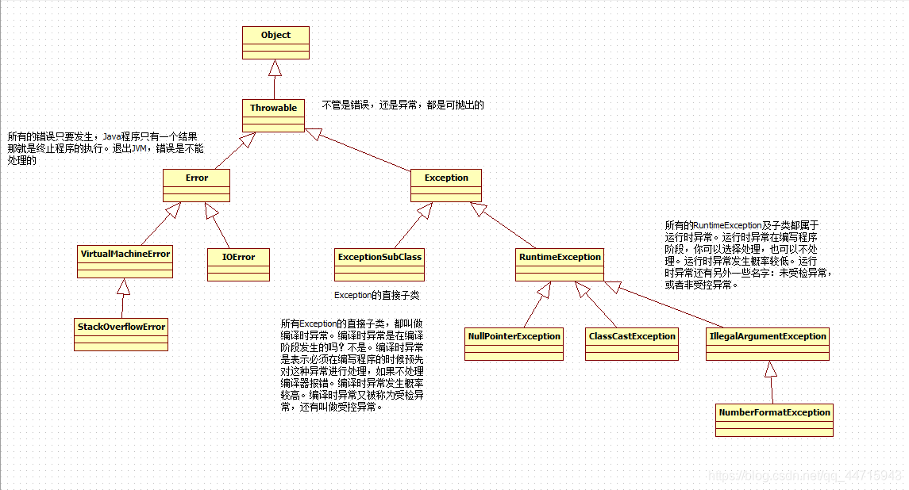

# 什么是异常





# try…catch

catch后面的小括号中的类型可以是 具体的异常类型，也可以是该异常类型的 父类型。

catch可以写多个。建议catch的时候，精确的一个一个处理。这样有利于程序的调试。

catch写多个的时候，从上到下，必须遵守 从小到大。

eg.

try {

FileInputStream fis = new FileInputStream("D:\Download\Javabean-addperson案例解析.docx");

} catch(FileNotFoundException e) {

System.out.println("文件不存在！");

}

等同于

try {

FileInputStream fis = new FileInputStream("D:\Download\Javabean-addperson案例解析.docx");

} catch(Exception e) {// 多态：Exception e = new FileNotFoundException();

System.out.println("文件不存在！");

}

try {

FileInputStream fis = new FileInputStream("D:\Download\Javabean-addperson案例解析.docx");

fis.read();

} catch(IOException e){

System.out.println("读文件报错了！");

} catch(FileNotFoundException e) {

System.out.println("文件不存在！");

}

JDK8的新特性：

catch() 异常间可以自小到大用 | 分割

eg.

try {

//创建输入流

FileInputStream fis = new FileInputStream("D:\Download\Javabean-addperson案例解析.docx");

// 进行数学运算

System.out.println(100 / 0); // 这个异常是运行时异常，编写程序时可以处理，也可以不处理。

} catch(FileNotFoundException | ArithmeticException | NullPointerException e) {

System.out.println("文件不存在？数学异常？空指针异常？都有可能！");

}

# 异常两个重要方法

方法名	作用

String getMessage()	返回异常的详细消息字符串

void printStackTrace()	追踪堆栈异常信息(采用异步线程)

# finally字句

在finally子句中的代码是最后执行的，并且是 一定会执行 的，即使try语句块中的代码出现了异常。

finally子句必须和try一起出现，不能单独编写。

## 9.1 finally语句通常使用在哪些情况下呢？

通常在finally语句块中完成 资源的释放/关闭。

eg.

public class ExceptionTest10 {

public static void main(String[] args) {

FileInputStream fis = null; // 声明位置放到try外面。这样在finally中才能用。

try {

fis = new FileInputStream("D:\Download\Javabean-addperson案例解析.docx");

String s = null;

// 这里一定会出现空指针异常！

s.toString();

System.out.println("hello world!");

// 流使用完需要关闭，因为流是占用资源的。

// 即使以上程序出现异常，流也必须要关闭！

// 放在这里有可能流关不了。

//fis.close();

} catch (FileNotFoundException e) {

e.printStackTrace();

} catch(IOException e){

e.printStackTrace();

} catch(NullPointerException e) {

e.printStackTrace();

} finally {

System.out.println("hello 浩克！");

// 流的关闭放在这里比较保险。

// finally中的代码是一定会执行的。

// 即使try中出现了异常！

if (fis != null) { // 避免空指针异常！

try {

// close()方法有异常，采用捕捉的方式。

fis.close();

} catch (IOException e) {

e.printStackTrace();

}

}

}

}

}

## 9.2try和finally联用，没有catch

eg.

public class ExceptionTest11 {

public static void main(String[] args) {

try {

System.out.println("try...");

return;

} finally {

System.out.println("finally...");

}

// 这里不能写语句，因为这个代码是无法执行到的。

//System.out.println("Hello World!");

}

}

以下代码的执行顺序：

先执行try…

再执行finally…

最后执行 return （return语句只要执行方法必然结束。）

注意：

try不能单独使用。

try finally可以联合使用。

放在finally语句块中的代码是一定会执行的

## 9.3 finally子句失效

System.exit(0); 只有这个可以治finally。

public class ExceptionTest12 {

public static void main(String[] args) {

try {

System.out.println("try...");

// 退出JVM

System.exit(0); // 退出JVM之后，finally语句中的代码就不执行了！

} finally {

System.out.println("finally...");

}

}

}

## 9.4 finally面试题

public class ExceptionTest13 {

public static void main(String[] args) {

int result = m();

System.out.println(result); //100

}

/*

java语法规则（有一些规则是不能破坏的，一旦这么说了，就必须这么做！）：

java中有一条这样的规则：

方法体中的代码必须遵循自上而下顺序依次逐行执行（亘古不变的语法！）

java中海油一条语法规则：

return语句一旦执行，整个方法必须结束（亘古不变的语法！）

*/

public static int m(){

int i = 100;

try {

// 这行代码出现在int i = 100;的下面，所以最终结果必须是返回100

// return语句还必须保证是最后执行的。一旦执行，整个方法结束。

return i;

} finally {

i++;

}

}

}

14

15

16

17

反编译之后的效果：

public static int m(){

int i = 100;

int j = i;

i++;

return j;

}

## 9.5 final finally finalize有什么区别？

final 关键字

final修饰的类无法继承

final修饰的方法无法覆盖

final修饰的变量不能重新赋值。

finally 关键字

finally 和try一起联合使用。

finally语句块中的代码是必须执行的。

finalize 标识符

是一个Object类中的方法名。

这个方法是由垃圾回收器GC负责调用的

- throws

 在方法声明位置上使用，表示

- throw

######  **手动抛出异常**

throw和throws的区别

1、throw 在方法体内使用，throws 在方法声明上使用；

2、throw 后面接的是异常对象，只能接一个。throws 后面接的是异常类型，可以接多个，多个异常类型用逗号隔开；

3、throw 是在方法中出现不正确情况时，手动来抛出异常，结束方法的，执行了 throw 语句一定会出现异常。而 throws 是用来声明当前方法有可能会出现某种异常的，如果出现了相应的异常，将由调用者来处理，声明了异常不一定会出现异常。

# 自定义异常

- 使用Java内置的异常类可以描述在编程时出现的大部分异常情况。除此之外，用户还可以自定义异常。用户自定义异常类，只需要继承Exception类即可。

- 在程序中使用自定义异常类，大体可分为以下几个步骤：

1. 创建自定义异常类

1. 在方法中通过throw关键字抛出异常对象

1. 如果在当前抛出异常的方法中处理异常，可以使用try-catch语句捕获并处理；否则在方法的声明处通过throws关键字指明要抛出给方法调用者的异常，继续进行下一步操作。

1. 在处理异常方法的调用者中捕获并处理异常

eg.

```
public class Example6_4 {
static int quotient(int x,int y) throws Exception{
if(y<0){
throw  new MyException("除数不能是负数");
}
return x/y;//返回值
}
public static void main(String[] args) {
    int a= 3;
    int b=0;
    try {
        int result = quotient(a,b);//调用quotient自定义异常方法，当b=0,会抛出ArithmeticException类的异常对象
        System.out.println(result);
    }catch (MyException e){
        System.out.println(e.getMessage());
    }catch (ArithmeticException e) {//异常对象会被此ArithmeticException类捕获
        System.out.println("除数不能为0");
    }catch (Exception e){
        System.out.println("程序发生了其它的异常");
    }
    }
}
/**
创建自定义异常
*/
class MyException extends Exception{
String message;
public MyException(String ErrorMessage){
this.message = ErrorMessage;
}
@Override
public String getMessage() {
return message;
}
}

```

## 实际应用中的经验总结

- 处理运行异常时，采用逻辑去合理规避同时辅助try-catch处理

- 在多重catch块后面，可以加一个catch（Exception）来处理可能会被遗漏的异常

- 对于不确定的代码，也可以加上try-catch，处理潜在的异常

- 尽量去处理异常，切忌只是简单地调用printStackTrace()去打印输出

- 具体如何去处理异常，要根据不同的业务需求和异常类型去决定

- 尽量添加finally语句块去释放占用的资源

10、自定义异常（开发中常用）

10.1前言

SUN提供的JDK内置的异常肯定是不够的用的。在实际的开发中，有很多业务，这些业务出现异常之后，JDK中都是没有的。和业务挂钩的。因此需要自定义异常。

10.2自定义异常步骤

第一步：编写一个类继承 Exception 或者 RuntimeException.

第二步：提供两个 构造方法，一个无参数的，一个带有String参数的。

eg.

//栈操作异常：自定义异常！

public class StackOperationException extends Exception{ // 编译时异常！

public MyStackOperationException(){

}

public MyStackOperationException(String s){

super(s);

}

}

11、方法覆盖，时遗留的问题

重写之后的方法不能比重写之前的方法抛出更多（更宽泛）的异常，可以更少。方法覆盖

class Animal {

public void doSome(){

}

public void doOther() throws Exception{

}

}

class Cat extends Animal {

// 编译正常。

public void doSome() throws RuntimeException{

}

// 编译报错。

/

// 编译正常。

/

// 编译正常。

/

// 编译正常。

public void doOther() throws NullPointerException{

}

}

注意：

一般不会这样考虑，方法覆盖复制一份，然后重写就好了。