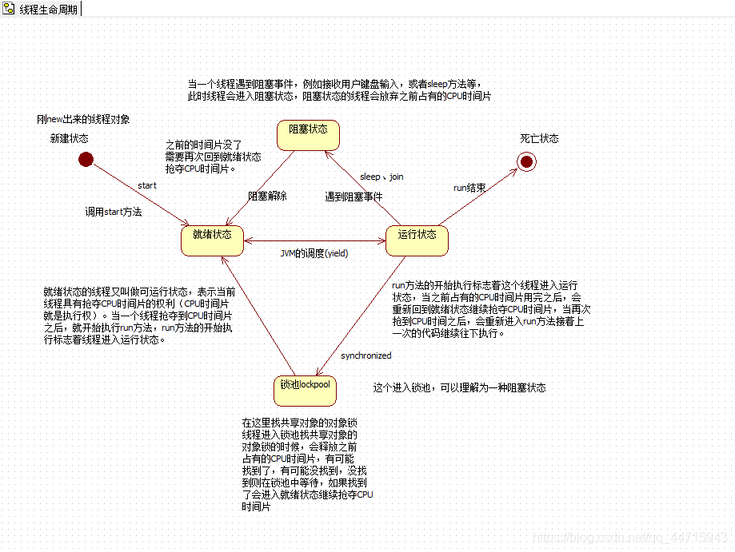
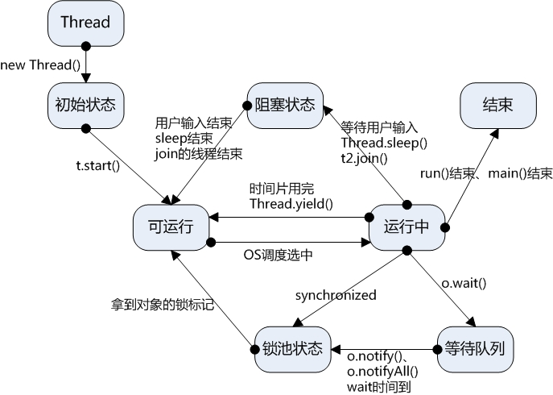
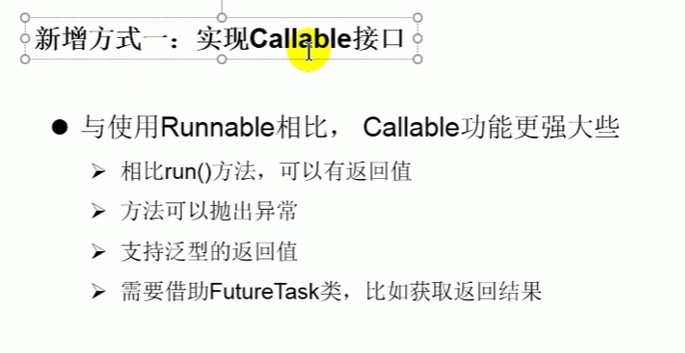
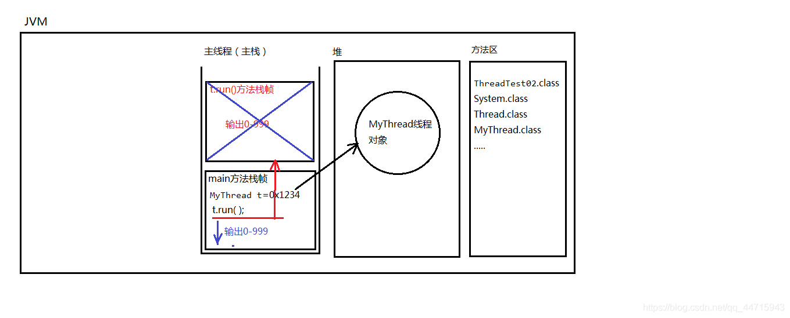
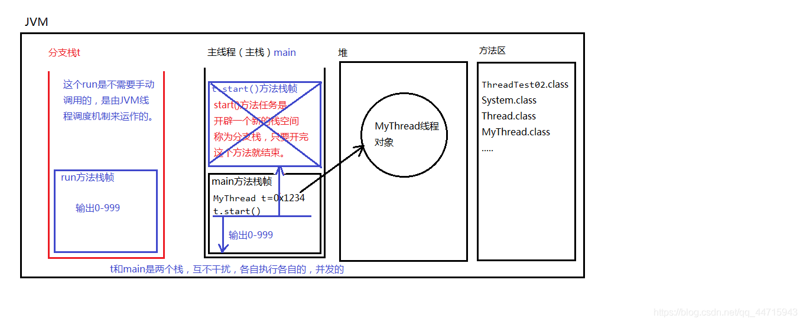
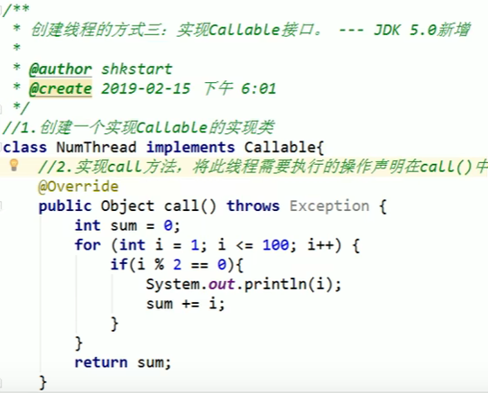
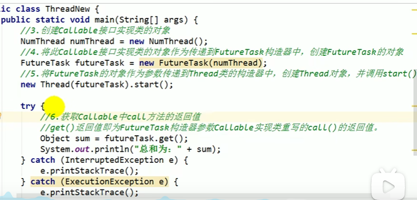

## Thread 方法

下表列出了Thread类的一些重要方法：

| 序号 | 方法描述 | 
| -- | -- |
| 1 | public void start() | 
| 2 | public void run() | 
| 3 | public final void setName(String name) | 
| 4 | public final void setPriority(int priority) | 
| 5 | public final void setDaemon(boolean on) | 
| 6 | public final void join(long millisec) | 
| 7 | public void interrupt() | 
| 8 | public final boolean isAlive() | 


上述方法是被 Thread 对象调用的，下面表格的方法是 Thread 类的静态方法。

| 序号 | 方法描述 | 
| -- | -- |
| 1 | public static void yield() | 
| 2 | public static void sleep(long millisec) | 
| 3 | public static boolean holdsLock(Object x) | 
| 4 | public static Thread currentThread() | 
| 5 | public static void dumpStack() | 


# Thread方法详细

## 获取当前线程对象、获取线程对象名字、修改线程对象名字

| 方法名 | 作用 | 
| -- | -- |
| static Thread currentThread() | 获取当前线程对象 | 
| String getName() | 获取线程对象名字 | 
| void setName(String name) | 修改线程对象名字 | 


## 关于线程的join()方法

| 方法名 | 作用 | 
| -- | -- |
| void join() | 将一个线程合并到当前线程中，当前线程受阻塞，加入的线程执行直到结束 | 


方法名	作用

void join()	将一个线程合并到当前线程中，当前线程受阻塞，加入的线程执行直到结束

void join(long millis)	接上条，等待该线程终止的时间最长为 millis 毫秒

void join(long millis, int nanos)	接第一条，等待该线程终止的时间最长为 millis 毫秒 + nanos 纳秒

## 关于线程的yield()方法

| 方法名 | 作用 | 
| -- | -- |
| static void yield() | 让位，当前线程暂停，回到就绪状态，让给其它线程。 | 


## Java进程的优先级

| 方法名 | 作用 | 
| -- | -- |
| int getPriority() | 获得线程优先级 | 
| void setPriority(int newPriority) | 设置线程优先级 | 


常量：

| 常量名 | 备注 | 
| -- | -- |
| static int MAX_PRIORITY | 最高优先级（10） | 
| static int MIN_PRIORITY | 最低优先级（1） | 
| static int NORM_PRIORITY | 默认优先级（5） | 


方法：

| 方法名 | 作用 | 
| -- | -- |
| int getPriority() | 获得线程优先级 | 
| void setPriority(int newPriority) | 设置线程优先级 | 


## 关于线程的sleep方法

| 方法名 | 作用 | 
| -- | -- |
| static void sleep(long millis) | 让当前线程休眠millis秒 | 


静态方法：Thread.sleep(1000);

参数是毫秒

作用： 让当前线程进入休眠，进入“阻塞状态”，放弃占有CPU时间片，让给其它线程使用。

这行代码出现在A线程中，A线程就会进入休眠。

这行代码出现在B线程中，B线程就会进入休眠。

Thread.sleep()方法，可以做到这种效果：

间隔特定的时间，去执行一段特定的代码，每隔多久执行一次。

| 方法名 | 作用 | 
| -- | -- |
| void interrupt() | 终止线程的睡眠 | 


## 关于Object类的wait()、notify()、notifyAll()方法（在同步代码块与同步方法中）

| 方法名 | 作用 | 
| -- | -- |
| void wait() | 让活动在当前对象的线程无限等待（释放之前占有的锁） | 
| void notify() | 唤醒当前对象正在等待的线程（只提示唤醒，不会释放锁） | 
| void notifyAll() | 唤醒当前对象全部正在等待的线程（只提示唤醒，不会释放锁） | 


# 线程的生命周期






| 构造方法名 | 备注 | 
| -- | -- |
|   |   | 
| Thread() |   | 
| Thread(String name) | name为线程名字 | 
| 创建线程第二种方式 |   | 
| Thread(Runnable target) |   | 
| Thread(Runnable target, String name) | name为线程名字 | 


编写一个类，直接 

1. 怎么创建线程对象？ **new**继承线程的类。

1. 怎么启动线程呢？ 调用线程对象的 **start()** 方法。

```java
public class ThreadTest02 {
    public static void main(String[] args) {
        MyThread t = new MyThread();
        // 启动线程
        //t.run(); // 不会启动线程，不会分配新的分支栈。（这种方式就是单线程。）
        t.start();
        // 这里的代码还是运行在主线程中。
        for(int i = 0; i < 1000; i++){
            System.out.println("主线程--->" + i);
        }
    }
}

class MyThread extends Thread {
    @Override
    public void run() {
        // 编写程序，这段程序运行在分支线程中（分支栈）。
        for(int i = 0; i < 1000; i++){
            System.out.println("分支线程--->" + i);
        }
    }
}
12345678910111213141516171819202122
```

**注意：**

- t.run()

 不会启动线程，只是普通的调用方法而已。

- t.start()

 方法的作用是：启动一个分支线程，

这段代码的任务只是为了开启一个新的栈空间，只要新的栈空间开出来，start()方法就结束了。线程就启动成功了。

启动成功的线程会自动调用run方法，并且run方法在分支栈的栈底部（压栈）。

run方法在分支栈的栈底部，main方法在主栈的栈底部。run和main是

**调用run()方法内存图：**



**调用start()方法内存图：**



编写一个类，

1. 怎么创建线程对象？ **new**线程类传入可运行的类/接口。

1. 怎么启动线程呢？ 调用线程对象的 **start()** 方法

```java
public class ThreadTest03 {
    public static void main(String[] args) {
        Thread t = new Thread(new MyRunnable()); 
        // 启动线程
        t.start();
        
        for(int i = 0; i < 100; i++){
            System.out.println("主线程--->" + i);
        }
    }
}

// 这并不是一个线程类，是一个可运行的类。它还不是一个线程。
class MyRunnable implements Runnable {
    @Override
    public void run() {
        for(int i = 0; i < 100; i++){
            System.out.println("分支线程--->" + i);
        }
    }
}
123456789101112131415161718192021
```

```java
public class ThreadTest04 {
    public static void main(String[] args) {
        // 创建线程对象，采用匿名内部类方式。
        Thread t = new Thread(new Runnable(){
            @Override
            public void run() {
                for(int i = 0; i < 100; i++){
                    System.out.println("t线程---> " + i);
                }
            }
        });

        // 启动线程
        t.start();

        for(int i = 0; i < 100; i++){
            System.out.println("main线程---> " + i);
        }
    }
}
1234567891011121314151617181920
```

**注意：**

**第二种方式**

## 新增方式：

### 方法一：实现Callable接口（jdk5.0新增）


#### 步骤





#### Callable的优点

1.call可以有返回值；

2.call可以抛出异常，被外面的操作捕获获取异常信息；

3.call支持泛型

### 方法二：使用线程池（重要）

