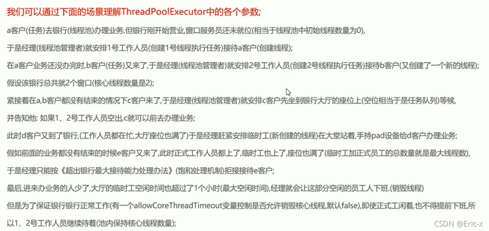
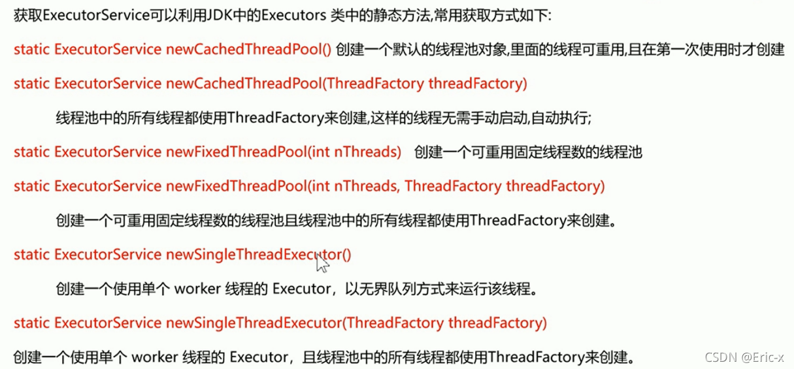
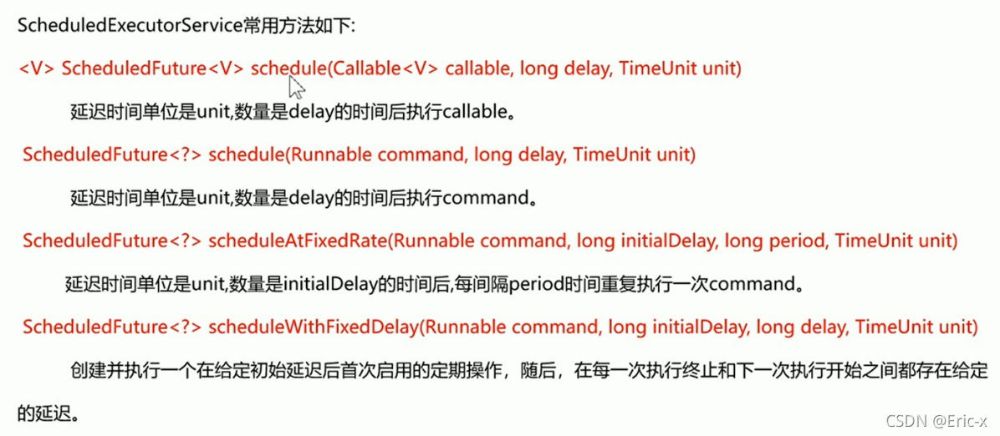
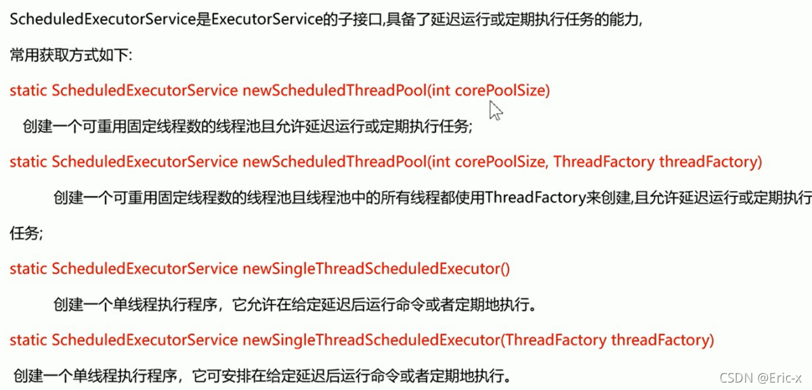
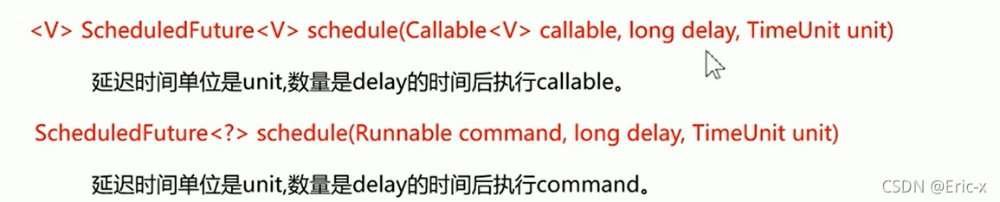
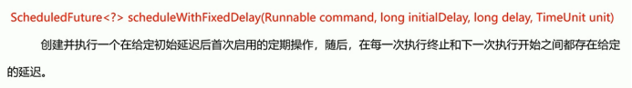
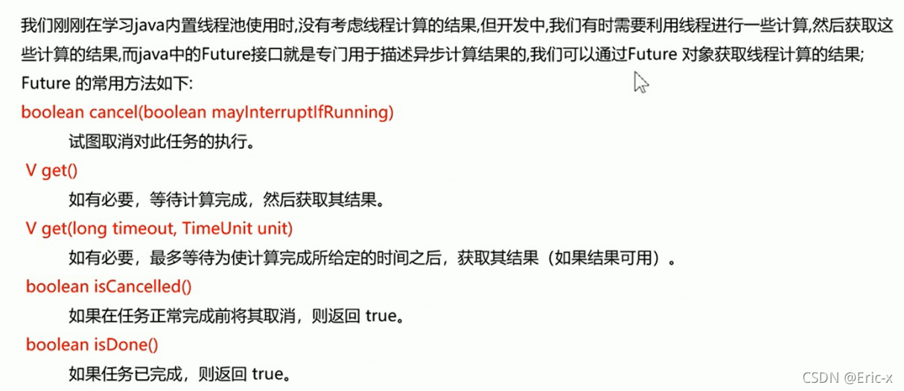

[](https://www.csdn.net/)

该篇关于多线程中的线程池是我在上篇Java基础没有写到的，当时想把整个多线程直接放在JavaSE中去，但发现网上很多讲Java课程的视频中讲多线程都没有讲到线程池，有些可能会说到，但比较少，可能只会介绍一种如何创建线程池的方式和使用，并没有详细说线程池，所以还是决定单独写一篇关于线程池的就好。而关于多线程的基础知识可以看我之前写的一篇文章，里面不仅有多线程的详细介绍和使用，还有很多的Java基础知识：

用一句话来概述就是：

使用线程池最大的原因就是可以根据系统的需求和硬件环境灵活的控制线程的数量，且可以对所有线程进行统一的管理和控制，从而提高系统的运行效率，降低系统的运行压力。

- 降低资源消耗：线程和任务分离，提高线程重用性

- 控制线程并发数量，降低服务器压力，统一管理所有线程

- 提高系统响应速度。假如创建线程用的时间为T1，执行任务的时间为T2，销毁线程的时间为T3，那么使用线程池就免去了T1和T3的时间。

```java
 public ThreadPoolExecutor(int corePoolSize,
                           int maximumPoolSize,
                           long keepAliveTime,
                           TimeUnit unit,
                           BlockingQueue<Runnable> workQueue,
                           RejectedExecutionHandler handler) 
123456
```

- corePoolSize：线程池核心线程数量

- maximumPoolSize:线程池最大线程数量

- keepAliverTime：当活跃线程数大于核心线程数时，空闲的多余线程最大存活时间

- unit：存活时间的单位

- workQueue：存放任务的队列

- handler：超出线程范围和队列容量的任务的处理程序



通过Executor工厂类获取线程池有三种方式，这三种方式都是通过Executors类中的静态方法来获取的。如下：



该方式特点是：创建一个默认的线程池对象，里面的线程可重用，且在第一次使用时才创建

```java
package com.itheima.demo02;

import java.util.concurrent.ExecutorService;
import java.util.concurrent.Executors;
import java.util.concurrent.ThreadFactory;

/**
 * 练习ExecuTors获取ExecutorService，然后调用方法，提交任务
 *
 * @author Eric
 * @create 2021-10-01 13:33
 */
public class MyTest1 {
    public static void main(String[] args) {
        //test1();
        test2();
    }

    //练习newCachedThreadPool方法
    private static void test1() {
        //1.使用工厂类获取线程池对象
        ExecutorService es = Executors.newCachedThreadPool();
        //2.提交任务
        for (int i = 1; i <= 10; i++) {
            es.submit(new MyRunnable(i));
        }
    }
    //练习newCachedThreadPool(ThreadFactory threadFactory)方法
    private static void test2() {
        //1.使用工厂类获取线程池对象
        ExecutorService es = Executors.newCachedThreadPool(new ThreadFactory() {
            int n = 1;
            @Override
            public Thread newThread(Runnable r) {
                return new Thread(r,"自定义的线程名称" + n++);
            }
        });
        //2.提交任务
        for (int i = 1; i <= 10; i++) {
            es.submit(new MyRunnable(i));
        }
    }
}

/**
 * 任务类，包含一个任务编号，在任务中打印出是那一个线程正在执行任务
 */
class MyRunnable implements Runnable{
    private int id;
    public MyRunnable(int id) {
        this.id = id;
    }

    @Override
    public void run() {
        //获取线程的名称，打印一句话
        String name = Thread.currentThread().getName();
        System.out.println(name + "执行了任务" + id);
    }
}
123456789101112131415161718192021222324252627282930313233343536373839404142434445464748495051525354555657585960
```

该方式特点是：可指定创建线程数，并且可以重复用

```java
package com.itheima.demo02;

import java.util.concurrent.ExecutorService;
import java.util.concurrent.Executors;
import java.util.concurrent.ThreadFactory;

/**
 * 练习ExecuTors获取ExecutorService，然后调用方法，提交任务
 *
 * @author Eric
 * @create 2021-10-01 13:33
 */
public class MyTest2 {
    public static void main(String[] args) {
        //test1();
        test2();
    }

    //练习newFixedThreadPool方法
    private static void test1() {
        //1.使用工厂类获取线程池对象
        ExecutorService es = Executors.newFixedThreadPool(3);
        //2.提交任务
        for (int i = 1; i <= 10; i++) {
            es.submit(new MyRunnable2(i));
        }
    }
    private static void test2() {
        //1.使用工厂类获取线程池对象
        ExecutorService es = Executors.newFixedThreadPool(3,new ThreadFactory() {
            int n = 1;
            @Override
            public Thread newThread(Runnable r) {
                return new Thread(r,"自定义的线程名称" + n++);
            }
        });
        //2.提交任务
        for (int i = 1; i <= 10; i++) {
            es.submit(new MyRunnable2(i));
        }
    }
}

/**
 * 任务类，包含一个任务编号，在任务中打印出是那一个线程正在执行任务
 */
class MyRunnable2 implements Runnable{
    private int id;
    public MyRunnable2(int id) {
        this.id = id;
    }

    @Override
    public void run() {
        //获取线程的名称，打印一句话
        String name = Thread.currentThread().getName();
        System.out.println(name + "执行了任务" + id);
    }
}
1234567891011121314151617181920212223242526272829303132333435363738394041424344454647484950515253545556575859
```

该方式特点是：只会创建一个线程

```java
package com.itheima.demo02;

import java.util.concurrent.ExecutorService;
import java.util.concurrent.Executors;
import java.util.concurrent.ThreadFactory;

/**
 * 练习ExecuTors获取ExecutorService，然后调用方法，提交任务
 *
 * @author Eric
 * @create 2021-10-01 13:33
 */
public class MyTest3 {
    public static void main(String[] args) {
        //test1();
        test2();

    }

    //练习newSingleThreadExecutor方法
    private static void test1() {
        //1.使用工厂类获取线程池对象
        ExecutorService es = Executors.newSingleThreadExecutor();
        //2.提交任务
        for (int i = 1; i <= 10; i++) {
            es.submit(new MyRunnable3(i));
        }
    }
    private static void test2() {
        //1.使用工厂类获取线程池对象
        ExecutorService es = Executors.newSingleThreadExecutor(new ThreadFactory() {
            int n = 1;
            @Override
            public Thread newThread(Runnable r) {
                return new Thread(r,"自定义的线程名称" + n++);
            }
        });
        //2.提交任务
        for (int i = 1; i <= 10; i++) {
            es.submit(new MyRunnable3(i));
        }
    }
}

/**
 * 任务类，包含一个任务编号，在任务中打印出是那一个线程正在执行任务
 */
class MyRunnable3 implements Runnable{
    private int id;
    public MyRunnable3(int id) {
        this.id = id;
    }

    @Override
    public void run() {
        //获取线程的名称，打印一句话
        String name = Thread.currentThread().getName();
        System.out.println(name + "执行了任务" + id);
    }
}
123456789101112131415161718192021222324252627282930313233343536373839404142434445464748495051525354555657585960
```

- shutdown()：仅仅是不再接受新的任务，以前的任务还会继续执行

- shutdownNow()：立刻关闭线程池，如果线程池中还有缓存的任务没有执行，则取消执行，并返回这些任务

具体代码如下：

```java
package com.itheima.demo02;

import java.util.List;
import java.util.concurrent.ExecutorService;
import java.util.concurrent.Executors;
import java.util.concurrent.ThreadFactory;

/**
 * 练习ExecuTors获取ExecutorService，然后调用方法，提交任务
 *
 * @author Eric
 * @create 2021-10-01 13:33
 */
public class MyTest4 {
    public static void main(String[] args) {
        //test1();
        test2();

    }

    //练习newSingleThreadExecutor方法
    private static void test1() {
        //1.使用工厂类获取线程池对象
        ExecutorService es = Executors.newSingleThreadExecutor();
        //2.提交任务
        for (int i = 1; i <= 10; i++) {
            es.submit(new MyRunnable4(i));
        }

        //3.关闭线程池，仅仅是不再接受新的任务，以前的任务还会继续执行
        es.shutdown();

        //演示：看能不能继续接收新任务
        //es.submit(new MyRunnable4(888));//不能再提交新的任务了，不然报异常
    }
    private static void test2() {
        //1.使用工厂类获取线程池对象
        ExecutorService es = Executors.newSingleThreadExecutor(new ThreadFactory() {
            int n = 1;
            @Override
            public Thread newThread(Runnable r) {
                return new Thread(r,"自定义的线程名称" + n++);
            }
        });
        //2.提交任务
        for (int i = 1; i <= 10; i++) {
            es.submit(new MyRunnable4(i));
        }

        //3.立刻关闭线程池，如果线程池中还有缓存的任务没有执行，则取消执行，并返回这些任务
        List<Runnable> list = es.shutdownNow();
        System.out.println(list.toString());
    }
}

/**
 * 任务类，包含一个任务编号，在任务中打印出是那一个线程正在执行任务
 */
class MyRunnable4 implements Runnable{
    private int id;
    public MyRunnable4(int id) {
        this.id = id;
    }

    @Override
    public void run() {
        //获取线程的名称，打印一句话
        String name = Thread.currentThread().getName();
        System.out.println(name + "执行了任务" + id);
    }

    @Override
    public String toString() {
        return "MyRunnable4{" +
                "id=" + id +
                '}';
    }
}
123456789101112131415161718192021222324252627282930313233343536373839404142434445464748495051525354555657585960616263646566676869707172737475767778
```

第一种：newCachedThreadPool：线程的数据是不做限制的，每次有任务来的时候都会以任务优先，性能最大化（也就是服务器压力比较大）

第二种：newFixedThreadPool：可以让压力不那么大，并且可以规定线程的数量，当线程的数量达到指定数量的时候，这个时候就不会再有新的线程了

第三种：newSingleThreadExecutor：绝对的安全，不考虑性能，因为是单线程，永远只有一个线程来执行任务。

> 当你想控制线程池延迟执行或者重复执行，那么上面创建线程池的三种方式已经不能满足了，这个时候就需要用到我们的线程池的子接口：ScheduledExecutorService


ScheduledExecutorService介绍如下：

通过该子接口中方法来达到我们的需求：





具体代码如下：

```java
package com.itheima.demo03;
import java.util.concurrent.Executors;
import java.util.concurrent.ScheduledExecutorService;
import java.util.concurrent.TimeUnit;

/**
 * 测试ScheduleExecutorService接口中的延迟执行任务和重复执行任务的功能
 *
 * @author Eric
 * @create 2021-10-02 9:17
 */
public class ScheduleExecutorServiceDemo01 {
    public static void main(String[] args) {
        //1.获取一个具备延迟执行任务的线程池对象
        ScheduledExecutorService es = Executors.newScheduledThreadPool(3);
        //2.创建多个任务对象，提交任务，每个任务延迟2秒执行
        es.schedule(new MyRunnable(1),2, TimeUnit.SECONDS);
        System.out.println("over");
    }
}

class MyRunnable implements Runnable{
    private int id;

    public MyRunnable(int id) {
        this.id = id;
    }

    @Override
    public void run() {
        String name = Thread.currentThread().getName();
        System.out.println(name + "执行了任务：" + id);
    }
}
12345678910111213141516171819202122232425262728293031323334
```

具体代码如下：

```java
package com.itheima.demo03;

import java.util.concurrent.Executors;
import java.util.concurrent.ScheduledExecutorService;
import java.util.concurrent.ThreadFactory;
import java.util.concurrent.TimeUnit;

/**
 * 测试ScheduleExecutorService接口中的延迟执行任务和重复执行任务的功能
 *
 * @author Eric
 * @create 2021-10-02 9:17
 */
public class ScheduleExecutorServiceDemo02 {
    public static void main(String[] args) {
        //1.获取一个具备延迟执行任务的线程池对象
        ScheduledExecutorService es = Executors.newScheduledThreadPool(3, new ThreadFactory() {
            int n = 1;
            @Override
            public Thread newThread(Runnable r) {
                return new Thread(r,"自定义线程名称：" + n++);
            }
        });
        //2.创建多个任务对象，提交任务，每个任务延迟2秒执行        //初始等待1秒，执行任务间隔2秒
        es.scheduleAtFixedRate(new MyRunnable2(1),1,2,TimeUnit.SECONDS);
        System.out.println("over");

    }
}

class MyRunnable2 implements Runnable{
    private int id;

    public MyRunnable2(int id) {
        this.id = id;
    }

    @Override
    public void run() {
        String name = Thread.currentThread().getName();
        try {
            Thread.sleep(1500);
        } catch (InterruptedException e) {
            e.printStackTrace();
        }
        System.out.println(name + "执行了任务：" + id);
    }
}
123456789101112131415161718192021222324252627282930313233343536373839404142434445464748
```

```java
package com.itheima.demo03;

import java.util.concurrent.Executors;
import java.util.concurrent.ScheduledExecutorService;
import java.util.concurrent.ThreadFactory;
import java.util.concurrent.TimeUnit;

/**
 * 测试ScheduleExecutorService接口中的延迟执行任务和重复执行任务的功能
 *
 * @author Eric
 * @create 2021-10-02 9:17
 */
public class ScheduleExecutorServiceDemo03 {
    public static void main(String[] args) {
        //1.获取一个具备延迟执行任务的线程池对象
        ScheduledExecutorService es = Executors.newSingleThreadScheduledExecutor(new ThreadFactory() {
            int n = 1;
            @Override
            public Thread newThread(Runnable r) {
                return new Thread(r,"自定义线程名称：" + n++);
            }
        });
        //2.创建多个任务对象，提交任务，每个任务延迟2秒执行        //初始延迟1秒，执行任务间隔2秒（任务执行时间不计入的，是等任务执行之后再间隔2秒）
        es.scheduleWithFixedDelay(new MyRunnable3(1),1,2,TimeUnit.SECONDS);
        System.out.println("over");

    }
}

class MyRunnable3 implements Runnable{
    private int id;

    public MyRunnable3(int id) {
        this.id = id;
    }

    @Override
    public void run() {
        String name = Thread.currentThread().getName();
        try {
            Thread.sleep(2000);
        } catch (InterruptedException e) {
            e.printStackTrace();
        }
        System.out.println(name + "执行了任务：" + id);
    }
}
123456789101112131415161718192021222324252627282930313233343536373839404142434445464748
```

1、设置延迟多长时间任务执行，可以使用schedule()方法

2、设置每间隔多长时间执行，有两种方式：

方式一：只计算第一次开始到第二次开始的间隔时间



方式二：第一次任务结束之后开始计时，间隔多长时间，到第二次任务开始之前，这个时间段。




介绍如下：



具体操作代码如下：

```java
package com.itheima.demo04;

import java.util.concurrent.*;

/**
 * 练习异步计算结果
 *
 * @author Eric
 * @create 2021-10-02 10:30
 */
public class FutureDemo {
    public static void main(String[] args) throws Exception {
        //1.获取线程池对象
        ExecutorService es = Executors.newCachedThreadPool();
        //2.创建Callable类型对象
        Future<Integer> f = es.submit(new MyCall(1, 1));
        //3.判断任务是否已经完成
        //test1(f);

        //测试get()方法
        //boolean b = f.cancel(true);
        //System.out.println("取消任务执行的结果：" + b);

        //Integer v = f.get(1, TimeUnit.SECONDS);//由于等待时间过短，任务来不及执行完成，所以会报异常
        //System.out.println("任务执行的结果是："  +v);
    }

    //正常执行流程
    private static void test1(Future<Integer> f) throws Exception {
        boolean done = f.isDone();
        System.out.println("第一次判断任务是否完成：" + done);

        boolean cancelled = f.isCancelled();
        System.out.println("第一次判断任务是否取消：" + cancelled);

        Integer v = f.get();//一直等待任务的执行，直到完成
        System.out.println("任务执行的结果是："  + v);

        //再一次判断任务是否完成
        boolean done2 = f.isDone();
        System.out.println("第二次判断任务是否完成：" + done2);

        boolean cancelled2 = f.isCancelled();
        System.out.println("第二次判断任务是否取消：" + cancelled2);
    }
}


class MyCall implements Callable<Integer>{
    private int a;
    private int b;

    //通过构造方法传递两个参数
    public MyCall(int a, int b) {
        this.a = a;
        this.b = b;
    }

    @Override
    public Integer call() throws Exception {
        String name = Thread.currentThread().getName();
        System.out.println(name + "准备开始计算...");
        Thread.sleep(2000);
        System.out.println(name + "计算完成...");
        return a + b;
    }
}
12345678910111213141516171819202122232425262728293031323334353637383940414243444546474849505152535455565758596061626364656667
```

最后，拿一个综合案例来结合前面写的融合一下，感兴趣的小伙伴可以锻炼一下。


具体代码如下：

         任务类代码：

```java
package com.itheima.demo05;

/**
 * 任务类：
 *      包含了商品数量，客户名称，送手机的行为
 *
 * @author Eric
 * @create 2021-10-02 10:46
 */
public class MyTask implements Runnable{
    //设计一个变量，用于表示商品的数量
    private static int id = 10;
    //表示客户名称变量
    private String userName;

    public MyTask(String userName) {
        this.userName = userName;
    }

    @Override
    public void run() {
        String name = Thread.currentThread().getName();
        System.out.println(userName + "正在使用" + name + "参与秒杀任务...");

        try {
            Thread.sleep(200);//为了逼真一点，休眠200毫秒
        } catch (InterruptedException e) {
            e.printStackTrace();
        }

        synchronized (MyTask.class){
            if(id > 0){
                System.out.println(userName + "使用" + name + "秒杀:" + id-- + "号商品成功啦！");
            }else {
                System.out.println(userName + "使用" + name + "秒杀失败了！");
            }
        }
    }
}
123456789101112131415161718192021222324252627282930313233343536373839
```

         测试类代码：

```java
package com.itheima.demo05;

import java.util.concurrent.LinkedBlockingDeque;
import java.util.concurrent.LinkedBlockingQueue;
import java.util.concurrent.ThreadPoolExecutor;
import java.util.concurrent.TimeUnit;

/**
 * 主程序类，测试任务类
 *
 * @author Eric
 * @create 2021-10-02 10:50
 */
public class MyTest {
    public static void main(String[] args) {
        //1.创建一个线程池对象
        ThreadPoolExecutor pool = new ThreadPoolExecutor(3,5,1, TimeUnit.MINUTES,new LinkedBlockingQueue<>(15));
        //2.循环创建任务对象
        for (int i = 0; i < 20; i++) {
            MyTask myTask = new MyTask("客户" + i);
            pool.submit(myTask);
        }
        //3.关闭线程池
        pool.shutdown();
    }
}
1234567891011121314151617181920212223242526
```

在实际项目中，我们使用多线程的话都是通过JDK8新特性中的 CompletableFuture ，感兴趣的小伙伴可以查看这篇文章：[多线程的复习和多线程的异步编排详解（CompletableFuture详细介绍和使用）](https://blog.csdn.net/weixin_47316183/article/details/127349045?spm=1001.2014.3001.5501)

该文章也是为了加深一下自己的理解和影响，当然，如果对你也有帮助，是我的荣幸~ 如有不对的地方请各位指教，感谢~

文章知识点与官方知识档案匹配，可进一步学习相关知识

[Java技能树](https://edu.csdn.net/skill/java/)

[](https://edu.csdn.net/skill/java/)