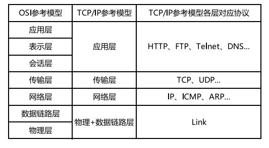
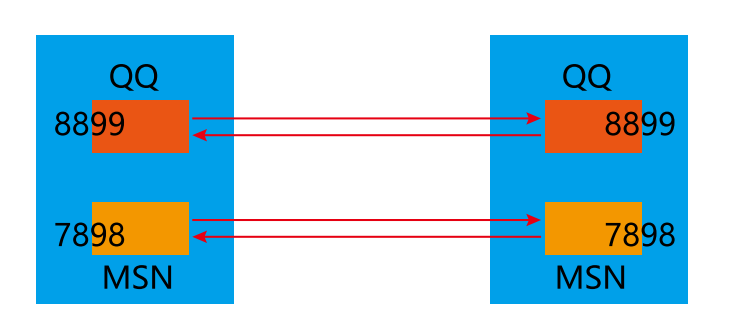
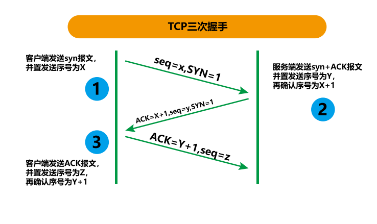
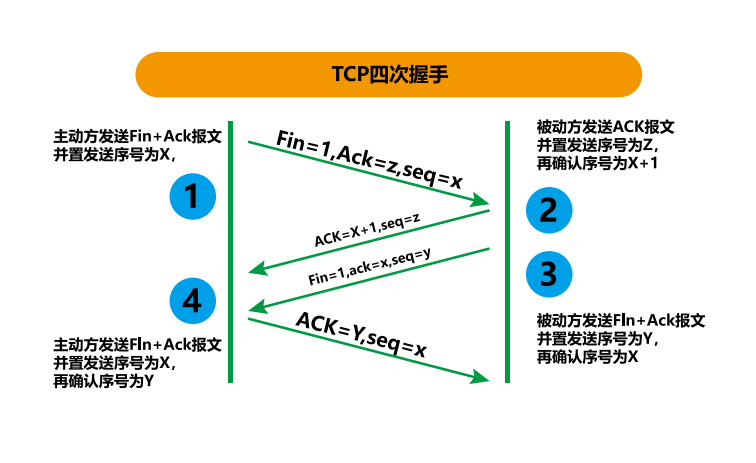
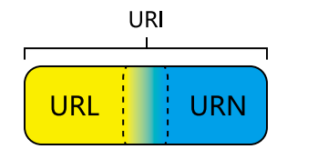

[TOC]

# 网络编程概述

Java 是 Internet 上的语言，它从语言级上提供了对网络应用程序的支持，程序员能够很容易开发常见的网络应用程序。
Java 提供的网络类库，可以实现无痛的网络连接，联网的底层细节被隐藏在 Java 的本机安装系统里，由 JVM进行控制。并且Java 实现了一个跨平台的网络库，程序员面对的是一个统一的网络编程环境。
计算机网络：
把分布在不同地理区域的计算机与专门的外部设备用通信线路互连成一个规模大、功能强的网络系统，从而使众多的计算机可以方便地互相传递信息、共享硬件、软件、数据信息等资源。网络编程的目的：
直接或间接地通过网络协议与其它计算机实现数据交换，进行通讯。
网络编程中有两个主要的问题：
·如何准确地定位网络上一台或多台主机；定位主机上的特定的应；
·找到主机后如何可靠高效地进行数据传输。

## 14.2 网络通信要素概述

通信双方地址
·IP
·端口号一定的规则（即：网络通信协议。有两套参考模型）
·OSI 参考模型：模型过于理想化，未能在因特网上进行广泛推广；
·TCP/IP 参考模型 ( 或 TCP/IP 协议 )：事实上的国际标准。
网络通信协议


## 14.3 通信要素1：IP 和端口号

### 14.3.1 IP 的理解与 InetAddress 类的实例化

·IP 地址：InetAddress
·唯一的标识 Internet 上的计算机（通信实体）；
·本地回环地址 (hostAddress)：
·127.0.0.1 主机名 (hostName)：localhost；
·IP 地址分类方式 1：IPV4 和 IPV6；
·IPV4：4 个字节组成，4 个 0-255。大概 42 亿，30 亿都在北美，亚洲 4 亿。2011 年初已经用尽。以点分十进制表示，如 192.168.0.1。
·IPV6：128 位（16 个字节），写成 8 个无符号整数，每个整数用四个十六进制位表示，数之间用冒号（：）分开，如：3ffe:3201:1401:1280\:c8ff\:fe4d\:db39:1984。
·IP 地址分类方式 2：公网地址 ( 万维网使用 ) 和私有地址 (局域网使用 )。192.168. 开头的就是私有地址，范围即为 192.168.0.0-192.168.255.255，专门为组织机构内部使用。
·特点：不易记忆
**·Internet 上的主机有两种方式表示地址：**

> ·域名 (hostName)：[www.atguigu.com。](http://www.atguigu.com。)
> ·IP 地址 (hostAddress)：202.108.35.210。
> ·InetAddress 类主要表示 IP 地址，两个子类：
> ·Inet4Address；
> ·Inet6Address。
> ·InetAddress 类对象含有一个 Internet 主机地址的域名和IP 地址：[www.atguigu.com](http://www.atguigu.com) 和 202.108.35.210。14.3 通信要素 1：IP 和端口号

### 14.3.1 IP 的理解与 InetAddress 类的实例化

·域名容易记忆，当在连接网络时输入一个主机的域名后，域名服务器 (DNS) 负责将域名转化成 IP 地址，这样才能和主机建立连接。------- 域名解析
一、网络编程中有两个主要的问题：

> 1.  如何准确地定位网络上一台或多台主机；定位主机上的特定的应用；

1.  找到主机后如何可靠高效地进行数据传输。

二、网络编程中的两个要素：

> 对应问题一：IP 和端口号；
> 对应问题二：提供网络通信协议：TCP/IP参考模型（应用层、传输层、网络层、物理 + 数据链路层）。

三、通信要素一：IP 和端口号
IP: 唯一的标识 Internet 上的计算机（通信实体）
**在 Java 中使用 InetAddress 类代表 IP**
IP 分类：IPv4 和 IPv6 ; 万维网 和 局域网

域名：[www.baidu.com](http://www.baidu.com)  	[www.mi.com](http://www.mi.com)  	[www.sina.com](http://www.sina.com)  	[www.jd.com](http://www.jd.com) 		[www.vip.com](http://www.vip.com)
本地回路地址：127.0.0.1 对应着：localhost。

\*\*如何实例化 InetAddress: 两个方法：getByName(String host) 、getLocalHost()。 \*\*

    **两个常用方法：getHostName() / getHostAddress()。**

端口号：正在计算机上运行的进程。
**要求：不同的进程有不同的端口号；范围：被规定为一个 16 位的整数 0\~65535。**
**端口号与 IP 地址的组合得出一个网络套接字：Socket。**
\`\`\`java
package 网络编程;

    import java.net.InetAddress;
    import java.net.UnknownHostException;

    class InetAddressTest {
        public void test() {
            try {
    // File file = new File("hello.txt");
                InetAddress inet1 = InetAddress.getByName("192.168.10.14");
                System.out.println(inet1);
                InetAddress inet2 = InetAddress.getByName("www.atguigu.com");
                System.out.println(inet2);
                InetAddress inet3 = InetAddress.getByName("127.0.0.1");
                System.out.println(inet3);
    // 获取本地 ip
                InetAddress inet4 = InetAddress.getLocalHost();
                System.out.println(inet4);
    // getHostName()
                System.out.println(inet2.getHostName());
    // getHostAddress()
                System.out.println(inet2.getHostAddress());
            } catch (UnknownHostException e) {
                e.printStackTrace();
            }
        }
    }
    ```

### 14.3.2 端口号的理解

> ·端口号标识正在计算机上运行的进程（程序）：
> ·不同的进程有不同的端口号；
> ·被规定为一个 16 位的整数 0~65535(2^16-1)。
> ·端口分类：
> ·公认端口：0~1023(2^10-1)。被预先定义的服务通信占用（如：HTTP 占用端口 80，FTP 占用端口 21，Telnet占用端口 23）。
> ·注册端口：1024~49151(16位101.......1)分配给用户进程或应用程序。（如：Tomcat 占用端口 8080，MySQL 占用端口 3306，Oracle 占用端口 1521 等）。
> ·动态 / 私有端口：49152~65535。
> ·端口号与 IP 地址的组合得出一个网络套接字：
> ·Socket。



## 14.4 通信要素 2：网络协议

网络通信协议：
计算机网络中实现通信必须有一些约定，即通信协议，对速率、传输代码、代码结构、传输控制步骤、出错控制等制定标准。
问题：网络协议太复杂：
计算机网络通信涉及内容很多，比如指定源地址和目标地址，加密解密，压缩解压缩，差错控制，流量控制，路由控制，如何实现如此复杂的网络协议呢？
通信协议分层的思想：
在制定协议时，把复杂成份分解成一些简单的成份，再将它们复合起来。最常用的复合方式是层次方式，即同层间可以通信、上一层可以调用下一层，而与再下一层不发生关系。各层互不影响，利于系统的开发和扩展。

**TCP 和 UDP 网络通信协议的对比**

> ·传输层协议中有两个非常重要的协议：
> ·传输控制协议 TCP(Transmission Control Protocol)。
> ·用户数据报协议 UDP(User Datagram Protocol)。
> ·TCP/IP 以其两个主要协议：传输控制协议(TCP)和网络互联协议(IP)而得名，实际上是一组协议，包括多个具有不同功能且互为关联的协议。
> ·IP(Internet Protocol) 协议是网络层的主要协议，支持网间互连的数据通信。
> ·TCP/IP 协议模型从更实用的角度出发，形成了高效的四层体系结构，即物理链路层、IP 层、传输层和应用层。

TCP 协议：

> ·使用 TCP 协议前，须先建立 TCP 连接，形成传输。
> ·传输前，采用“三次握手”方式，点对点通信，是可靠的。
> ·TCP 协议进行通信的两个应用进程：客户端、服务端。
> ·在连接中可进行大数据量的传输 - 传输完毕，需释放已建立的连接，效率低。

·UDP 协议：

> ·将数据、源、目的封装成数据包，不需要建立连接。
> ·每个数据报的大小限制在 64K 内。
> ·发送不管对方是否准备好，接收方收到也不确认，故是不可靠的。
> ·可以广播发送。
> ·发送数据结束时无需释放资源，开销小，速度快。





> URG：紧急指针（urgent pointer）有效。
> ACK：确认序号有效。（为了与**确认号ack**区分开，我们用大写表示）
> PSH：接收方应该尽快将这个报文交给应用层。
> RST：重置连接。
> SYN：发起一个新连接。
> FIN：释放一个连接。

## 14.5 TCP 网络编程

实现 TCP 的网络编程
例子 1：客户端发送信息给服务端，服务端将数据显示在控制台上。

```java
package 网络编程;
import java.io.*;
import java.net.*;
class TCPTest {
    // 客户端
    public void client() {
        Socket socket = null;
        OutputStream os = null;
        try {
// 1. 创建 Socket 对象，指明服务器端的 ip 和端口号
            InetAddress inet = InetAddress.getByName("192.168.14.100");
            socket = new Socket(inet, 8899);
// 2. 获取一个输出流，用于输出数据
            os = socket.getOutputStream();
// 3. 写出数据的操作
            os.write(" 你好，我是客户端 HH".getBytes());
        } catch (IOException e) {
            e.printStackTrace();
        } finally {
// 4. 资源的关闭
            if (os != null) {
                try {
                    os.close();
                } catch (IOException e) {
                    e.printStackTrace();

                }

            }
            if (socket != null) {
                try {
                    socket.close();
                } catch (IOException e) {
                    e.printStackTrace();

                }
            }

        }
    }

    // 服务端
    public void server() {
        ServerSocket ss = null;
        Socket socket = null;
        InputStream is = null;
        ByteArrayOutputStream baos = null;
        try {
// 1. 创建服务器端的 ServerSocket，指明自己的端口号
            ss = new ServerSocket(8899);
// 2. 调用 accept() 表示接收来自于客户端的 socket
            socket = ss.accept();
// 3. 获取输入流
            is = socket.getInputStream();
// 不建议这样写，可能会有乱码
// byte[] buffer = new byte[1024];
// int len;
// while ((len = is.read(buffer)) != -1) {
// String str = new String(buffer, 0, len);
// System.out.print(str);
//}
// 4. 读取输入流中的数据
        baos = new ByteArrayOutputStream();
        byte[] buffer = new byte[5];
        int len;
        while ((len = is.read(buffer)) != -1) {
            baos.write(buffer, 0, len);
        }
        System.out.println(baos.toString());
        System.out.println(" 收到了来自于：" + socket.getInetAddress().getHostAddress() + " 的数据 ");
    } catch (IOException e) {
        e.printStackTrace();
    } finally {
        if (baos != null) {
// 5. 关闭资源
            try {
                baos.close();
            } catch (IOException e) {
                e.printStackTrace();

            }

        }
        if (is != null) {
            try {
                is.close();
            } catch (IOException e) {
                e.printStackTrace();

            }

        }
        if (socket != null) {
            try {
                socket.close();
            } catch (IOException e) {
                e.printStackTrace();

            }

        }
        if (ss != null) {
            try {
                ss.close();
            } catch (IOException e) {
                e.printStackTrace();

            }

        }

    }
}
}
```

上面这个可能理解起来有问题

将服务器与客户端分开运行先启动服务器

```java
package 网络编程;
import java.io.ByteArrayOutputStream;
import java.io.IOException;
import java.io.InputStream;
import java.net.ServerSocket;
import java.net.Socket;

public class TCPServer {
    public static void main(String[] args) {
        ServerSocket serverSocket = null;
        Socket socket = null;
        InputStream is = null;
        ByteArrayOutputStream baos = null;
        try {
            //1、创建服务端的ServerSocket，指明自己的端口号
            serverSocket = new ServerSocket(8090);
            //2、调用accept接收到来自于客户端的socket
            socket = serverSocket.accept();//阻塞式监听，会一直等待客户端的接入
            //3、获取socket的输入流
            is = socket.getInputStream();

//        不建议这样写：因为如果我们发送的数据有汉字，用String的方式输出可能会截取汉字，产生乱码
//        int len=0;
//        byte[] buffer = new byte[1024];
//        while ((len=is.read(buffer))!=-1){
//            String str = new String(buffer, 0, len);
//            System.out.println(str);
//        }

            //4、读取输入流中的数据
            //ByteArrayOutputStream的好处是它可以根据数据的大小自动扩充
            baos = new ByteArrayOutputStream();
            int len=0;
            byte[] buffer = new byte[1024];
            while ((len=is.read(buffer))!=-1){
                baos.write(buffer,0,len);
            }
            System.out.println("收到了来自于客户端"+socket.getInetAddress().getHostName()
                    +"的消息："+baos.toString());
        } catch (IOException e) {
            e.printStackTrace();
        } finally {//5、关闭资源
            if(serverSocket!=null){
                try {
                    serverSocket.close();
                } catch (IOException e) {
                    e.printStackTrace();
                }
            }
            if(socket!=null){
                try {
                    socket.close();
                } catch (IOException e) {
                    e.printStackTrace();
                }
            }
            if(is!=null){
                try {
                    is.close();
                } catch (IOException e) {
                    e.printStackTrace();
                }
            }
            if(baos!=null){
                try {
                    baos.close();
                } catch (IOException e) {
                    e.printStackTrace();
                }
            }
        }
    }
}


```

```java
package 网络编程;
import java.io.IOException;
import java.io.OutputStream;
import java.net.InetAddress;
import java.net.Socket;

public class TCPClient {
    public static void main(String[] args){
        Socket socket = null;
        OutputStream os = null;
        try {
            //1、创建Socket对象，它的第一个参数需要的是服务端的IP，第二个参数是服务端的端口
            InetAddress inet = InetAddress.getByName("10.176.69.102");
            socket = new Socket(inet,8090);
            //2、获取一个输出流，用于写出要发送的数据
            os = socket.getOutputStream();
            //3、写出数据
            os.write("你好，我是客户端！".getBytes());
        } catch (IOException e) {
            e.printStackTrace();
        } finally {//4、释放资源
            if(socket!=null){
                try {
                    socket.close();
                } catch (IOException e) {
                    e.printStackTrace();
                }
            }
            if(os!=null){
                try {
                    os.close();
                } catch (IOException e) {
                    e.printStackTrace();
                }
            }
        }
    }
}

```

> 例题 2：客户端发送文件给服务端，服务端将文件保 存在本地。
> 例题 3：从客户端发送文件给服务端，服务端保存到 本地。并返回“发送成功”给客户端并关闭相应的连接。
> 略

## 14.6 UDP 网络编程

· 类 DatagramSocket 和 DatagramPacket 实 现 了 基 于UDP 协议网络程序。
·UDP 数据报通过数据报套接字 DatagramSocket 发送和接收，系统不保证 UDP 数据报一定能够安全送到目的地，也不能确定什么时候可以抵达。
·DatagramPacket 对象封装了 UDP 数据报，在数据报中包含了发送端的 IP地址和端口号以及接收端的 IP 地址和端口号。
·UDP协议中每个数据报都给出了完整的地址信息，因此无须建立发送方和接收方的连接。如同发快递包裹一样。
·流程：
·DatagramSocket 与 DatagramPacket
·建立发送端，接收端
·建立数据包
·调用 Socket 的发送、接收方法
·关闭 Socket
发送端与接收端是两个独立的运行程序
UDPd 协议的网络编程

```java
package 网络编程;
import java.io.IOException;
import java.net.DatagramPacket;
import java.net.DatagramSocket;

public class UDPReceiver {
    public static void main(String[] args) throws IOException {
        //1、创建一个socket，开放端口
        DatagramSocket socket = new DatagramSocket(9090);
        byte[] buffer = new byte[1024];
        //2、创建一个包接收数据
        DatagramPacket packet = new DatagramPacket(buffer, 0, buffer.length);
        //3、接收数据
        socket.receive(packet);//阻塞式接收
        //将数据包转换为字符串输出
        String msg = new String(packet.getData(), 0, packet.getLength());
        System.out.println(msg);
        //4、释放资源
        socket.close();
    }
}

```

```java
package 网络编程;
import java.io.IOException;
import java.net.DatagramPacket;
import java.net.DatagramSocket;
import java.net.InetAddress;

public class UDPSender {
    public static void main(String[] args) throws IOException {
        //1、创建一个socket
        DatagramSocket socket = new DatagramSocket();
        InetAddress inet = InetAddress.getLocalHost();
        String msg="你好，很高兴认识你！";
        byte[] buffer = msg.getBytes();
        //2、创建一个包（要发送给谁）
        DatagramPacket packet = new DatagramPacket(buffer,0,buffer.length,inet,9090);
        //3、发送包
        socket.send(packet);
        //4、释放资源
        socket.close();
    }
}

```

## 14.7 URL 编程

### 14.7.1 URL 的理解与实例化

URL 网络编程
1.URL：统一资源定位符，对应着互联网的某一资源地址。

1.  格式：
    <http://127.0.0.1:8080/work/164.jpg?username=subei>
    协议 主机名 端口号 资源地址 参数列表

### 14.7.2 URL 网络编程实现 Tomcat 服务端数据下载

```java
package 网络编程;

import java.io.*;
import java.net.*;

public class URLTest1 {
    public static void main(String[] args) {
        HttpURLConnection urlConnection = null;
        InputStream is = null;
        FileOutputStream fos = null;
        try {
            URL url = new URL("https://img.t.sinajs.cn/t6/style/images/global_nav/WB_logo.png?id=1404211047727");
            urlConnection = (HttpURLConnection) url.openConnection();
            urlConnection.connect();
            is = urlConnection.getInputStream();
            fos = new FileOutputStream("123.jpg");
            byte[] buffer = new byte[1024];
            int len;
            while ((len = is.read(buffer)) != -1) {
                fos.write(buffer, 0, len);
            }
            System.out.println(" 下载完成 ");
        } catch (IOException e) {
            e.printStackTrace();
        } finally {
// 关闭资源
            if (is != null) {
                try {
                    is.close();
                } catch (IOException e) {
                    e.printStackTrace();
                }
            }
            if (fos != null) {
                try {
                    fos.close();
                } catch (IOException e) {
                    e.printStackTrace();
                }
            }
            if (urlConnection != null) {
                urlConnection.disconnect();
            }
        }
    }
}
```

### 14.7.3 URI、URL 和 URN 的区别

&#x9;URI，是 uniform resource identifier，统一资源标识符，用来唯一的标识一个资源。而 URL 是 uniform resource locator，统一资源定位符，它是一种具体的 URI，即URL 可以用来标识一个资源，而且还指明了如何 locate这个资源。而 URN，uniform resource name，统一资源命名，是通过名字来标识资源，比如 mailto:<java-net@java.sun.com>。也就是说，URI 是以一种抽象的，高层次概念定义统一资源标识，而 URL 和 URN 则是具体的资源标识的方式。URL 和 URN 都是一种 URI。
&#x9;在 Java 的 URI 中，一个 URI 实例可以代表绝对的，也可以是相对的，只要它符合 URI 的语法规则。而 URL类则不仅符合语义，还包含了定位该资源的信息，因此它不能是相对的。


