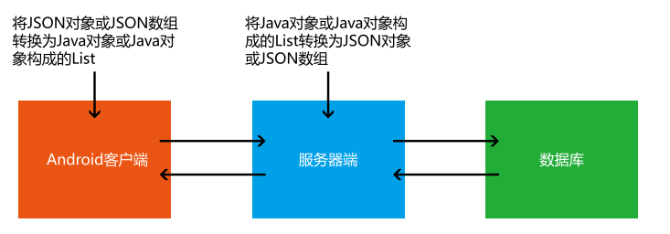
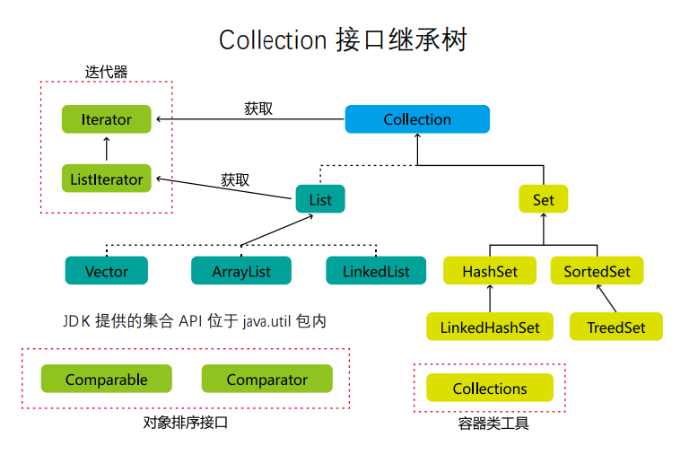
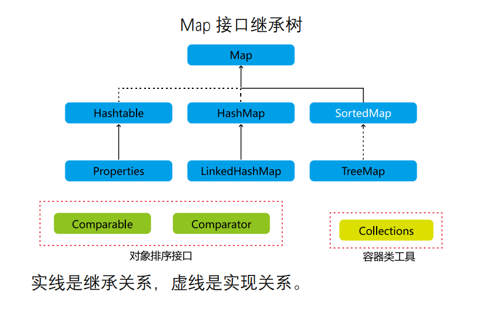
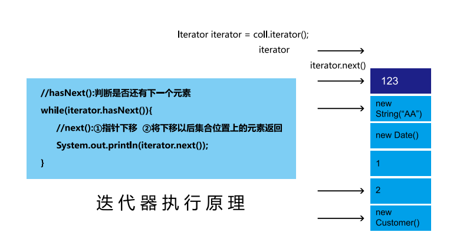
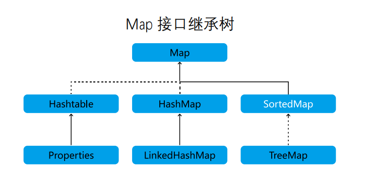
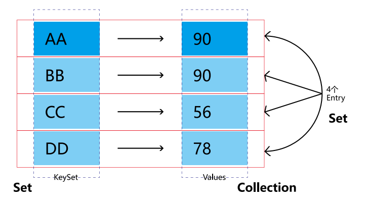

# 11.1 Java 集合框架概述

## 11.1.1 集合框架与数组的对比及概述

一、集合的概述1. 集合、数组都是对多个数据进行存储操作的结构，简称 Java 容器。

说明；此时的存储，主要是指能存层面的存储，不涉及到持久化的存储（.txt,.jpg,.avi, 数据库中）。

### 2.1 数组在存储多个数据封面的特点：

》一旦初始化以后，它的长度就确定了。

》数组一旦定义好，它的数据类型也就确定了。我们就只能操作指定类型的数据了。比如：String[] arr; int[] arr1; Object[] arr2。

### 2.2 数组在存储多个数据方面的缺点：

》一旦初始化以后，其长度就不可修改。

》数组中提供的方法非常有限，对于添加、删除、插入数据等操作，非常不便，同时效率不高。

》获取数组中实际元素的个数的需求，数组没有现成的属性或方法可用。

》数组存储数据的特点：有序、可重复。对于无序、不可重复的需求，不能满足。



## 11.1.2 集合框架涉及到的 API

### Java 集合可分为 Collection 和 Map 两种体系：

Collection 接口：单列数据，定义了存取一组对象的方法的集合。

List：元素有序、可重复的集合。

Set：元素无序、不可重复的集合。

Map 接口：双列数据，保存具有映射关系“key-value 对”的集合。

### 二、集合框架

|---Collection 接口：单列集合，用来存储一个一个的对象

|---List 接口：存储有序的、可重复的数据。 -->“动态”数组

|---ArrayList、LinkedList、Vector

|---Set 接口：存储无序的、不可重复的数据 --> 高中讲的“集合”

|---HashSet、LinkedHashSet、TreeSet

|---Map 接口：双列集合，用来存储一对 (key - value) 一对的数据 -->高中函数：y = f(x)

|---HashMap、LinkedHashMap、TreeMap、Hashtable、Properties





# ** Collection 接口**

### 11.2 Collection 接口方法

### 11.2.1 Collection 接口中的常用方法

 1Collection 接口是 List、Set 和 Queue 接口的父接口，该接口里定义的方法既可用于操作 Set 集合，也可用于操作 List 和 Queue 集合。

JDK 不提供此接口的任何直接实现，而是提供更具体的子接口（如：Set 和 List）实现。

在 Java5 之前，Java 集合会丢失容器中所有对象的数据类型，把所有对象都当成 Object 类型处理；从 JDK 5.0 增加了泛型以后，Java 集合可以记住容器中对象的数据类型。

1、添加 	add(Objec tobj) addAll(Collection coll)

2、获取有效元素的个数	 int size()

3、清空集合 void clear()

4、是否是空集合 boolean isEmpty()

5、是否包含某个元素

① boolean contains(Object obj)：是通过元素的 equals 方法来判断是否是同一个对象。

② boolean containsAll(Collection c)：也是调用元素的 equals 方法来比较的。拿两个集合的元素挨个比较。

6、删除① boolean remove(Object obj)：通过元素的 equals 方法判断是否是要删除的那个元素。只会删除找到的第一个元素。

② boolean removeAll(Collection coll)：取当前集合的差集。

7、取两个集合的交集：boolean retainAll(Collection c)：把交集的结果存在当前集合中，不影响 c。

8、集合是否相等 boolean equals(Object obj)

9、转成对象数组 Object[] toArray()

10、获取集合对象的哈希值 hashCode()

11、遍历 iterator()：返回迭代器对象，用于集合遍历

### 三、Collection 接口中的方法的使用

```
import java.util.ArrayList;
import java.util.Collection;
import java.util.Date;
 class CollectionTest {
    public void test1() {
        Collection coll = new ArrayList();
// add(Object e): 将元素 e 添加到集合 coll 中
        coll.add("AA");
        coll.add("BB");
        coll.add(123); // 自动装箱
        coll.add(new Date());
// size(): 获取添加的元素的个数
        System.out.println(coll.size()); // 4
        // addAll(Collection coll1): 将 coll1 集合中的元素添加到当前的集合中
        Collection coll1 = new ArrayList();
        coll1.add(456);
        coll1.add("CC");
        coll.addAll(coll1);
        System.out.println(coll.size()); // 6
        System.out.println(coll);
// clear(): 清空集合元素
        coll.clear();
// isEmpty(): 判断当前集合是否为空
        System.out.println(coll.isEmpty());
    }
}
```

### 11.2.2 Collection 接口中的常用方法 2

```
import java.util.*;
// 向 Collection 接口的实现类的对象中添加数据 obj 时，要求 obj 所在类要重写 equals().
 class Person {
    private String name;
    private int age;
    public Person() {
        super();
    }
    public Person(String name, int age) {
        this.name = name;
        this.age = age;
    }
    public String getName() {
        return name;
    }
    public void setName(String name) {
        this.name = name;
    }
    public int getAge() {
        return age;
    }
    public void setAge(int age) {
        this.age = age;
    }
    @Override
    public String toString() {
        return "Person{" + "name='" + name + '\'' + ", age=" +
                age + '}';
    }
    @Override
    public boolean equals(Object o) {
        System.out.println("Person equals()....");
        if (this == o)
            return true;
        if (o == null || getClass() != o.getClass())
            return false;
        Person person = (Person) o;
        return age == person.age && Objects.equals(name,
                person.name);
    }
    @Override
    public int hashCode() {
        return Objects.hash(name, age);
    }
}
public class CollectinoTest {
    public void test() {
        Collection coll = new ArrayList();
        coll.add(123);
        coll.add(456);
// Person p = new Person("Jerry",20);
// coll.add(p);
        coll.add(new Person("Jerry", 20));
        coll.add(new String("Tom"));
        coll.add(false);
        // 1.contains(Object obj): 判断当前集合中是否包含 obj
// 我们在判断时会调用 obj 对象所在类的 equals()。
        boolean contains = coll.contains(123);
        System.out.println(contains);
        System.out.println(coll.contains(new String("Tam")));
// System.out.println(coll.contains(p));//true
        System.out.println(coll.contains(new Person("Jerry", 20)));
// false -->true
        // 2.containsAll(Collection coll1): 判断形参 coll1 中的所有元素是否都存在于当前集合中。
        Collection coll1 = Arrays.asList(123, 4567);
        System.out.println(coll.containsAll(coll1));
    }
}
```

### 11.2.3 Collection 接口中的常用方法 3

```
import java.util.ArrayList;
import java.util.Arrays;
import java.util.Collection;
import java.util.Objects;

 class Person {
    private String name;
    private int age;
    public Person() {
        super();
    }
    public Person(String name, int age) {
        this.name = name;
        this.age = age;
    }
    public String getName() {
        return name;
    }
    public void setName(String name) {
        this.name = name;
    }
    public int getAge() {
        return age;
    }
    public void setAge(int age) {
        this.age = age;
    }
    @Override
    public String toString() {
        return "Person{" + "name='" + name + '\'' + ", age=" +
                age + '}';
    }
    @Override
    public boolean equals(Object o) {
        System.out.println("Person equals()....");
        if (this == o)
            return true;
        if (o == null || getClass() != o.getClass())
            return false;
        Person person = (Person) o;
        return age == person.age && Objects.equals(name,
                person.name);
    }
    @Override
    public int hashCode() {
        return Objects.hash(name, age);
    }
}
 class CollectinoTest {
    public void test2() {
// 3.remove(Object obj): 从当前集合中移除 obj 元素。
        Collection coll = new ArrayList();
        coll.add(123);
        coll.add(456);
        coll.add(new Person("Jerry", 20));
        coll.add(new String("Tom"));
        coll.add(false);
        coll.remove(1234);
        System.out.println(coll);
        coll.remove(new Person("Jerry", 20));
        System.out.println(coll);
        // 4. removeAll(Collection coll1): 差集：从当前集合中移除coll1 中所有的元素。
        Collection coll1 = Arrays.asList(123, 456);
        coll.removeAll(coll1);
        System.out.println(coll);
    }
    public void test3() {
        Collection coll = new ArrayList();
        coll.add(123);
        coll.add(456);
        coll.add(new Person("Jerry", 20));
        coll.add(new String("Tom"));
        coll.add(false);
        // 5.retainAll(Collection coll1): 交集：获取当前集合和 coll1 集合的交集，并返回给当前集合
// Collection coll1 = Arrays.asList(123,456,789);
// coll.retainAll(coll1);
// System.out.println(coll);
        // 6.equals(Object obj): 要想返回 true，需要当前集合和形参集合的元素都相同。
        Collection coll1 = new ArrayList();
        coll1.add(456);
        coll1.add(123);
        coll1.add(new Person("Jerry", 20));
        coll1.add(new String("Tom"));
        coll1.add(false);
        System.out.println(coll.equals(coll1));
    }
}

```

### 11.2.4 Collection 接口中的常用方法 4

```
import java.util.*;

 class Person {
    private String name;
    private int age;
    public Person() {
        super();
    }
    public Person(String name, int age) {
        this.name = name;
        this.age = age;
    }
    public String getName() {
        return name;
    }
    public void setName(String name) {
        this.name = name;
    }
    public int getAge() {
        return age;
    }
    public void setAge(int age) {
        this.age = age;
    }
    @Override
    public String toString() {
        return "Person{" + "name='" + name + '\'' + ", age=" +
                age + '}';
    }
    @Override
    public boolean equals(Object o) {
        System.out.println("Person equals()....");
        if (this == o)
            return true;
        if (o == null || getClass() != o.getClass())
            return false;
        Person person = (Person) o;
        return age == person.age && Objects.equals(name,
                person.name);
    }
    @Override
    public int hashCode() {
        return Objects.hash(name, age);
    }
}
public class CollectinoTest {
    public void test4() {
        Collection coll = new ArrayList();
        coll.add(123);
        coll.add(456);
        coll.add(new Person("Jerry", 20));
        coll.add(new String("Tom"));
        coll.add(false);
// 7.hashCode(): 返回当前对象的哈希值
        System.out.println(coll.hashCode());
// 8. 集合 ---> 数组：toArray()
        Object[] arr = coll.toArray();
        for (int i = 0; i < arr.length; i++) {
            System.out.println(arr[i]);
        }
// 拓展：数组 ---> 集合 : 调用 Arrays 类的静态方法 asList()
        List<String> list = Arrays.asList(new String[] { "AA", "BB", "CC" });
    System.out.println(list);
    List arr1 = Arrays.asList(123, 456);
System.out.println(arr1);// [123, 456]
    List arr2 = Arrays.asList(new int[] { 123, 456 });
System.out.println(arr2.size());// 1
    List arr3 = Arrays.asList(new Integer[] { 123, 456 });
System.out.println(arr3.size());// 2
    // 9.iterator(): 返回 Iterator 接口的实例，用于遍历集合元素。放在 IteratorTest.java 中测试
}
}
```

## 11.3 Iterator 迭代器接口

Iterator 对象称为迭代器 ( 设计模式的一种 )，主要用于遍历 Collection 集合中的元素。

GOF 给迭代器模式的定义为：提供一种方法访问一个容器 (container)对象中各个元素，而又不需暴露该对象的内部细节。迭代器模式，就是为容器而生。类似于“公交车上的售票员”、“火车上的乘务员”、“空姐”。

Collection 接口继承了 java.lang.Iterable 接口，该接口有一个 iterator() 方法，那么所有实现了 Collection 接口的集合类都有一个 iterator() 方法，用以返回一个实现了 Iterator 接口的对象。

Iterator 仅用于遍历集合，Iterator 本身并不提供承装对象的能力。如果需要创建 Iterator 对象，则必须有一个被迭代的集合。

集合对象每次调用 iterator() 方法都得到一个全新的迭代器对象，默认游标都在集合的第一个元素之前。

### 11.3.1 迭代器 Iterator 的执行原理



### 11.3.2 使用 Iterator 遍历 Collection

集合元素的遍历操作，使用迭代器 Iterator 接口内部的方法：hasNext() 和 next()

```
import java.util.*;

public class IteratorTest {
    public void test() {
        Collection coll = new ArrayList();
        coll.add(123);
        coll.add(456);
        coll.add(new Person("Jerry", 20));
        coll.add(new String("Tom"));
        coll.add(false);
        Iterator iterator = coll.iterator();
// 方式一：
// System.out.println(iterator.next());
// System.out.println(iterator.next());
// System.out.println(iterator.next());
// System.out.println(iterator.next());
// System.out.println(iterator.next());
// // 报异常：NoSuchElementException
// // 因 为： 在 调 用 it.next() 方 法 之 前 必 须 要 调 用 it.hasNext()
//        进行检测。若不调用，且下一条记录无效，直接调用 it.next() 会抛出
//        NoSuchElementException 异常。
// System.out.println(iterator.next());
        // 方式二：不推荐
// for(int i = 0; i < coll.size(); i++){
// System.out.println(iterator.next());
// }
// 方式三：推荐
        while (iterator.hasNext()) {
            System.out.println(iterator.next());
        }
    }
}
```

### 11.3.3 Iterator 遍历集合的两种错误写法

集合元素的遍历操作，使用迭代器 Iterator 接口：

1. 内部的方法：hasNext() 和 next()；

2. 集合对象每次调用 iterator() 方法都得到一个全新的迭代器对象，默认游标都在集合的第一个元素之前；

3. 内部定义了 remove(), 可以在遍历的时候，删除集合中的元素。此方法不同于集合直接调用 remove()

```
import java.util.*;

public class IteratorTest {
    public void test2() {
        Collection coll = new ArrayList();
        coll.add(123);
        coll.add(456);
        coll.add(new Person("Jerry", 20));
        coll.add(new String("Tom"));
        coll.add(false);
// 错误方式一：
// Iterator iterator = coll.iterator();
// while(iterator.next() != null){
// System.out.println(iterator.next());
// }
// 错误方式二：
// 集合对象每次调用 iterator() 方法都得到一个全新的迭代器对
// 象，默认游标都在集合的第一个元素之前。
        while (coll.iterator().hasNext()) {
            System.out.println(coll.iterator().next());
        }
    }
}
```

### 11.3.4 Iterator 迭代器 remove() 的使用

```
import java.util.*;
public class IteratorTest {
    // 测试 Iterator 中的 remove() 方法

    public void test3() {
        Collection coll = new ArrayList();
        coll.add(123);
        coll.add(456);
        coll.add(new Person("Jerry", 20));
        coll.add(new String("Tom"));
        coll.add(false);
// 删除集合中“Tom”
// 如果还未调用 next() 或在上一次调用 next 方法之后已经调用
// 了 remove 方法，再调用 remove 都会报 IllegalStateException。
        Iterator iterator = coll.iterator();
        while (iterator.hasNext()) {
// iterator.remove();
            Object obj = iterator.next();
            if ("Tom".equals(obj)) {
                iterator.remove();
// iterator.remove(); 
            }
        }
// 遍历集合
        iterator = coll.iterator();
        while (iterator.hasNext()) {
            System.out.println(iterator.next());
        }
    }
}
```

### 11.3.5 新特性 foreach 循环遍历集合或数组

·Java 5.0 提供了 foreach 循环迭代访问 Collection 和数组。

·遍历操作不需获取 Collection 或数组的长度，无需使用索引访问元素。

·遍历集合的底层调用 Iterator 完成操作。

·foreach 还可以用来遍历数组。

```
import java.util.*;

public class ForTest {
    public void test() {
        java.util.Collection coll = new ArrayList();
        coll.add(123);
        coll.add(456);
        coll.add(new String("Tom"));
        coll.add(false);
        // for( 集合元素的类型 局部变量 : 集合对象 ), 内部仍然调用了迭
//        代器。
        for (Object obj : coll) {
            System.out.println(obj);
        }
    }

    public void test2() {
        int[] arr = new int[] { 1, 2, 3, 4, 5, 6 };
// for( 数组元素的类型 局部变量 : 数组对象 )
        for (int i : arr) {
            System.out.println(i);
        }
    }
//·Java 5.0 提供了 foreach 循环迭代访问 Collection 和
//    数组。
//            ·遍历操作不需获取 Collection 或数组的长度，无需
//    使用索引访问元素。
//            ·遍历集合的底层调用 Iterator 完成操作。
//            ·foreach 还可以用来遍历数组。
//            398 399
    // 练习题
    public void test3() {
        String[] arr = new String[] { "SS", "KK", "RR" };
// // 方式一：普通 for 赋值
// for (int i = 0; i < arr.length; i++) {
// arr[i] = "HH";
// }
// 方式二：增强 for 循环
        for (String s : arr) {
            s = "HH";
        }
        for (int i = 0; i < arr.length; i++) {
            System.out.println(arr[i]);
        }
    }
}
```

### 11.4 Collection 子接口之一：List 接口

鉴于 Java 中数组用来存储数据的局限性，我们通常使用 List 替代数组；

·List 集合类中元素有序、且可重复，集合中的每个元素都有其对应的顺序索引；

·List 容器中的元素都对应一个整数型的序号记载其在容器中的位置，可以根据序号存取容器中的元素；

·JDK API 中 List 接 口 的 实 现 类 常 用 的 有：ArrayList、LinkedList 和 Vector

### 11.4.1 List 接口常用实现类的对比

1. List 接口框架

|----Collection 接口：单列集合，用来存储一个一个的对象；

|----List 接口：存储有序的、可重复的数据。 -->“动态”数组 ,替换原有的数组；

|----ArrayList：作为 List 接口的主要实现类；线程不安全的，效率高；底层使用 Object[] elementData 存储；

|----LinkedList：对于频繁的插入、删除操作，使用此类效率比 ArrayList 高；底层使用双向链表存储；

|----Vector：作为 List 接口的古老实现类；线程安全的，效率低；底层使用 Object[] elementData 存储。

面试题：比较 ArrayList、LinkedList、Vector 三者的异同？同：三个类都是实现了 List 接口，存储数据的特点相同：存储有序的、可重复的数据不同：见上

### 11.4.2 ArrayList 的源码分析

#### 2.ArrayList 的源码分析：

##### 2.1 jdk 7 情况下

ArrayList list = new ArrayList();// 底层创建了长度是 10 的 Object[] 数组 elementData；

list.add(123);//elementData[0] = new Integer(123)；

...

list.add(11);// 如果此次的添加导致底层 elementData 数组容量不够，则扩容。默认情况下，扩容为原来的容量的 1.5 倍，同时需要将原有数组中的数据复制到新的数组中。

结论：建议开发中使用带参的构造器：ArrayList list = new ArrayList(int capacity)

##### 2.2 jdk 8 中 ArrayList 的变化：

ArrayList list = new ArrayList();// 底层 Object[] elementData初始化为 {}. 并没有创建长度为 10 的数组；

list.add(123);// 第一次调用 add() 时，底层才创建了长度 10 的数组，并将数据 123 添加到 elementData[0]；

...后续的添加和扩容操作与 jdk 7 无异。

2.3 小结：jdk7 中的 ArrayList 的对象的创建类似于单例的饿汉式，而jdk8 中的 ArrayList 的对象的创建类似于单例的懒汉式，延迟了数组的创建，节省内存。

### 11.4.3 LinkedList 的源码分析

对 于 频 繁 的 插 入 或 删 除 元 素 的 操 作， 建 议 使 用LinkedList 类，效率较高。

LinkedList：双向链表，内部没有声明数组，而是定义了 Node 类型的 first 和 last，用于记录首末元素。同时，定义内部类Node，作为LinkedList中保存数据的基本结构。

##### 3.LinkedList 的源码分析：

LinkedList list = new LinkedList(); // 内部声明了 Node 类型的 first 和 last 属性，默认值为 null。

list.add(123); // 将 123 封装到 Node 中，创建了 Node 对象。

其中，Node 定义为：体现了 LinkedList 的双向链表的说法。

private static class Node {

E item;Node next;

Node prev;

Node(Node prev, E element, Node next) {

this.item = element;

this.next = next; //next 变量记录下一个元素的位置

this.prev = prev; //prev 变量记录前一个元素的位置

}

}

### 11.4.4 Vector 的源码分析

Vector 是一个古老的集合，JDK1.0 就有了。大多数操作与ArrayList相同，区别之处在于Vector是线程安全的。

在各种 list 中，最好把 ArrayList 作为缺省选择。当插入、删除频繁时，使用 LinkedList；Vector 总是比ArrayList 慢，所以尽量避免使用。4.Vector 的源码分析：

jdk7 和 jdk8 中通过 Vector() 构造器创建对象时，底层都创建了长度为10 的数组。

在扩容方面，默认扩容为原来的数组长度的 2 倍。

### 11.4.5 List 接口中的常用方法测试

List 除了从 Collection 集合继承的方法外，List 集合里添加了一些根据索引来操作集合元素的方法。

5.List 接口的常用方法：

void add(intindex, Object ele)：在 index 位置插入 ele 元素；

boolean addAll(int index, Collection eles)：从 index 位置开始将 eles 中的所有元素添加进来；

Object get(int index)：获取指定 index 位置的元素；

int indexOf(Object obj)：返回 obj 在集合中首次出现的位置；

int lastIndexOf(Object obj)：返回 obj 在当前集合中末次出现的位置；

Object remove(int index)：移除指定 index 位置的元素，并返回此元素

；Object set(int index, Object ele)：设置指定 index 位置的元素为 ele；

List subList(int fromIndex, int toIndex)：返回从 fromIndex 到 toIndex 位置的子集合。

总结：常用方法

增：add(Object obj)

删：remove(int index) / remove(Object obj)

改：set(int index, Object ele)

查：get(int index)

插：add(int index, Object ele)

长度：size()遍历：

① Iterator 迭代器方式 ② 增强 for 循环 ③ 普通的循环

```
import java.util.*;
public class ListTest {
    public void test3() {
        ArrayList list = new ArrayList();
        list.add(123);
        list.add(456);
        list.add("AA");
// 方式一：Iterator 迭代器方式
        Iterator iterator = list.iterator();
        while (iterator.hasNext()) {
            System.out.println(iterator.next());
        }
        System.out.println("***************");
// 方式二：增强 for 循环
        for (Object obj : list) {
            System.out.println(obj);
        }
        System.out.println("***************");
// 方式三：普通 for 循环
        for (int i = 0; i < list.size(); i++) {
            System.out.println(list.get(i));
        }
    }
    public void tets2() {
        ArrayList list = new ArrayList();
        list.add(123);
        list.add(456);
        list.add("AA");
        list.add(456);
        // int indexOf(Object obj): 返回 obj 在集合中首次出现的位置。
        // 如果不存在，返回 -1.
        int index = list.indexOf(4567);
        System.out.println(index);
        // int lastIndexOf(Object obj): 返回 obj 在当前集合中末次出
        // 现的位置。如果不存在，返回 -1.
        System.out.println(list.lastIndexOf(456));
        // Object remove(int index): 移除指定 index 位置的元素，并
        // 返回此元素
        Object obj = list.remove(0);
        System.out.println(obj);
        System.out.println(list);
        // Object set(int index, Object ele): 设置指定 index 位置的元
        // 素为 ele
        list.set(1, "CC");
        System.out.println(list);
        // List subList(int fromIndex, int toIndex): 返回从 fromIndex
        // 到 toIndex 位置的左闭右开区间的子集合
        List subList = list.subList(2, 4);
        System.out.println(subList);
        System.out.println(list);
    }
    public void test() {
        ArrayList list = new ArrayList();
        list.add(123);
        list.add(456);
        list.add("AA");
        list.add(456);
        System.out.println(list);
        //void add(int index, Object ele): 在 index 位置插入 ele 元素
        list.add(1, "BB");
        System.out.println(list);
        // boolean addAll(int index, Collection eles): 从 index 位置
        // 开始将 eles 中的所有元素添加进来
        List list1 = Arrays.asList(1, 2, 3);
        list.addAll(list1);
// list.add(list1);
        System.out.println(list.size());// 9
// Object get(int index): 获取指定 index 位置的元素
        System.out.println(list.get(2));
    }
}
```

### 11.4.6 List 的一个面试小题

请问 ArrayList/LinkedList/Vector 的异同？谈谈你的理解？ArrayList 底层是什么？扩容机制？ Vector 和 ArrayList 的最大区别？

ArrayList 和 LinkedList 的异同二者都线程不安全，相对线程安全的Vector，执行效率高。

此外，ArrayList 是实现了基于动态数组的数据结构，LinkedList 基于链表的数据结构。

对于随机访问 get 和 set，ArrayList 觉得优于 LinkedList，因为 LinkedList要移动指针。

对于新增和删除操作 add( 特指插入 ) 和 remove，LinkedList 比较占优势，因为 ArrayList 要移动数据。

ArrayList 和 Vector 的区别 Vector 和 ArrayList 几乎是完全相同的，唯一的区别在于 Vector 是同步类 (synchronized)，属于强同步类。因此开销就比 ArrayList 要大，访问要慢。

正常情况下，大多数的 Java程序员使用 ArrayList 而不是 Vector，因为同步完全可以由程序员自己来控制。Vector 每次扩容请求其大小的 2 倍空间，而 ArrayList 是 1.5 倍。

Vector 还有一个子类 Stack。

区分 List 中 remove(int index) 和 remove(Object obj)

```
public class ListEver {
    public void testListRemove() {
        List list = new ArrayList();
        list.add(1);
        list.add(2);
        list.add(3);
        updateList(list);
        System.out.println(list);
    }
    private void updateList(List list) {
// list.remove(2);
        list.remove(new Integer(2));
    }
}
```

## 11.5 Collection 子接口之二：Set 接口

Set 接口是 Collection 的子接口，set 接口没有提供额外的方法。

Set 集合不允许包含相同的元素，如果试把两个相同的元素加入同一个 Set 集合中，则添加操作失败。

Set 判断两个对象是否相同不是使用 == 运算符，而是根据 equals() 方法。

#### 11.5.1 Set 接口实现类的对比

1.Set 接口的框架：

|----Collection 接口：单列集合，用来存储一个一个的对象；

|----Set 接口：存储无序的、不可重复的数据--> 高中讲的“集合”；

|----HashSet：作为 Set 接口的主要实现类；线程不安全的；可以存储 null 值；

|----LinkedHashSet：作为 HashSet 的子类；遍历其内部数据时，可以按照添加的顺序遍历；对于频繁的遍历操作，LinkedHashSet 效率高于 HashSet。

|----TreeSet：可以按照添加对象的指定属性，进行排序。

#### 11.5.2 Set 的无序性与不可重复性的理解

1.Set 接口中没有定义额外的方法，使用的都是 Collection 中声明过的方法。

2. 要求：向 Set( 主要指：HashSet、LinkedHashSet) 中添加的数据，其所在的类一定要重写 hashCode() 和 equals()要求：重写的 hashCode() 和 equals() 尽可能保持一致性：相等的对象必须具有相等的散列码 

重写两个方法的小技巧：对象中用作 equals() 方法比较的 Field，都应该用来计算 hashCode 值。

#### 一、Set: 存储无序的、不可重复的数据

1. 无序性：不等于随机性。存储的数据在底层数组中并非按照数组索引的顺序添加，而是根据数据的哈希值决定的。

2. 不可重复性：保证添加的元素按照 equals() 判断时，不能返回 true. 即：相同的元素只能添加一个。

#### 二、添加元素的过程：以 HashSet 为例：

我们向 HashSet 中添加元素 a，首先调用元素 a 所在类的 hashCode() 方法，计算元素 a 的哈希值，

此哈希值接着通过某种算法计算出在 HashSet 底层数组中的存放位置（即为：索引位置），判断：数组此位置上是否已经有元素：如果此位置上没有其他元素，则元素 a 添加成功。 ---> 情况 1

如果此位置上有其他元素 b( 或以链表形式存在的多个元素），则比较元素 a 与元素 b 的 hash 值：如果 hash 值不相同，则元素 a 添加成功。

---> 情况 2

如果 hash 值相同，进而需要调用元素a所在类 equals() 方法：

equals() 返回 true, 元素 a 添加失败；

equals() 返回 false, 则元素 a 添加成功。

---> 情况 2 

对于添加成功的情况 2 和情况 3 而言：元素 a 与已经存在指定索引位置上数据以链表的方式存储。 jdk 7 : 元素 a 放到数组中，指向原来的元素。

 jdk 8 : 原来的元素在数组中，指向元素 a

总结：七上八下

**HashSet 底层：数组 + 链表的结构。**

#### Set 实现类之一：HashSet

HashSet 是 Set 接口的典型实现，大多数时候使用 Set 集合时都使用这个实现类。

HashSet 按 Hash 算法来存储集合中的元素，因此具有很好的存取、查找、删除性能。

HashSet 具有以下特点：

①不能保证元素的排列顺序； 

② HashSet 不是线程安全的；

 ③集合元素可以是 null。底层也是数组，初始容量为 16，当如果使用率超过 0.75，（16*0.75=12）就会扩大容量为原来的 2 倍。（16 扩容为 32，依次为 64,128…等）。

HashSet 集合判断两个元素相等的标准：两个对象通过 hashCode() 方法比较相等，并且两个对象的 equals() 方法返回值也相等。

对 于 存 放 在 Set 容 器 中 的 对 象， 对 应 的 类 一 定 要 重 写 equals() 和hashCode(Object obj) 方法，以实现对象相等规则。即：“相等的对象必须具有相等的散列码”。

```
import java.util.*;
public class SetTest {
    public void test() {
        Set set = new HashSet();
        set.add(123);
        set.add(456);
        set.add("fgd");
        set.add("book");
        set.add(new User("Tom", 12));
        set.add(new User("Tom", 12));
        set.add(129);
        Iterator iterator = set.iterator();
        while (iterator.hasNext()) {
            System.out.println(iterator.next());

        }
    }
}
public class User {
    private String name;
    private int age;
    public User() { }
    public User(String name, int age) {
        this.name = name;
        this.age = age;
    }
    public String getName() {
        return name;
    }
    public void setName(String name) {
        this.name = name;
    }
    public int getAge() {
        return age;
    }
    public void setAge(int age) {
        this.age = age;
    }
    @Override
    public String toString() {
        return "User{" + "name='" + name + '\'' + ", age=" + age
                + '}';
    }
    @Override
    public boolean equals(Object o) {
        System.out.println("User equals()....");
        if (this == o)
            return true;
        if (o == null || getClass() != o.getClass())
            return false;
        User user = (User) o;
        if (age != user.age)
            return false;
        return name != null ? name.equals(user.name) : user.name
                == null; }
    @Override
    public int hashCode() {
        int result = name != null ? name.hashCode() : 0;
        result = 31 * result + age;
        return result;
    }
}

```

### 11.5.3 关于 hashCode() 和 equals() 的重写

**重写 hashCode() 方法的基本原则：**

在程序运行时，同一个对象多次调用 hashCode() 方法应该返回相同的值。

当两个对象的 equals() 方法比较返回 true 时，这两个对象的 hashCode()方法的返回值也应相等。

对象中用作 equals() 方法比较的 Field，都应该用来计算 hashCode 值。

**重写 equals() 方法的基本原则：**

以自定义的 Customer 类为例，何时需要重写 equals() ？

当一个类有自己特有的“逻辑相等”概念 , 当改写 equals() 的时候，总是要改写 hashCode()，根据一个类的 equals 方法（改写后），两个截然不同的实例有可能在逻辑上是相等的，但是，根据 Object.hashCode() 方法，它们仅仅是两个对象。

因此，违反了“相等的对象必须具有相等的散列码”。

结论：复写 equals 方法的时候一般都需要同时复写 hashCode 方法。通常参与计算 hashCode 的对象的属性也应该参与到 equals() 中进行计算。

**Eclipse/IDEA 工具里 hashCode() 的重写：**

以 Eclipse/IDEA 为例，在自定义类中可以调用工具自动重写 equals 和hashCode。问题：为什么用 Eclipse/IDEA 复写 hashCode 方法，有 

选择系数的时候要选择尽量大的系数。因为如果计算出来的 hash 地址越大，所谓的“冲突”就越少，查找起来效率也会提高。（减少冲突）并且 31 只占用 5bits, 相乘造成数据溢出的概率较小。

31可以由i*31== (i<<5)-1来表示,现在很多虚拟机里面都有做相关优化。（提高算法效率）

31 是一个素数，素数作用就是如果我用一个数字来乘以这个素数，那么最终出来的结果只能被素数本身和被乘数还有 1 来整除！ ( 减少冲突 )

### 11.5.4 LinkedHashSet 的使用

#### Set 实现类之二：LinkedHashSet

·LinkedHashSet 是 HashSet 的子类

·LinkedHashSet 根据元素的 hashCode 值来决定元素的存储位置，但它同时使用双向链表维护元素的次序，这使得元素看起来是以插入顺序保存的。

·LinkedHashSet 插入性能略低于 HashSet，但在迭代访问 Set 里的全部元素时有很好的性能。

·LinkedHashSet 不允许集合元素重复。

#### LinkedHashSet 的使用：

·LinkedHashSet 作为 HashSet 的子类，在添加数据的同时，每个数据还维护了两个引用，记录此数据前一个数据和后一个数据。

优点：对于频繁的遍历操作，LinkedHashSet 效率高于 HashSet

### 11.5.5 TreeSet 的自然排序与定制排序

Set 实现类之三：TreeSet

·TreeSet 是 SortedSet 接口的实现类，TreeSet 可以确保集合元素处于排序状态。

·TreeSet 底层使用红黑树结构存储数据。

**·新增的方法如下：( 了解 )**

·Comparator comparator()

·Object first()·Object last()

·Object lower(Object e)

·Object higher(Object e)

·SortedSet subSet(fromElement, toElement)

·SortedSet headSet(toElement)·SortedSet tailSet(fromElement)

·TreeSet 两种排序方法：自然排序和定制排序。默认情况下，TreeSet 采用自然排序。

·TreeSet 和后面要讲的 TreeMap 采用红黑树的存储结构。

·特点：有序，查询速度比 List 快。

·自然排序：TreeSet 会调用集合元素的 compareTo(Object obj) 方法来比较元素之间的大小关系，然后将集合元素按升序 ( 默认情况 ) 排列。

· 如 果 试 图 把 一 个 对 象 添 加 到 TreeSet 时， 则 该 对 象 的 类 必 须 实 现Comparable 接口。

·实现 Comparable 的类必须实现 compareTo(Object obj) 方法，两个对象即通过 compareTo(Object obj) 方法的返回值来比较大小。

**·Comparable 的典型实现：**

·BigDecimal、BigInteger 以及所有的数值型对应的包装类：按它们对应的数值大小进行比较。

·Character：按字符的 unicode 值来进行比较。

·Boolean：true 对应的包装类实例大于 false 对应的包装类实例。

·String：按字符串中字符的 unicode 值进行比较。·Date、Time：后边的时间、日期比前面的时间、日期大。

·向 TreeSet 中添加元素时，只有第一个元素无须比较 compareTo() 方法，后面添加的所有元素都会调用 compareTo() 方法进行比较。

·因为只有相同类的两个实例才会比较大小，所以向 TreeSet 中添加的应该是同一个类的对象。·对于 TreeSet 集合而言，它判断两个对象是否相等的唯一标准是：两个对象通过 compareTo(Object obj) 方法比较返回值。

·当需要把一个对象放入 TreeSet 中，重写该对象对应的 equals() 方法时，应保证该方法与 compareTo(Object obj) 方法有一致的结果：如果两个对象通过equals() 方法比较返回 true，则通过 compareTo(Object obj) 方法比较应返回 0。否则，让人难以理解。

1. 向 TreeSet 中添加的数据，要求是相同类的对象。

2. 两种排序方式：自然排序（实现 Comparable 接口） 和 定制排序（Comparator）。

3. 自然排序中，比较两个对象是否相同的标准为：compareTo() 返回 0. 不再是 equals()。

4. 定制排序中，比较两个对象是否相同的标准为：compare() 返回 0. 不再是 equals()。

```
import java.util.*;

public class TreeSetTest {
    public void test() {
        TreeSet set = new TreeSet();
// 失败：不能添加不同类的对象
// set.add(123);
// set.add(456);
// set.add("AA");
// set.add(new User("Tom", 12));
// 举例一：
// set.add(34);
// set.add(-34);
// set.add(43);
// set.add(11);
// set.add(8);
// Set 实现类之三：TreeSet 414 415
// 举例二：
        set.add(new User("Tom", 12));
        set.add(new User("Jerry", 32));
        set.add(new User("Jim", 2));
        set.add(new User("Mike", 65));
        set.add(new User("Jack", 33));
        set.add(new User("Jack", 56));
        Iterator iterator = set.iterator();
        while (iterator.hasNext()) {
            System.out.println(iterator.next());

        }
    }
}
public class TreeSetTest {
    public void tets2() {
        Comparator com = new Comparator() {
            // 按照年龄从小到大排列
            @Override
            public int compare(Object o1, Object o2) {
                if (o1 instanceof User && o2 instanceof User) {
                    User u1 = (User) o1;
                    User u2 = (User) o2;
                    return Integer.compare(u1.getAge(),
                            u2.getAge());
                } else {
                    throw new RuntimeException(" 输入的数据类 型不匹配 ");

                }

            }
        };
        TreeSet set = new TreeSet(com);
        set.add(new User("Tom", 12));
        set.add(new User("Jerry", 32));
        set.add(new User("Jim", 2));
        set.add(new User("Mike", 65));
        set.add(new User("Mary", 33));
        set.add(new User("Jack", 33));
        set.add(new User("Jack", 56));
        Iterator iterator = set.iterator();
        while (iterator.hasNext()) {
            System.out.println(iterator.next());

        }
    }
}
public class User implements Comparable {
    private String name;
    private int age;
    public User() { }
    public User(String name, int age) {
        this.name = name;
        this.age = age;
    }
    public String getName() {
        return name;
    }
    public void setName(String name) {
        this.name = name;
    }
    public int getAge() {
        return age;
    }
    public void setAge(int age) {
        this.age = age;
    }
416 417
    @Override
    public String toString() {
        return "User{" + "name='" + name + '\'' + ", age=" + age
                + '}';
    }
    @Override
    public boolean equals(Object o) {
        System.out.println("User equals()....");
        if (this == o)
            return true;
        if (o == null || getClass() != o.getClass())
            return false;
        User user = (User) o;
        if (age != user.age)
            return false;
        return name != null ? name.equals(user.name) : user.name
                == null;
    }
    @Override
    public int hashCode() { // return name.hashCode() + age;
        int result = name != null ? name.hashCode() : 0;
        result = 31 * result + age;
        return result;
    }
    // 按照姓名从大到小排列 , 年龄从小到大排列
    @Override
    public int compareTo(Object o) {
        if (o instanceof User) {
            User user = (User) o;
// return this.name.compareTo(user.name); 
            // 按照姓名从小到大排列
// return -this.name.compareTo(user.name); 
// 按照姓名从大到小排列
            int compare = -this.name.compareTo(user.name);
// 按照姓名从大到小排列
            if (compare != 0) { // 年龄从小到大排列
                return compare;
            } else {
                return Integer.compare(this.age, user.age);
            }
        } else {
            throw new RuntimeException(" 输入的类型不匹配 ");
        }
    }
}
```

# 11.6 Map 接口



## 11.6.1 Map 接口及其多个实现类的对比

一、Map 的实现类的结构：

|----Map：双列数据，存储 key-value 对的数据--- 类似于高中的函数：y = f(x)；

|----HashMap：作为 Map 的主要实现类；线程不安全的，效率高；存储 null 的 key 和 value；

|----LinkedHashMap: 保证在遍历 map 元素时，可以按照添加的顺序实现遍历。原因：在原有的 HashMap 底层结构基础上，添加了一对指针，指向前一个和后一个元素。对于频繁的遍历操作，此类执行效率高于HashMap。

|----TreeMap：保证按照添加的 key-value 对进行排序，实现排序遍历。此时考虑 key 的自然排序或定制排序底层使用红黑树；

|----Hashtable：作为古老的实现类；线程安全的，效率低；不能存储 null 的 key 和 value；

|----Properties：常用来处理配置文件。key 和 value 都是 String类型。HashMap 的底层：数组 + 链表（jdk7 及之前） 数组 + 链表 + 红黑树（jdk 8）

## 二、Map 结构的理解：

Map 中的 key：无序的、不可重复的，使用 Set 存储所有的 key ---> key 所在的类要重写 equals() 和 hashCode() （以 HashMap 为例）。

Map 中的 value：无序的、可重复的，使用 Collection 存储所有的 value --->value 所在的类要重写 equals()。

一个键值对：key-value 构成了一个 Entry 对象。

Map 中的 entry: 无序的、不可重复的，使用 Set 存储所有的 entry。

## 三、HashMap 的底层实现原理？以 jdk7 为例说明：

HashMap map = new HashMap()：

在实例化以后，底层创建了长度是 16 的一维数组 Entry[] table。

... 可能已经执行过多次 put...

map.put(key1,value1)：

首先，调用 key1 所在类的 hashCode() 计算 key1 哈希值，此哈希值经过某种算法计算以后，得到在 Entry 数组中的存放位置。

如果此位置上的数据为空，此时的 key1-value1 添加成功。-- 情况 1

如果此位置上的数据不为空，( 意味着此位置上存在一个或多个数据 ( 以链表形式存在 )), 比较 key1 和已经存在的一个或多个数据的哈希值：

如果 key1 的哈希值与已经存在的数据的哈希值都不相同，此时key1-value1 添加成功。-- 情况 2

如果 key1 的哈希值和已经存在的某一个数据 (key2-value2) 的哈希值相同，继续比较：调用 key1 所在类的 equals(key2) 方法，比较：如果 equals() 返回 false：此时 key1-value1 添加成功。-- 情况 3

如果 equals() 返回 true：使用 value1 替换 value2。

补充：关于情况 2 和情况 3：此时 key1-value1 和原来的数据以链表的方式存储。

在不断的添加过程中，会涉及到扩容问题，当超出临界值 ( 且要存放的位置非空 ) 时，扩容。默认的扩容方式：扩容为原来容量的 2 倍，并将原有的数据复制过来。 

## 五、Map 中定义的方法：

### 添加、删除、修改操作：·

Object put(Object key,Object value)：将指定 key-value 添加到 ( 或修改 ) 当前 map 对象中；

·void putAll(Map m): 将 m 中的所有 key-value 对存放到当前 map 中；

·Object remove(Object key)：移除指定 key 的 key-value 对，并返回 value；

·void clear()：清空当前 map 中的所有数据。

### 元素查询的操作：

·Object get(Object key)：获取指定 key 对应的 value；

·boolean containsKey(Object key)：是否包含指定的 key；

·boolean containsValue(Object value)：是否包含指定的 value；

·int size()：返回 map 中 key-value 对的个数；

·boolean isEmpty()：判断当前 map 是否为空；

·boolean equals(Object obj)：判断当前 map 和参数对象 obj 是否相等。

### 元视图操作的方法：

·Set keySet()：返回所有 key 构成的 Set 集合；

·Collection values()：返回所有 value 构成的 Collection 集合；

·Set entrySet()：返回所有 key-value 对构成的 Set 集。

### 总结：常用方法：

添加：put(Object key,Object value)

删除：remove(Object key)

修改：put(Object key,Object value)

查询：get(Object key)

长度：size()

遍历：keySet() / values() / entrySet()

## 11.6.2 Map 中存储的 key-value 的特点



·Map 与 Collection 并列存在。用于保存具有映射关系的数据：key-value。

·Map 中的 key 和 value 都可以是任何引用类型的数据。

·Map 中的 key 用 Set 来存放，不允许重复，即同一个 Map 对象所对应的类，须重写 hashCode() 和 equals() 方法。

常用 String 类作为 Map 的“键”：

key 和 value 之间存在单向一对一关系，即通过指定的 key 总能找到唯一的、确定的 value。

Map 接 口 的 常 用 实 现 类：HashMap、TreeMap、LinkedHashMap 和Properties。其中，HashMap 是 Map 接口使用频率最高的实现类。

## 11.6.3 Map 实现类之一：HashMap

·HashMap 是 Map 接口使用频率最高的实现类。

·允许使用 null 键和 null 值，与 HashSet 一样，不保证映射的顺序。

·所有的 key 构成的集合是 Set：无序的、不可重复的。所以，key 所在的类要重写：equals() 和 hashCode()。

·所有的 value 构成的集合是 Collection：无序的、可以重复的。所以，value 所在的类要重写：equals()。·一个 key-value 构成一个 entry。

·所有的 entry 构成的集合是 Set：无序的、不可重复的。

·HashMap 判断两个 key 相等的标准是：两个 key 通过 equals() 方法返回 true，hashCode 值也相等。

·HashMap 判断两个 value 相等的标准是：两个 value 通过 equals() 方法返回 true。

### HashMap 源码中的重要常量

·DEFAULT_INITIAL_CAPACITY：HashMap 的默认容量，16；

·MAXIMUM_CAPACITY：HashMap 的最大支持容量，2^30；

·DEFAULT_LOAD_FACTOR：HashMap 的默认加载因子；

·TREEIFY_THRESHOLD：Bucket 中链表长度大于该默认值，转化为红黑树；

·UNTREEIFY_THRESHOLD：Bucket 中红黑树储存的 Node 小于该默认值，转化为链表；

·MIN_TREEIFY_CAPACITY：同种的 Node 树被化时的最小的 hash表容量。（当桶中 Node 的；·数量大道需要变红黑树时，若 hash 表容量小于 MIN_TREEIFY_CAPACITY 时，此时应执行；·resize 扩 容 操 作 这 个 MIN_TREEIFY_CAPACITY 的 值 至 少 是TREEIFY_THRESHOLD 的 4 倍。）；

·table：储存元素的数组，总是 2 的 n 次幂；

·entrySet：储存具体元素的集；

·size：HashMap 中储存的键值对的数量；

·modCount：HashMap 扩容和结构改变的次数；

·threshold：扩容的临界值，= 容量 * 填充因子；·loadFactor：填充因子。

### 11.6.4 HashMap 的底层实现原理

#### HashMap 源码中的重要常量

 DEFAULT_INITIAL_CAPACITY：HashMap 的默认容量，16

DEFAULT_LOAD_FACTOR：HashMap 的默认加载因子：0.75

threshold：扩容的临界值，= 容量 * 填充因子：16 * 0.75 => 12

TREEIFY_THRESHOLD：Bucket 中链表长度大于该默认值，转化为红黑树：8

MIN_TREEIFY_CAPACITY：桶中的 Node 被树化时最小的 hash 表容量 :64

#### HashMap 在 JDK7 中的底层实现原理：

HashMap 的内部存储结构其实是数组和链表的结合。当实例化一个HashMap 时，系统会创建一个长度为 Capacity 的 Entry 数组，这个长度在哈希表中被称为容量 (Capacity)，在这个数组中可以存放元素的位置我们称之为“桶”(bucket)，每个 bucket 都有自己的索引，系统可以根据索引快速的查找 bucket 中的元素。

每个 bucket 中存储一个元素，即一个 Entry 对象，但每一个 Entry 对象可以带一个引用变量，用于指向下一个元素，因此，在一个桶中，就有可能生成一个 Entry 链。而且新添加的元素作为链表的 head。

**添加元素的过程：**

向 HashMap 中添加 entry1(key，value)，需要首先计算 entry1 中 key 的哈希值 ( 根据 key 所在类的 hashCode() 计算得到 )，此哈希值经过处理以后，得到在底层 Entry[] 数组中要存储的位置 i。如果位置 i 上没有元素，则 entry1 直接添加成功。如果位置 i 上已经存在 entry2( 或还有链表存在的 entry3，entry4)，则需要通过循环的方法，依次比较 entry1 中 key 的 hash 值和其他的 entry 的 hash 值。如果彼此 hash 值不同，则直接添加成功。如果 hash 值相同，继续比较二者是否 equals。如果返回值为 true，则使用 entry1 的 value 去替换 equals 为 true 的 entry 的 value。如果遍历一遍以后，发现所有的 equals 返回都为 false, 则 entry1 仍可添加成功。entry1 指向原有的 entry 元素

#### HashMap 在 JDK8 中的底层实现原理

HashMap 的内部存储结构其实是数组 + 链表 + 红黑树的结合。当实例化一个 HashMap 时，会初始化 initialCapacity 和 loadFactor，在 put 第一对映射关系时，系统会创建一个长度为 initialCapacity 的 Node 数组，这个长度在哈希表中被称为容量 (Capacity)，在这个数组中可以存放元素的位置我们称之为“桶”(bucket)，每个 bucket 都有自己的索引，系统可以根据索引快速的查找 bucket 中的元素。

每个 bucket 中存储一个元素，即一个 Node 对象，但每一个 Node 对象可以带一个引用变量 next，用于指向下一个元素，因此，在一个桶中，就有可能生成一个 Node 链。也可能是一个一个 TreeNode 对象，每一个TreeNode 对象可以有两个叶子结点 left 和 right，因此，在一个桶中，就有可能生成一个 TreeNode 树。而新添加的元素作为链表的 last，或树的叶子结点。

#### 那么 HashMap 什么时候进行扩容和树形化呢？

当 HashMap 中的元素个数超过数组大小 ( 数组总大小 length, 不是数组中个数 size)*loadFactor 时，就会进行数组扩容，loadFactor 的默认值(DEFAULT_LOAD_FACTOR) 为 0.75，这是一个折中的取值。也就是说，默认情况下，数组大小 (DEFAULT_INITIAL_CAPACITY) 为 16，那么当HashMap 中元素个数超过 16*0.75=12（这个值就是代码中的 threshold 值，也叫做临界值）的时候，就把数组的大小扩展为 2*16=32，即扩大一倍，然后重新计算每个元素在数组中的位置，而这是一个非常消耗性能的操作，所以如果我们已经预知 HashMap 中元素的个数，那么预设元素的个数能够有效的提高 HashMap 的性能。

#### 关于映射关系的 key 是否可以修改？ answer：不要修改

映射关系存储到 HashMap 中会存储 key 的 hash 值，这样就不用在每次查找时重新计算每一个 Entry 或 Node（TreeNode）的 hash 值了，因此如果已经 put 到 Map 中的映射关系，再修改 key 的属性，而这个属性又参与hashcode 值的计算，那么会导致匹配不上。

### 11.6.5 Map 实现类之二：LinkedHashMap

LinkedHashMap 是 HashMap 的子类。在 HashMap 存储结构的基础上，使用了一对双向链表来记录添加元素的顺序。与 LinkedHashSet 类似，LinkedHashMap 可以维护 Map 的迭代顺序：迭代顺序与 Key-Value 对的插入顺序一致。

#### HashMap 中的内部类：Node。

```
static class Node<K, V> implements Map.Entry<K, V> {
    final int hash;
    final K key;
    V value;
    Node<K, V> next;
}
```

#### LinkedHashMap 中的内部类：Entry

```
static class Entry<K, V> extends HashMap.Node<K, V> {
    Entry<K, V> before, after;
    Entry(int hash, K key, V value, Node<K, V> next) {
        super(hash, key, value, next);
    }
}
```

### 11.6.6 Map 中的常用方法

```
import java.util.*;

public class MapTest {
    /**
     * 元素查询的操作： 
     Object get(Object key)：获取指定 key 对应的 value ；
     boolean containsKey(Object key)：是否包含指定的 key ；
     boolean containsValue(Object value)：是否包含指定的 value ；
     int size()：返回 map 中 key-value 对的个数 ；
     boolean isEmpty()：判断当前 map 是否为空；
     boolean equals(Object obj)：判断当前 map 和参数对象 obj 是否相等。
     */
    public void test4() {
        Map map = new HashMap();
        map.put("AA", 123);
        map.put(45, 123);
        map.put("BB", 56);
// Object get(Object key)
        System.out.println(map.get(45));
// containsKey(Object key)
        boolean isExist = map.containsKey("BB");
        System.out.println(isExist);
        isExist = map.containsValue(123);
        System.out.println(isExist);
        map.clear();
        System.out.println(map.isEmpty());
    }
    /**
     * 添加、删除、修改操作： 
     Object put(Object key,Object value)：将指定 key-value 添加到 ( 或修改 )
     当前 map 对象中；
     void putAll(Map m): 将 m 中的所有 key-value 对存放到当前 map 中 
     Object remove(Object key)： 移 除 指 定 key 的 key-value 对， 并 返 回
     value 
     void clear()：清空当前 map 中的所有数据
     */
    public void test3() {
        Map map = new HashMap();
// 添加
        map.put("AA", 123);
        map.put(45, 123);
        map.put("BB", 56);
// 修改
        map.put("AA", 87);
        System.out.println(map);
        Map map1 = new HashMap();
        map1.put("CC", 123);
        map1.put("DD", 456);
        map.putAll(map1);
        System.out.println(map);
// remove(Object key)
        Object value = map.remove("CC");
        System.out.println(value);
        System.out.println(map);
// clear()
        map.clear();// 与 map = null 操作不同
        System.out.println(map.size());
        System.out.println(map);
    }
}

```

```
import java.util.*;
class MapTest {
    /**
     元视图操作的方法： Set keySet()：返回所有 key 构成的 Set 集合
     Collection values()：返回所有 value 构成的 Collection 集合
     Set entrySet()：返回所有 key-value 对构成的 Set 集合
     */
    public void test5() {
        Map map = new HashMap();
        map.put("AA", 123);
        map.put(45, 1234);
        map.put("BB", 56);
// 遍历所有的 key 集：keySet()
        Set set = map.keySet();
        Iterator iterator = set.iterator();
        while (iterator.hasNext()) {
            System.out.println(iterator.next());
        }
        System.out.println("*****************");
// 遍历所有的 values 集：values()
        Collection values = map.values();
        for (Object obj : values) {
            System.out.println(obj);
        }
        System.out.println("***************");
        // 遍历所有的 key-values
// 方式一：
        Set entrySet = map.entrySet();
        Iterator iterator1 = entrySet.iterator();
        while (iterator1.hasNext()) {
            Object obj = iterator1.next();
// entrySet 集合中的元素都是 entry
            Map.Entry entry = (Map.Entry) obj;
            System.out.println(entry.getKey() + "---->" + entry.
                    getValue());
        }
        System.out.println("/");
// 方式二：
        Set keySet = map.keySet();
        Iterator iterator2 = keySet.iterator();
        while (iterator2.hasNext()) {
            Object key = iterator2.next();
            Object value = map.get(key);
            System.out.println(key + "=====" + value);
        }
    }
}
public class Main {
    public static void main(String[] args) {
        MapTest mapTest=new MapTest();
        mapTest.test5();

    }
}
```

面试题：

1. HashMap 的底层实现原理？

2. HashMap 和 Hashtable 的异同？

2.1.HashMap 与 Hashtable 都实现了 Map 接口。由于 HashMap 的非线程安全性，效率上可能高于 Hashtable。Hashtable 的方法是 Synchronize 的，而HashMap 不是，在多个线程访问 Hashtable 时，不需要自己为它的方法实现同步，而 HashMap 就必须为之提供外同步。				

2.2.HashMap 允许将 null 作为一个 entry 的 key 或者 value，而 Hashtable不允许。

2.3.HashMap 把 Hashtable 的 contains 方法去掉了，改成 containsvalue 和containsKey。因为 contains 方法容易让人引起误解。

2.4.Hashtable 继承自 Dictionary 类，而 HashMap 是 Java1.2 引进的 Map interface 的一个实现。2.5.Hashtable 和 HashMap 采用的 hash/rehash 算法都大概一样，所以性能不会有很大的差异。

3. CurrentHashMap 与 Hashtable 的异同？（暂时不讲）

```
public class MapTest {
    public void test() {
        Map map = new HashMap();
// map = new Hashtable();
        map.put(null, 123);
    }
}
```

## 11.6.7 Map 实现类之三：TreeMap

·TreeMap 存 储 Key-Value 对 时， 需 要 根 据 keyvalue 对进行排序。TreeMap 可以保证所有的 Key-Value 对处于有序状态。

·TreeSet 底层使用红黑树结构存储数据。

·TreeMap 的 Key 的排序：·自然排序：TreeMap 的所有的 Key 必须实现Comparable接口，而且所有的Key应该是同一个类的对象，否则将会抛出 ClasssCastException。

· 定 制 排 序： 创 建 TreeMap 时， 传 入 一 个Comparator 对象，该对象负责对 TreeMap 中的所有 key 进行排序。此时不需要 Map 的 Key 实现 Comparable 接口。

·TreeMap 判断两个 key 相等的标准：两个 key 通过compareTo() 方法或者 compare() 方法返回 0。

## 11.6.8 Map 实现类之四：Hashtable

·Hashtable 是个古老的 Map 实现类，JDK1.0 就提供了。不同于 HashMap，Hashtable 是线程安全的。

·Hashtable 实现原理和 HashMap 相同，功能相同。底层都使用哈希表结构，查询速度快，很多情况下可以互用。

·与 HashMap 不同，Hashtable 不允许使用 null 作为key 和 value。

·与 HashMap 一样，Hashtable 也不能保证其中 KeyValue 对的顺序。

·Hashtable判断两个key相等、两个value相等的标 准，与 HashMap 一致。

## 11.6.9 Map 实现类之五：Properties

·Properties 类是 Hashtable 的子类，该对象用于处理属性文件。

·由于属性文件里的 key、value 都是字符串类型，所以 Properties 里的 key 和 value 都是字符串类型。

·存取数据时，建议使用 setProperty(String key,Stringvalue) 方法和 getProperty(String key) 方法。

```
Properties pros = new Properties();
        pros.load(new FileInputStream("jdbc.properties"));
        String user - pros.getProperty("user");System.out.println(user);
```

11.7 Collections 工具类

**操作数组的工具类：Arrays；**

**Collections 是一个操作 Set、List 和 Map 等集合的工具类；**

Collections 中提供了一系列静态的方法对集合元素进行排序、查询和修改等操作，还提供了对集合对象设置不可变、对集合对象实现同步控制等方法。

**排序操作：（均为 static 方法）**

 reverse(List)：反转 List 中元素的顺序。

shuffle(List)：对 List 集合元素进行随机排序。

sort(List)：根据元素的自然顺序对指定 List 集合元素按升序排序。

sort(List，Comparator)： 根 据 指 定 的 Comparator 产生的顺序对 List 集合元素进行排序。

swap(List，int，int)：将指定 list 集合中的 i 处元素和 j 处元素进行交换。

·Object max(Collection)：根据元素的自然顺序，返回给定集合中的最大元 素。

·Object max(Collection，Comparator)：根据 Comparator 指定的顺序，返回给定集合中的最大元素；

·Object min(Collection)；·Object min(Collection，Comparator)；

·int frequency(Collection，Object)：返回指定集合中指定元素的出现次数；

·void copy(List dest,List src)：将 src 中的内容复制到 dest 中；

·boolean replaceAll(List list，Object oldVal，Object newVal)：使用新值替换 List 对象的所有旧值。

```
public class CollectionTest {
    @Test
    public void test() {
        List list = new ArrayList();
        list.add(123); list.add(43); list.add(765);
        list.add(765); list.add(765);
        list.add(-97); list.add(0);
        System.out.println(list);
// Collections.reverse(list);
// Collections.shuffle(list);
// Collections.sort(list);
// Collections.swap(list,1,2);
        int frequency = Collections.frequency(list, 123);
        System.out.println(list);
        System.out.println(frequency);
    }
    @Test
    public void test2() {
        List list = new ArrayList();
        list.add(123); list.add(43);
        list.add(765); list.add(-97);
        list.add(0);
        // 报异常：IndexOutOfBoundsException("Source does not 
        fit in dest")
// List dest = new ArrayList();
// Collections.copy(dest,list);
// 正确的：
        List dest = Arrays.asList(new Object[list.size()]);
        System.out.println(dest.size());// list.size();
        Collections.copy(dest, list);
        System.out.println(dest);
// 返回的 list1 即为线程安全的 List
        List list1 = Collections.synchronizedList(list);
    }
}

```