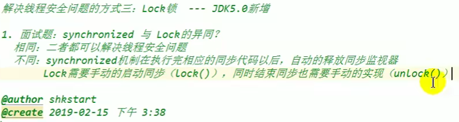
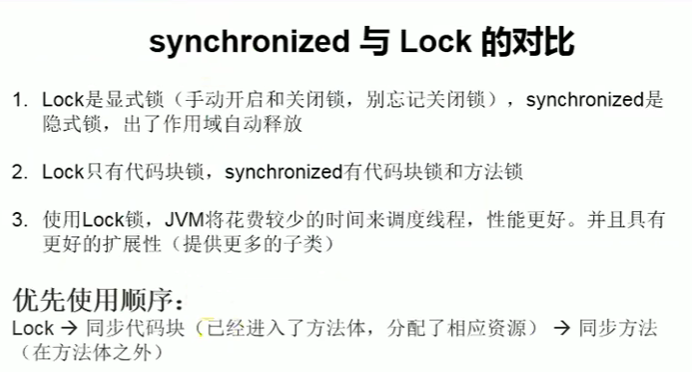

# 方式一：同步代码块

synchronized(同步监视器）{

//需要被同步的代码

}

说明：1.操作共享数据的代码，即需要被同步的代码；（不多也不能少）

2.共享数据：即多个线程共同操作的变量；

3.同步监视器，俗称锁，任何一个类的对象都可以充当锁；

要求：不同线程必须使用同一把锁；

补充：在使用实现Runnable接口的多线程方式中可以考虑使用this充当同步监视器；

  在使用继承Thread创建多线程时，慎用this充当同步监视器

同步监视器可以是this，变量.class(这个是指类）

# 方式二：同步方法

如果操作数据的代码完整的声明在一个方法中，我们不妨将此方法声明为同步的。

1，同步方法仍然涉及到同步监视器，但不需要我们显式的声明

2。非静态的同步方法同步监视器是this；静态的同步监视器是该类本身。

###### //同步的方式解决了线程的安全问题（好处）       											操作同步代码时只有一个线程参与，其他线程等待，相当于一个单线程的过程速度较慢

###### 将单例模式的懒汉式改为线程安全

# 方法三：Lock锁（jdk5.0新增）

# synchronize与Lock

###### **死锁**

