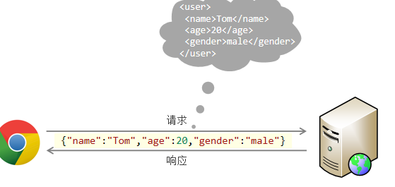
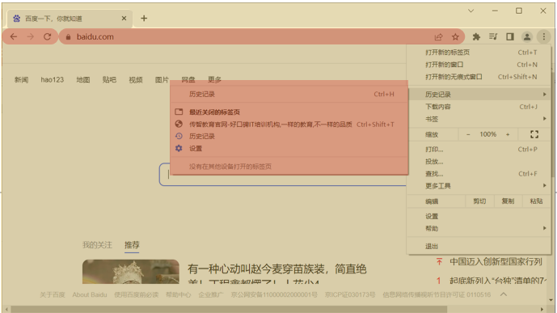

## JavaScript引入方式

内部脚本：将JS代码定义在HTML页面中

> *   JavaScript代码必须位于\<script>\</script>标签之间
> *   在HTML文档中，可以在任意地方，放置任意数量的\<script>
> *   一般会把脚本置于\<body>元素的底部，可改善显示速度

外部脚本：将 JS代码定义在外部 JS文件中，然后引入到 HTML页面中

> *   外部JS文件中，只包含JS代码，不包含\<script>标签
> *   \<script>标签不能自闭合

## 书写语法

*   区分大小写：与 Java 一样，变量名、函数名以及其他一切东西都是区分大小写的
*   每行结尾的分号可有可无
*   注释：
*   单行注释：// 注释内容
*   多行注释：/\* 注释内容 \*/
*   大括号表示代码块

### 输出语句

> 使用 window\.alert() 写入警告框
> 使用 document.write() 写入 HTML 输出
> 使用 console.log() 写入浏览器控制台

```js
<script>
 window.alert("Hello JavaScript"); //浏览器弹出警告框 
 document.write("Hello JavaScript"); //写入HTML,在浏览器展示
 console.log("Hello JavaScript"); //写入浏览器控制台
</script>
```

## 变量

*   JavaScript 中用 var 关键字（variable 的缩写）来声明变量 。
*   JavaScript 是一门弱类型语言，变量可以存放不同类型的值 。
*   变量名需要遵循如下规则：
*   组成字符可以是任何字母、数字、下划线（\_）或美元符号（\$）
*   数字不能开头
*   建议使用驼峰命名

> 特点：JS是弱类型语言，变量可以存放不同类型的值
> 声明：
> var：声明变量，全局作用域/函数作用域，允许重复声明
> let：声明变量，块级作用域，不允许重复声明
> const：声明常量，一旦声明，常量的值不能改变

### 数据类型

JavaScript中分为：原始类型 和 引用类型。

> *   number：数字（整数、小数、NaN(Not a Number)）
> *   string：字符串，单双引皆可
> *   boolean：布尔。true，false
> *   null：对象为空
> *   undefined：当声明的变量未初始化时，该变量的默认值是 undefined

使用 typeof 运算符可以获取数据类型：
`var a = 20;
alert(typeof  a);`

## 运算符

> 算术运算符：+ , - , \* , / , % , ++ , --
> 赋值运算符：= , += , -= , \*= , /= , %=
> &#x20;比较运算符：> , < , >= , <= , != , == , ========&#x20;
> 逻辑运算符：&& , || , !
> 三元运算符：条件表达式 ? true\_value: false\_value


### 类型转换

*   字符串类型转为数字：
*   将字符串字面值转为数字。 如果字面值不是数字，则转为NaN。
*   其他类型转为boolean：
*   Number：0 和 NaN为false，其他均转为true。
*   String：空字符串为false，其他均转为true。
*   Null 和 undefined ：均转为false。

```html
<!DOCTYPE html>
<html lang="en">
<head>
    <meta charset="UTF-8">
    <meta http-equiv="X-UA-Compatible" content="IE=edge">
    <meta name="viewport" content="width=device-width, initial-scale=1.0">
    <title>JS-运算符</title>
</head>
<body>
    
</body>
<script>
    var age = 20;
    var _age = "20";
    var $age = 20;
    
    alert(age == _age);
    alert(age === _age);
    alert(age === $age);


    // 类型转换 - 其他类型转为数字
    // alert(parseInt("12")); 
    // alert(parseInt("12A45")); 
    // alert(parseInt("A45"));


    // 类型转换 - 其他类型转为boolean
    // if(0){
    //     alert("0 转换为false");
    // }
    // if(NaN){
    //     alert("NaN 转换为false");
    // }
    // if(1){
    //     alert("除0和NaN其他数字都转为 true");
    // }

    // if(""){
    //     alert("空字符串为 false, 其他都是true");
    // }
        
    // if(null){
    //     alert("null 转化为false");
    // }
    // if(undefined){
    //     alert("undefined 转化为false");
    // }

</script>
</html>
```

## 函数

介绍：函数（方法）是被设计为执行特定任务的代码块。
定义：JavaScript 函数通过 function 关键字进行定义，语法为：

> var a=function functionName(参数1,参数2..){
>
> //要执行的代码
>
> }

> 注意：
> 形式参数不需要类型。因为JavaScript是弱类型语言
> 返回值也不需要定义类型，可以在函数内部直接使用return返回即可
> 调用：函数名称(实际参数列表)

## JS对象

## Array

JavaScript 中 Array对象用于定义数组。

*   **定义**

> var 变量名 = new Array(元素列表); //方式一
> var 变量名 = \[ 元素列表 ]; //方式二

*   **访问**

> arr\[ 索引 ] = 值;

*   \*\* 属性\*\*

| 属性     | 描述             |
| :----- | :------------- |
| length | 设置或返回数组中元素的数量。 |

*   **方法**

| 方法        | 描述                       |
| :-------- | :----------------------- |
| forEach() | 遍历数组中的每个有值的元素，并调用一次传入的函数 |
| push()    | 将新元素添加到数组的末尾，并返回新的长度。    |
| splice()  | 从数组中删除元素。                |

> 箭头函数(ES6)：是用来简化函数定义语法的。具体形式为:  (…) => { … } ，如果需要给箭头函数起名字： var  xxx = (…) => { … }

## String

*   定义
    var 变量名 = new String("…") ; //方式一
    var 变量名 = "…" ; //方式二

*   属性
    | 属性     | 描述      |
    | :----- | :------ |
    | length | 字符串的长度。 |

*   方法
    | 方法          | 描述                   |
    | :---------- | :------------------- |
    | charAt()    | 返回在指定位置的字符。          |
    | indexOf()   | 检索字符串。               |
    | trim()      | 去除字符串两边的空格           |
    | substring() | 提取字符串中两个指定的索引号之间的字符。 |

## JavaScript自定义对象

*   **定义格式：**

> var 对象名 = {
> 属性名1: 属性值1,
> 属性名2: 属性值2,
> 属性名3: 属性值3,
> 函数名称: function(形参列表){}
> };

*   **调用格式：**

> 对象名.属性名;
> 对象名.函数名();

## JSON

### JSON简介

> *   概念：JavaScript Object Notation，JavaScript对象标记法。
> *   JSON 是通过 JavaScript 对象标记法书写的文本。

    {
        name:"Tom", 
        age:20, 
        gender:"male"
    };
    {
        "name":"Tom",
        "age":20,
        "gender":"male"
    }



### JSON基础语法

*   定义

> var 变量名 = '{"key1": value1, "key2": value2}';
> \-  示例
> \> var userStr = '{"name":"Jerry","age":18, "addr":\["北京","上海","西安"]}';
> \>

*   JSON字符串转为JS对象

> var jsObject = JSON.parse(userStr);

*   JS对象转为JSON字符串

> var jsonStr = JSON.stringify(jsObject);

注：

> value 的数据类型为：
> 数字（整数或浮点数）
> 字符串（在双引号中）
> 逻辑值（true 或 false）
> 数组（在方括号中）
> 对象（在花括号中）
> null

## BOM

*   概念：Browser Object Model  浏览器对象模型，允许JavaScript与浏览器对话， JavaScript 将浏览器的各个组成部分封装为对象。

*   组成：
    Window：浏览器窗口对象
    Navigator：浏览器对象
    Screen：屏幕对象
    History：历史记录对象
    Location：地址栏对象



## Window

*   介绍：浏览器窗口对象。
*   获取：直接使用window，其中 window. 可以省略。

>      window.alert("Hello Window");
>      alert("Hello Window");

*   属性：
    history：对 History 对象的只读引用。请参阅 [History 对象](https://www.w3school.com.cn/jsref/dom_obj_history.asp)。
    location：用于窗口或框架的 Location 对象。请参阅 [Location 对象](https://www.w3school.com.cn/jsref/dom_obj_location.asp)	。
    navigator：对 Navigator 对象的只读引用。请参阅 [Navigator 对象](https://www.w3school.com.cn/jsref/dom_obj_navigator.asp)。
*   方法
    alert()：显示带有一段消息和一个确认按钮的警告框。
    confirm()：显示带有一段消息以及确认按钮和取消按钮的对话框。
    setInterval()：按照指定的周期（以毫秒计）来调用函数或计算表达式。
    setTimeout()：在指定的毫秒数后调用函数或计算表达式。

### Location

介绍：地址栏对象。

获取：使用 window\.location 获取，其中 window. 可以省略。(window\.location.属性;
)

属性：
href：设置或返回完整的URL。

## DOM

概念：Document Object Model ，文档对象模型。
将标记语言的各个组成部分封装为对应的对象：

> Document：整个文档对象
> Element：元素对象
> Attribute：属性对象
> Text：文本对象
> Comment：注释对象

```html
<html>
    <head>
        <title>DOM</title>
    </head>
    <body>
        <h1>DOM对象标题</h1>
        <a href="https://itcast.cn">传智教育</a>
    </body>
</html>
```


DOM是 W3C（万维网联盟）的标准，定义了访问HTML和XML文档的标准，分为3个不同的部分：
1.Core DOM - 所有文档类型的标准模型

>     Document：整个文档对象
>     Element：元素对象
>     Attribute：属性对象
>     Text：文本对象
>     Comment：注释对象

2.XML DOM - XML 文档的标准模型\
3.HTML DOM - HTML 文档的标准模型

>     Image：
>     Button ：<input type='button'>

*   HTML中的Element对象可以通过Document对象获取，而Document对象是通过window对象获取的。
*   Document对象中提供了以下获取Element元素对象的函数：
    1.根据id属性值获取，返回单个Element对象

> var h1 = document.getElementById('h1');

2.根据标签名称获取，返回Element对象数组

> var divs = document.getElementsByTagName('div');

3.根据name属性值获取，返回Element对象数组

> var hobbys = document.getElementsByName('hobby');

4.根据class属性值获取，返回Element对象数组

> var clss = document.getElementsByClassName('cls');

## 事件监听

*   事件：HTML事件是发生在HTML元素上的 “事情”。比如：

1.  按钮被点击
2.  鼠标移动到元素上
3.  按下键盘按键

*   事件监听：JavaScript可以在事件被侦测到时 执行代码。

### 事件绑定

方式一：通过 HTML标签中的事件属性进行绑定

```html
<input type="button" onclick="on()" value="按钮1">

<script>
    function on(){
        alert('我被点击了!');
    }
</script>
```

方式二：通过 DOM 元素属性绑定

```html
<input type="button" id="btn" value="按钮2">

<script>
    document.getElementById('btn').onclick=function(){
        alert('我被点击了!');
    }
</script>
```

### 常见事件

| 事件名         | 说明           |
| :---------- | :----------- |
| onclick     | 鼠标单击事件       |
| onblur      | 元素失去焦点       |
| onfocus     | 元素获得焦点       |
| onload      | 某个页面或图像被完成加载 |
| onsubmit    | 当表单提交时触发该事件  |
| onkeydown   | 某个键盘的键被按下    |
| onmouseover | 鼠标被移到某元素之上   |
| onmouseout  | 鼠标从某元素移开     |

