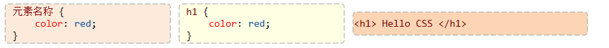
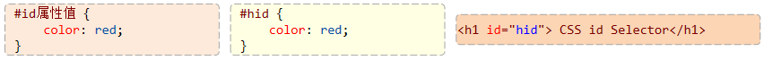
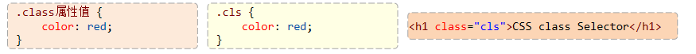
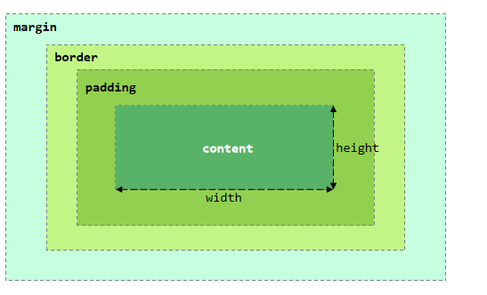
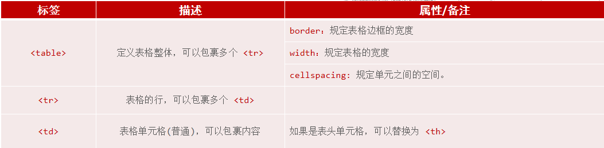
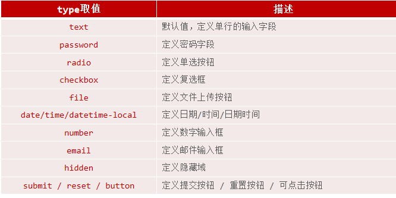

[TOC]

## 快速入门

```html
<!-- 文档类型为HTML -->
<!DOCTYPE html>
<html lang="en">
<head>
    <!-- 字符集为UTF-8 -->
    <meta charset="UTF-8">
    <!-- 设置浏览器兼容性 -->
    <meta http-equiv="X-UA-Compatible" content="IE=edge">
    <meta name="viewport" content="width=device-width, initial-scale=1.0">
    <title>焦点访谈：中国底气 新思想夯实大国粮仓</title>
</head>
<body>
    <!-- 
    img标签: 
        src: 图片资源路径
        width: 宽度(px, 像素 ; % , 相对于父元素的百分比)
        height: 高度(px, 像素 ; % , 相对于父元素的百分比)
        
        

    路径书写方式:
        绝对路径:
            1. 绝对磁盘路径: C:\Users\Administrator\Desktop\HTML\img\news_logo.png
                           

            2. 绝对网络路径: https://i2.sinaimg.cn/dy/deco/2012/0613/yocc20120613img01/news_logo.png
                           
        相对路径:
            ./ : 当前目录 , ./ 可以省略的
            ../: 上一级目录
     -->
     新浪政务 > 正文

    <h1>焦点访谈：中国底气 新思想夯实大国粮仓</h1>
    
    <hr>
    2023年03月02日 21:50 央视网
    <hr>

</body>
</html>
```

1.标题标签
标签：\<h1>…\</h1>（h1 → h6 重要程度依次降低）
注意：HTML标签都是预定义好的，不能自己随意定义。
2.水平线标签   \<hr>
3.图片标签 \

*   绝对路径：绝对磁盘路径（D:/xxxx）、绝对网络路径（<https://xxxx）>
*   相对路径：从当前文件开始查找。 （./ : 当前目录, ../ : 上级目录）

# 样式（css)

```html
<!DOCTYPE html>
<html lang="en">
<head>
    <meta charset="UTF-8">
    <meta http-equiv="X-UA-Compatible" content="IE=edge">
    <meta name="viewport" content="width=device-width, initial-scale=1.0">
    <title>焦点访谈：中国底气 新思想夯实大国粮仓</title>
    <!-- 方式二: 内嵌样式 -->
    <style>
        h1 {
             /* color: red; */
            /* color: rgb(0, 0, 255); */
            color: #4D4F53;
        }

        /* 元素选择器 */
        /* span {
            color: red;
        } */

        /* 类选择器 */
        /* .cls {
            color: green;
        } */
        
        /* ID选择器 */
        #time {
            color: #968D92;
            font-size: 13px; /* 设置字体大小 */
        }
        a {
            color: black;
            text-decoration: none; /* 设置文本为一个标准的文本 */
        }
    </style>
     <!-- 方式三: 外联样式 -->
        <!-- <link rel="stylesheet" href="css/news.css"> -->
</head>
<body>

     新浪政务 > 正文
    <!-- 方式一: 行内样式 -->
    <!-- <h1 style="color: red;">焦点访谈：中国底气 新思想夯实大国粮仓</h1> -->
    <h1>焦点访谈：中国底气 新思想夯实大国粮仓</h1>

    <hr>
    <span id="time">2023年03月02日 21:50</span>  <span> <a href="https://news.cctv.com/2023/03/02/ARTIUCKFf9kE9eXgYE46ugx3230302.shtml" target="_blank">央视网</a></span>
    <hr>

</body>
</html>
```

### 1.CSS选择器：用来选取需要设置样式的元素(标签)

*   元素选择器
    
*   id选择器
    
*   类选择器
    

### 2.<span>标签

*   \<span> 是一个在开发网页时大量会用到的没有语义的布局标签
*   特点：一行可以显示多个(组合行内元素)，宽度和高度默认由内容撑开

### 3.CSS属性

*   color：设置文本的颜色
*   font-size：字体大小 （注意：记得加px）

## 基础标签样式

### 1.超链接

> *   标签：
>     \<a href="..." target="...">央视网</a>
> *   属性：
>     href：指定资源访问的url
>     target：指定在何处打开资源链接
>     \_self：默认值，在当前页面打开
>     \_blank：在空白页面打开
> *   css属性
>     text-decoration：规定添加到文本的修饰，none表示定义标准的文本。
>     color：定义文本的颜色

### 2.视频标签：\<video>

>     src：规定视频的url
>     controls：显示播放控件
>     width：播放器的宽度
>     height：播放器的高度

### 3.音频标签：\<audio>

>     src：规定音频的url
>     controls：显示播放控件

### 4.图片标签 \

>         src: 图片资源路径
>         width: 宽度(px, 像素 ; % , 相对于父元素的百分比)
>         height: 高度(px, 像素 ; % , 相对于父元素的百分比)

### 5.段落标签：\<p>

### 6.文本加粗标签: \<b>  \<strong>

### 7.换行标签 \<br>

### css样式\<p>

line-height：设置行高
text-indent：定义第一个行内容的缩进
text-align：规定元素中的文本的水平对齐方式

**注：**

> **在HTML中无论输入多少个空格，只会显示一个。 可以使用空格占位符：\&nbs**

## 盒子模型（布局）

```html
<!DOCTYPE html>
<html lang="en">
<head>
    <meta charset="UTF-8">
    <meta http-equiv="X-UA-Compatible" content="IE=edge">
    <meta name="viewport" content="width=device-width, initial-scale=1.0">
    <title>盒子模型</title>
    <style>
        div {
            width: 200px;
            height: 200px;
            box-sizing: border-box; /* 指定width height为盒子的高宽 */
            background-color: aquamarine; /* 背景色 */
            
            padding: 20px; /* 内边距, 上 右 下 左 */
            border: 10px solid red; /* 边框, 宽度 线条类型 颜色 */
            margin: 30px; /* 外边距, 上 右 下 左 */
        }
    </style>
</head>

<body>
    
    <div>
        A A A A A A A A A A A A A A A A A A A A A A A A A A A A A A A A A A 
    </div>

</body>
</html>
```

盒子：页面中所有的元素（标签），都可以看做是一个 盒子，由盒子将页面中的元素包含在一个矩形区域内，通过盒子的视角更方便的进行页面布局

盒子模型组成：内容区域（content）、内边距区域（padding）、边框区域（border）、外边距区域（margin）


布局标签：实际开发网页中，会大量频繁的使用 div 和 span 这两个没有语义的布局标签。

标签：\<div>  \<span>
特点：

> div标签：
> 一行只显示一个（独占一行）
> 宽度默认是父元素的宽度，高度默认由内容撑开
> 可以设置宽高（width、height）
> span标签：
> 一行可以显示多个
> 宽度和高度默认由内容撑开
> 不可以设置宽高（width、height）

### CSS盒子模型

组成：内容（content）、内边距（padding）、边框（border）、外边距（margin）

#### CSS属性

width：设置宽度
height：设置高度
border：设置边框的属性，如：1px solid #000；
padding：内边距
margin：外边距

> 注意：如果只需要设置某一个方位的边框、内边距、外边距，可以在属性名后加上 –位置，如：padding-top、padding-left、padding-right …

## 新浪新闻页面

    <!-- 文档类型为HTML -->
    <!DOCTYPE html>
    <html lang="en">
    <head>
    	<!-- 字符集为UTF-8 -->
        <meta charset="UTF-8">
    	<!-- 设置浏览器兼容性 -->
        <meta http-equiv="X-UA-Compatible" content="IE=edge">
        <meta name="viewport" content="width=device-width, initial-scale=1.0">
        <title>焦点访谈：中国底气 新思想夯实大国粮仓</title>
        <!-- 方式二: 内嵌样式 -->
        <style>
            h1 {
                 /* color: red; */
                /* color: rgb(0, 0, 255); */
                color: #4D4F53;
            }

            /* 元素选择器 */
            /* span {
                color: red;
            } */

            /* 类选择器 */
            /* .cls {
                color: green;
            } */
            
            /* ID选择器 */
            #time {
                color: #968D92;
                font-size: 13px; /* 设置字体大小 */
            }
            a {
                color: black;
                text-decoration: none; /* 设置文本为一个标准的文本 */
            }
            p {
                text-indent: 35px; /* 设置首行缩进 */
                line-height: 40px; /* 设置行高 */
            }

            #plast {
                text-align: right; /* 对齐方式 */
            }

            #center {
                width: 65%;
                /* margin: 0% 17.5% 0% 17.5% ; */ /* 外边距, 上 右 下 左 */
                margin: 0% 17.5% 0% 17.5%;
            }
        </style>
         <!-- 方式三: 外联样式 -->
            <!-- <link rel="stylesheet" href="css/news.css"> -->
    </head>
    <body>
        <div id="center">
             新浪政务 > 正文
            <!-- 方式一: 行内样式 -->
            <!-- <h1 style="color: red;">焦点访谈：中国底气 新思想夯实大国粮仓</h1> -->
            <h1>焦点访谈：中国底气 新思想夯实大国粮仓</h1>

            <hr>
            <span id="time">2023年03月02日 21:50</span>  <span> <a href="https://news.cctv.com/2023/03/02/ARTIUCKFf9kE9eXgYE46ugx3230302.shtml" target="_blank">央视网</a></span>
            <hr>

            <!-- 正文 -->
            <!-- 视频 -->
            <video src="video/1.mp4" controls width="950px"></video>

            <!-- 音频 -->
            <!-- <audio src="audio/1.mp3" controls></audio> -->

            <p>
            <strong>央视网消息</strong> （焦点访谈）：党的十八大以来，以习近平同志为核心的党中央始终把解决粮食安全问题作为治国理政的头等大事，重农抓粮一系列政策举措有力有效，我国粮食产量站稳1.3万亿斤台阶，实现谷物基本自给、口粮绝对安全。我们把饭碗牢牢端在自己手中，为保障经济社会发展提供了坚实支撑，为应对各种风险挑战赢得了主动。连续八年1.3万亿斤，这个沉甸甸的数据是如何取得的呢？
            </p>

            <p>
            人勤春来早，春耕农事忙。立春之后，由南到北，我国春耕春管工作陆续展开，春天的田野处处生机盎然。
            </p>

            

            <p>
                今年，我国启动了新一轮千亿斤粮食产能提升行动，这是一个新的起点。2015年以来，我国粮食产量连续8年稳定在1.3万亿斤以上，人均粮食占有量始终稳稳高于国际公认的400公斤粮食安全线。从十年前的约12200亿斤到2022年的约13700亿斤，粮食产量提高了1500亿斤。
            </p>

            

            <p>
                中国式现代化一个重要的中国特色是人口规模巨大的现代化。我们粮食生产的发展，意味着我们要立足国内，解决14亿多人吃饭的问题。仓廪实，天下安。保障粮食安全是一个永恒的课题，任何时候都不能放松。在以习近平同志为核心的党中央坚强领导下，亿万中国人民辛勤耕耘、不懈奋斗，我们就一定能够牢牢守住粮食安全这一“国之大者”，把中国人的饭碗牢牢端在自己手中，夯实中国式现代化基础。
            </p>

            <p id="plast">
                责任编辑：王树淼 SN242
            </p>  
        </div>
    </body>
    </html>

## 表格标签

```html
<!DOCTYPE html>
<html lang="en">
<head>
    <meta charset="UTF-8">
    <meta http-equiv="X-UA-Compatible" content="IE=edge">
    <meta name="viewport" content="width=device-width, initial-scale=1.0">
    <title>HTML-表格</title>
    <style>
        td {
            text-align: center; /* 单元格内容居中展示 */
        }
    </style>
</head>
<body>
    
    <table border="1px" cellspacing="0"  width="600px">
        <tr>
            <th>序号</th>
            <th>品牌Logo</th>
            <th>品牌名称</th>
            <th>企业名称</th>
        </tr>
        <tr>
            <td>1</td>
            <td>  </td>
            <td>华为</td>
            <td>华为技术有限公司</td>
        </tr>
        <tr>
            <td>2</td>
            <td>  </td>
            <td>阿里</td>
            <td>阿里巴巴集团控股有限公司</td>
        </tr>
    </table>

</body>
</html>
```



*   \<table>：定义表格
*   \<tr>：定义表格中的行，一个 <tr> 表示一行
*   \<th>：表示表头单元格，具有加粗居中效果
*   \<td>：表示普通单元格

## 表单

### 表单标签

```html
<!DOCTYPE html>
<html lang="en">
<head>
    <meta charset="UTF-8">
    <meta http-equiv="X-UA-Compatible" content="IE=edge">
    <meta name="viewport" content="width=device-width, initial-scale=1.0">
    <title>HTML-表单</title>
</head>
<body>
    <!-- 
    form表单属性: 
        action: 表单提交的url, 往何处提交数据 . 如果不指定, 默认提交到当前页面
        method: 表单的提交方式 .
            get: 在url后面拼接表单数据, 比如: ?username=Tom&age=12 , url长度有限制 . 默认值
            post: 在消息体(请求体)中传递的, 参数大小无限制的.
    -->   

    <form action="" method="post">
        用户名: <input type="text" name="username">
        年龄: <input type="text" name="age">

        <input type="submit" value="提交">
    </form>

</body>
</html>
```

> *   场景：在网页中主要负责数据采集功能，如 注册、登录等数据采集。
>
> *   标签：\<form>
>
> *   表单项：不同类型的 input 元素、下拉列表、文本域等。
>
> *   \<input>：定义表单项，通过type属性控制输入形式
>
> *   \<select>：定义下拉列表
>
> *   \<textarea>：定义文本域
>
> *   属性：
>
> *   action：规定当提交表单时向何处发送表单数据，URL
>
> *   method：规定用于发送表单数据的方式。GET、POST

**表单标签**：\<form>\
**表单属性**:
action：表单数据提交的url地址
method：表单提交方式


