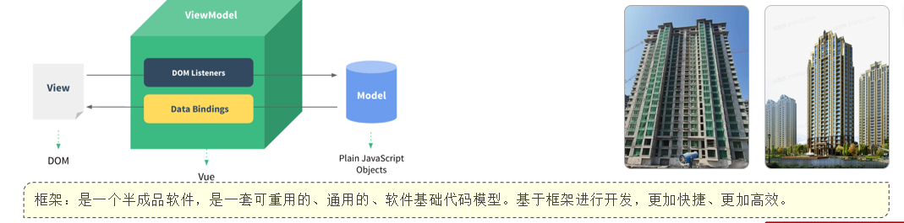
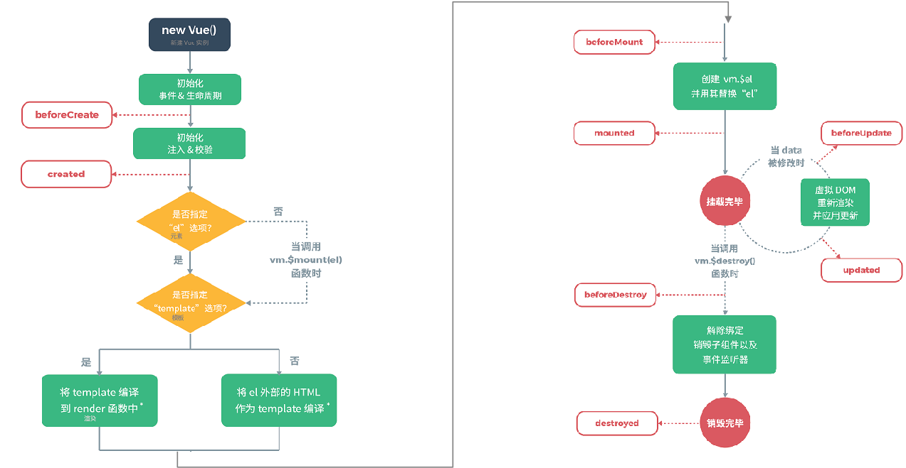

[TOC]

## Vue简介

*   Vue 是一套前端框架，免除原生JavaScript中的DOM操作，简化书写。
*   基于MVVM(Model-View-ViewModel)思想，实现数据的双向绑定，将编程的关注点放在数据上。
*   官网： <https://v2.cn.vuejs.org/>
    

## Vue快速入门

```HTML
<!DOCTYPE html>
<html lang="en">
<head>
    <meta charset="UTF-8">
    <meta http-equiv="X-UA-Compatible" content="IE=edge">
    <meta name="viewport" content="width=device-width, initial-scale=1.0">
    <title>Vue-快速入门</title>
    <script src="js/vue.js"></script>
</head>
<body>
    <div id="app">
        <input type="text" v-model="message">
        {{message}}
    </div>
    

</body>
<script>
    // 1. 创建一个Vue实例
    
    new Vue({
         el: "#app",//vue接管区
        data :{
            message : "Hello Vue!"
        }
    })
</script>
</html>
```

*   新建HTML页面，引入Vue.js文件

> \<script src="js/vue.js">\</script>

*   在JS代码区域，创建Vue核心对象，定义数据模型

\<script>
\>     new Vue({
\>         el: "#app",
\>         data: {
\>             message: "Hello Vue!"
\>         }
\>     })
\</script>

*   编写视图

> <div id="app">
>     &lt;input type="text" v-model="message"&gt;
>     {{ message }}
> </div>

*   插值表达式
*   形式：{{ 表达式 }}。
*   内容可以是：
*
    *   变量
*
    *   三元运算符
*
    *   函数调用
*
    *   算术运算

## 常用指令

*   指令：HTML 标签上带有 v- 前缀 的特殊属性，不同指令具有不同含义。例如：v-if，v-for…
*   常用指令

    | 指令        | 作用                             |
    | :-------- | :----------------------------- |
    | v-bind    | 为HTML标签绑定属性值，如设置 href , css样式等 |
    | v-model   | 在表单元素上创建双向数据绑定                 |
    | v-on      | 为HTML标签绑定事件                    |
    | v-if      | 条件性的渲染某元素，判定为true时渲染,否则不渲染     |
    | v-else-if |                                |
    | v-else    |                                |
    | v-show    | 根据条件展示某元素，区别在于切换的是display属性的值  |
    | v-for     | 列表渲染，遍历容器的元素或者对象的属性            |

### v-bind与v-model

| 指令      | 作用                             |
| :------ | :----------------------------- |
| v-bind  | 为HTML标签绑定属性值，如设置 href , css样式等 |
| v-model | 在表单元素上创建双向数据绑定                 |

*   v-bind

> <a>传智教育</a> <a>传智教育</a>

*   v-model

> \<input type="text" v-model="url">

注意事项：通过v-bind或者v-model绑定的变量，必须在数据模型中声明。

```javascript
  new Vue({
     el: "#app",
     data: {
        url: "https://www.itcast.cn"
     }
  })

```

### v-on

| 指令   | 作用          |
| :--- | :---------- |
| v-on | 为HTML标签绑定事件 |

> \<input type="button" value="按钮" v-on\:click="handle()">

> \<input type="button" value="按钮" @click="handle()">

```html
<script>
    new Vue({
        el: "#app",
        data: {
	//...
        },
        methods: {
            handle:function(){
                alert('我被点击了');
            }
        },
    })
</script>

```

### 条件判断指令

| 指令        | 作用                            |
| :-------- | :---------------------------- |
| v-if      | 条件性的渲染某元素，判定为true时渲染,否则不渲染    |
| v-else-if |                               |
| v-else    |                               |
| v-show    | 根据条件展示某元素，区别在于切换的是display属性的值 |

*   v-if

> 年龄{{age}},经判定为:
> \<span v-if="age <= 35">年轻人</span>
> \<span v-else-if="age > 35 && age < 60">中年人</span>
> \<span v-else>老年人</span>

*   v-show

> 年龄{{age}},经判定为:
> \<span v-show="age <= 35">年轻人</span>

### for

| 指令    | 作用                  |
| :---- | :------------------ |
| v-for | 列表渲染，遍历容器的元素或者对象的属性 |

> \<div v-for="addr in addrs">{{addr}}</div>

> \<div v-for="(addr,index) in addrs">{{index + 1}} : {{addr}}</div>

> data: {
>    . . .
> addrs: \['北京','上海','广州','深圳','成都','杭州']
> },

## 生命周期

*   生命周期：指一个对象从创建到销毁的整个过程。
*   生命周期的八个阶段：每触发一个生命周期事件，会自动执行一个生命周期方法(钩子)。
    | 状态            | 阶段周期     |
    | :------------ | :------- |
    | beforeCreate  | 创建前      |
    | created       | 创建后      |
    | beforeMount   | 挂载前      |
    | ==mounted==   | ==挂载完成== |
    | beforeUpdate  | 更新前      |
    | updated       | 更新后      |
    | beforeDestroy | 销毁前      |
    | destroyed     | 销毁后      |




```html
<script>
    new Vue({
        el: "#app",
        data: {
            
        },
        mounted() {
            console.log("Vue挂载完毕,发送请求获取数据");
        },
        methods: {
           
        },
    })
</script>
```

> mounted：挂载完成，Vue初始化成功，HTML页面渲染成功。（发送请求到服务端，加载数据）

1.  Vue是什么?
    Vue是一个基于MVVM模型的前端js框架。

2.  Vue常用指令?
    v-bind、v-model、v-on、v-if、v-show、v-for

3.  Vue生命周期?
    mounted

